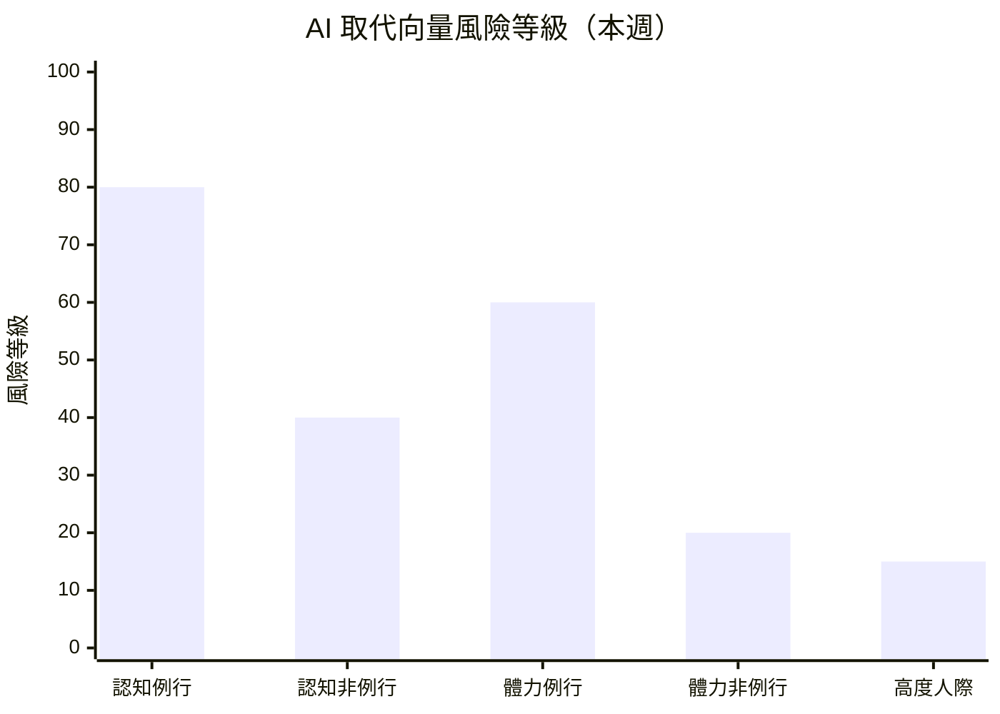

# 內容規格書：career_strategy / 求職策略建議 — 每週報告

> 內部規劃文件，不發布至 GitHub Pages。
> 產出日期：2026-03-22
> Revamp 階段：Stage 5（Content Specification）
> 本文件直接指導每週報告的 AI 自動化產出。
> **風險等級：最高** — 本 Mode 的內容直接影響讀者的職涯決策。

---

## 1. 頁面目標

### 主要目標

整合本週 climate_index、skills_drift、industry_segments、salary_bands 四份報告的分析結果，為不同狀態的讀者（求職中/考慮轉職/在職觀察）提供有數據支撐的職涯行動參考方向。

### 次要目標

1. 透過 AI 取代向量風險評估，幫助讀者理解自己角色的長期安全性
2. 提供結構化的技能學習路徑引導
3. 用透明免責聲明建立「誠實 AI」品牌信任

### 成功指標

| 指標 | 目標值 | 測量方式 |
|------|--------|----------|
| 頁面瀏覽量 | > 600 PV/報 | Google Analytics |
| 平均停留時間 | > 5 分鐘 | Analytics |
| 社群分享 | > 8 次/報 | 社群監控 |

---

## 2. 目標受眾

### 主要受眾

| 項目 | 說明 |
|------|------|
| 受眾 A | 積極求職中（25-40 歲）——需要本週具體行動方向 |
| 受眾 B | 在職考慮轉職（30-45 歲）——需要市場驗證和風險評估 |
| 進入方式 | 搜尋「求職策略」「轉職建議」/ 從其他 Mode 連結 / 直接回訪 |
| 下一步期望 | 調整求職方向、規劃學習路徑、評估轉職時機 |

### 次要受眾

| 項目 | 說明 |
|------|------|
| 受眾 C | 職涯顧問——需要可引用的市場數據 |
| 受眾 D | 應屆畢業生——需要更多基礎解釋 |

---

## 3. 關鍵訊息

| 順序 | 訊息 | 呈現方式 |
|------|------|----------|
| 1 | 本報告是「基於數據的參考方向」而非個人化建議——這是品牌承諾 | 報告開頭重要聲明 |
| 2 | 你的職業類別在 AI 時代的風險等級和可採取的方向 | AI 向量風險矩陣 + 各向量分析 |
| 3 | 本週市場最值得關注的機會窗口和應該注意的風險 | 分受眾行動清單 |

---

## 4. 內容結構

### 4.1 區塊規劃

```
┌─────────────────────────────────────┐
│ 區塊 1：重要聲明（免責前置）         │
├─────────────────────────────────────┤
│ 區塊 2：本週市場概覽                 │
├─────────────────────────────────────┤
│ 區塊 3：受眾分流導引（新增）         │
├─────────────────────────────────────┤
│ 區塊 4：AI 取代向量風險評估          │
│  └ 4a：風險總覽表                    │
│  └ 4b：Mermaid 風險矩陣圖（新增）    │
│  └ 4c：各向量詳細分析（×5）          │
├─────────────────────────────────────┤
│ 區塊 5：高需求技能與學習路徑         │
│  └ 5a：技能需求上升 Top 10           │
│  └ 5b：結構化學習路徑（改版）        │
├─────────────────────────────────────┤
│ 區塊 6：台灣常見職業專屬建議（新增） │
├─────────────────────────────────────┤
│ 區塊 7：熱門轉職路徑觀察             │
├─────────────────────────────────────┤
│ 區塊 8：各產業進入門檻觀察           │
├─────────────────────────────────────┤
│ 區塊 9：本週關鍵觀察                 │
├─────────────────────────────────────┤
│ 區塊 10：分受眾行動清單              │
├─────────────────────────────────────┤
│ 區塊 11：免責聲明（7 點完整版）       │
└─────────────────────────────────────┘
```

### 4.2 核心區塊規格

#### 區塊 1：重要聲明

| 項目 | 規格 |
|------|------|
| 目的 | 法律風險控管 + 品牌信任建立 |
| 位置 | 報告最開頭（H1 之後第一個元素） |
| 格式 | blockquote 醒目框 |
| 語氣 | 誠實但不嚇人——「我們清楚告訴你限制」而非「這很危險別信」 |

##### 固定文案

```markdown
> **重要聲明**：本報告由 AI 系統基於公開數據自動產出，所有內容僅為「基於數據觀測的
> 參考方向」，不構成專業職涯諮詢。重大職涯決策請諮詢專業職涯顧問。詳見報告末
> 「免責聲明」。
```

---

#### 區塊 3：受眾分流導引（新增）

| 項目 | 規格 |
|------|------|
| 目的 | 讓不同狀態的讀者快速找到最相關的內容 |
| 位置 | 市場概覽之後 |
| 格式 | 3 個帶錨點連結的分流選項 |

##### 內容規格

```markdown
## 快速導覽

根據你目前的狀態，以下是最相關的報告段落：

- **正在求職中** → [本週機會窗口](#本週行動清單) ｜ [高需求技能](#高需求技能與學習資源參考) ｜ [產業進入門檻](#各產業進入門檻觀察)
- **考慮轉職中** → [AI 風險評估](#ai-取代向量風險評估) ｜ [轉職路徑觀察](#熱門轉職路徑觀察) ｜ [薪資對標](#各產業進入門檻觀察)
- **在職觀察中** → [技能趨勢](#高需求技能與學習資源參考) ｜ [產業動態](#本週關鍵觀察) ｜ [AI 風險趨勢](#ai-取代向量風險評估)
```

---

#### 區塊 4b：AI 風險矩陣 Mermaid 圖（新增）

| 項目 | 規格 |
|------|------|
| 目的 | 視覺化五向量的風險等級和趨勢方向 |
| 格式 | Mermaid 圖表（xychart-beta 或表格式呈現） |

##### 範例

````markdown

> 風險等級基於職缺變化率、技能替代信號、全球趨勢綜合判定。數值越高表示該向量下
> 的角色面臨越大的自動化替代壓力。此為觀測指標，非確定性預測。
````

---

#### 區塊 5b：結構化學習路徑（改版）

| 項目 | 規格 |
|------|------|
| 目的 | 從「散落學習資源」升級為「結構化引導」 |
| 格式 | Top 3 上升技能各一個學習路徑表 |

##### 單一技能路徑格式

```markdown
### {技能名稱}（AI 向量：{向量分類}）

| 階段 | 學習目標 | 推薦資源類型 | 預估時間 |
|------|----------|-------------|----------|
| 基礎 | {基礎概念和入門} | 官方文件 / 免費教程 | 20-40 小時 |
| 進階 | {實作和專案} | 主流平台（如 Coursera、edX） | 40-80 小時 |
| 實戰 | {專案和社群參與} | 開源專案 / 技術社群 | 持續 |

> **聲明**：以上為基於公開資訊的學習方向參考，不代表推薦或品質保證。學習效果因人而異。
```

---

#### 區塊 6：台灣常見職業專屬建議（新增）

| 項目 | 規格 |
|------|------|
| 目的 | 覆蓋非科技職業的台灣讀者 |
| 格式 | 3-5 個台灣常見職業各一個段落 |
| 職業選擇 | 基於 tw_govjobs 觀測到的高需求角色：業務/行政/門市服務/製造/看護 |

##### 單一職業格式

```markdown
### {職業名稱}（AI 向量：{向量分類}）

**本週市場觀察**：
- 職缺觀測：{來自 tw_govjobs 的數據}
- 薪資參考：{若有}
- AI 風險評估：{基於向量分析}

**參考方向**（非建議）：
- {1-2 條基於數據的參考方向}

> 以上基於政府平台 {N} 筆職缺觀測，樣本以{地區}為主。
```

---

#### 區塊 10：分受眾行動清單

| 受眾 | 行動數量 | 內容方向 | 語氣等級 |
|------|----------|----------|----------|
| 求職者 | 4-5 條 | 投遞方向、技能準備、面試策略 | 最審慎——「可考慮」 |
| 在職者 | 2-3 條 | 技能評估、長期規劃 | 審慎——「建議參考」 |
| 職涯顧問 | 1-2 條 | 市場數據引用建議 | 專業交流 |

##### 語氣規範（本 Mode 特殊加強）

| 使用 | 禁止 |
|------|------|
| 可考慮、值得參考 | 應該、必須、一定要 |
| 數據顯示、觀測到 | 保證、確定、肯定 |
| 基於本週觀測 | 未來一定會 |
| 建議諮詢專業顧問 | 按照本報告做就對了 |

---

#### 區塊 11：免責聲明

**固定 7 點**（不可刪減，不可修改核心意涵）：

1. 非專業職涯諮詢
2. 數據局限性
3. 預測不確定性
4. 個人差異
5. 不構成投資建議
6. 學習資源中立
7. AI 生成風險

---

## 5. CTA 規格

| 類型 | 文案 | 連結目標 |
|------|------|----------|
| 主要 | 「需要更個人化的建議？建議諮詢專業職涯顧問」 | — (不外連) |
| 次要 | 「查看本週景氣溫度計，了解市場整體狀況 →」 | climate_index |

---

## 6. SEO 規格

| 項目 | 規格 |
|------|------|
| seo.title | `{YYYY}第{WW}週職涯觀察：{核心方向} \| 求職策略` **≤ 40 字元**（縮短版） |
| seo.description | `本週職涯觀察：{技能}需求上升，{產業}職缺擴張。含AI風險評估、學習路徑參考。` ≤ 155 字元 |
| keywords | 5-8 個，含「職涯規劃」「轉職建議」「AI取代風險」+ 本週熱門技能 |
| FAQ | Q1「該學什麼技能」Q2「哪些職業AI風險高」Q3「現在適合轉職嗎」 |

### FAQ 特殊規範

- 所有 FAQ 答案必須使用「基於觀測」「可關注」語氣
- 必須包含「需依個人情況評估」提醒
- 不做確定性預測

---

## 7. 寫作指南

### 語氣調性

| 維度 | 規格 | 範例 |
|------|------|------|
| 整體 | 有數據的好朋友，而非權威專家 | ✅「數據看起來是這樣的」❌「你應該這樣做」 |
| 風險描述 | 客觀呈現，不恐嚇 | ✅「該向量風險等級上升」❌「你的工作快消失了」 |
| 行動方向 | 賦權而非指令 | ✅「可考慮關注」❌「立即學習」 |
| 不確定性 | 明確承認 | ✅「若此趨勢持續」❌「這個趨勢必然持續」 |

### 用語規範

| 使用 | 禁止 |
|------|------|
| 基於數據觀測的參考方向 | 專業建議 |
| 值得關注的信號 | 確定性的預測 |
| 建議諮詢專業顧問 | 照做就對了 |
| 可能的方向 | 唯一的出路 |
| 觀測到的趨勢 | 市場一定會怎樣 |

### 禁止清單（本 Mode 獨有）

- 禁止推薦具體付費課程或培訓機構
- 禁止推薦具體公司或職位
- 禁止預測特定時間範圍的職業消亡
- 禁止使用「黃金」「鐵飯碗」「夕陽」等主觀判斷語
- 禁止暗示只有一條「正確」的職涯路徑
- 禁止假設所有讀者都有資源學習新技能（考慮經濟弱勢）

---

## 8. 品質檢查清單

### 語氣與合規（最優先）

- [ ] 報告開頭有重要聲明框
- [ ] 末尾有完整 7 點免責聲明
- [ ] 全文無「應該」「必須」「一定要」等確定性語氣
- [ ] 全文無確定性職涯預測
- [ ] 全文無付費課程推薦
- [ ] 全文無恐嚇式 AI 取代描述
- [ ] 轉職路徑均有「不確定性提醒」
- [ ] 考慮到不同經濟條件的讀者

### 數據與來源

- [ ] 每個數據點可追溯到具體 Layer 或 Mode
- [ ] 學習資源為公開可驗證的免費資源
- [ ] 觀測結果與因果關係未混淆
- [ ] 跨 Mode 引用一致（4/4 依賴 Mode）

### 結構與內容

- [ ] 受眾分流導引存在
- [ ] AI 風險矩陣 Mermaid 圖存在
- [ ] 五大向量分析完整
- [ ] 台灣非科技職業段落存在（至少 3 個）
- [ ] 結構化學習路徑存在（至少 Top 3 技能）
- [ ] 行動清單按三類受眾分欄
- [ ] seo.title ≤ 40 字元

### Jekyll Front Matter

- [ ] risk_level: HIGH
- [ ] dependent_modes 列出 4 個依賴 Mode
- [ ] confidence 標註
- [ ] qdrant_search_used: true

---

*本規格書為每週 career_strategy 報告的操作手冊。此為系統中風險等級最高的報告，產出時必須嚴格遵循語氣規範和禁止清單。搭配 `core/Narrator/Modes/career_strategy/CLAUDE.md` 使用。*
