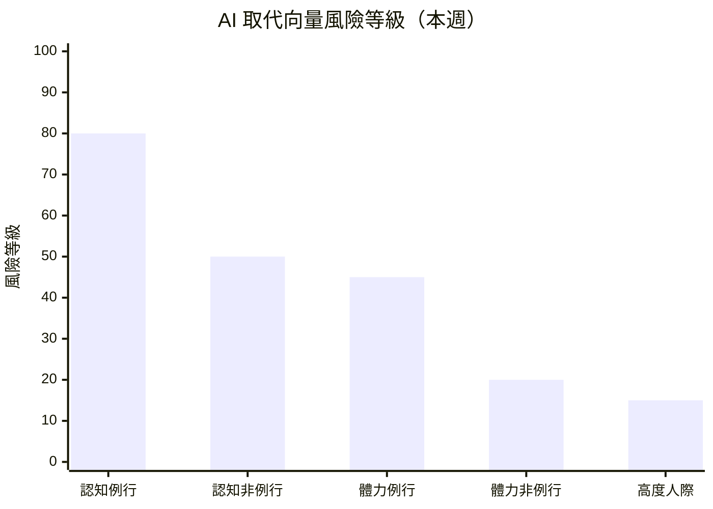

# 求職策略建議 — 2026年第12週

> **重要聲明**：本報告由 AI 系統基於公開數據自動產出，所有內容僅為「基於數據觀測的參考方向」，不構成專業職涯諮詢。重大職涯決策請諮詢專業職涯顧問。詳見報告末「免責聲明」。

## 本週市場概覽

> 本週（2026-W12）就業市場溫度維持「🟠 偏冷」，溫度指數從 W09 的 40 下調至 35，寒冷信號進一步增強。美國 2 月非農就業下降 92,000 人——近年少見的月度負增長——六個月淨就業趨近零。醫療保健業就業首次轉負（-28K），過去一年就業增長的最大支柱失速。Atlassian 裁員 10%（約 1,600 人）以 AI 投資為由，「AI 取代人力」敘事從消費科技擴散至企業軟體。另一方面，AI 相關職缺為唯一逆勢成長領域，國防科技 Swarmer IPO 首日暴漲 520%，獨角獸數量年增 61% 達 187 家。市場呈現深度分化而非全面萎縮。（引用來源：climate_index W12、workforce_news、funding_signals）

> 本報告使用 Qdrant 向量搜尋取得相關資料

## 快速導覽

根據你目前的狀態，以下是最相關的報告段落：

- **正在求職中** → [本週機會窗口](#本週行動清單) ｜ [高需求技能](#二高需求技能與學習資源參考) ｜ [產業進入門檻](#四各產業進入門檻觀察)
- **考慮轉職中** → [AI 風險評估](#一ai-取代向量風險評估) ｜ [轉職路徑觀察](#三熱門轉職路徑觀察) ｜ [薪資對標](#四各產業進入門檻觀察)
- **在職觀察中** → [技能趨勢](#二高需求技能與學習資源參考) ｜ [產業動態](#六本週關鍵觀察) ｜ [AI 風險趨勢](#一ai-取代向量風險評估)

---

## 一、AI 取代向量風險評估

基於 skills_drift 和 industry_segments 的數據，以下為各[AI 取代向量](/glossary/#ai-取代向量)的當前狀態評估。

### 風險總覽

| 取代向量 | 當前風險等級 | 趨勢方向 | 關鍵觀察 |
|----------|------------|----------|----------|
| [認知例行](/glossary/#認知例行cognitive-routine)（cognitive_routine） | 高 | 升高 | Atlassian 以 AI 為由裁員 1,600 人，趨勢從消費科技擴散至企業軟體（來源：workforce_news） |
| [認知非例行](/glossary/#認知非例行cognitive-non-routine)（cognitive_nonroutine） | 中 | 升溫 | Agentic AI +32%、MCP +27%，Sam Altman 致謝事件折射 AI 編碼工具深入開發流程（來源：skills_drift、workforce_news） |
| [體力例行](/glossary/#體力例行physical-routine)（physical_routine） | 中 | 持平 | 製造業觀測職缺 14 筆，無明顯加速信號（來源：industry_segments） |
| [體力非例行](/glossary/#體力非例行physical-non-routine)（physical_nonroutine） | 低 | 持平 | 零售服務業職缺佔台灣最大宗 48%（499 筆），人力需求穩定（來源：tw_govjobs） |
| [高度人際](/glossary/#高度人際interpersonal)（interpersonal） | 低 | 持平 | 經營管理 42,000 TWD、照護服務 40,000 TWD，薪資穩定上升（來源：salary_bands） |

> **風險等級說明**：風險等級基於該向量下角色的職缺需求變化、技能替代信號、全球趨勢綜合判定。此為基於有限數據的觀測結果，不代表確定性預測。

> 風險等級基於職缺變化率、技能替代信號、全球趨勢綜合判定。數值越高表示該向量下的角色面臨越大的自動化替代壓力。此為觀測指標，非確定性預測。

### 各向量詳細分析

#### 認知例行（cognitive_routine）

**觀測到的信號**：
- Atlassian 裁員 10%（約 1,600 人），明確以 AI 投資為由，為企業軟體（B2B SaaS）首次大規模 AI 主題裁員（來源：workforce_news）
- Meta 據報考慮裁員 20%（約 15,000 人），以抵消 AI 基礎設施支出，消息尚未獲官方確認 [REVIEW_NEEDED]（來源：workforce_news）
- 財務會計類薪資中位數 34,300 TWD，為觀測類別中偏低（來源：salary_bands）
- 2025 年逾 127,000 名科技工作者遭裁，裁員趨勢延續至 2026 年（來源：funding_signals）

**受影響的角色**：

| 角色 | 職缺變化 | 技能需求變化 | 觀測到的替代信號 |
|------|----------|-------------|-----------------|
| 資料輸入員 | 無明顯數據 | 基礎 SQL 仍有需求（+6.4%） | AI 自動化數據處理工具持續普及 |
| 財務助理 | 穩定 | Excel 增速趨緩、Python/SQL 上升 | agentic 財務建模工具持續發展 |
| 客服專員 | 無明顯數據 | 無明顯信號 | AI 聊天機器人取代部分基礎諮詢 |
| QA 測試員 | 下降信號 | AI Coding Assistant 出現（18 次） | Atlassian 裁員涵蓋 QA 與產品支援職能 |

**參考方向**（非建議）：
- 基於觀測數據，該向量下的工作者可關注以下技能補充方向：資料分析（SQL、Python）、AI 工具協作、業務流程優化
- 全球趨勢參考：Atlassian 以 AI 取代人力後，Block、Pinterest 已有先例，「以 AI 為由裁員」已形成系統性趨勢，但對個人的實際影響取決於具體公司與崗位（來源：workforce_news、industry_segments）

#### 認知非例行（cognitive_nonroutine）

**觀測到的信號**：
- Agentic/AI Agent +32.2%、MCP +27.3%、Vector Database +20.7%、RAG +17.9%（來源：skills_drift）
- Platform Engineering 首次作為獨立標籤出現（22 次），DevOps 向平台工程演化加速（來源：skills_drift）
- AI Coding Assistant 作為新興標籤出現（18 次），反映 AI 輔助開發成為獨立技能需求（來源：skills_drift）
- 後端工程師需求佔 39%、全端 28%，薪資區間 $120K-$265K USD（來源：global_hn_hiring）
- 台灣科技資訊類薪資中位數 40,200 TWD/月，較 W09 +1.8%（來源：salary_bands）

**受影響的角色**：

| 角色 | 職缺變化 | 技能需求變化 | 觀測到的替代信號 |
|------|----------|-------------|-----------------|
| 軟體工程師 | 穩定 | Rust +5.7%、Platform Engineering 新出現 | AI Coding Assistant 改變開發流程，Altman 致謝事件折射焦慮 |
| AI/ML 工程師 | 上升 | Agentic +32.2%、MCP +27.3% | 需求擴張中，短期內不受取代 |
| 資料工程師 | 上升 | Data Engineer +9.0%、Vector DB +20.7% | RAG 架構標準化帶動需求 |
| DevOps/SRE 工程師 | 穩定至上升 | CI/CD +10.2%、K8s +6.9% | Platform Engineering 分化為獨立角色 |

**參考方向**（非建議）：
- 基於觀測數據，該向量下的工作者可關注 AI Agent 生態系技能（Agentic、MCP、Vector Database、RAG）
- Platform Engineering 作為新興方向值得關注，顯示 DevOps 角色正在進一步專業化
- Sam Altman 致謝事件與 AI Coding Assistant 標籤出現，顯示「從頭寫程式碼」的需求可能逐步降低，「AI 協同開發」能力的重要性上升。但此為趨勢觀察，個人影響因技術棧和產業而異

#### 體力例行（physical_routine）

**觀測到的信號**：
- 製造業觀測職缺數僅 14 筆，樣本不足（來源：industry_segments）
- 台灣製造生產類薪資中位數 38,200 TWD/月，較 W09 +1.1%（來源：salary_bands）
- 國防科技擴張可能帶動精密製造需求（來源：funding_signals）
- 無明顯機器人取代加速信號（來源：climate_index）

**受影響的角色**：

| 角色 | 職缺變化 | 技能需求變化 | 觀測到的替代信號 |
|------|----------|-------------|-----------------|
| 生產線作業員 | 無明顯數據 | 無明顯信號 | 長期自動化趨勢，本週無加速信號 |
| 倉儲搬運員 | 穩定 | 物流類 34 筆穩定 | 無明顯信號 |
| 品管檢測員 | 穩定 | AI 視覺辨識技術持續進步 | 中期壓力，短期穩定 |

**參考方向**（非建議）：
- 基於觀測數據，該向量下的工作者可關注設備維護、自動化系統操作等技能
- 國防科技 IPO 熱潮可能間接帶動精密製造人才需求
- 本系統目前缺乏專門的製造業職缺資料源，觀測能力有限

#### 體力非例行（physical_nonroutine）

**觀測到的信號**：
- 零售服務業職缺 499 筆，佔台灣就業通職缺 48%（來源：tw_govjobs）
- 物流運輸薪資中位數 42,500 TWD/月，營建工程 44,400 TWD/月（來源：salary_bands）
- 台灣餐飲服務持續穩定，高齡化驅動照護需求（來源：industry_segments）
- 美國休閒餐旅業 2 月損失 27,000 個職位（來源：global_indeed_hiring）

**受影響的角色**：

| 角色 | 職缺變化 | 技能需求變化 | 觀測到的替代信號 |
|------|----------|-------------|-----------------|
| 餐飲內外場人員 | 穩定（台灣） | 連鎖餐飲持續擴點招募 | 自助點餐機普及，但服務體驗仍需人力 |
| 司機/物流配送 | 穩定 | 無明顯信號 | 薪資中位數 42,500 TWD |
| 技術維修人員 | 穩定 | 66 筆技術工類職缺 | 現場作業需求高，自動化難度大 |
| 營建工人 | 穩定 | 無明顯信號 | 薪資最高類別（44,400 TWD） |

**參考方向**（非建議）：
- 該向量下的職缺需求穩定，短期內 AI 取代風險較低
- 營建工程薪資為觀測類別最高（44,400 TWD），但需考量體力負擔與職業風險
- 美國休閒餐旅業 2 月出現負增長，全球趨勢與台灣本地需求存在分歧，台灣內需仍然穩健

#### 高度人際（interpersonal）

**觀測到的信號**：
- 經營管理類薪資中位數 42,000 TWD/月，較 W09 +1.2%（來源：salary_bands）
- 照護服務類薪資中位數 40,000 TWD/月，較 W09 +1.3%（來源：salary_bands）
- 教育訓練類薪資中位數 38,800 TWD/月，較 W09 +1.3%（來源：salary_bands）
- 管理、教育、照護等人際互動工作受 AI 衝擊評估為「低」（來源：industry_segments）

**受影響的角色**：

| 角色 | 職缺變化 | 技能需求變化 | 觀測到的替代信號 |
|------|----------|-------------|-----------------|
| 店經理/營運主管 | 穩定 | 企業持續招募管理職 | 無明顯取代信號 |
| 照顧服務員 | 穩定至上升 | 高齡化驅動長期需求 | 人際互動不可取代 |
| 教師/講師 | 穩定 | AI 輔助教學工具漸增 | 學生輔導、情緒支持不可取代 |
| 業務/銷售顧問 | 穩定 | 客戶關係管理仍需人際技能 | 無明顯取代信號 |

**參考方向**（非建議）：
- 高度人際向量持續為 AI 取代風險最低的類別
- 照護服務因高齡化結構性需求穩定，但薪資區間較寬（P25 30,700 至 P75 48,000 TWD），反映技能與經驗差異
- 經營管理類薪資排名第三（42,000 TWD），人際協調能力在 AI 時代可能反而更具價值

---

## 二、高需求技能與學習資源參考

基於 skills_drift 的上升榜，以下為值得關注的技能方向。

### 技能需求上升 Top 10

| 排名 | 技能 | 需求變化 | 相關角色 | 相關產業 | AI 取代向量 |
|------|------|----------|----------|----------|-------------|
| 1 | Agentic/AI Agent | +32.2% | AI 工程師、後端工程師 | AI 新創、企業 AI 轉型 | cognitive_nonroutine |
| 2 | MCP（Model Context Protocol） | +27.3% | AI 工具開發者、LLM 工程師 | AI 工具開發、LLM 應用 | cognitive_nonroutine |
| 3 | Platform Engineering | 新出現 | DevOps 工程師、SRE | 雲端平台、大型科技公司 | cognitive_nonroutine |
| 4 | Vector Database | +20.7% | 資料工程師、AI 工程師 | RAG 應用、AI 產品開發 | cognitive_nonroutine |
| 5 | PyTorch | +19.0% | ML 工程師、研究員 | AI 研發、深度學習 | cognitive_nonroutine |
| 6 | RAG（檢索增強生成） | +17.9% | AI 工程師、後端工程師 | LLM 應用、企業 AI | cognitive_nonroutine |
| 7 | FastAPI | +12.8% | 後端工程師 | API 開發、AI 服務 | cognitive_nonroutine |
| 8 | Next.js | +10.3% | 全端工程師、前端工程師 | SaaS 產品、Web 應用 | cognitive_nonroutine |
| 9 | CI/CD | +10.2% | DevOps 工程師 | 所有科技公司 | cognitive_nonroutine |
| 10 | Rust | +5.7% | 系統工程師、後端工程師 | 協作軟體、金融科技 | cognitive_nonroutine |

> 資料來源：約 4,840 筆職缺，觀測週期 W09~W12（來源：skills_drift W12）

### 結構化學習路徑

> **聲明**：以下僅列出公開可驗證的免費或主流學習平台，不代表推薦或背書。學習效果因人而異，且學習路徑因個人基礎不同而差異極大。不同經濟條件的讀者可優先關注免費資源。

#### Agentic AI / AI Agent（AI 取代向量：cognitive_nonroutine）

| 階段 | 學習目標 | 資源類型參考 | 預估時間 |
|------|----------|-------------|----------|
| 基礎 | LLM 原理、Prompt Engineering | 官方文件（OpenAI Docs、Anthropic Docs） | 20-40 小時 |
| 進階 | Agent 架構、MCP 協定、Tool Use | 開源專案（LangChain、CrewAI 官方教程） | 40-80 小時 |
| 實戰 | 生產環境部署、Agent 編排 | 開源社群、技術部落格 | 持續 |

> **聲明**：以上為基於公開資訊的學習方向參考，不代表推薦或品質保證。學習效果因人而異。

#### Rust（AI 取代向量：cognitive_nonroutine）

| 階段 | 學習目標 | 資源類型參考 | 預估時間 |
|------|----------|-------------|----------|
| 基礎 | 所有權系統、型別系統 | 官方文件（The Rust Programming Language Book，免費） | 30-50 小時 |
| 進階 | 並發、async/await、系統程式設計 | 主流平台（如 Exercism，免費） | 40-80 小時 |
| 實戰 | 開源貢獻、效能敏感專案 | GitHub 開源專案 | 持續 |

> **聲明**：以上為基於公開資訊的學習方向參考，不代表推薦或品質保證。學習效果因人而異。

#### Platform Engineering（AI 取代向量：cognitive_nonroutine）

| 階段 | 學習目標 | 資源類型參考 | 預估時間 |
|------|----------|-------------|----------|
| 基礎 | Kubernetes、Docker、CI/CD 管線 | 官方文件（Kubernetes Docs，免費）、主流平台（如 freeCodeCamp） | 30-60 小時 |
| 進階 | Internal Developer Platform、Terraform/Crossplane | 開源專案文件（Backstage、Crossplane） | 40-80 小時 |
| 實戰 | 企業平台建置、開發者體驗優化 | 技術社群、CNCF 生態系 | 持續 |

> **聲明**：以上為基於公開資訊的學習方向參考，不代表推薦或品質保證。學習效果因人而異。

---

## 三、熱門轉職路徑觀察

> **重要**：以下轉職路徑為基於數據觀測的「可能方向」，不代表建議或保證。每條路徑的可行性高度取決於個人背景、經驗和學習能力。重大職涯決策建議諮詢專業職涯顧問。

### 基於數據觀測的轉職方向

| 起始角色 | 目標方向 | [技能重疊度](/glossary/#技能重疊度) | 需補充技能 | 薪資變化參考 | 觀測依據 |
|----------|----------|-----------|-----------|-------------|----------|
| DevOps 工程師 | Platform Engineer | 高 | Internal Developer Platform、開發者體驗設計 | +10~20%（推估） | skills_drift：Platform Engineering 新出現 |
| 後端工程師 | AI Agent 工程師 | 中 | MCP、LLM 應用、Agent 編排 | +15~30%（推估） | skills_drift：Agentic +32.2%、MCP +27.3% |
| 資料工程師 | RAG/向量搜尋工程師 | 高 | Vector Database、RAG 架構、LLM | +10~20%（推估） | skills_drift：Vector DB +20.7%、RAG +17.9% |
| 前端工程師 | 全端工程師（AI 產品） | 中 | FastAPI、LLM API 整合、後端基礎 | +5~15%（推估） | skills_drift：FastAPI +12.8%、Next.js +10.3% |

### 轉職路徑詳解

#### DevOps 工程師 → Platform Engineer

**觀測依據**：
- Platform Engineering 本週首次作為獨立技能標籤出現（22 次）（來源：skills_drift）
- CI/CD +10.2%、Kubernetes +6.9%、Docker +7.4%，基礎技能需求持續上升（來源：skills_drift）

**技能重疊**：
- 已具備：Kubernetes、Docker、CI/CD、Terraform、雲端平台
- 需補充：Internal Developer Platform 建置、開發者體驗設計、Backstage/Crossplane

**薪資帶參考**（來源：salary_bands、global_hn_hiring）：
- DevOps 工程師：$120K-$180K USD（全球科技職缺）
- Platform Engineer：$140K-$220K USD（推估，基於少量樣本）

**不確定性提醒**：
- Platform Engineering 為新興標籤，22 次出現屬小樣本，趨勢是否持續需觀察
- 不同公司對 Platform Engineer 的定義和職責範圍差異極大
- 此路徑的薪資估計基於有限樣本，實際薪資因公司規模、地區等因素差異甚大

#### 後端工程師 → AI Agent 工程師

**觀測依據**：
- Agentic/AI Agent +32.2%（W12 出現 156 次），為本週成長最快的技能（來源：skills_drift）
- MCP +27.3%，職缺描述中開始出現「production MCP deployments」等用語（來源：skills_drift）
- AI Agent 從 W01 的約 60 次成長至 W12 的 156 次，12 週增幅 +160%（來源：skills_drift）

**技能重疊**：
- 已具備：API 設計、系統架構、Python/Go/TypeScript、資料庫操作
- 需補充：LLM 應用開發、MCP 協定、Agent 編排框架、向量資料庫

**薪資帶參考**（來源：global_hn_hiring）：
- 後端工程師 P50：$160K USD
- AI/ML 工程師 P50：$180K-$220K USD

**不確定性提醒**：
- AI Agent 技術棧仍在快速演化，目前學習的工具可能在 6-12 個月後有顯著變動
- 此領域對 LLM 基礎理解有一定門檻，轉職時間因人而異
- 市場需求雖上升但仍以有經驗者為主，純轉職者可能面臨競爭

#### 資料工程師 → RAG/向量搜尋工程師

**觀測依據**：
- Vector Database +20.7%、RAG +17.9%（來源：skills_drift）
- Data Engineer +9.0%，基礎角色需求同步上升（來源：skills_drift）
- PostgreSQL +5.9%，部分 RAG 應用使用 pgvector 擴充（來源：skills_drift）

**技能重疊**：
- 已具備：SQL、Python、資料管線設計、ETL 流程、雲端平台
- 需補充：Vector Database（Pinecone、Weaviate、pgvector）、RAG 架構設計、LLM API 整合

**薪資帶參考**（來源：global_hn_hiring）：
- 資料工程師 P50：$150K USD
- RAG/向量搜尋工程師 P50：$160K-$200K USD（推估）

**不確定性提醒**：
- RAG 架構為 LLM 應用的當前主流方案，但技術路線可能因 LLM 能力提升而調整
- 向量資料庫市場仍在整合中，工具選擇可能快速變化
- 薪資推估基於有限樣本，實際情況因公司和地區而異

#### 前端工程師 → 全端工程師（AI 產品）

**觀測依據**：
- FastAPI +12.8%、Next.js +10.3%（來源：skills_drift）
- 全端工程師需求佔 28%，僅次於後端（來源：global_hn_hiring）

**技能重疊**：
- 已具備：React、TypeScript、Next.js、CSS 工具鏈
- 需補充：FastAPI/Node.js 後端、LLM API 整合、資料庫設計

**薪資帶參考**（來源：salary_bands、global_hn_hiring）：
- 前端工程師 P50：$130K USD
- 全端工程師 P50：$155K USD

**不確定性提醒**：
- 「全端」定義寬泛，不同公司期望的技能深度差異很大
- 後端技能需要實際專案經驗，僅完成教程可能不足
- AI 產品整合可能需要理解 LLM 特性，學習曲線因人而異

---

## 四、各產業進入門檻觀察

基於 industry_segments 和 tw_govjobs 的數據：

| 產業 | 入門角色 | 基本技能門檻 | 平均入門薪資 | 觀測職缺數 | 進入難度參考 |
|------|----------|-------------|-------------|-----------|-------------|
| 軟體與 SaaS | Junior Developer | Python/JS、Git、基礎 CS | 36,000 TWD（台灣 P25） | ~3,500 | 中（技術門檻，但職缺多） |
| 零售服務 | 門市服務員 | 服務態度、POS 操作 | 34,100 TWD（台灣 P25） | ~499 | 低（門檻低，職缺多） |
| 醫療照護 | 照顧服務員 | 照護證照 | 34,000 TWD（台灣 P25） | ~79 | 中（需證照） |
| 物流運輸 | 配送人員 | 駕照、體力 | 38,600 TWD（台灣 P25） | ~34 | 低 |
| 金融服務 | 會計助理 | Excel、基礎會計 | 32,900 TWD（台灣 P25） | ~138 | 中（需專業知識） |
| 營建工程 | 工地人員 | 體力、基礎技術 | 36,300 TWD（台灣 P25） | ~18 | 低（但體力要求高） |

> **進入難度參考**基於：入門職缺數量、要求技能數量、要求經驗年資、證照要求。此為觀測指標，非絕對判斷。薪資數據來源為 tw_govjobs，以政府平台基層職缺為主，可能低估科技業實際薪資。

---

## 五、台灣常見職業觀察

### 門市服務人員（AI 取代向量：體力非例行 / 高度人際）

**本週市場觀察**：
- 職缺觀測：台灣就業通零售服務類 499 筆，佔全平台 48%，需求穩定（來源：tw_govjobs）
- 薪資參考：P50 為 37,800 TWD/月（+0.8%），P25 為 34,100 TWD（來源：salary_bands）
- AI 風險評估：收銀自動化（自助結帳）持續普及，但顧客服務體驗仍需人力，整體風險偏低

**參考方向**（非建議）：
- 連鎖餐飲與零售持續擴點，基層人力需求穩定
- 可關注服務品質提升、基礎外語能力（觀光需求上升）

> 以上基於政府平台 499 筆零售服務職缺觀測，樣本以台北市為主。

### 照顧服務員（AI 取代向量：高度人際）

**本週市場觀察**：
- 職缺觀測：台灣就業通照護類 12 筆、醫療保健類 67 筆（來源：tw_govjobs）
- 薪資參考：P50 為 40,000 TWD/月（+1.3%），薪資區間較寬（P25 30,700 至 P75 48,000 TWD）（來源：salary_bands）
- AI 風險評估：病患關懷、情緒支持高度依賴人際互動，短期內不可取代

**參考方向**（非建議）：
- 高齡化社會結構驅動長期需求，人力缺口可能持續擴大
- 美國醫療就業首次轉負（-28K），但台灣與美國趨勢分歧，台灣需求仍穩定

> 以上基於政府平台 79 筆照護/醫療職缺觀測。

### 物流配送人員（AI 取代向量：體力非例行）

**本週市場觀察**：
- 職缺觀測：台灣就業通物流運輸類 34 筆（來源：tw_govjobs）
- 薪資參考：P50 為 42,500 TWD/月（+1.2%），薪資在非科技類中排名前段（來源：salary_bands）
- AI 風險評估：自動駕駛配送仍在實驗階段，台灣道路環境短期內難以全面自動化

**參考方向**（非建議）：
- 物流薪資排名第二（42,500 TWD），反映體力勞動與工時的補償
- 可關注大型物流公司的正職機會，福利保障較完善

> 以上基於政府平台 34 筆物流運輸職缺觀測，樣本有限。

### 營建工程人員（AI 取代向量：體力非例行）

**本週市場觀察**：
- 職缺觀測：台灣就業通營建類 18 筆（來源：tw_govjobs）
- 薪資參考：P50 為 44,400 TWD/月（+1.4%），為所有觀測類別最高（來源：salary_bands）
- AI 風險評估：營建施工對現場判斷和體力要求高，自動化難度大，風險極低

**參考方向**（非建議）：
- 薪資為觀測類別最高，但需考量體力負擔、職業安全風險和工作環境
- 國防科技擴張可能中期帶動基礎建設需求

> 以上基於政府平台 18 筆營建職缺觀測，小樣本。

---

## 六、本週關鍵觀察

### 市場動態觀察

美國 2 月非農就業下降 92,000 人，為近年少見的月度負增長。醫療保健業——過去一年就業增長的最大支柱——首次轉負（-28K）。多國同步惡化：澳洲失業率升至 4.28%（+0.21pp），加拿大升至 6.9%（+0.2pp），歐盟就業增速驟降 88%。市場溫度下調至 35，逼近「寒冷」邊界。但 JOLTS 職缺 1 月反彈 +6.0%，平均時薪維持 +3.8% 年增率，基本面尚未全面崩潰。（來源：climate_index W12、global_bls）

### 技能趨勢觀察

AI Agent 生態系持續爆發性成長：Agentic 12 週增幅 +160%（從 60 次到 156 次），MCP 12 週增幅 +320%（從 10 次到 42 次，小樣本）。MCP 從概念驗證進入生產部署階段，職缺描述出現「production MCP deployments」、「MCP-native architecture」等用語。Platform Engineering 首次作為獨立標籤出現（22 次），AI Coding Assistant 同步出現（18 次）。Top 10 主流技能排名過去 4 週完全穩定，變化集中在中長尾新興技能。（來源：skills_drift W12）

### 產業結構觀察

Atlassian 裁員 1,600 人標誌著「以 AI 名義裁員」從消費者科技擴散至企業軟體（B2B SaaS），形成系統性趨勢。Sam Altman 致謝事件雖為輿論事件，但與 Atlassian 的裁員決策形成呼應——AI 工具正在實質改變開發工作的需求結構。另一方面，2025 年 187 家新創晉升獨角獸（年增 61%），Swarmer IPO 首日暴漲 520%，資安與 AI 融資持續活躍。市場的結構性分化——AI 原生 vs. 傳統科技——在 W12 進一步深化。（來源：industry_segments W12、workforce_news、funding_signals）

### 值得持續關注的信號

- **美國 3 月就業數據**：確認非農負增長是否為趨勢性惡化
- **Meta 裁員傳聞**：若 20% 裁員（約 15,000 人）獲確認，將重塑科技就業版圖 [REVIEW_NEEDED]
- **醫療保健業後續走勢**：2 月 -28K 是結構性轉折還是短期因素（Kaiser Permanente 罷工影響）
- **停滯性通膨風險**：油價四週漲 27%、PPI 超預期，若持續將壓縮薪資購買力
- **AI Agent 技能需求成熟度**：MCP 是否從小樣本成長為主流需求

---

## 本週行動清單

> 基於本週數據觀測，以下為參考行動方向。所有建議均為「可考慮」的方向，非確定性指令。

### 求職者

- [ ] **盤點個人技能與 AI 取代向量的關係**：對照本報告 AI 風險矩陣，評估自身角色所屬向量的風險等級。若屬認知例行向量，可考慮關注數據分析、AI 工具協作等補充方向（依據：AI 取代向量風險評估）
- [ ] **關注 AI-adjacent 領域職缺**：法律科技、生技 ML、金融科技等 AI 交叉應用領域正在活躍招聘，機會窗口相對較大（依據：global_hn_hiring、skills_drift Agentic +32.2%）
- [ ] **評估國防科技新興機會**：Swarmer IPO 暴漲 520% 帶動國防科技關注度，12 家新創具上市潛力，涵蓋工程、硬體、AI/ML 人才需求（依據：funding_signals）
- [ ] **強化 AI 協作工具使用能力**：AI Coding Assistant 已作為獨立技能標籤出現（18 次），無論目標角色為何，AI 工具使用能力可能逐漸成為基礎要求（依據：skills_drift）

### 在職者

- [ ] **評估所在公司的 AI 策略與人力配比**：Atlassian 以 AI 名義裁員 1,600 人，了解自身公司的 AI 導入計畫可作為風險評估的參考（依據：workforce_news）
- [ ] **關注 Platform Engineering 趨勢**：若目前為 DevOps/SRE 角色，Platform Engineering 首次作為獨立標籤出現，值得關注是否有向此方向發展的機會（依據：skills_drift）
- [ ] **追蹤市場溫度變化**：溫度指數降至 35 逼近「寒冷」邊界，建議關注 3 月就業數據以評估是否為趨勢性惡化（依據：climate_index W12）

### 職涯顧問

- [ ] **引用 AI 取代向量框架進行客戶評估**：本報告五向量分析可作為結構化職涯風險評估的參考框架
- [ ] **關注醫療保健業轉折信號**：美國醫療就業首次轉負，過去建議客戶「醫療是穩定選擇」的前提可能需要重新評估

### 下週關注

- 美國 3 月就業數據（確認非農負增長是否為趨勢性惡化）
- Meta 裁員消息是否獲官方確認及具體規模
- AI Agent 生態系技能需求是否持續加速（MCP 是否突破 50 次門檻）

---

## 免責聲明

本報告由 AI 系統基於公開數據自動產出，僅供參考。

1. **非專業職涯諮詢**：本報告不構成專業的職涯規劃建議。重大職涯決策請諮詢專業職涯顧問。
2. **數據局限性**：分析基於有限的觀測數據源（主要為台灣就業通及全球公開報告），不代表完整的就業市場狀況。tw_104_jobs、tw_company_reviews 因 API 限制停用，台灣科技人才市場動態資訊有所不足。
3. **預測不確定性**：所有趨勢分析和預測均基於歷史數據推斷，實際市場變化可能與預測不同。
4. **個人差異**：職涯發展受個人背景、技能、經驗、地理位置等多重因素影響，本報告無法涵蓋個人化情境。
5. **不構成投資建議**：報告中提及的產業趨勢和企業動態不構成任何投資建議。
6. **學習資源中立**：報告中列出的學習資源僅為公開可查資訊的彙整，不代表推薦或品質保證。
7. **AI 生成風險**：本報告由 AI 模型生成，儘管基於數據，但綜合判斷部分可能包含不精確或過度簡化的分析。

> 需要更個人化的建議？建議諮詢專業職涯顧問。

[查看本週景氣溫度計，了解市場整體狀況 →](/reports/climate-index-w12/)

---

最後更新：2026-03-22
