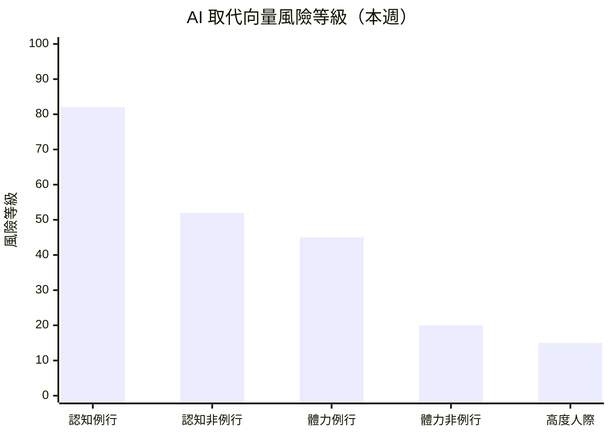

# 求職策略建議 — 2026年第13週

> **重要聲明**：本報告由 AI 系統基於公開數據自動產出，所有內容僅為「基於數據觀測的參考方向」，不構成專業職涯諮詢。重大職涯決策請諮詢專業職涯顧問。詳見報告末「免責聲明」。

## 本週市場概覽

> 本週（2026-W13）就業市場溫度維持「🟠 偏冷」，溫度指數持續在 35，連續第 4 週未回升。美國 2 月非農就業 -92K 效應持續發酵，3 月數據尚未公布。Digg 因 AI 機器人垃圾內容問題裁員並關閉 App，裁員信號從大廠擴散至中小型內容平台。Meta 裁員 20% 傳聞仍未獲官方確認。另一方面，AI 相關職缺仍為唯一逆勢成長領域，Agentic AI 需求連續第六週維持 30%+ 成長，Legal AI 和 Agent Observability 作為新興標籤首次出現。市場持續呈現結構性分化：AI 原生領域擴張 vs. 傳統平台收縮。（引用來源：climate_index W13、skills_drift W13、workforce_news）

> 本報告使用 Qdrant 向量搜尋取得相關資料

## 快速導覽

根據你目前的狀態，以下是最相關的報告段落：

- **正在求職中** → [本週機會窗口](#本週行動清單) ｜ [高需求技能](#二高需求技能與學習資源參考) ｜ [產業進入門檻](#四各產業進入門檻觀察)
- **考慮轉職中** → [AI 風險評估](#一ai-取代向量風險評估) ｜ [轉職路徑觀察](#三熱門轉職路徑觀察) ｜ [薪資對標](#四各產業進入門檻觀察)
- **在職觀察中** → [技能趨勢](#二高需求技能與學習資源參考) ｜ [產業動態](#六本週關鍵觀察) ｜ [AI 風險趨勢](#一ai-取代向量風險評估)

---

## 一、AI 取代向量風險評估

基於 skills_drift 和 industry_segments 的數據，以下為各[AI 取代向量](/glossary/#ai-取代向量)的當前狀態評估。

### 風險總覽

| 取代向量 | 當前風險等級 | 趨勢方向 | 關鍵觀察 |
|----------|------------|----------|----------|
| [認知例行](/glossary/#認知例行cognitive-routine)（cognitive_routine） | 高 | 升高 | Digg 裁員關閉 App，AI bot 破壞平台機制；Atlassian 裁員後續效應持續（來源：workforce_news） |
| [認知非例行](/glossary/#認知非例行cognitive-non-routine)（cognitive_nonroutine） | 中 | 升溫 | Agentic AI +34.4%、MCP +31.4%，Legal AI 新興標籤出現（來源：skills_drift） |
| [體力例行](/glossary/#體力例行physical-routine)（physical_routine） | 中 | 持平 | 製造業觀測職缺 14 筆，無明顯加速信號（來源：industry_segments） |
| [體力非例行](/glossary/#體力非例行physical-non-routine)（physical_nonroutine） | 低 | 持平 | 零售服務業職缺佔台灣最大宗 48%（499 筆），人力需求穩定（來源：tw_govjobs） |
| [高度人際](/glossary/#高度人際interpersonal)（interpersonal） | 低 | 持平 | 經營管理 42,400 TWD、照護服務 40,400 TWD，薪資穩定上升（來源：salary_bands） |

> **風險等級說明**：風險等級基於該向量下角色的職缺需求變化、技能替代信號、全球趨勢綜合判定。此為基於有限數據的觀測結果，不代表確定性預測。

> 風險等級基於職缺變化率、技能替代信號、全球趨勢綜合判定。數值越高表示該向量下的角色面臨越大的自動化替代壓力。此為觀測指標，非確定性預測。

### 各向量詳細分析

#### 認知例行（cognitive_routine）

**觀測到的信號**：
- Digg 因 AI 機器人垃圾帳號無法遏制而裁員並關閉 App，反映非 AI 原生內容平台面臨雙重壓力（來源：workforce_news）
- Atlassian 裁員 1,600 人（W12）後續效應持續發酵，B2B SaaS 產業信心受壓（來源：workforce_news）
- 財務會計類薪資中位數 34,600 TWD，為觀測類別中偏低（來源：salary_bands）
- 2025 年逾 127,000 名科技工作者遭裁，裁員趨勢延續至 2026 年（來源：funding_signals）

**受影響的角色**：

| 角色 | 職缺變化 | 技能需求變化 | 觀測到的替代信號 |
|------|----------|-------------|-----------------|
| 資料輸入員 | 無明顯數據 | 基礎 SQL 仍有需求（+9.2%） | AI 自動化數據處理工具持續普及 |
| 財務助理 | 穩定 | Excel 增速趨緩、Python/SQL 上升 | agentic 財務建模工具持續發展 |
| 客服專員 | 無明顯數據 | 無明顯信號 | AI 聊天機器人取代部分基礎諮詢 |
| QA 測試員 | 下降信號 | AI Coding Assistant 持續出現 | Atlassian 裁員涵蓋 QA 與產品支援職能 |
| 內容聚合編輯 | 下降信號 | 無明顯信號 | Digg 關閉 App，內容聚合模式受 AI 衝擊 |

**參考方向**（非建議）：
- 基於觀測數據，該向量下的工作者可關注以下技能補充方向：資料分析（SQL、Python）、AI 工具協作、業務流程優化
- Digg 事件顯示 AI 不僅透過「取代人力」影響就業，還透過「破壞既有平台商業模式」間接造成職位流失。對個人影響取決於具體公司與業務模式（來源：workforce_news、industry_segments）

#### 認知非例行（cognitive_nonroutine）

**觀測到的信號**：
- Agentic/AI Agent +34.4%、MCP +31.4%、Vector Database +25.0%、RAG +19.2%（來源：skills_drift）
- Legal AI（8 次）和 Agent Observability（5 次）作為新興標籤首次出現（來源：skills_drift）
- 職缺用語從「production agentic systems」進一步演化為「agentic at scale」和「multi-agent orchestration」（來源：skills_drift）
- 後端工程師需求佔 39%、全端 28%，薪資區間 $120K-$280K USD（來源：global_hn_hiring）
- 台灣科技資訊類薪資中位數 40,900 TWD/月，較 W12 +1.7%（來源：salary_bands）

**受影響的角色**：

| 角色 | 職缺變化 | 技能需求變化 | 觀測到的替代信號 |
|------|----------|-------------|-----------------|
| 軟體工程師 | 穩定 | Rust +8.5%、Platform Engineering +27.3% | AI Coding Assistant 改變開發流程 |
| AI/ML 工程師 | 上升 | Agentic +34.4%、MCP +31.4% | 需求擴張中，短期內不受取代 |
| 資料工程師 | 上升 | Data Engineer +11.9%、Vector DB +25.0% | RAG 架構標準化帶動需求 |
| DevOps/SRE 工程師 | 穩定至上升 | CI/CD +14.3%、K8s +10.4% | Platform Engineering 分化為獨立角色 |

**參考方向**（非建議）：
- 基於觀測數據，該向量下的工作者可關注 AI Agent 生態系技能（Agentic、MCP、Vector Database、RAG）
- Legal AI 和 Agent Observability 的出現，暗示 AI Agent 生態正從基礎建構走向垂直產業應用與運維監控，值得追蹤
- 職缺用語質變（「agentic at scale」、「multi-agent orchestration」）顯示市場從「能建構 Agent」升級為「能管理多 Agent 系統」。但此為趨勢觀察，個人影響因技術棧和產業而異

#### 體力例行（physical_routine）

**觀測到的信號**：
- 製造業觀測職缺數僅 14 筆，樣本不足（來源：industry_segments）
- 台灣製造生產類薪資中位數 38,600 TWD/月，較 W12 +1.0%（來源：salary_bands）
- 國防科技擴張可能帶動精密製造需求（來源：funding_signals）
- 無明顯機器人取代加速信號（來源：climate_index）

**受影響的角色**：

| 角色 | 職缺變化 | 技能需求變化 | 觀測到的替代信號 |
|------|----------|-------------|-----------------|
| 生產線作業員 | 無明顯數據 | 無明顯信號 | 長期自動化趨勢，本週無加速信號 |
| 倉儲搬運員 | 穩定 | 物流類 34 筆穩定 | 無明顯信號 |
| 品管檢測員 | 穩定 | AI 視覺辨識技術持續進步 | 中期壓力，短期穩定 |

**參考方向**（非建議）：
- 基於觀測數據，該向量下的工作者可關注設備維護、自動化系統操作等技能
- 國防科技 IPO 熱潮可能間接帶動精密製造人才需求
- 本系統目前缺乏專門的製造業職缺資料源，觀測能力有限

#### 體力非例行（physical_nonroutine）

**觀測到的信號**：
- 零售服務業職缺 499 筆，佔台灣就業通職缺 48%（來源：tw_govjobs）
- 物流運輸薪資中位數 42,900 TWD/月，營建工程 44,800 TWD/月（來源：salary_bands）
- 台灣餐飲服務持續穩定，高齡化驅動照護需求（來源：industry_segments）

**受影響的角色**：

| 角色 | 職缺變化 | 技能需求變化 | 觀測到的替代信號 |
|------|----------|-------------|-----------------|
| 餐飲內外場人員 | 穩定（台灣） | 連鎖餐飲持續擴點招募 | 自助點餐機普及，但服務體驗仍需人力 |
| 司機/物流配送 | 穩定 | 無明顯信號 | 薪資中位數 42,900 TWD |
| 技術維修人員 | 穩定 | 66 筆技術工類職缺 | 現場作業需求高，自動化難度大 |
| 營建工人 | 穩定 | 無明顯信號 | 薪資最高類別（44,800 TWD） |

**參考方向**（非建議）：
- 該向量下的職缺需求穩定，短期內 AI 取代風險較低
- 營建工程薪資為觀測類別最高（44,800 TWD），但需考量體力負擔與職業風險

#### 高度人際（interpersonal）

**觀測到的信號**：
- 經營管理類薪資中位數 42,400 TWD/月，較 W12 +1.0%（來源：salary_bands）
- 照護服務類薪資中位數 40,400 TWD/月，較 W12 +1.0%（來源：salary_bands）
- 教育訓練類薪資中位數 39,200 TWD/月，較 W12 +1.0%（來源：salary_bands）
- 管理、教育、照護等人際互動工作受 AI 衝擊評估為「低」（來源：industry_segments）

**受影響的角色**：

| 角色 | 職缺變化 | 技能需求變化 | 觀測到的替代信號 |
|------|----------|-------------|-----------------|
| 店經理/營運主管 | 穩定 | 企業持續招募管理職 | 無明顯取代信號 |
| 照顧服務員 | 穩定至上升 | 高齡化驅動長期需求 | 人際互動不可取代 |
| 教師/講師 | 穩定 | AI 輔助教學工具漸增 | 學生輔導、情緒支持不可取代 |
| 業務/銷售顧問 | 穩定 | 客戶關係管理仍需人際技能 | 無明顯取代信號 |

**參考方向**（非建議）：
- 高度人際向量持續為 AI 取代風險最低的類別
- 照護服務因高齡化結構性需求穩定，但薪資區間較寬（P25 31,100 至 P75 48,500 TWD），反映技能與經驗差異
- 經營管理類薪資排名第三（42,400 TWD），人際協調能力在 AI 時代可能反而更具價值

---

## 二、高需求技能與學習資源參考

基於 skills_drift 的上升榜，以下為值得關注的技能方向。

### 技能需求上升 Top 10

| 排名 | 技能 | 需求變化 | 相關角色 | 相關產業 | AI 取代向量 |
|------|------|----------|----------|----------|-------------|
| 1 | Agentic/AI Agent | +34.4% | AI 工程師、後端工程師 | AI 新創、企業 AI 轉型 | cognitive_nonroutine |
| 2 | MCP（Model Context Protocol） | +31.4% | AI 工具開發者、LLM 工程師 | AI 工具開發、LLM 應用 | cognitive_nonroutine |
| 3 | Platform Engineering | +27.3% | DevOps 工程師、SRE | 雲端平台、大型科技公司 | cognitive_nonroutine |
| 4 | Vector Database | +25.0% | 資料工程師、AI 工程師 | RAG 應用、AI 產品開發 | cognitive_nonroutine |
| 5 | PyTorch | +22.7% | ML 工程師、研究員 | AI 研發、深度學習 | cognitive_nonroutine |
| 6 | RAG（檢索增強生成） | +19.2% | AI 工程師、後端工程師 | LLM 應用、企業 AI | cognitive_nonroutine |
| 7 | FastAPI | +18.8% | 後端工程師 | API 開發、AI 服務 | cognitive_nonroutine |
| 8 | Next.js | +14.0% | 全端工程師、前端工程師 | SaaS 產品、Web 應用 | cognitive_nonroutine |
| 9 | CI/CD | +14.3% | DevOps 工程師 | 所有科技公司 | cognitive_nonroutine |
| 10 | Rust | +8.5% | 系統工程師、後端工程師 | 協作軟體、金融科技 | cognitive_nonroutine |

> 資料來源：約 4,855 筆職缺，觀測週期 W10~W13（來源：skills_drift W13）

### 結構化學習路徑

> **聲明**：以下僅列出公開可驗證的免費或主流學習平台，不代表推薦或背書。學習效果因人而異，且學習路徑因個人基礎不同而差異極大。不同經濟條件的讀者可優先關注免費資源。

#### Agentic AI / AI Agent（AI 取代向量：cognitive_nonroutine）

| 階段 | 學習目標 | 資源類型參考 | 預估時間 |
|------|----------|-------------|----------|
| 基礎 | LLM 原理、Prompt Engineering | 官方文件（OpenAI Docs、Anthropic Docs） | 20-40 小時 |
| 進階 | Agent 架構、MCP 協定、Tool Use、Multi-Agent 編排 | 開源專案（LangChain、CrewAI 官方教程） | 40-80 小時 |
| 實戰 | 規模化部署、Agent Observability | 開源社群、技術部落格 | 持續 |

> **聲明**：以上為基於公開資訊的學習方向參考，不代表推薦或品質保證。學習效果因人而異。

#### Rust（AI 取代向量：cognitive_nonroutine）

| 階段 | 學習目標 | 資源類型參考 | 預估時間 |
|------|----------|-------------|----------|
| 基礎 | 所有權系統、型別系統 | 官方文件（The Rust Programming Language Book，免費） | 30-50 小時 |
| 進階 | 並發、async/await、系統程式設計 | 主流平台（如 Exercism，免費） | 40-80 小時 |
| 實戰 | 開源貢獻、效能敏感專案 | GitHub 開源專案 | 持續 |

> **聲明**：以上為基於公開資訊的學習方向參考，不代表推薦或品質保證。學習效果因人而異。

#### Platform Engineering（AI 取代向量：cognitive_nonroutine）

| 階段 | 學習目標 | 資源類型參考 | 預估時間 |
|------|----------|-------------|----------|
| 基礎 | Kubernetes、Docker、CI/CD 管線 | 官方文件（Kubernetes Docs，免費）、主流平台（如 freeCodeCamp） | 30-60 小時 |
| 進階 | Internal Developer Platform、Terraform/Crossplane | 開源專案文件（Backstage、Crossplane） | 40-80 小時 |
| 實戰 | 企業平台建置、開發者體驗優化 | 技術社群、CNCF 生態系 | 持續 |

> **聲明**：以上為基於公開資訊的學習方向參考，不代表推薦或品質保證。學習效果因人而異。

---

## 三、熱門轉職路徑觀察

> **重要**：以下轉職路徑為基於數據觀測的「可能方向」，不代表建議或保證。每條路徑的可行性高度取決於個人背景、經驗和學習能力。重大職涯決策建議諮詢專業職涯顧問。

### 基於數據觀測的轉職方向

| 起始角色 | 目標方向 | [技能重疊度](/glossary/#技能重疊度) | 需補充技能 | 薪資變化參考 | 觀測依據 |
|----------|----------|-----------|-----------|-------------|----------|
| DevOps 工程師 | Platform Engineer | 高 | Internal Developer Platform、開發者體驗設計 | +10~20%（推估） | skills_drift：Platform Engineering +27.3% |
| 後端工程師 | AI Agent 工程師 | 中 | MCP、LLM 應用、Multi-Agent 編排 | +15~30%（推估） | skills_drift：Agentic +34.4%、MCP +31.4% |
| 資料工程師 | RAG/向量搜尋工程師 | 高 | Vector Database、RAG 架構、LLM | +10~20%（推估） | skills_drift：Vector DB +25.0%、RAG +19.2% |
| 前端工程師 | 全端工程師（AI 產品） | 中 | FastAPI、LLM API 整合、後端基礎 | +5~15%（推估） | skills_drift：FastAPI +18.8%、Next.js +14.0% |

### 轉職路徑詳解

#### DevOps 工程師 → Platform Engineer

**觀測依據**：
- Platform Engineering 從 W12 的 22 次成長至 28 次（+27.3%），從新標籤轉為持續成長趨勢（來源：skills_drift）
- CI/CD +14.3%、Kubernetes +10.4%、Docker +11.2%，基礎技能需求持續上升（來源：skills_drift）

**技能重疊**：
- 已具備：Kubernetes、Docker、CI/CD、Terraform、雲端平台
- 需補充：Internal Developer Platform 建置、開發者體驗設計、Backstage/Crossplane

**薪資帶參考**（來源：salary_bands、global_hn_hiring）：
- DevOps 工程師：$140K-$260K USD（全球科技職缺）
- Platform Engineer：$150K-$230K USD（推估，基於少量樣本）

**不確定性提醒**：
- Platform Engineering 為新興標籤，28 次出現屬小樣本，趨勢是否持續需觀察
- 不同公司對 Platform Engineer 的定義和職責範圍差異極大
- 此路徑的薪資估計基於有限樣本，實際薪資因公司規模、地區等因素差異甚大

#### 後端工程師 → AI Agent 工程師

**觀測依據**：
- Agentic/AI Agent +34.4%（W13 出現 168 次），連續第六週維持 30%+ 成長（來源：skills_drift）
- MCP +31.4%，職缺描述中持續出現「MCP-native architecture」等用語（來源：skills_drift）
- AI Agent 從 W01 的約 60 次成長至 W13 的 168 次，12 週增幅 +158%（來源：skills_drift）

**技能重疊**：
- 已具備：API 設計、系統架構、Python/Go/TypeScript、資料庫操作
- 需補充：LLM 應用開發、MCP 協定、Agent 編排框架、向量資料庫、Multi-Agent 系統設計

**薪資帶參考**（來源：global_hn_hiring）：
- 後端工程師 P50：$160K USD
- AI/ML 工程師 P50：$180K-$220K USD

**不確定性提醒**：
- AI Agent 技術棧仍在快速演化，目前學習的工具可能在 6-12 個月後有顯著變動
- 此領域對 LLM 基礎理解有一定門檻，轉職時間因人而異
- 市場需求雖上升但仍以有經驗者為主，純轉職者可能面臨競爭

#### 資料工程師 → RAG/向量搜尋工程師

**觀測依據**：
- Vector Database +25.0%、RAG +19.2%（來源：skills_drift）
- Data Engineer +11.9%，基礎角色需求同步上升（來源：skills_drift）
- PostgreSQL +8.7%，部分 RAG 應用使用 pgvector 擴充（來源：skills_drift）

**技能重疊**：
- 已具備：SQL、Python、資料管線設計、ETL 流程、雲端平台
- 需補充：Vector Database（Pinecone、Weaviate、pgvector）、RAG 架構設計、LLM API 整合

**薪資帶參考**（來源：global_hn_hiring）：
- 資料工程師 P50：$150K USD
- RAG/向量搜尋工程師 P50：$160K-$200K USD（推估）

**不確定性提醒**：
- RAG 架構為 LLM 應用的當前主流方案，但技術路線可能因 LLM 能力提升而調整
- 向量資料庫市場仍在整合中，工具選擇可能快速變化
- 薪資推估基於有限樣本，實際情況因公司和地區而異

#### 前端工程師 → 全端工程師（AI 產品）

**觀測依據**：
- FastAPI +18.8%、Next.js +14.0%（來源：skills_drift）
- 全端工程師需求佔 28%，僅次於後端（來源：global_hn_hiring）

**技能重疊**：
- 已具備：React、TypeScript、Next.js、CSS 工具鏈
- 需補充：FastAPI/Node.js 後端、LLM API 整合、資料庫設計

**薪資帶參考**（來源：salary_bands、global_hn_hiring）：
- 前端工程師 P50：$130K USD
- 全端工程師 P50：$155K USD

**不確定性提醒**：
- 「全端」定義寬泛，不同公司期望的技能深度差異很大
- 後端技能需要實際專案經驗，僅完成教程可能不足
- AI 產品整合可能需要理解 LLM 特性，學習曲線因人而異

---

## 四、各產業進入門檻觀察

基於 industry_segments 和 tw_govjobs 的數據：

| 產業 | 入門角色 | 基本技能門檻 | 平均入門薪資 | 觀測職缺數 | 進入難度參考 |
|------|----------|-------------|-------------|-----------|-------------|
| 軟體與 SaaS | Junior Developer | Python/JS、Git、基礎 CS | 36,500 TWD（台灣 P25） | ~3,500 | 中（技術門檻，但職缺多） |
| 零售服務 | 門市服務員 | 服務態度、POS 操作 | 34,400 TWD（台灣 P25） | ~499 | 低（門檻低，職缺多） |
| 醫療照護 | 照顧服務員 | 照護證照 | 34,200 TWD（台灣 P25） | ~79 | 中（需證照） |
| 物流運輸 | 配送人員 | 駕照、體力 | 39,000 TWD（台灣 P25） | ~34 | 低 |
| 金融服務 | 會計助理 | Excel、基礎會計 | 33,200 TWD（台灣 P25） | ~138 | 中（需專業知識） |
| 營建工程 | 工地人員 | 體力、基礎技術 | 36,800 TWD（台灣 P25） | ~18 | 低（但體力要求高） |

> **進入難度參考**基於：入門職缺數量、要求技能數量、要求經驗年資、證照要求。此為觀測指標，非絕對判斷。薪資數據來源為 tw_govjobs，以政府平台基層職缺為主，可能低估科技業實際薪資。

---

## 五、台灣常見職業觀察

### 門市服務人員（AI 取代向量：體力非例行 / 高度人際）

**本週市場觀察**：
- 職缺觀測：台灣就業通零售服務類 499 筆，佔全平台 48%，需求穩定（來源：tw_govjobs）
- 薪資參考：P50 為 38,100 TWD/月（+0.8%），P25 為 34,400 TWD（來源：salary_bands）
- AI 風險評估：收銀自動化（自助結帳）持續普及，但顧客服務體驗仍需人力，整體風險偏低

**參考方向**（非建議）：
- 連鎖餐飲與零售持續擴點，基層人力需求穩定
- 可關注服務品質提升、基礎外語能力（觀光需求上升）

> 以上基於政府平台 499 筆零售服務職缺觀測，樣本以台北市為主。

### 照顧服務員（AI 取代向量：高度人際）

**本週市場觀察**：
- 職缺觀測：台灣就業通照護類及醫療保健類合計約 79 筆（來源：tw_govjobs）
- 薪資參考：P50 為 40,400 TWD/月（+1.0%），薪資區間較寬（P25 31,100 至 P75 48,500 TWD）（來源：salary_bands）
- AI 風險評估：病患關懷、情緒支持高度依賴人際互動，短期內不可取代

**參考方向**（非建議）：
- 高齡化社會結構驅動長期需求，人力缺口可能持續擴大
- 美國醫療就業曾出現負增長（-28K），但台灣與美國趨勢分歧，台灣需求仍穩定

> 以上基於政府平台約 79 筆照護/醫療職缺觀測。

### 物流配送人員（AI 取代向量：體力非例行）

**本週市場觀察**：
- 職缺觀測：台灣就業通物流運輸類 34 筆（來源：tw_govjobs）
- 薪資參考：P50 為 42,900 TWD/月（+0.9%），薪資在非科技類中排名前段（來源：salary_bands）
- AI 風險評估：自動駕駛配送仍在實驗階段，台灣道路環境短期內難以全面自動化

**參考方向**（非建議）：
- 物流薪資排名第二（42,900 TWD），反映體力勞動與工時的補償
- 可關注大型物流公司的正職機會，福利保障較完善

> 以上基於政府平台 34 筆物流運輸職缺觀測，樣本有限。

### 營建工程人員（AI 取代向量：體力非例行）

**本週市場觀察**：
- 職缺觀測：台灣就業通營建類 18 筆（來源：tw_govjobs）
- 薪資參考：P50 為 44,800 TWD/月（+0.9%），為所有觀測類別最高（來源：salary_bands）
- AI 風險評估：營建施工對現場判斷和體力要求高，自動化難度大，風險極低

**參考方向**（非建議）：
- 薪資為觀測類別最高，但需考量體力負擔、職業安全風險和工作環境
- 國防科技擴張可能中期帶動基礎建設需求

> 以上基於政府平台 18 筆營建職缺觀測，小樣本。

---

## 六、本週關鍵觀察

### 市場動態觀察

美國 2 月非農就業 -92K 效應持續發酵，3 月數據尚未公布，市場處於等待確認階段。溫度指數連續第 4 週維持在 35，逼近「寒冷」邊界但未進一步惡化。Digg 因 AI 機器人垃圾內容裁員並關閉 App，為中小型內容平台受 AI 衝擊的最新案例。Meta 裁員 20% 傳聞仍未獲官方確認 [REVIEW_NEEDED]。台灣就業市場維持穩定，tw_govjobs 職缺 1,040 筆，結構無顯著變動。（來源：climate_index W13、workforce_news）

### 技能趨勢觀察

AI Agent 生態系持續爆發性成長：Agentic 12 週增幅 +158%（從約 65 次到 168 次），MCP 12 週增幅 +283%（從約 12 次到 46 次，小樣本）。本週最值得關注的質變信號是 Legal AI（8 次）和 Agent Observability（5 次）兩個新興標籤的出現——前者反映 AI Agent 從通用基礎設施走向垂直產業應用，後者反映 Agent 生產部署催生運維監控需求。Top 10 主流技能排名連續第五週完全穩定，變化集中在中長尾新興技能。（來源：skills_drift W13）

### 產業結構觀察

Digg 裁員關閉 App 反映了 AI 對就業的「第二路徑」影響——不僅透過取代人力，還透過破壞既有商業模式間接導致職位流失。AI bot 生成垃圾內容→平台信任度下降→用戶流失→營收下滑→裁員。這條路徑對內容聚合、社群媒體、線上論壇等非 AI 原生平台構成結構性威脅。Atlassian 裁員 1,600 人的後續效應持續，B2B SaaS 產業信心受壓。資本市場方面，國防科技 IPO 餘溫持續，AI 與資安仍為融資熱門領域。（來源：industry_segments W13、workforce_news、funding_signals）

### 值得持續關注的信號

- **美國 3 月就業數據**：確認非農負增長是否為趨勢性惡化
- **Meta 裁員傳聞**：若 20%（約 15,000 人）獲確認，將重塑科技就業版圖 [REVIEW_NEEDED]
- **AI Agent 垂直化趨勢**：Legal AI 是否從小樣本（8 次）成長為可量化的趨勢
- **Agent Observability**：AI Agent 運維監控是否催生新的專業角色需求
- **MCP 是否突破 50 次門檻**：從小樣本成長為主流需求的關鍵觀察點

---

## 本週行動清單

> 基於本週數據觀測，以下為參考行動方向。所有建議均為「可考慮」的方向，非確定性指令。

### 求職者

- [ ] **盤點個人技能與 AI 取代向量的關係**：對照本報告 AI 風險矩陣，評估自身角色所屬向量的風險等級。若屬認知例行向量，可考慮關注數據分析、AI 工具協作等補充方向（依據：AI 取代向量風險評估）
- [ ] **關注 AI-adjacent 領域職缺**：Legal AI、Agent Observability 等新興垂直領域開始出現人才需求，可作為差異化求職方向的參考（依據：skills_drift，Legal AI 8 次、Agent Observability 5 次）
- [ ] **評估目標公司的 AI 韌性**：Digg 因 AI bot 問題倒閉，可作為評估目標公司商業模式是否受 AI 結構性威脅的參考案例（依據：workforce_news）
- [ ] **強化 AI 協作工具使用能力**：無論目標角色為何，AI 工具使用能力逐漸成為基礎要求，可考慮在求職材料中展現相關經驗（依據：skills_drift）
- [ ] **留意台灣非科技職缺機會**：營建工程薪資中位數 44,800 TWD 為觀測最高，物流運輸 42,900 TWD 亦在前段，非科技路徑值得納入評估（依據：salary_bands）

### 在職者

- [ ] **評估所在平台/公司的 AI 韌性**：Digg 案例顯示 AI 可透過破壞商業模式間接導致裁員，值得評估自身公司是否面臨類似風險（依據：workforce_news）
- [ ] **追蹤 AI Agent 生態系的垂直化動向**：Legal AI 和 Agent Observability 的出現可能暗示新的專業方向，可考慮關注自身產業是否出現類似的 AI 垂直化需求（依據：skills_drift）
- [ ] **追蹤市場溫度變化**：溫度指數連續 4 週維持 35，等待 3 月就業數據以評估是否為趨勢性惡化（依據：climate_index W13）

### 職涯顧問

- [ ] **引用「AI 第二路徑」框架評估客戶風險**：Digg 案例揭示 AI 不僅取代人力，還可能透過破壞商業模式間接影響就業，此框架可用於更全面的客戶職涯風險評估
- [ ] **關注 AI Agent 垂直化對非科技產業的影響**：Legal AI 出現暗示法律服務業可能面臨 AI 專業化衝擊，值得納入對法律相關客戶的諮詢參考

### 下週關注

- 美國 3 月就業數據（確認非農負增長是否為趨勢性惡化）
- Meta 裁員消息是否獲官方確認及具體規模
- AI Agent 垂直化趨勢追蹤（Legal AI 是否持續出現、Agent Observability 發展）

---

## 免責聲明

本報告由 AI 系統基於公開數據自動產出，僅供參考。

1. **非專業職涯諮詢**：本報告不構成專業的職涯規劃建議。重大職涯決策請諮詢專業職涯顧問。
2. **數據局限性**：分析基於有限的觀測數據源（主要為台灣就業通及全球公開報告），不代表完整的就業市場狀況。tw_104_jobs、tw_company_reviews 因 API 限制停用，台灣科技人才市場動態資訊有所不足。
3. **預測不確定性**：所有趨勢分析和預測均基於歷史數據推斷，實際市場變化可能與預測不同。
4. **個人差異**：職涯發展受個人背景、技能、經驗、地理位置等多重因素影響，本報告無法涵蓋個人化情境。
5. **不構成投資建議**：報告中提及的產業趨勢和企業動態不構成任何投資建議。
6. **學習資源中立**：報告中列出的學習資源僅為公開可查資訊的彙整，不代表推薦或品質保證。
7. **AI 生成風險**：本報告由 AI 模型生成，儘管基於數據，但綜合判斷部分可能包含不精確或過度簡化的分析。

> 需要更個人化的建議？建議諮詢專業職涯顧問。

[查看本週景氣溫度計，了解市場整體狀況 →](/reports/climate-index-w13/)
