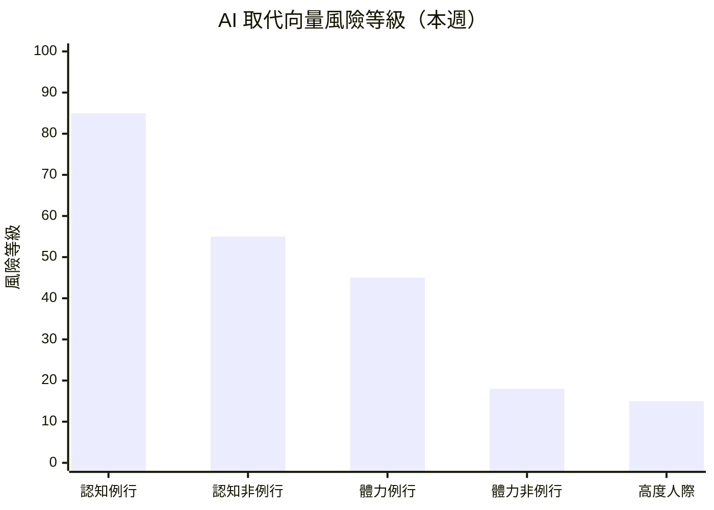

# 求職策略建議 — 2026年第17週

> **重要聲明**：本報告由 AI 系統基於公開數據自動產出，所有內容僅為「基於數據觀測的參考方向」，不構成專業職涯諮詢。重大職涯決策請諮詢專業職涯顧問。詳見報告末「免責聲明」。

## 本週市場概覽

> 本週（2026-W17）就業市場溫度微升至「🟠 偏冷」，溫度指數從 35 回升至 38。美國 3 月非農就業 +178K 終結了 2 月 -92K 的負增長衝擊，但失業率同步升至 4.3%（+0.2pp），U-6 未充分就業率達 8.0%，市場呈現「有量無質」的分化復甦格局。平均時薪 $37.38（+3.5% YoY）微幅超越 CPI +3.3%，實質薪資正增長但幅度僅 0.2 個百分點。OpenAI 完成 $110B 史上最大單輪融資，AI 資本狂熱持續升溫，SaaS IPO 持續缺席。Agent Security 作為新興技能標籤首次出現（18 次），MCP 成長 +38.3% 並進入商業化階段。市場分化格局進一步深化：AI 原生領域持續擴張，傳統軟體與內容平台持續承壓。（引用來源：climate_index W17、skills_drift W17、industry_segments W17、salary_bands W17）

> 本報告使用 Qdrant 向量搜尋取得相關資料

## 快速導覽

根據你目前的狀態，以下是最相關的報告段落：

- **正在求職中** → [本週機會窗口](#本週行動清單) ｜ [高需求技能](#二高需求技能與學習資源參考) ｜ [產業進入門檻](#四各產業進入門檻觀察)
- **考慮轉職中** → [AI 風險評估](#一ai-取代向量風險評估) ｜ [轉職路徑觀察](#三熱門轉職路徑觀察) ｜ [薪資對標](#四各產業進入門檻觀察)
- **在職觀察中** → [技能趨勢](#二高需求技能與學習資源參考) ｜ [產業動態](#六本週關鍵觀察) ｜ [AI 風險趨勢](#一ai-取代向量風險評估)

---

## 一、AI 取代向量風險評估

基於 skills_drift 和 industry_segments 的數據，以下為各[AI 取代向量](/glossary/#ai-取代向量)的當前狀態評估。

### 風險總覽

| 取代向量 | 當前風險等級 | 趨勢方向 | 關鍵觀察 |
|----------|------------|----------|----------|
| [認知例行](/glossary/#認知例行cognitive-routine)（cognitive_routine） | 高 | 升高 | 財務會計薪資成長僅 +1.7%，與非例行差距擴大至 1.6pp；SaaS IPO 缺席反映自動化壓力（來源：salary_bands、industry_segments） |
| [認知非例行](/glossary/#認知非例行cognitive-non-routine)（cognitive_nonroutine） | 中 | 分化加劇 | Agent Security 新興（18 次）、MCP +38.3%、Agentic +28.2%；AI 工具從輔助走向執行層面（來源：skills_drift） |
| [體力例行](/glossary/#體力例行physical-routine)（physical_routine） | 中 | 持平 | 製造業觀測職缺僅 2 筆（資料源差異），tw_govjobs 數據未更新；機器人融資活躍（Coco Robotics $80M）（來源：industry_segments） |
| [體力非例行](/glossary/#體力非例行physical-non-routine)（physical_nonroutine） | 低 | 持平 | 營建工程薪資 46,400 TWD 續居冠軍（+3.6%），物流運輸 44,200 TWD 次之（來源：salary_bands） |
| [高度人際](/glossary/#高度人際interpersonal)（interpersonal） | 低 | 持平 | 經營管理 43,800 TWD（+3.3%）、照護服務 41,600 TWD（+3.0%），人際互動需求穩定（來源：salary_bands） |

> **風險等級說明**：風險等級基於該向量下角色的職缺需求變化、技能替代信號、全球趨勢綜合判定。此為基於有限數據的觀測結果，不代表確定性預測。

> 風險等級基於職缺變化率、技能替代信號、全球趨勢綜合判定。數值越高表示該向量下的角色面臨越大的自動化替代壓力。此為觀測指標，非確定性預測。

### 各向量詳細分析

#### 認知例行（cognitive_routine）

**觀測到的信號**：
- 財務會計類薪資成長率僅 +1.7%（W13→W17），與認知非例行的 +3.3% 差距從 W13 的 0.4pp 擴大至 1.6pp，薪資剪刀差持續擴大（來源：salary_bands）
- SaaS IPO 持續缺席，Atlassian 裁員 1,600 人效應延續，傳統企業軟體產業承壓（來源：funding_signals、industry_segments）
- OpenAI $110B 融資加速 AI 工具對例行認知工作的替代壓力（來源：funding_signals）
- AI Coding Agent（Claude Code、GitHub Copilot）正在取代部分認知例行的程式碼撰寫任務（來源：skills_drift）

**受影響的角色**：

| 角色 | 職缺變化 | 技能需求變化 | 觀測到的替代信號 |
|------|----------|-------------|-----------------|
| 財務助理 | 穩定但增速最慢 | Python/SQL 上升，Excel 增速趨緩 | AI 代理式財務建模工具崛起（Zocks、Meridian） |
| 資料輸入員 | 無明顯數據 | 基礎 SQL 仍有需求 | AI 自動化數據處理工具持續普及 |
| QA 測試員 | 下降信號 | Playwright +55.6%（自動化測試） | AI 測試工具加速取代手動測試 |
| 客服專員 | 無明顯數據 | 無明顯信號 | AI 聊天機器人取代基礎諮詢 |
| 初階程式設計師 | 穩定 | AI Coding Assistant 持續出現 | Always Further（nono.sh）建構 Agent 安全驗證層，前提是 Agent 已執行例行編碼工作 |

**參考方向**（非建議）：
- 基於觀測數據，該向量下的工作者可關注以下技能補充方向：資料分析（SQL、Python）、AI 工具協作、業務流程優化
- 財務會計從業者可考慮關注 AI 代理式工具的應用，將自身定位從「執行者」調整為「AI 工具協作者」
- 薪資剪刀差持續擴大的趨勢值得長期關注，但此為結構性變化而非急迫危機，個人影響因具體工作內容和公司而異

#### 認知非例行（cognitive_nonroutine）

**觀測到的信號**：
- Agent Security 作為新興技能標籤首次大規模出現（18 次），MintMCP 和 Always Further 在同週招聘，標誌 AI Agent 生態從「建構→部署→監控→安全」四階段演進（來源：skills_drift）
- Agentic/AI Agent +28.2%（至 218 次），成長速度較 W13 的 34.4% 略有放緩但絕對數量持續攀升（來源：skills_drift）
- MCP +38.3%（至 65 次），MintMCP 公司直接以 MCP 命名建構閘道器平台，MCP 從協議層進入商業化階段（來源：skills_drift）
- FastAPI +21.6%（至 118 次），穩居 AI 服務 API 框架首選（來源：skills_drift）
- 台灣科技資訊類薪資中位數 42,500 TWD/月（+3.9%），為本週所有類別漲幅最大（來源：salary_bands）
- HN Hiring 全球科技職缺薪資中位數 $178K USD/年，薪資揭露範圍上移至 $125K-$280K（來源：salary_bands）

**受影響的角色**：

| 角色 | 職缺變化 | 技能需求變化 | 觀測到的替代信號 |
|------|----------|-------------|-----------------|
| 軟體工程師 | 穩定 | Rust +6.2%、C++ +10.1% | AI Coding Assistant 改變開發流程，但需求仍強 |
| AI/ML 工程師 | 上升 | Agentic +28.2%、MCP +38.3%、Agent Security +50% | 需求擴張中，短期內不受取代 |
| 資料工程師 | 上升 | Data Engineer +7.4%、Vector DB +22.2%、pgvector 新出現 | RAG 架構標準化帶動需求 |
| DevOps/SRE 工程師 | 穩定至上升 | CI/CD +6.7%、K8s +6.6%、OpenTofu 新出現 | 基礎設施自動化需求持續擴張 |
| 資安工程師 | 上升 | Security +6.2%、Agent Security +50% | Agent 安全治理催生新專業角色 |

**參考方向**（非建議）：
- 基於觀測數據，該向量下的工作者可關注 AI Agent 生態系的安全治理層面（Agent Security、MCP Gateway、Tool Authorization）
- MCP 從協議走向平台（MintMCP），學習投資的確定性進一步提升，值得評估
- NLP（+20.3%）和 Computer Vision（+19.5%）同時加速成長，AI 應用正從純文字 LLM 擴展到多模態場景
- 但需注意：AI Agent 技術棧仍在快速演化，目前學習的具體工具可能在未來有顯著變動

#### 體力例行（physical_routine）

**觀測到的信號**：
- 製造業觀測職缺僅 2 筆（資料源差異，W13 含 tw_govjobs 為 14 筆），本週數據嚴重不足（來源：industry_segments）
- 台灣製造生產類薪資中位數 39,800 TWD/月（+3.1%），薪資穩定上升（來源：salary_bands）
- 機器人融資活躍（Coco Robotics $80M），可能加速製造業自動化（來源：funding_signals）
- 國防科技 IPO 熱潮持續，可能帶動精密製造需求（來源：funding_signals）

**受影響的角色**：

| 角色 | 職缺變化 | 技能需求變化 | 觀測到的替代信號 |
|------|----------|-------------|-----------------|
| 生產線作業員 | 無明顯數據 | 無明顯信號 | 長期自動化趨勢，本週無加速信號 |
| 倉儲搬運員 | 穩定 | 無明顯信號 | 無明顯信號 |
| 品管檢測員 | 穩定 | AI 視覺辨識持續進步 | 中期壓力，短期穩定 |

**參考方向**（非建議）：
- 基於觀測數據，該向量下的工作者可關注設備維護、自動化系統操作等技能
- 國防科技與機器人融資活躍可能在中期帶動精密製造人才需求
- 本系統目前缺乏專門的製造業職缺資料源，觀測能力有限

#### 體力非例行（physical_nonroutine）

**觀測到的信號**：
- 營建工程類薪資中位數 46,400 TWD/月（+3.6%），連續多週蟬聯薪資冠軍，Q2 工程旺季效應顯現（來源：salary_bands）
- 物流運輸薪資中位數 44,200 TWD/月（+3.0%），技術工藝 35,800 TWD（+3.5%）（來源：salary_bands）
- 體力非例行向量平均薪資成長 +3.4%，為本週最高（來源：salary_bands）
- Archer Aviation、Skyways 等硬體/航空新創在 HN Hiring 招聘，軟硬體整合領域需求走升（來源：skills_drift）

**受影響的角色**：

| 角色 | 職缺變化 | 技能需求變化 | 觀測到的替代信號 |
|------|----------|-------------|-----------------|
| 營建工人 | 穩定 | Q2 旺季帶動需求 | 現場作業需求高，自動化難度大 |
| 司機/物流配送 | 穩定 | 無明顯信號 | 自動駕駛配送仍在實驗階段 |
| 技術維修人員 | 穩定 | 營建旺季連帶帶動水電、機電需求 | 現場作業需求高，短期穩定 |
| 餐飲服務人員 | 穩定 | 連鎖餐飲持續擴點 | 自助點餐機普及，但服務體驗仍需人力 |

**參考方向**（非建議）：
- 該向量下的職缺需求穩定，短期內 AI 取代風險較低
- 營建工程薪資為觀測類別最高（46,400 TWD），但需考量體力負擔與職業安全風險
- 技術工藝漲幅 +3.5% 高於多數認知型類別，反映「現場不可遠端化」的工作在人力供給吃緊時具有薪資上行優勢

#### 高度人際（interpersonal）

**觀測到的信號**：
- 經營管理類薪資中位數 43,800 TWD/月（+3.3%），排名第三（來源：salary_bands）
- 照護服務類薪資中位數 41,600 TWD/月（+3.0%），薪資區間較寬（P25 32,200 至 P75 49,800 TWD）（來源：salary_bands）
- 教育訓練類薪資中位數 40,400 TWD/月（+3.1%）（來源：salary_bands）
- GTM（Go-to-Market）作為獨立職位在 HN Hiring 出現，結合產品理解和市場推廣能力（來源：skills_drift）
- Solutions Engineer 持續成長（+8%），需要工程技能與客戶關係管理的深度融合（來源：skills_drift）

**受影響的角色**：

| 角色 | 職缺變化 | 技能需求變化 | 觀測到的替代信號 |
|------|----------|-------------|-----------------|
| 店經理/營運主管 | 穩定 | 企業持續招募管理職 | 無明顯取代信號 |
| 照顧服務員 | 穩定至上升 | 高齡化驅動長期需求 | 人際互動不可取代 |
| 教師/講師 | 穩定 | AI 教學工具漸增 | 學生輔導、情緒支持不可取代 |
| 業務/銷售顧問 | 穩定 | Customer Success +7%、Solutions Engineer +8% | 技術銷售複合角色需求上升 |

**參考方向**（非建議）：
- 高度人際向量持續為 AI 取代風險最低的類別
- GTM 和 Solutions Engineer 的出現顯示「技術 + 人際」複合角色正在成為新的高價值職位方向
- 照護服務因高齡化結構性需求穩定，薪資區間較寬反映技能與經驗差異

---

## 二、高需求技能與學習資源參考

基於 skills_drift 的上升榜，以下為值得關注的技能方向。

### 技能需求上升 Top 10

| 排名 | 技能 | 需求變化 | 相關角色 | 相關產業 | AI 取代向量 |
|------|------|----------|----------|----------|-------------|
| 1 | Agent Security | +50.0% | 資安工程師、AI 工程師 | AI Agent 平台、企業資安 | cognitive_nonroutine |
| 2 | MCP（Model Context Protocol） | +38.3% | AI 工具開發者、LLM 工程師 | AI 工具開發、Agent 平台 | cognitive_nonroutine |
| 3 | Agentic/AI Agent | +28.2% | AI 工程師、後端工程師 | AI 新創、企業 AI 轉型 | cognitive_nonroutine |
| 4 | Vector Database | +22.2% | 資料工程師、AI 工程師 | RAG 應用、AI 產品開發 | cognitive_nonroutine |
| 5 | FastAPI | +21.6% | 後端工程師、AI 服務開發 | AI 服務 API、金融科技 | cognitive_nonroutine |
| 6 | NLP | +20.3% | AI 工程師、研究員 | 保險科技、法律科技 | cognitive_nonroutine |
| 7 | Computer Vision | +19.5% | ML 工程師、機器人工程師 | 自駕/機器人、醫療 AI | cognitive_nonroutine |
| 8 | RAG（檢索增強生成） | +14.4% | AI 工程師、後端工程師 | LLM 應用、企業 AI | cognitive_nonroutine |
| 9 | LLM | +10.2% | AI/ML 工程師 | AI 研發 | cognitive_nonroutine |
| 10 | Rust | +6.2% | 系統工程師、後端工程師 | 嵌入式、區塊鏈、高效能運算 | cognitive_nonroutine |

> 資料來源：約 4,680 筆職缺，觀測週期 W14~W17（來源：skills_drift W17）。Agent Security（18 次）、MCP（65 次）為小樣本，變化率僅供參考。

### 結構化學習路徑

> **聲明**：以下僅列出公開可驗證的免費或主流學習平台，不代表推薦或背書。學習效果因人而異，且學習路徑因個人基礎不同而差異極大。不同經濟條件的讀者可優先關注免費資源。

#### Agent Security（AI 取代向量：cognitive_nonroutine）

| 階段 | 學習目標 | 資源類型參考 | 預估時間 |
|------|----------|-------------|----------|
| 基礎 | Agent Identity 概念、Tool Authorization（ReBaC）、AI 安全基礎 | 官方文件（OWASP AI Security）、開源專案文件 | 10-20 小時 |
| 進階 | MCP 閘道器治理、Agent 指令密碼學驗證、企業 Agent 安全策略 | 開源專案（MintMCP 文件、nono.sh 文件） | 20-40 小時 |
| 實戰 | Agent 安全架構設計、安全審計 | 開源社群、資安技術社群 | 持續 |

> **聲明**：Agent Security 為新興領域（本週首次大規模觀測到），學習資源仍在建構中。以上為基於公開資訊的方向參考，不代表推薦或品質保證。

#### Agentic AI / MCP（AI 取代向量：cognitive_nonroutine）

| 階段 | 學習目標 | 資源類型參考 | 預估時間 |
|------|----------|-------------|----------|
| 基礎 | LLM 原理、Prompt Engineering、MCP 協議規格 | 官方文件（OpenAI Docs、Anthropic Docs、MCP Spec） | 20-40 小時 |
| 進階 | Agent 架構、MCP 伺服器建構、Multi-Agent 編排、Tool Use | 開源專案（LangChain、CrewAI 官方教程） | 40-80 小時 |
| 實戰 | 規模化部署、Agent Observability、Agent Security 整合 | 開源社群、技術部落格 | 持續 |

> **聲明**：以上為基於公開資訊的學習方向參考，不代表推薦或品質保證。學習效果因人而異。

#### FastAPI + pgvector（AI 取代向量：cognitive_nonroutine）

| 階段 | 學習目標 | 資源類型參考 | 預估時間 |
|------|----------|-------------|----------|
| 基礎 | FastAPI 框架、PostgreSQL 基礎、向量搜尋概念 | 官方文件（FastAPI Docs、pgvector GitHub，免費） | 20-40 小時 |
| 進階 | RAG 應用架構、向量索引最佳化、API 設計模式 | 主流平台（如 Coursera、edX） | 40-60 小時 |
| 實戰 | RAG 產品開發、效能調校 | 開源專案、GitHub | 持續 |

> **聲明**：以上為基於公開資訊的學習方向參考，不代表推薦或品質保證。學習效果因人而異。

---

## 三、熱門轉職路徑觀察

> **重要**：以下轉職路徑為基於數據觀測的「可能方向」，不代表建議或保證。每條路徑的可行性高度取決於個人背景、經驗和學習能力。重大職涯決策建議諮詢專業職涯顧問。

### 基於數據觀測的轉職方向

| 起始角色 | 目標方向 | [技能重疊度](/glossary/#技能重疊度) | 需補充技能 | 薪資變化參考 | 觀測依據 |
|----------|----------|-----------|-----------|-------------|----------|
| 資安工程師 | Agent Security 工程師 | 高 | MCP 協議、Agent Identity、Tool Authorization | +10~25%（推估） | skills_drift：Agent Security +50%、MCP +38.3% |
| 後端工程師 | AI Agent 工程師 | 中 | MCP、LLM 應用、Agent 安全、Multi-Agent 編排 | +15~30%（推估） | skills_drift：Agentic +28.2%、MCP +38.3% |
| 資料工程師 | RAG/向量搜尋工程師 | 高 | pgvector、RAG 架構、LLM 整合 | +10~20%（推估） | skills_drift：Vector DB +22.2%、RAG +14.4%、pgvector 新出現 |
| 前端工程師 | 全端工程師（AI 產品） | 中 | FastAPI、LLM API 整合、後端基礎 | +5~15%（推估） | skills_drift：FastAPI +21.6%、Next.js +9.8% |

### 轉職路徑詳解

#### 資安工程師 → Agent Security 工程師

**觀測依據**：
- Agent Security 作為獨立技能需求首次大規模出現（18 次），MintMCP、Always Further、Northstar Security 在同一週招聘（來源：skills_drift）
- AI Agent 生態從「建構→部署→監控→安全」持續演進，W13 的 Agent Observability 和 W17 的 Agent Security 構成完整的運維技能譜系（來源：skills_drift）

**技能重疊**：
- 已具備：安全架構設計、身份驗證、存取控制、滲透測試、合規管理
- 需補充：MCP 協議理解、Agent Identity 機制、ReBaC（Relationship-Based Access Control）、AI Agent 指令驗證

**薪資帶參考**（來源：salary_bands、global_hn_hiring）：
- 資安工程師：台灣 44,000-60,000 TWD/月；全球 $150K-$250K USD
- Agent Security 工程師：全球 $160K-$280K USD（推估，基於極少量樣本）

**不確定性提醒**：
- Agent Security 為本週首次大規模觀測到的新興標籤（僅 18 次），是否成為持續趨勢需觀察
- 此領域尚處早期階段，職位定義和技能要求可能快速演化
- 薪資推估基於極有限樣本，實際差異可能很大

#### 後端工程師 → AI Agent 工程師

**觀測依據**：
- Agentic/AI Agent +28.2%（W17 出現 218 次），12 週增幅 +179%（來源：skills_drift）
- MCP +38.3%，從協議走向平台（MintMCP），商業化生態正在形成（來源：skills_drift）
- 職缺描述中持續出現「agentic at scale」「multi-agent orchestration」等用語（來源：skills_drift）

**技能重疊**：
- 已具備：API 設計、系統架構、Python/Go/TypeScript、資料庫操作
- 需補充：LLM 應用開發、MCP 協定與伺服器建構、Agent 編排框架、向量資料庫、Agent Security 基礎

**薪資帶參考**（來源：global_hn_hiring）：
- 後端工程師 P50：$185K USD
- AI/ML 工程師 P50：$180K-$220K USD

**不確定性提醒**：
- AI Agent 技術棧仍在快速演化，目前學習的工具可能在 6-12 個月後有顯著變動
- Agent Security 的出現顯示 AI Agent 工程師除了建構能力外，安全知識也逐漸成為要求
- 市場需求雖上升但仍以有經驗者為主，純轉職者可能面臨競爭

#### 資料工程師 → RAG/向量搜尋工程師

**觀測依據**：
- Vector Database +22.2%、RAG +14.4%（來源：skills_drift）
- pgvector 作為獨立技能標籤首次大規模出現（8 次），RAG 應用偏好使用 PostgreSQL 生態（來源：skills_drift）
- Data Engineer +7.4%，基礎角色需求同步上升（來源：skills_drift）

**技能重疊**：
- 已具備：SQL、Python、資料管線設計、ETL 流程、雲端平台、PostgreSQL
- 需補充：pgvector 擴充、RAG 架構設計、LLM API 整合、向量索引最佳化

**薪資帶參考**（來源：global_hn_hiring）：
- 資料工程師 P50：$150K USD
- RAG/向量搜尋工程師 P50：$160K-$200K USD（推估）

**不確定性提醒**：
- pgvector 是否將取代獨立向量資料庫仍在觀察中，技術路線選擇存在不確定性
- RAG 架構為 LLM 應用的當前主流方案，但技術路線可能因 LLM 能力提升而調整
- 薪資推估基於有限樣本，實際情況因公司和地區而異

#### 前端工程師 → 全端工程師（AI 產品）

**觀測依據**：
- FastAPI +21.6%、Next.js +9.8%（來源：skills_drift）
- 全端工程師需求佔 HN Hiring 約 28%，僅次於後端（來源：global_hn_hiring）
- SvelteKit +45.5%（小樣本），在 AI 新創中被採用（來源：skills_drift）

**技能重疊**：
- 已具備：React/Vue、TypeScript、Next.js、CSS 工具鏈
- 需補充：FastAPI/Node.js 後端、LLM API 整合、資料庫設計（PostgreSQL/pgvector）

**薪資帶參考**（來源：salary_bands、global_hn_hiring）：
- 前端工程師 P50：$130K USD
- 全端工程師 P50：$175K USD

**不確定性提醒**：
- 「全端」定義寬泛，不同公司期望的技能深度差異很大
- 後端技能需要實際專案經驗，僅完成教程可能不足
- AI 產品整合可能需要理解 LLM 特性，學習曲線因人而異

---

## 四、各產業進入門檻觀察

基於 industry_segments 和 salary_bands 的數據：

| 產業 | 入門角色 | 基本技能門檻 | 平均入門薪資 | 觀測職缺數 | 進入難度參考 |
|------|----------|-------------|-------------|-----------|-------------|
| 軟體與 SaaS | Junior Developer | Python/JS、Git、基礎 CS | 37,800 TWD（台灣 P25） | ~2,512 | 中（技術門檻，但職缺多） |
| 零售服務 | 門市服務員 | 服務態度、POS 操作 | 35,500 TWD（台灣 P25） | 資料不足 | 低（門檻低） |
| 醫療照護 | 照顧服務員 | 照護證照 | 34,600 TWD（台灣 P25） | 21 | 中（需證照） |
| 物流運輸 | 配送人員 | 駕照、體力 | 40,200 TWD（台灣 P25） | 資料不足 | 低 |
| 金融服務 | 會計助理 | Excel、基礎會計 | 33,800 TWD（台灣 P25） | 34 | 中（需專業知識） |
| 營建工程 | 工地人員 | 體力、基礎技術 | 38,200 TWD（台灣 P25） | 資料不足 | 低（但體力要求高） |

> **進入難度參考**基於：入門職缺數量、要求技能數量、要求經驗年資、證照要求。此為觀測指標，非絕對判斷。本週因 tw_govjobs 部分數據未更新，多數非科技產業觀測職缺數不足。薪資數據來源為 tw_govjobs 與 global_hn_hiring，以政府平台基層職缺為主，可能低估科技業實際薪資。

---

## 五、台灣常見職業觀察

### 門市服務人員（AI 取代向量：體力非例行 / 高度人際）

**本週市場觀察**：
- 職缺觀測：本週因 tw_govjobs 資料未完整更新，零售服務類數據延續 W13 基準（約 499 筆，佔全平台 48%）（來源：tw_govjobs）
- 薪資參考：P50 為 39,200 TWD/月（+2.9%），P25 為 35,500 TWD（來源：salary_bands）
- AI 風險評估：收銀自動化（自助結帳）持續普及，但顧客服務體驗仍需人力，整體風險偏低

**參考方向**（非建議）：
- 零售服務薪資增速 +2.9%，雖低於平均但穩定
- 可關注連鎖餐飲與零售的管理職升遷路徑，管理類薪資可達 43,800 TWD（+3.3%）

> 以上基於 W13 延續數據及 W17 薪資觀測。

### 照顧服務員（AI 取代向量：高度人際）

**本週市場觀察**：
- 職缺觀測：醫療照護類數據延續穩定趨勢，全球 Adzuna 觀測 21 筆（來源：industry_segments）
- 薪資參考：照護服務 P50 為 41,600 TWD/月（+3.0%），醫療照護 P50 為 34,800 TWD（+1.2%），差異大（來源：salary_bands）
- AI 風險評估：病患關懷、情緒支持高度依賴人際互動，短期內不可取代

**參考方向**（非建議）：
- 高齡化社會結構驅動長期需求，人力缺口可能持續擴大
- 照護服務薪資 41,600 TWD 排名第五，高於多數認知例行類別
- 醫療照護薪資成長僅 +1.2%，反映公部門薪資結構僵固

> 以上基於 salary_bands W17 觀測數據。

### 物流配送人員（AI 取代向量：體力非例行）

**本週市場觀察**：
- 職缺觀測：物流運輸類延續穩定趨勢（來源：tw_govjobs W13 基準）
- 薪資參考：P50 為 44,200 TWD/月（+3.0%），薪資排名第二（來源：salary_bands）
- AI 風險評估：自動駕駛配送仍在實驗階段，台灣道路環境短期內難以全面自動化

**參考方向**（非建議）：
- 物流薪資排名第二（44,200 TWD），僅次於營建工程，反映體力勞動與工時的補償
- Q2 工程旺季帶動物料運輸需求，間接支撐物流人力需求

> 以上基於 salary_bands W17 觀測數據。

### 營建工程人員（AI 取代向量：體力非例行）

**本週市場觀察**：
- 職缺觀測：營建類延續穩定趨勢，PropTech 融資持續（Cambio $18M）（來源：industry_segments）
- 薪資參考：P50 為 46,400 TWD/月（+3.6%），為所有觀測類別最高，連續多週蟬聯冠軍（來源：salary_bands）
- AI 風險評估：營建施工對現場判斷和體力要求高，自動化難度大，風險極低

**參考方向**（非建議）：
- 薪資為觀測類別最高（46,400 TWD），Q2 旺季效應帶動漲幅 +3.6%
- 技術工藝類（水電、機電）薪資連帶上升（+3.5%），反映營建帶動效應
- 需考量體力負擔、職業安全風險和工作環境

> 以上基於 salary_bands W17 觀測數據。

---

## 六、本週關鍵觀察

### 市場動態觀察

美國 3 月非農就業 +178K 終結了 2 月 -92K 的負增長衝擊，市場最擔憂的「連續負增長」情境並未發生。但失業率同步升至 4.3%（+0.2pp），U-6 達 8.0%，確認勞動市場正在進入溫和降溫通道。溫度指數從 35 微升至 38，從「急凍觀望」轉為「溫和分化」，但遠未達回暖門檻。平均時薪 +3.5% YoY 微幅超越 CPI +3.3%，實質薪資正增長但幅度極窄（僅 0.2pp），若通膨再度攀升將迅速翻負。台灣市場因 tw_govjobs 網路問題未更新最新數據，延續 W13 基準。（來源：climate_index W17、global_bls）

### 技能趨勢觀察

本週最值得關注的發展是 Agent Security 作為獨立技能需求的出現（18 次）。MintMCP（MCP 閘道器治理）、Always Further（Agent 安全執行環境 nono.sh）、Northstar Security（AI Agent 語義安全層）三家公司在同一週的 HN Hiring 中招聘，構成清晰信號：AI Agent 生態已從 W13 的「建構→部署→監控」三階段演進至「建構→部署→監控→安全」四階段模型。MCP 從協議走向平台（MintMCP 直接以 MCP 命名），商業化確定性提升。NLP（+20.3%）和 Computer Vision（+19.5%）同時加速成長，AI 應用正從純文字 LLM 擴展到多模態場景。Top 10 主流技能排名高度穩定（LLM 與 Rust 完成排名互換），變化集中在中長尾新興技能。（來源：skills_drift W17）

### 產業結構觀察

OpenAI $110B 融資為史上最大創投交易，估值 $840B，將在多個維度影響產業就業結構：直接帶動 AI 人才需求擴張、加速 AI 工具對傳統工作的替代壓力、巨額資金投入算力基建間接帶動半導體與能源供應鏈需求。SaaS IPO 持續缺席，傳統軟體企業面臨估值困境。資金正極端集中於 AI 與金融科技頭部企業（OpenAI $110B、Ricursive Intelligence $300M、Stripe $159B 估值），「頭部巨額融資 + 尾部持續裁員」的格局正在改變就業市場供需結構。（來源：industry_segments W17、funding_signals）

### 值得持續關注的信號

- **Agent Security 趨勢驗證**：是否從 HN Hiring 擴散至 Arbeitnow 和其他來源，判斷是矽谷限定或全球趨勢
- **MCP 商業化進展**：MintMCP 等平台公司的發展是否吸引更多生態參與者
- **4 月非農數據**：預計 5 月初公布，確認 3 月回彈是否為趨勢性改善
- **失業率走向**：U-3 連續多月維持 4% 以上，是否進一步攀升至觸發衰退討論的水準
- **認知例行薪資剪刀差**：與非例行類別的差距是否繼續擴大
- **pgvector vs 獨立向量資料庫**：RAG 應用技術棧是否持續向 PostgreSQL 生態集中

---

## 本週行動清單

> 基於本週數據觀測，以下為參考行動方向。所有建議均為「可考慮」的方向，非確定性指令。

### 求職者

- [ ] **了解 Agent Security 基礎概念**：Agent Security 作為新興標籤首次出現（18 次），可考慮了解 Agent Identity、Tool Authorization 和 Agent 指令驗證等基礎概念。若具備資安背景，此方向值得優先評估（依據：skills_drift，3 家 Agent 安全公司同週招聘）
- [ ] **評估 AI Agent 生態系的職缺機會**：Agentic +28.2%、MCP +38.3% 持續高成長，OpenAI $110B 融資進一步加速 AI 人才需求。可考慮將履歷中的 AI 相關經驗突出展示（依據：skills_drift、funding_signals）
- [ ] **關注 FastAPI + pgvector 組合技能**：FastAPI（+21.6%）和 pgvector（新出現）在 RAG 應用中成為常見技術棧，學習投入成本相對可控（依據：skills_drift，Cultivate AI 等公司明確列出此組合）
- [ ] **參考科技資訊類 P50（42.5K TWD）設定薪資期望**：科技類漲幅 +3.9% 為本週之冠。資深工程師可參考 P75（55.2K），金融科技可達 58K-75K（依據：salary_bands）
- [ ] **評估非科技路徑的薪資競爭力**：營建工程 46,400 TWD（薪資冠軍）、物流運輸 44,200 TWD，均高於多數認知型類別。若具備相關技能或體力條件，可納入評估（依據：salary_bands）

### 在職者

- [ ] **評估所屬產業的 AI 滲透速度**：OpenAI $110B 融資將加速 AI 在各產業的應用。若從事認知例行工作（如財務會計，薪資成長僅 +1.7%），可考慮關注技能升級方向（依據：salary_bands、industry_segments）
- [ ] **盤點團隊的 Agent 安全能力**：Agent Security 作為獨立需求出現，可考慮評估團隊是否具備 Agent 身份驗證、工具授權管理能力（依據：skills_drift）
- [ ] **追蹤 PostgreSQL 生態擴展**：pgvector、Supabase、TimescaleDB 等 PostgreSQL 生態加速擴展，可考慮評估是否需要將團隊的 PostgreSQL 技能擴展到向量搜尋或時間序列場景（依據：skills_drift）

### 職涯顧問

- [ ] **引用「AI Agent 四階段成熟模型」評估客戶風險**：AI Agent 生態已演進至「建構→部署→監控→安全」四階段，每個階段催生不同的專業角色需求，可用於更細緻的客戶職涯規劃
- [ ] **關注認知例行薪資剪刀差的諮詢意涵**：財務會計類與非例行類別的薪資成長差距從 0.4pp 擴大至 1.6pp，此數據可作為引導認知例行工作者評估技能升級的量化依據

### 下週關注

- 4 月非農就業數據（預計 5 月初公布），確認 3 月回彈是否為趨勢性改善
- Agent Security 是否從 HN Hiring 擴散至其他來源（判斷全球化程度）
- 台灣資料來源（tw_govjobs）連線恢復後的最新數據
- MCP 商業化生態後續發展（MintMCP 等平台公司動態）

---

## 免責聲明

本報告由 AI 系統基於公開數據自動產出，僅供參考。

1. **非專業職涯諮詢**：本報告不構成專業的職涯規劃建議。重大職涯決策請諮詢專業職涯顧問。
2. **數據局限性**：分析基於有限的觀測數據源（主要為台灣就業通及全球公開報告），不代表完整的就業市場狀況。tw_104_jobs 因 API 限制停用、tw_company_reviews 已停用、tw_govjobs 本週部分數據未更新，台灣科技人才市場動態資訊有所不足。本週僅 5/15 個 Layer 提供有效數據。
3. **預測不確定性**：所有趨勢分析和預測均基於歷史數據推斷，實際市場變化可能與預測不同。
4. **個人差異**：職涯發展受個人背景、技能、經驗、地理位置等多重因素影響，本報告無法涵蓋個人化情境。
5. **不構成投資建議**：報告中提及的產業趨勢和企業動態不構成任何投資建議。
6. **學習資源中立**：報告中列出的學習資源僅為公開可查資訊的彙整，不代表推薦或品質保證。
7. **AI 生成風險**：本報告由 AI 模型生成，儘管基於數據，但綜合判斷部分可能包含不精確或過度簡化的分析。

> 需要更個人化的建議？建議諮詢專業職涯顧問。

[查看本週景氣溫度計，了解市場整體狀況 →](/reports/climate-index-w17/)
