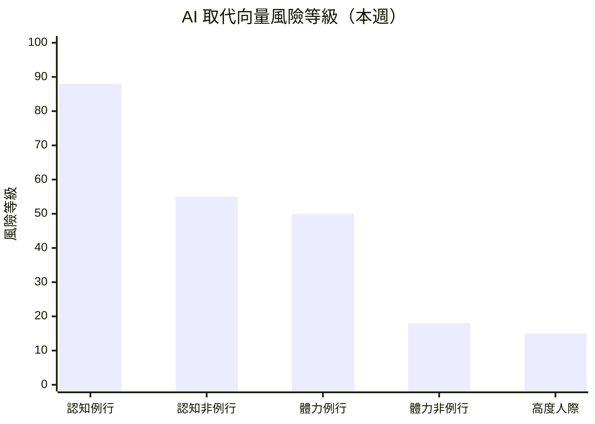

# 求職策略建議 — 2026年第25週

> **重要聲明**：本報告由 AI 系統基於公開數據自動產出，所有內容僅為「基於數據觀測的參考方向」，不構成專業職涯諮詢。重大職涯決策請諮詢專業職涯顧問。詳見報告末「免責聲明」。

> 本報告整合本週 climate_index、skills_drift、industry_segments、salary_bands 四份報告與 Extractor Layer 萃取結果（docs/Extractor/）綜合產出。註：本週 Qdrant 向量搜尋因 OpenAI API 金鑰失效（HTTP 401）暫停，改以報告與 Layer 語料庫直接讀取，底層資料一致。

## 本週市場概覽

> 本週（2026-W25）就業市場溫度降至「🟠 偏冷」，指數從 W17 的 38 回落至 34。事件面出現一波密集的科技業 AI 驅動裁員潮：Meta 8,000、Cisco 近 4,000、Intuit 逾 3,000、Cloudflare 1,100、Snap 1,000、Epic Games 1,000、Coinbase 700、GM 600 名 IT、GitLab 350、Robinhood 290，合計逾 1.9 萬人。關鍵特徵是 Cloudflare、Cisco 等公司**在營收創歷史新高之際仍裁員，明確歸因於 AI 效率提升而非業務萎縮**——這是「結構性 AI 取代」而非景氣性收縮。與此同時，資本端與勞動端背離：SpaceX 完成史上最大 IPO 並同日以 $60B 收購 AI 編碼工具 Cursor，機器人（Neura Robotics $1.4B）、語音 AI（ElevenLabs $500M ARR）持續吸金。技能面，AI 訊號已出現於過半（53.7%）科技職缺，從「差異化技能」轉為「基礎能力預期」。微軟 CEO Nadella 本週公開警告 AI 可能「空洞化整個產業」。（引用來源：[climate_index W25](/reports/climate-index-w25/)、[skills_drift W25](/reports/skills-drift-w25/)、[industry_segments W25](/reports/industry-segments-w25/)、[salary_bands W25](/reports/salary-bands-w25/)）

## 快速導覽

根據你目前的狀態，以下是最相關的報告段落：

- **正在求職中** → [本週機會窗口](#本週行動清單) ｜ [高需求技能](#二高需求技能與學習路徑參考) ｜ [產業進入門檻](#四各產業進入門檻觀察)
- **考慮轉職中** → [AI 風險評估](#一ai-取代向量風險評估) ｜ [轉職路徑觀察](#三熱門轉職路徑觀察) ｜ [薪資對標](#四各產業進入門檻觀察)
- **在職觀察中** → [技能趨勢](#二高需求技能與學習路徑參考) ｜ [產業動態](#六本週關鍵觀察) ｜ [AI 風險趨勢](#一ai-取代向量風險評估)

---

## 一、AI 取代向量風險評估

基於 skills_drift 和 industry_segments 的數據，以下為各[AI 取代向量](/glossary/#ai-取代向量)的當前狀態評估。本週的關鍵變化是事件面（裁員）信號明確強化了「認知例行」向量的風險判讀。

### 風險總覽

| 取代向量 | 當前風險等級 | 趨勢方向 | 關鍵觀察 |
|----------|------------|----------|----------|
| [認知例行](/glossary/#認知例行cognitive-routine)（cognitive_routine） | 高 | 升高 | Cloudflare 1,100 支援職位因 AI「變得多餘」、Coinbase 以 AI 使小團隊高效化裁員 700；薪資面台美雙市場皆位居底部（來源：climate_index、salary_bands） |
| [認知非例行](/glossary/#認知非例行cognitive-non-routine)（cognitive_nonroutine） | 中 | 分化加劇 | AI 占比升至 53.7%、Agentic 升至 18.0%；GM 裁傳統 IT 改招 AI 原生人才——非 AI 原生工程師承壓，AI 原生需求升溫（來源：skills_drift、workforce_news） |
| [體力例行](/glossary/#體力例行physical-routine)（physical_routine） | 中 | 持平偏升 | Mistral 進軍工業 AI、Base10 $850M 投資真實經濟自動化，中期壓力；本週無台灣製造職缺新數據（來源：industry_segments） |
| [體力非例行](/glossary/#體力非例行physical-non-routine)（physical_nonroutine） | 低 | 持平 | 本週裁員集中科技白領，體力非例行無直接衝擊；台灣營建工程 46,400 TWD 續居薪資冠軍（來源：salary_bands、climate_index） |
| [高度人際](/glossary/#高度人際interpersonal)（interpersonal） | 低 | 持平 | 管理／客戶角色占比穩定；美國高度人際職中位數 $78,988 接近認知非例行，人際價值穩固（來源：skills_drift、salary_bands） |

> **風險等級說明**：風險等級基於該向量下角色的職缺需求變化、技能替代信號、全球趨勢綜合判定。此為基於有限數據的觀測結果，不代表確定性預測。

> 風險等級基於職缺變化率、技能替代信號、全球趨勢綜合判定。數值越高表示該向量下的角色面臨越大的自動化替代壓力。本週認知例行風險上調（W17 為 85），反映多起「營收創高仍裁支援職位」的結構性 AI 取代事件。此為觀測指標，非確定性預測。

### 各向量詳細分析

#### 認知例行（cognitive_routine）

**觀測到的信號**：
- Cloudflare 明言 AI 使 1,100 個**支援職位**「變得多餘」，且發生於營收創歷史新高之際——這是 AI 直接取代認知例行工作的典型案例（來源：workforce_news、climate_index）
- Coinbase 裁 700 人（14%）並推「單人團隊」模式，CEO 強調 AI 大幅提升小團隊生產力（來源：workforce_news）
- Intuit 裁逾 3,000 人「重新聚焦 AI 產品」、Cisco 近 4,000 人「投入更多 AI」，企業正將人力由非 AI 職能轉向 AI 開發（來源：workforce_news、skills_drift）
- 薪資面印證：台灣財務會計（35,200 TWD）與美國認知例行職（$42,993，n=20 ⚠️ 小樣本）在各自市場皆位居薪資底部（來源：salary_bands）

**受影響的角色**：

| 角色 | 職缺變化 | 技能需求變化 | 觀測到的替代信號 |
|------|----------|-------------|-----------------|
| 客服／支援專員 | 下降信號 | 基礎客服技能需求下降 | Cloudflare 明言 AI 使 1,100 支援職位過時 |
| 採購／合約管理 | 下降信號 | 流程性操作需求下降 | Zip 推 5 款 AI Agent 自動化採購／合約審核 |
| 財務助理／會計 | 穩定但增速最慢 | Python/SQL 上升、Excel/VBA 下降 | AI 代理式財務工具崛起，台美薪資皆墊底 |
| 資料輸入員 | 無明顯新數據 | 基礎技能需求趨緩 | AI 自動化數據處理持續普及 |

**參考方向**（非建議）：
- 基於觀測數據，該向量下的工作者可關注將定位從「執行者」調整為「AI 工具協作者」的方向，例如熟悉 AI 工具在自身領域的應用
- 薪資面顯示此向量在台美雙市場皆偏低，技能升級（向認知非例行或高度人際發展）在數據上與較佳薪資定位相關，但此為觀測相關性而非「學了就能加薪」的因果保證
- 本向量是本週唯一風險上調的向量，但「結構性壓力」不等於「急迫危機」，個人影響因具體工作內容、公司與地區而異。不同經濟條件的讀者可優先從免費資源切入

#### 認知非例行（cognitive_nonroutine）

**觀測到的信號**：
- AI 廣義訊號在最新批次出現於 53.7% 職缺（全期 51.0%），Agentic/AI Agent 升至 18.0%（全期 16.4%），兩者出現數均 > 50，為本週最穩健的上升信號（來源：skills_drift）
- GM 裁減約 600 名傳統 IT 員工同時招募 AI 原生開發、Agent 與模型開發、Prompt Engineering 人才，反映「技能組合重構」而非單純縮編（來源：workforce_news、climate_index）
- SpaceX $60B 收購 Cursor，AI 編碼工具成核心戰略資產，**推測**可能壓縮初中階工程需求，同時推升 AI 原生與 agentic 架構人才搶奪（來源：industry_segments、funding_signals）
- FastAPI 占比續升（3.7%，12 筆），NLP 相對成長約 66%（7 筆 ⚠️ 小樣本）（來源：skills_drift）
- 薪資面：美國認知非例行職中位數 $79,023（n=311）為各向量最高、薪資帶最寬（P25–P75 跨 $70K），技能溢價顯著（來源：salary_bands）

**受影響的角色**：

| 角色 | 職缺變化 | 技能需求變化 | 觀測到的替代信號 |
|------|----------|-------------|-----------------|
| 軟體工程師 | 穩定但分化 | AI 協作工具熟練度成基本盤 | AI 編碼工具（Cursor/Copilot）改變開發流程，非 AI 原生者承壓 |
| AI/ML 工程師 | 上升 | Agentic +1.6pp、AI 占比 53.7% | 需求擴張中，為企業 AI 重構的主要受益角色 |
| 後端工程師 | 穩定 | FastAPI、agentic 工作負載架構 | GitLab 重建基礎設施因應 agentic workloads |
| 資安工程師 | 上升 | Security 為跨產業結構性需求 | Cisco 將資源集中於 AI 與資安 |
| 非 AI 傳統 IT | 下降信號 | 傳統維運技能需求下降 | GM 裁傳統 IT 改招 AI 原生人才 |

**參考方向**（非建議）：
- 基於觀測數據，與 AI 協作的能力（理解 LLM、整合 AI API、在工作流中運用 AI 工具）正成為默認要求，可考慮在履歷中具體呈現相關經驗
- AI Agent 開發基礎（工具呼叫、規劃、記憶）為占比擴張最快的方向之一，值得評估
- 但需注意：AI Agent 技術棧仍在快速演化，本週新興標籤（MCP、pgvector）在占比口徑下降至 ≤ 2 的小樣本，提醒這些標籤仍處早期、高波動階段，不宜據單週信號決定學習投資

#### 體力例行（physical_routine）

**觀測到的信號**：
- Mistral AI 進軍工業製造 AI、Base10 Partners $850M 投資物流／建築／製造等真實經濟自動化，**推測**將加速生產線自動化（來源：industry_segments、funding_signals）
- 台灣製造生產類薪資中位數 39,800 TWD（延續 W17 數據），本週無新觀測（來源：salary_bands）
- 本系統缺乏專門製造業職缺資料源，tw_govjobs 本週未更新，觀測能力有限（來源：industry_segments）

**受影響的角色**：

| 角色 | 職缺變化 | 技能需求變化 | 觀測到的替代信號 |
|------|----------|-------------|-----------------|
| 生產線作業員 | 無明顯新數據 | 無明顯信號 | 長期自動化趨勢，本週融資面有加速信號 |
| 品管檢測員 | 穩定 | AI 視覺檢測普及 | 中期壓力，部分流程可被替代 |
| 設備維護技師 | 穩定 | 自動化系統操作需求或上升 | 設備維護與異常排除短期仍需技術人員 |

**參考方向**（非建議）：
- 基於觀測數據，該向量下的工作者可關注自動化系統操作、設備維護等較難被取代的技能
- 機器人與工業 AI 融資活躍可能在中期帶動「自動化整合」人才需求，跨域升級為較穩健路徑
- 本系統目前缺乏專門的製造業職缺資料源，本週觀測能力有限，相關判讀僅供參考

#### 體力非例行（physical_nonroutine）

**觀測到的信號**：
- 本週裁員集中於科技業白領（中後台、支援、工程），體力非例行職類無直接衝擊信號（來源：climate_index）
- 台灣營建工程類薪資中位數 46,400 TWD 續居所有類別冠軍，物流運輸 44,200 TWD 次之（延續 W17 數據，來源：salary_bands）
- 機器人（Neura Robotics $1.4B、Standard Bots $200M）與太空硬體（SpaceX IPO、Iceye $520M）融資強勁，**推測**中期拉動嵌入式、機器人軟體、軟硬整合人才（來源：industry_segments、funding_signals）

**受影響的角色**：

| 角色 | 職缺變化 | 技能需求變化 | 觀測到的替代信號 |
|------|----------|-------------|-----------------|
| 營建工人 | 穩定 | 現場作業需求穩定 | 現場作業自動化難度大，本週無加速信號 |
| 司機／物流配送 | 穩定 | 無明顯信號 | 自動駕駛配送仍在實驗階段 |
| 技術維修人員 | 穩定 | 軟硬整合能力為差異化籌碼 | 現場作業短期穩定 |

**參考方向**（非建議）：
- 該向量下的職缺需求相對穩定，本週 AI 直接取代風險較低
- 台灣營建工程薪資為觀測類別最高（46,400 TWD），但需考量體力負擔、職業安全與工作環境
- 對純軟體背景人才，機器人／太空科技融資熱潮使「軟硬整合」成為跨入此領域的差異化方向（推測，基於融資信號）

#### 高度人際（interpersonal）

**觀測到的信號**：
- 管理（management）與客戶（solutions/customer）角色在職缺語料中占比穩定，本週無明顯漂移（來源：skills_drift）
- 美國高度人際職中位數 $78,988（n=53），幾乎等同認知非例行的 $79,023，且下緣（P25 $65,432）較高，人際價值穩固（來源：salary_bands）
- 本週裁員集中科技中後台與工程，人際導向職類無直接衝擊；惟 ElevenLabs 語音 AI 規模化對配音／電話客服形成中長期替代壓力（來源：climate_index）

**受影響的角色**：

| 角色 | 職缺變化 | 技能需求變化 | 觀測到的替代信號 |
|------|----------|-------------|-----------------|
| 店經理／營運主管 | 穩定 | 管理職持續招募 | 無明顯取代信號 |
| 照顧服務員 | 穩定至上升 | 高齡化驅動長期需求 | 人際互動不可取代 |
| 教師／講師 | 穩定 | AI 教學工具漸增 | 學生輔導、情緒支持不可取代 |
| 技術銷售／客戶成功 | 穩定 | 技術＋人際複合能力 | 「技術＋人際」複合角色為相對抗替代方向 |

**參考方向**（非建議）：
- 高度人際向量持續為本週 AI 取代風險最低的類別，其「相對穩定性」本身即為值得關注的長期信號
- 薪資面顯示人際價值在美國市場與技術職相當（中位數接近 $79K），且下緣較高
- 「技術＋人際」複合角色（如 Solutions Engineer、技術銷售）在數據上為相對抗 AI 取代的方向，值得評估

---

## 二、高需求技能與學習路徑參考

基於 skills_drift 的占比上升榜，以下為值得關注的技能方向。本週技能趨勢的核心訊息是：**AI 已成「基礎能力訊號」而非加分項**。

### 技能需求上升 Top 7（占比口徑）

| 排名 | 技能 | 占比漂移 | 最新批次占比 | 相關角色 | AI 取代向量 |
|------|------|----------|-------------|----------|-------------|
| 1 | AI（廣義） | +2.7pp | 53.7%（173 筆） | 跨職能（已成基礎能力） | cognitive_nonroutine |
| 2 | Agentic/AI Agent | +1.6pp | 18.0%（58 筆） | AI 工程師、後端工程師 | cognitive_nonroutine |
| 3 | NLP | +0.9pp | 2.2%（7 筆 ⚠️ 小樣本） | AI 工程師、研究員 | cognitive_nonroutine |
| 4 | FastAPI | +0.7pp | 3.7%（12 筆） | 後端、AI 服務開發 | cognitive_nonroutine |
| 5 | C++ | +0.7pp | 4.7%（15 筆） | 系統／高效能、交易基礎設施 | physical_nonroutine（間接） |
| 6 | ClickHouse | +0.2pp | 1.6%（5 筆） | 資料工程師 | cognitive_nonroutine |
| 7 | MCP | +0.2pp | 0.6%（2 筆 ⚠️ 小樣本） | AI 工具開發者 | cognitive_nonroutine |

> 資料來源：global_hn_hiring，全期語料 n=2,677（2025-08～2026-04）、最新批次 n=322（2026-04）。本週採「占比（share of postings）」口徑，新興標籤（MCP、pgvector）因樣本過小變化收斂，列為早期信號（來源：skills_drift W25）。

> **重要提醒**：相較 W17 以即時批次觀測到的 MCP +38%、Agentic +28% 等高漲幅，本週改採占比口徑後方向一致（AI/Agent 仍為核心、FastAPI 維持上升），但新興標籤波動收斂。React、TypeScript、AWS、Kubernetes 等通用基礎技能在最新批次占比下降，這是 AI 職缺密度高所致的**批次擠壓效應，並非需求衰退**，不建議因此放棄這些基礎技能（來源：skills_drift W25）。

### 結構化學習路徑

> **聲明**：以下僅列出公開可驗證的免費或主流學習平台，不代表推薦或背書。學習效果因人而異，學習路徑因個人基礎不同而差異極大。不同經濟條件的讀者可優先關注免費資源。

#### AI 協作能力（AI 取代向量：cognitive_nonroutine）

> 本週首選方向。AI 訊號已出現於過半職缺，與 AI 工具協作正成為跨職能的默認要求。

| 階段 | 學習目標 | 資源類型參考 | 預估時間 |
|------|----------|-------------|----------|
| 基礎 | LLM 原理、Prompt Engineering、AI API 基本概念 | 官方文件（OpenAI Docs、Anthropic Docs，免費） | 5–15 小時 |
| 進階 | 在既有工作流整合 AI 工具、AI 輔助開發實作 | 官方文件、開源教程 | 20–40 小時 |
| 實戰 | 將 AI 協作經驗具體化為可展示的專案／成果 | 開源專案、技術社群 | 持續 |

> **聲明**：以上為基於公開資訊的學習方向參考，不代表推薦或品質保證。學習效果因人而異。

#### AI Agent 開發基礎（AI 取代向量：cognitive_nonroutine）

| 階段 | 學習目標 | 資源類型參考 | 預估時間 |
|------|----------|-------------|----------|
| 基礎 | AI Agent 架構（工具呼叫、規劃、記憶）、MCP 協議概念 | 官方文件（[Anthropic MCP 文件](https://modelcontextprotocol.io/)，免費） | 5–10 小時 |
| 進階 | Agent 編排、Multi-Agent 協作、Tool Use 實作 | 開源專案（LangChain、CrewAI 官方教程） | 40–80 小時 |
| 實戰 | 小型 Agent 應用開發與部署 | 開源社群、技術部落格 | 持續 |

> **聲明**：MCP、Agentic 等為早期高波動領域（本週占比口徑下樣本偏小），學習資源仍在建構中。以上為方向參考，不代表已確立的學習投資方向。

#### AI 服務後端（FastAPI）（AI 取代向量：cognitive_nonroutine）

| 階段 | 學習目標 | 資源類型參考 | 預估時間 |
|------|----------|-------------|----------|
| 基礎 | FastAPI 框架、REST API 設計、Python 基礎 | 官方文件（[FastAPI 文件](https://fastapi.tiangolo.com/)，免費） | 20–40 小時 |
| 進階 | AI 服務 API 整合、資料庫設計、非同步處理 | 主流平台（如 Coursera、edX） | 40–60 小時 |
| 實戰 | AI 服務後端專案、效能調校 | 開源專案、GitHub | 持續 |

> **聲明**：以上為基於公開資訊的學習方向參考，不代表推薦或品質保證。學習效果因人而異。

---

## 三、熱門轉職路徑觀察

> **重要**：以下轉職路徑為基於數據觀測的「可能方向」，不代表建議或保證。每條路徑的可行性高度取決於個人背景、經驗和學習能力。重大職涯決策建議諮詢專業職涯顧問。

### 基於數據觀測的轉職方向

| 起始角色 | 目標方向 | [技能重疊度](/glossary/#技能重疊度) | 需補充技能 | 薪資變化參考 | 觀測依據 |
|----------|----------|-----------|-----------|-------------|----------|
| 非 AI 傳統 IT | AI 原生開發／資料工程 | 中 | AI 協作、LLM 整合、Agent 基礎、雲端工程 | 推估正向（樣本有限） | workforce_news：GM 裁傳統 IT 改招 AI 原生人才 |
| 後端工程師 | AI Agent 工程師 | 中 | MCP、LLM 應用、Agent 編排、FastAPI | +（推估，樣本有限） | skills_drift：Agentic 18.0%、FastAPI 3.7% |
| 認知例行職能（支援／行政） | AI 工具協作角色 | 低至中 | AI 工具應用、流程自動化、資料分析基礎 | 推估正向但門檻高 | climate_index：支援職位受 AI 取代壓力最大 |
| 純軟體工程師 | 軟硬整合／機器人軟體 | 中 | 嵌入式 C/C++、機器人軟體（ROS）、系統程式 | 推估正向（樣本有限） | industry_segments：機器人融資強勁（Neura $1.4B） |

> **薪資推估說明**：本週薪資樣本以美國認知非例行職為主（311/393），其他向量樣本不足（體力類僅 4–5 筆）。上表薪資變化均為「推估」且樣本有限，不應視為確定性承諾。

### 轉職路徑詳解

#### 非 AI 傳統 IT → AI 原生開發／資料工程

**觀測依據**：
- GM 裁減約 600 名傳統 IT 員工的同時，明確招募 AI 原生開發、資料工程、雲端工程、Agent 與模型開發、Prompt Engineering 人才，定性為「技能組合重構」而非單純縮編（來源：workforce_news、climate_index）
- AI 占比已達 53.7%，與 AI 協作能力正成為技術職的基礎要求（來源：skills_drift）

**技能重疊**：
- 已具備：系統維運、網路與基礎設施、雲端平台基礎、IT 流程管理
- 需補充：AI 協作能力、LLM API 整合、資料工程（管線、向量資料）、Agent 基礎概念

**薪資帶參考**（來源：salary_bands）：
- 美國認知非例行職（涵蓋 AI 原生開發）P50：$79,023、P75：$121,336（n=311）
- 台灣科技資訊類 P50：42,500 TWD（n=95，2026-02~03 批次）

**不確定性提醒**：
- GM 案例為單一企業的職能重構，是否為產業普遍現象需持續觀察
- 「傳統 IT → AI 原生」的轉換需要實質的技能重建，僅完成教程可能不足以滿足職缺要求
- 此路徑門檻不低，純轉職者可能面臨與既有 AI 工程師的競爭

#### 後端工程師 → AI Agent 工程師

**觀測依據**：
- Agentic/AI Agent 占比升至 18.0%（58 筆，非小樣本），為本週最穩健的上升信號之一（來源：skills_drift）
- GitLab 因 agentic workloads 對開發者基礎設施造成壓力而重建基礎設施，顯示 agentic 已進入工程現場（來源：industry_segments）
- FastAPI 占比續升（3.7%），常見於 AI 服務 API 後端（來源：skills_drift）

**技能重疊**：
- 已具備：API 設計、系統架構、Python/Go/TypeScript、資料庫操作
- 需補充：LLM 應用開發、MCP 協定與 Agent 編排、向量資料庫、AI 協作工具熟練度

**薪資帶參考**（來源：salary_bands）：
- 美國認知非例行職 P50：$79,023、P75：$121,336（涵蓋 AI 工程相關職）

**不確定性提醒**：
- AI Agent 技術棧仍在快速演化，目前學習的具體工具（MCP、特定框架）可能在 6–12 個月後有顯著變動
- MCP、pgvector 等標籤本週占比口徑下為小樣本（≤ 2），宜視為「值得關注的早期訊號」而非已確立的學習投資方向
- 市場需求雖上升但仍以有經驗者為主，純轉職者可能面臨競爭

#### 認知例行職能（支援／行政） → AI 工具協作角色

**觀測依據**：
- Cloudflare 明言 AI 使 1,100 個支援職位「變得多餘」、Zip 推 5 款 AI Agent 自動化採購／合約審核，認知例行職能受 AI 取代壓力最大（來源：climate_index、industry_segments）
- 薪資面：認知例行職在台美雙市場皆位居底部（來源：salary_bands）

**技能重疊**：
- 已具備：流程理解、領域知識、跨部門協調、資料整理
- 需補充：AI 工具實際應用、基礎資料分析（Excel→SQL/Python）、流程自動化思維

**薪資帶參考**（來源：salary_bands）：
- 認知例行職位於薪資底部（台灣財務會計 35,200 TWD、美國 $42,993 n=20 ⚠️ 小樣本）
- 向認知非例行升級在數據上與較佳薪資定位相關（為觀測相關性，非因果保證）

**不確定性提醒**：
- 此為本週風險最高向量的轉出路徑，轉換門檻較高，需要實質的技能重建時間與資源
- 不應假設所有讀者都有資源學習新技能；經濟條件受限者可優先從免費資源（官方文件、開源教程）切入，並評估在現職中漸進累積 AI 工具經驗
- 「AI 取代壓力」是結構性趨勢而非個人急迫危機，具體影響因工作內容、公司與地區而異

#### 純軟體工程師 → 軟硬整合／機器人軟體

**觀測依據**：
- 機器人（Neura Robotics $1.4B、Standard Bots $200M）與太空硬體（SpaceX IPO、Iceye $520M）融資強勁，**推測**中期拉動嵌入式、機器人軟體人才需求（來源：industry_segments、funding_signals）
- C++ 占比小幅上升（+0.7pp），與高效能／系統程式職缺相關（來源：skills_drift）

**技能重疊**：
- 已具備：程式設計基礎、系統思維、軟體工程實務
- 需補充：嵌入式 C/C++、機器人軟體（ROS）、即時系統、軟硬整合概念

**薪資帶參考**（來源：salary_bands）：
- 此向量本週美國樣本嚴重不足（體力非例行 n=4 ⚠️），無可靠中位數，不做薪資對標

**不確定性提醒**：
- 此路徑依據為融資信號（資本面）而非職缺面，融資不必然等比例轉化為招募，需持續觀察
- 軟硬整合需要的硬體知識學習曲線因人而異，跨度較大
- 本系統缺乏專門硬體／機器人職缺資料源，相關判讀僅供參考

---

## 四、各產業進入門檻觀察

基於 industry_segments 和 salary_bands 的數據：

| 產業 | 入門角色 | 基本技能門檻 | 平均入門薪資 | 本週信號 | 進入難度參考 |
|------|----------|-------------|-------------|----------|-------------|
| 軟體與 SaaS | Junior Developer | Python/JS、Git、AI 協作工具 | 37,800 TWD（台灣 P25） | 🔴 分化（AI 原生擴張、傳統承壓） | 中（職缺多但 AI 協作成基本盤） |
| 電子硬體／機器人 | 嵌入式／機器人軟體工程師 | C/C++、ROS、軟硬整合 | 樣本不足 | 🟢 擴張（融資強勁） | 中至高（跨域門檻） |
| 半導體 | 嵌入式 AI／IC 設計 | Verilog/VHDL、EDA、嵌入式 | 樣本不足 | 🟢 穩定偏擴張 | 高（專業門檻） |
| 醫療生技 | 照顧服務員／生物統計 | 照護證照／統計分析 | 34,600 TWD（台灣 P25） | 🟢 穩定（AI 衝擊低） | 低至中 |
| 金融服務 | 會計助理／合規 | Excel、AI 治理／合規 | 33,800 TWD（台灣 P25） | 🔴 收縮（Coinbase/Robinhood 裁員） | 中 |
| 能源與綠能 | 能源儲存／電力系統工程師 | 儲能、電力系統 | 樣本不足 | 🟢 轉型中成長（AI 衝擊低） | 中 |
| 營建工程 | 工地人員／BIM | 體力、基礎技術／BIM | 38,200 TWD（台灣 P25） | 🟡 穩定（AI 衝擊低） | 低（但體力要求高） |
| 媒體娛樂 | 內容／社群 | AI 內容工具、數位行銷 | 樣本不足 | 🔴 收縮（Epic/Snap 裁員） | 中（產業承壓） |

> **進入難度參考**基於：入門職缺數量、要求技能數量、本週擴張/收縮信號。此為觀測指標，非絕對判斷。**本週因 tw_govjobs 未更新，多數非科技產業觀測職缺數不足，薪資以台灣就業通 2026-02~03 批次為延續參考；硬體、半導體、能源等產業以 funding_signals 事件信號為主，職缺數據參考價值有限**（來源：industry_segments、salary_bands）。

---

## 五、台灣常見職業觀察

> **特別說明**：本週台灣本地資料源（tw_govjobs、tw_104_jobs）未更新／fetch 失敗，以下台灣職業觀察延續 W17 基準與 salary_bands 2026-02~03 批次數據，並結合本週全球 AI 趨勢補充。台灣最新動態觀測能力受限，請謹慎解讀。

### 門市／零售服務人員（AI 取代向量：體力非例行 / 高度人際）

**本週市場觀察**：
- 職缺觀測：延續 W13 基準（零售服務約佔台灣政府平台 48%），本週無新數據（來源：tw_govjobs 既有資料）
- 薪資參考：零售服務 P50 為 39,200 TWD/月，P25 為 35,500 TWD（來源：salary_bands，2026-02~03 批次）
- AI 風險評估：本週裁員集中於科技白領，零售服務無直接衝擊；自助結帳持續普及但服務體驗仍需人力，整體風險偏低

**參考方向**（非建議）：
- 零售服務薪資雖低於平均但相對穩定，本週無新增 AI 衝擊信號
- 可關注連鎖零售的管理職升遷路徑，經營管理類薪資可達 43,800 TWD

> 以上基於 tw_govjobs 既有資料與 salary_bands W25 延續數據，台灣最新動態本週未更新。

### 照顧服務員（AI 取代向量：高度人際）

**本週市場觀察**：
- 職缺觀測：醫療照護受高齡化結構驅動，需求穩定（來源：industry_segments）
- 薪資參考：照護服務 P50 為 41,600 TWD/月，醫療照護 P50 為 34,800 TWD，差異大（來源：salary_bands）
- AI 風險評估：病患關懷、情緒支持高度依賴人際互動，為本週醫療生技產業「AI 衝擊低」評級的代表職類，短期不可取代

**參考方向**（非建議）：
- 高齡化社會結構驅動長期需求，醫療生技為少數「AI 衝擊低且有資本支持」的產業
- 照護服務薪資 41,600 TWD 高於多數認知例行類別

> 以上基於 salary_bands W25 與 industry_segments W25 觀測。

### 物流配送人員（AI 取代向量：體力非例行）

**本週市場觀察**：
- 職缺觀測：延續穩定趨勢（來源：tw_govjobs 既有資料）
- 薪資參考：P50 為 44,200 TWD/月，薪資排名第二（來源：salary_bands）
- AI 風險評估：自動駕駛配送仍在實驗階段；惟 Base10 $850M 投資真實經濟自動化（含物流），中期可能形成壓力

**參考方向**（非建議）：
- 物流薪資排名第二（44,200 TWD），反映體力勞動與工時補償
- 自動化投資為中期信號而非急迫衝擊，現場配送短期內仍需人力

> 以上基於 salary_bands W25 與 funding_signals W25 觀測。

### 營建工程人員（AI 取代向量：體力非例行）

**本週市場觀察**：
- 職缺觀測：延續穩定趨勢，AI 衝擊低（來源：industry_segments）
- 薪資參考：P50 為 46,400 TWD/月，為所有觀測類別最高（來源：salary_bands）
- AI 風險評估：營建施工對現場判斷與體力要求高，自動化難度大，本週風險極低

**參考方向**（非建議）：
- 薪資為觀測類別最高（46,400 TWD），且為本週無 AI 衝擊信號的少數類別
- 需考量體力負擔、職業安全風險與工作環境

> 以上基於 salary_bands W25 與 industry_segments W25 觀測。

---

## 六、本週關鍵觀察

### 市場動態觀察

本週就業市場最主導的變數，是事件面密集的「AI 驅動裁員潮」。Meta、Cisco、Intuit、Cloudflare、Snap 等密集裁員逾 1.9 萬人，市場溫度從 38 回落至 34。判讀的關鍵矛盾在於：總經數據（BLS 3 月：非農 +178K、失業率 4.3%）並未惡化、資本市場熱絡（SpaceX 史上最大 IPO、$60B 收購 Cursor），但事件面的 AI 裁員密集且性質結構化——Cloudflare、Cisco 在營收創歷史新高之際仍裁員，明確歸因 AI 效率。這意味本輪收縮與景氣脫鉤，是「結構性 AI 取代」而非景氣性收縮。需注意 BLS 為 3 月數據，與本週（6 月）事件面存在約 3 個月時間落差。（來源：climate_index W25、global_bls）

### 技能趨勢觀察

本週技能面的核心訊息是「AI 已成基礎能力訊號，而非加分項」。AI 訊號出現於 53.7% 的職缺、Agentic/AI Agent 升至 18.0%。當一項技能訊號出現於過半職缺，它已從「差異化技能」轉為「基礎能力預期」——對技術工作者而言，與 AI 協作的能力正逐漸成為默認要求。值得注意的是，「為投入 AI 而裁員」（Cisco、Intuit、Cloudflare）與職缺端 AI 需求上升形成閉環，是需求端與供給調整端的同一現象兩面。本週改採占比口徑後，通用技能（React、TypeScript、AWS）的占比下降屬批次擠壓效應，非真實衰退，仍為應維持的基礎。（來源：skills_drift W25）

### 產業結構觀察

本週產業格局呈現高度兩極化的「裁員潮 × 巨額融資」雙重信號。收縮端集中於軟體與 SaaS（傳統職能）、金融科技（Coinbase、Robinhood）、媒體娛樂（Epic、Snap、Truecaller 廣告營收 -44%）；擴張端集中於電子硬體／機器人（Neura $1.4B）、半導體（晶片商投資自駕 Wayve、「Silicon Is Back」）、太空航太（SpaceX IPO）、AI 基礎設施。值得注意：2026 年至今美國吸納全球約 80% 的種子至成長階段 AI 融資，非美國地區（含台灣、歐洲）AI 人才紅利相對有限，可能加劇人才外流壓力。微軟 CEO Nadella 警告 AI 可能「空洞化整個產業」為本週最具份量的就業信號。（來源：industry_segments W25、funding_signals）

### 值得持續關注的信號

- **「營收創高仍裁員」是否擴散**：Cloudflare、Cisco 案例使裁員與景氣脫鉤，是否成為更多企業的常態，將決定 AI 取代的速度判讀
- **BLS 4–5 月就業數據**：將驗證本週裁員潮是否反映於總體失業率與非農（預計後續公布）
- **AI 占比是否飽和**：AI 訊號已過半，是否進入「占比飽和」階段，影響「學 AI」的邊際差異化價值
- **台灣資料源恢復**：tw_govjobs、tw_104_jobs 連線恢復後，台灣本地（含非科技、體力例行職）的最新動態
- **AI 融資的美國集中現象**：非美國地區 AI 機會相對有限，跨境職涯規劃的結構性背景
- **Qdrant 向量搜尋恢復**：OpenAI API 金鑰修復後的跨來源語意檢索能力

---

## 本週行動清單

> 基於本週數據觀測，以下為參考行動方向。所有建議均為「可考慮」的方向，非確定性指令。重大職涯決策請諮詢專業職涯顧問。

### 求職者

- [ ] **盤點並具體化 AI 協作經驗**：AI 訊號已出現於過半職缺（53.7%），與 AI 工具協作正成為默認要求。可考慮檢視履歷是否能展現使用 LLM API、AI 輔助開發等具體經驗（依據：skills_drift，最新批次 173/322 筆提及 AI）
- [ ] **投遞前評估目標職能的 AI 取代暴露度**：Cloudflare 1,100 支援職位因 AI「變得多餘」、Zip AI Agent 自動化採購／合約。可考慮優先確認目標職能是否易被 AI 流程取代，而非僅看公司財務表現（依據：climate_index、industry_segments）
- [ ] **關注擴張產業的機會窗口**：機器人（Neura $1.4B）、太空科技（SpaceX IPO）、AI 基礎設施、半導體（晶片商投資自駕）為本週融資強勁、信號正向的領域，相關工程／研究職缺資金充足（依據：industry_segments、funding_signals）
- [ ] **參考薪資中位數設定務實期望**：美國認知非例行職 P50 $79,023、P75 $121,336（遠端機會）；台灣科技資訊類 P50 約 42,500 TWD（2~3 月數據，建議搭配即時人力銀行交叉驗證）（依據：salary_bands）
- [ ] **不因經濟條件受限而卻步**：AI 協作、AI Agent 基礎的入門可從免費官方文件起步（OpenAI/Anthropic Docs、MCP 文件、FastAPI 文件），入門時間相對可控（依據：skills_drift 學習資源）

### 在職者

- [ ] **評估所屬職能的 AI 滲透速度與升級路徑**：若從事認知例行工作（支援、行政、流程性職能，本週風險最高且薪資墊底），可考慮關注向認知非例行或高度人際發展的技能升級方向（依據：salary_bands、climate_index）
- [ ] **盤點團隊的 AI 整合能力**：在 AI 占比過半的市場中，可考慮評估團隊是否具備將 AI 整合進現有產品／流程的能力，這正成為企業職能重構的核心（依據：skills_drift、workforce_news GM 案例）
- [ ] **持續追蹤而非追逐早期標籤**：MCP、pgvector 等本週為小樣本（≤ 2），建議列入觀察清單，待信號穩定再投入學習資源（依據：skills_drift 占比口徑收斂）

### 職涯顧問

- [ ] **以「結構性 vs 景氣性收縮」框架評估客戶風險**：本週多起裁員發生於營收創高背景下、明確歸因 AI，與景氣性裁員性質不同。此區分可用於更精準判讀客戶所屬職能的長期暴露度（依據：climate_index、workforce_news）
- [ ] **引用認知例行薪資底部數據引導技能升級評估**：認知例行職在台美雙市場皆位居薪資底部（台灣 35.2K、美國 $42,993），此跨市場一致性可作為引導認知例行工作者評估技能升級的量化依據（依據：salary_bands）

### 下週關注

- BLS 4–5 月非農與失業率數據，驗證本週 AI 裁員潮是否反映於總經面
- 台灣資料來源（tw_govjobs、tw_104_jobs）連線恢復後的最新數據，補強非科技與體力例行職類觀測
- AI 占比是否進入飽和階段、新興標籤（MCP、Agentic）信號是否轉穩
- Qdrant 向量搜尋恢復（OpenAI API 金鑰修復）後的跨來源檢索能力

---

## 免責聲明

本報告由 AI 系統基於公開數據自動產出，僅供參考。

1. **非專業職涯諮詢**：本報告不構成專業的職涯規劃建議。重大職涯決策請諮詢專業職涯顧問。
2. **數據局限性**：分析基於有限的觀測數據源。本週僅 4/14 個 Layer 提供有效數據，且以全球事件面（workforce_news、funding_signals）與科技職缺語料（global_hn_hiring）為主；台灣本地資料源（tw_govjobs、tw_104_jobs）未更新或 fetch 失敗，台灣最新市場動態資訊不足。BLS 總經數據最新僅至 3 月，與本週（6 月）事件面存在約 3 個月時間落差。
3. **預測不確定性**：所有趨勢分析和預測均基於歷史數據推斷，實際市場變化可能與預測不同。本報告中標註為「推測」者尤須謹慎看待。
4. **個人差異**：職涯發展受個人背景、技能、經驗、地理位置、家庭與經濟條件等多重因素影響，本報告無法涵蓋個人化情境。本報告不假設所有讀者都有相同的學習資源。
5. **不構成投資建議**：報告中提及的產業趨勢和企業動態（含融資、IPO、M&A）不構成任何投資建議。
6. **學習資源中立**：報告中列出的學習資源僅為公開可查資訊的彙整，不代表推薦或品質保證。學習效果因人而異。
7. **AI 生成風險**：本報告由 AI 模型生成，儘管基於數據，但綜合判斷部分可能包含不精確或過度簡化的分析。本週 Qdrant 向量搜尋因 OpenAI API 金鑰失效暫停，改以報告與 Layer 語料庫直接讀取。

> 需要更個人化的建議？建議諮詢專業職涯顧問。

[查看本週景氣溫度計，了解市場整體狀況 →](/reports/climate-index-w25/)

---

最後更新：2026-06-17
