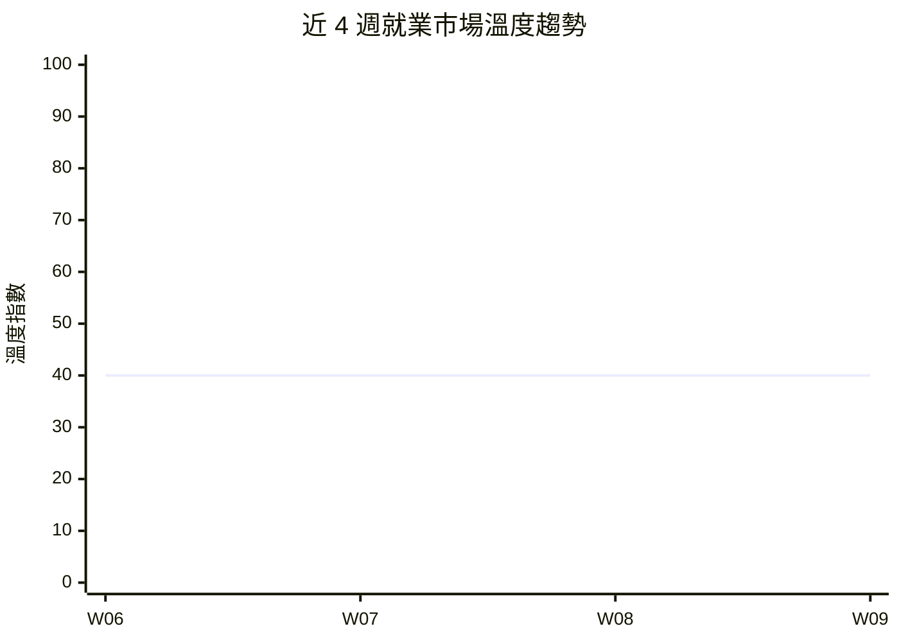

# 內容規格書：climate_index / 就業景氣溫度計 — 每週報告

> 內部規劃文件，不發布至 GitHub Pages。
> 產出日期：2026-03-22
> Revamp 階段：Stage 5（Content Specification）
> 本文件直接指導每週報告的 AI 自動化產出，為系統執行的操作手冊。

---

## 1. 頁面目標

### 主要目標

每週產出一份整合 14 個資料來源的就業市場溫度判讀報告，讓任何受眾在 30 秒內掌握本週市場走向。

### 次要目標

1. 提供 HR 可直接引用的市場數據
2. 為求職者提供本週求職時機判斷依據
3. 為研究者提供週頻的勞動市場代理指標
4. 累積歷史溫度數據，建立趨勢追蹤能力

### 成功指標

| 指標 | 目標值 | 測量方式 |
|------|--------|----------|
| 頁面停留時間 | > 3 分鐘 | Google Analytics |
| 連續 4 週回訪率 | > 30% | Analytics 同期群 |
| 社群分享次數 | > 10 次/報 | 社群監控 |

---

## 2. 目標受眾

### 主要受眾

| 項目 | 說明 |
|------|------|
| 是誰 | 企業 HR 主管（30-50 歲）、積極求職者（25-40 歲） |
| 來這頁的目的 | HR：掌握市場溫度以調整招募策略；求職者：判斷求職時機 |
| 進入方式 | Google 搜尋「就業市場景氣」/ 直接回訪 / 社群連結 |
| 下一步期望 | HR：擷取數據到簡報；求職者：調整求職策略 |

### 次要受眾

| 項目 | 說明 |
|------|------|
| 是誰 | 政策研究者、財經記者 |
| 來這頁的目的 | 取得可引用的週頻勞動市場數據 |

---

## 3. 關鍵訊息

每篇報告必須傳達以下 3 個核心訊息：

| 順序 | 訊息 | 呈現方式 |
|------|------|----------|
| 1 | 本週就業市場的溫度等級和方向（好轉/惡化/持平） | 溫度符號 + 執行摘要框 |
| 2 | 造成此溫度的核心原因（2-3 個數據點） | 溫度判讀依據段落 |
| 3 | 不同受眾本週應該關注什麼、可以採取什麼行動 | 分受眾行動清單 |

---

## 4. 內容結構

### 4.1 區塊規劃

```
┌─────────────────────────────────────┐
│ 區塊 1：溫度判讀 + 一句話摘要       │
├─────────────────────────────────────┤
│ 區塊 2：執行摘要框（3-5 點核心發現） │
├─────────────────────────────────────┤
│ 區塊 3：溫度趨勢折線圖（Mermaid）   │
├─────────────────────────────────────┤
│ 區塊 4：核心指標表（台灣+全球）     │
├─────────────────────────────────────┤
│ 區塊 5：溫度判讀依據               │
├─────────────────────────────────────┤
│ 區塊 6：產業亮點與警訊             │
├─────────────────────────────────────┤
│ 區塊 7：本週重大事件               │
├─────────────────────────────────────┤
│ 區塊 8：AI 取代向量觀察            │
├─────────────────────────────────────┤
│ 區塊 9：分受眾行動清單             │
├─────────────────────────────────────┤
│ 區塊 10：免責聲明                  │
└─────────────────────────────────────┘
```

### 4.2 各區塊詳細規格

#### 區塊 1：溫度判讀 + 一句話摘要

| 項目 | 規格 |
|------|------|
| 目的 | 30 秒內讓讀者知道本週市場狀態 |
| 位置 | 頁面最頂部（H2 標題） |
| 格式 | `## 本週溫度：{符號} {等級}` + blockquote 一句話摘要 |

##### 內容規格

| 元素 | 規格 | 範例 |
|------|------|------|
| 溫度等級 | 五級之一：🔴寒冷/🟠偏冷/🟡持平/🟢溫暖/🔵過熱 | 🟠 偏冷 |
| 一句話摘要 | 30 字以內，說明本週最重要的市場動態 | 「科技裁員持續但 AI 職缺逆勢成長，市場呈分化格局」 |

##### 文案方向

- 語氣：精確但不冰冷，像天氣預報般客觀
- 避免：聳動語氣（「暴跌！」「崩盤！」）

---

#### 區塊 2：執行摘要框（新增）

| 項目 | 規格 |
|------|------|
| 目的 | HR 和忙碌讀者的「TL;DR」，掌握全貌不用看全文 |
| 位置 | 溫度判讀之後、指標表之前 |
| 格式 | Markdown blockquote 或特殊框體 |

##### 內容規格

| 元素 | 規格 |
|------|------|
| 核心發現 | 3-5 個 bullet points |
| 每點字數 | 30-50 字 |
| 必含資訊 | (1) 溫度方向和原因 (2) 最值得注意的產業信號 (3) 本週最大事件 |
| 數據引用 | 每點至少含 1 個具體數字 |

##### 範例

```markdown
> **本週核心發現：**
> - 市場溫度維持 🟠 偏冷，連續第 3 週未回升（來源：14 Layer 綜合）
> - 台灣政府平台職缺 1,000 筆，服務業佔 62%（來源：tw_govjobs）
> - Block 裁員 200+ 人、eBay 裁員影響，科技業裁員信號持續（來源：workforce_news）
> - AI/ML 職缺逆勢成長 8%，成為唯一正成長的科技分類（來源：global_hn_hiring）
```

---

#### 區塊 3：溫度趨勢折線圖（新增）

| 項目 | 規格 |
|------|------|
| 目的 | 讓讀者一眼看到趨勢方向（改善/惡化/持平） |
| 位置 | 執行摘要之後 |
| 格式 | Mermaid xychart-beta 折線圖 |
| 數據 | 近 4 週溫度指數（0-100 量化） |

##### 數據來源

- 從歷史報告中提取溫度判讀，轉換為數值：🔴=20, 🟠=40, 🟡=60, 🟢=80, 🔵=100
- 若歷史報告無量化指標，以等級中位值代入

##### 範例

````markdown

> 資料來源：W06-W09 景氣溫度計報告綜合判讀
````

---

#### 區塊 4：核心指標表

| 項目 | 規格 |
|------|------|
| 目的 | 提供可引用的具體數據，分台灣和全球 |
| 位置 | 趨勢圖之後 |
| 格式 | 兩個 Markdown 表格（台灣市場 + 全球市場） |

##### 內容規格

- 台灣市場表：7 個指標（職缺數、薪資、新增職缺、政府平台、裁員事件、招聘潮、融資）
- 全球市場表：6 個指標（非農、失業率、OECD、ManpowerGroup、Indeed、LinkedIn）
- 每個指標必含：本週值、前週值、變化、來源
- **新增**：數據覆蓋說明（幾個 Layer 有數據、哪些缺失）

##### 文案方向

- 來源欄使用 Layer 名稱（如 `tw_govjobs`），讓研究者可追溯
- 變化使用 `+/-N` 和 `+/-X%` 雙重標示

---

#### 區塊 5：溫度判讀依據

| 項目 | 規格 |
|------|------|
| 目的 | 解釋溫度判讀的邏輯，建立方法論信任 |
| 字數 | 300-500 字，3-5 段 |
| 結構 | 台灣→全球→事件→綜合研判→（選填）前期銜接 |

##### 文案方向

- 每段必須引用具體數據，格式：「（來源：{layer_name}）」
- 矛盾信號必須明確說明：「台灣數據顯示 X，但全球數據顯示 Y」
- 避免：純主觀判斷、無來源的斷言

---

#### 區塊 6-8：產業亮點、重大事件、AI 向量

維持現有 Mode CLAUDE.md 的輸出框架規格，不做結構性修改。

---

#### 區塊 9：分受眾行動清單（改版）

| 項目 | 規格 |
|------|------|
| 目的 | 將洞察轉化為不同受眾的具體行動 |
| 格式 | 按受眾分為 3 個 H3 子標題 |

##### 內容規格

| 受眾 | 行動數量 | 內容方向 | 語氣 |
|------|----------|----------|------|
| HR 主管 | 2-3 條 | 招募策略調整、薪資開價建議、產業監控 | 同儕對話，假設懂術語 |
| 求職者 | 3-5 條 | 投遞時機、產業選擇、技能準備 | 親切具體，避免行話 |
| 研究者 | 1-2 條 | 可追蹤的指標、值得深入的研究方向 | 學術交流語氣 |

##### 格式範例

```markdown
### HR 主管

- [ ] **評估招募預算**：本週市場溫度維持偏冷，建議評估是否下調本季招募目標（依據：職缺數連續 3 週下滑）
- [ ] **關注 AI 人才搶奪**：AI/ML 職缺逆勢成長 8%，若有相關職缺需求建議加快招募速度

### 求職者

- [ ] **優先投遞 AI 相關職缺**：本週 AI/ML 是唯一正成長的科技分類，機會窗口相對較大
- [ ] **避開近期裁員密集的公司**：Block、eBay 等近期有裁員動態，投遞前建議確認目標公司狀態
```

##### 文案方向

- 使用「建議」而非「應該」
- 每條行動必須連結到報告中的具體數據
- 以主動動詞開頭：評估、關注、投遞、準備、追蹤

---

#### 區塊 10：免責聲明

維持現有 Mode CLAUDE.md 定義的免責聲明文字。

---

## 5. CTA 規格

### 主要 CTA

| 項目 | 規格 |
|------|------|
| 文案 | 「查看本週完整技能漂移分析 →」 |
| 位置 | 報告末端、行動清單之後 |
| 連結目標 | 同週次的 skills_drift 報告 |

### 次要 CTA

| 項目 | 規格 |
|------|------|
| 文案 | 「查看上週報告 →」 |
| 位置 | 溫度趨勢圖旁 |
| 連結目標 | 上一週的 climate_index 報告 |

---

## 6. SEO 規格

| 項目 | 規格 | 字數限制 |
|------|------|----------|
| seo.title | `{YYYY}年第{WW}週就業市場{溫度等級}：{事件摘要} \| 景氣溫度計` | ≤ 60 字元 |
| seo.description | `本週就業市場溫度：{等級}。{核心數據1}。{核心數據2}。涵蓋台灣與全球{N}個資料來源。` | ≤ 155 字元 |
| H1 | `就業景氣溫度計 — {YYYY}年第{WW}週` | — |
| 目標關鍵字 | 主要：就業市場景氣、景氣指數；次要：{本週亮點產業}、失業率 | 5-8 個 |
| permalink | `/reports/climate-index-w{ww}/` | — |
| FAQ | 3-5 題，問題為使用者搜尋形式 | 答案可獨立理解 |

### FAQ 產出規則

- Q1 固定：「{YYYY}年第{WW}週就業市場景氣如何？」
- Q2 固定：「哪些產業正在擴大招聘？」
- Q3 固定：「本週有哪些重大就業市場事件？」
- Q4-Q5：根據本週數據動態產出

---

## 7. 寫作指南

### 語氣調性

| 維度 | 規格 | 範例 |
|------|------|------|
| 正式度 | 中性偏專業（不學術、不口語） | ✅「市場呈分化格局」❌「市場超級分裂」 |
| 專業度 | HR 術語可用，但核心概念需解釋 | ✅「淨就業展望指數」（首次出現附解釋） |
| 情感 | 客觀理性，不渲染恐慌也不過度樂觀 | ✅「裁員事件密度增加」❌「裁員風暴來襲！」 |
| 人稱 | 第三人稱（報告體），行動清單可用「建議」 | ✅「本週觀測到」❌「我們發現」 |

### 用語規範

| 使用 | 避免 |
|------|------|
| 觀測到、數據顯示、趨勢為 | 我們認為、肯定是、一定會 |
| 建議關注、值得參考 | 你應該、你必須 |
| 信號、趨勢、觀察 | 預測、保證、確定 |
| 偏冷、溫暖（溫度術語） | 糟糕、很差、非常好 |
| 基於 {N} 個來源的觀測 | 根據全面分析 |

### 格式規範

| 項目 | 規格 |
|------|------|
| 段落長度 | 最多 4 行（行動裝置友好） |
| 句子長度 | 最多 40 字（含標點） |
| 表格使用 | 數據比較一律用表格，不用文字敘述 |
| 數字格式 | 千位用逗號（1,234）；百分比用一位小數（8.3%） |
| 來源引用 | 格式：（來源：{layer_name}） |

### 術語連結規範

首次出現以下術語時連結到 `/glossary/`：

- [景氣溫度](/glossary/#景氣溫度)
- [AI 取代向量](/glossary/#ai-取代向量)
- [認知例行](/glossary/#認知例行cognitive-routine)
- [認知非例行](/glossary/#認知非例行cognitive-non-routine)
- 其餘見 `core/Narrator/CLAUDE.md` 術語連結規範

---

## 8. 品質檢查清單

每篇報告產出後，必須通過以下檢查：

### 內容檢查

- [ ] 執行摘要框存在且含 3-5 點核心發現
- [ ] 每點核心發現含至少 1 個具體數字
- [ ] 溫度趨勢折線圖存在且數據正確
- [ ] 核心指標表完整（台灣 7 指標 + 全球 6 指標）
- [ ] 溫度判讀依據每段有來源引用
- [ ] 矛盾信號有明確說明
- [ ] 行動清單按 HR/求職者/研究者分欄
- [ ] 每條行動連結到報告中的具體數據
- [ ] 免責聲明完整

### SEO 檢查

- [ ] seo.title ≤ 60 字元，含週次和溫度等級
- [ ] seo.description ≤ 155 字元，含核心數據
- [ ] FAQ 3-5 題，答案可獨立理解
- [ ] permalink 格式正確

### 品質檢查

- [ ] 無「應該」「必須」等強制語氣
- [ ] 推測與事實明確區隔
- [ ] 溫度判讀與指標數據邏輯一致
- [ ] 前期銜接：溫度變化方向與上週報告一致
- [ ] 數據覆蓋率標註完整（哪些 Layer 缺失）
- [ ] 本報告使用 Qdrant 向量搜尋取得相關資料——標註存在

### Jekyll Front Matter 檢查

- [ ] layout: default
- [ ] title: W{WW}
- [ ] parent: 景氣溫度計
- [ ] nav_order: {10000 - WW}
- [ ] last_modified_date: {ISO 8601}
- [ ] confidence: {高/中/低}
- [ ] qdrant_search_used: true

---

*本規格書為每週 climate_index 報告的操作手冊。產出系統（Narrator Mode opus）應以此為主要依據，搭配 `core/Narrator/Modes/climate_index/CLAUDE.md` 的輸出框架使用。*
