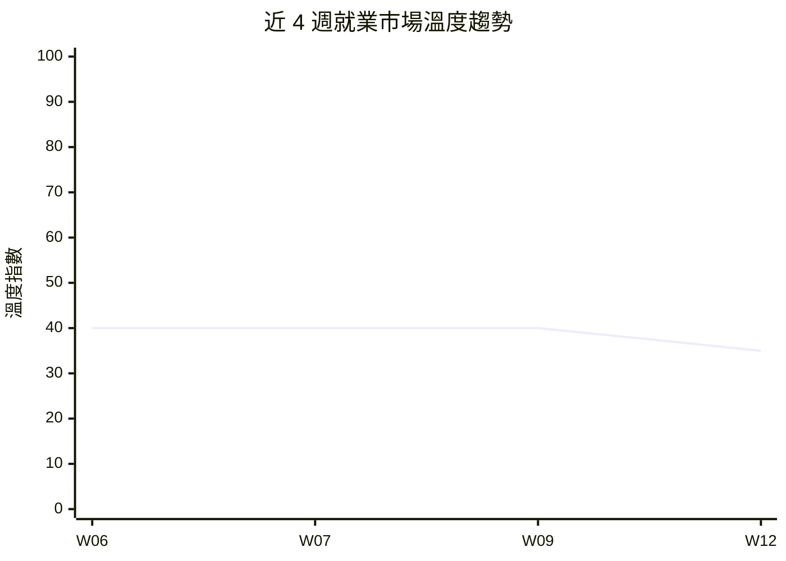

# 就業景氣溫度計 — 2026年第12週

## 本週溫度：🟠 偏冷

> 美國非農罕見負增長，科技裁員以AI為名加速擴散，勞動市場進入停滯期。

> 本報告使用 Qdrant 向量搜尋取得相關資料

> **本週核心發現：**
> - 市場溫度維持 🟠 偏冷，較 W09 寒冷信號進一步增強——美國 2 月非農 -92K，六個月淨就業趨近零（來源：global_bls、global_indeed_hiring）
> - Atlassian 裁員 10%（約 1,600 人）以 AI 投資為由，Meta 據報考慮裁員 20%（約 15,000 人），「AI 取代人力」敘事從消費科技擴散至企業軟體（來源：workforce_news）
> - 醫療保健業就業首次轉負（-28K），過去一年就業增長主力失速（來源：global_indeed_hiring）
> - AI-adjacent 職缺逆勢成長，國防科技 Swarmer IPO 首日暴漲 520%，獨角獸數量年增 61% 至 187 家（來源：funding_signals、global_hn_hiring）
> - 聯準會維持利率 3.50%-3.75% 不變，油價四週漲 27%，停滯性通膨風險浮現（來源：global_indeed_hiring）

> 資料來源：W06-W12 景氣溫度計報告綜合判讀。W12 溫度指數下調至 35，反映非農負增長與裁員信號加劇。

[查看上週報告 →](/reports/climate-index-w09/)

## 核心指標

### 台灣市場

| 指標 | 本週 | 前週（W09） | 變化 | 來源 |
|------|------|------|------|------|
| 政府平台職缺數 | 1,040 | 1,000 | +40, +4.0% | tw_govjobs |
| 主要職缺類型分布 | 零售服務 48%、科技 9%、專業 9% | 零售服務 48%、科技 9%、專業 9% | 結構穩定 | tw_govjobs |
| 薪資觀測區間 | 29,500-40,000 TWD | 29,500-40,000 TWD | → | tw_govjobs |
| 裁員事件數（全球科技） | 2（新增） | 4 | 數量減少但規模更大 | workforce_news |
| 融資/IPO 事件數 | 2（新增） | 9 | 數據未更新 | funding_signals |

**備註**：tw_104_jobs、tw_company_reviews 因 API 限制持續停用。台灣科技業職缺佔比維持 9%（95 筆），專業類 89 筆、醫療保健 67 筆、零售服務 499 筆。政府平台以基層服務業為主，無法完整反映台灣科技人才市場動態。

### 全球市場

| 指標 | 最新值 | 前期值 | 趨勢 | 來源 |
|------|--------|--------|------|------|
| 美國非農就業（月增） | -92K（2 月） | +126K（1 月） | ↓ 大幅惡化 | global_bls |
| 美國失業率 | 4.4%（2 月） | 4.3%（1 月） | ↑ +0.1pp | global_bls |
| 美國 JOLTS 職缺 | 6,946K（1 月） | 6,550K（12 月） | ↑ +6.0% | global_bls |
| 美國平均時薪 | $37.32（2 月） | $37.17（1 月） | ↑ +0.4% | global_bls |
| 澳洲失業率 | 4.28%（2 月） | 4.07%（1 月） | ↑ +0.21pp | global_abs |
| 加拿大失業率 | 6.9%（2 月） | 6.7%（1 月） | ↑ +0.2pp | global_statcan |
| 歐盟就業人數（年度） | 19,433K（2025） | 19,416K（2024） | ↑ +17K（增速驟降） | global_eurostat |
| ManpowerGroup NEO（Q2） | 數據未更新 | — | — | global_manpower_outlook |
| Indeed 招聘趨勢 | 科技業低於疫情前 30%+ | — | ↓ | global_indeed_hiring |
| 聯準會利率 | 3.50%-3.75%（3 月維持） | 同 | → | global_indeed_hiring |

> **數據覆蓋說明**：本週共有 **10/14 個 Layer 提供有效數據**。缺失的 Layer：tw_104_jobs（API 限制停用）、tw_company_reviews（已停用）、global_linkedin_workforce（本週無新數據）、global_manpower_outlook（WebFetch 失敗，Q2 數據待確認）。

---

## 溫度判讀依據

**台灣市場核心態勢**：政府就業通平台職缺數微增至 1,040 筆，結構與前期接近。零售服務業佔 48%（499 筆）仍為最大宗，科技類維持 9%（95 筆），專業類 89 筆，醫療保健 67 筆，創意類 57 筆。薪資觀測區間維持 29,500-40,000 元未變。由於 tw_104_jobs 持續停用，台灣科技人才市場的完整動態仍無法精確評估，政府平台數據以基層服務業為主要反映。（來源：tw_govjobs）

**全球市場背景——多國失業率同步上升**：美國 2 月非農就業下降 92,000 人，遠遜市場預期的 +50,000，為近年少見的月度負增長。失業率升至 4.4%，勞動力參與率降至 62%（2021 年 12 月以來最低）。Indeed Hiring Lab 以「overwhelmingly disappointing」形容此次數據，並指出近六個月淨就業創造趨近零。同期，澳洲失業率升至 4.28%（前月 4.07%，+0.21pp），加拿大升至 6.9%（前月 6.7%，+0.2pp），歐盟 2025 年就業增長僅 +17K（2024 年為 +143K，增速驟降 88%）。多國同步惡化顯示全球勞動市場正在降溫。但 JOLTS 職缺數 1 月反彈至 6,946K（+6.0%），平均時薪維持 +3.8% 年增率，基本面尚未全面崩潰。（來源：global_bls、global_abs、global_statcan、global_eurostat、global_indeed_hiring）

**事件面信號——AI 主題裁員擴散至企業軟體**：本觀測期兩起重大裁員事件值得關注。Atlassian 裁減 10% 全球員工（約 1,600 人），明確以「將資金重新投入 AI 研發」為由，成為繼 Block、Pinterest 之後又一以 AI 為名裁員的案例，且為首次擴散至企業軟體（B2B SaaS）領域。Meta 據報考慮裁員 20%（估計約 15,000 人）以抵消 AI 基礎設施支出，此消息尚未獲官方確認（[REVIEW_NEEDED]），若屬實將是科技業 2026 年最大裁員案。此外，Digg 裁員並關閉 App，反映非 AI 原生的內容平台面臨結構性壓力。Sam Altman 向程式設計師致謝引發大量諷刺迷因，折射技術工作者對 AI 取代的深層焦慮。（來源：workforce_news）

**綜合研判——偏冷趨勢強化，接近寒冷邊界**：本週維持「🟠 偏冷」判讀，但較 W09 進一步惡化，溫度指數下調。決定性因素包括：(1) 美國非農首次出現月度負增長（-92K），六個月淨就業接近零；(2) 多國失業率同步上升；(3) 醫療保健業——過去一年就業增長的最大支柱——首次轉負（-28K）；(4) 科技業裁員從消費者科技擴散至企業軟體，「以 AI 投資取代人力」成為系統性趨勢。未調升至「🔴 寒冷」的原因：JOLTS 職缺 1 月反彈 +6.0%，時薪仍維持正增長（+3.8% YoY），AI 相關職缺逆勢擴張，國防科技 IPO 活躍，顯示市場並非全面萎縮而是深度分化。（來源：綜合判讀）

**與前期銜接**：W09 報告判讀為「偏冷」，當時核心信號為 Block 減半員工與 AI 融資狂熱。W12 的寒冷信號進一步增強：非農從 12 月的 +126K 惡化至 2 月 -92K，裁員主題從金融科技擴散至企業軟體，醫療保健支柱轉負。若 3 月數據持續惡化或 Meta 裁員確認，下期可能調降至「🔴 寒冷」。

---

## 產業亮點與警訊

### 擴張信號

- 🟢 **AI/ML 職缺**：Indeed 報告顯示提及 AI 的職缺為整體招聘市場中唯一正成長類別，HN Hiring 中 AI-adjacent 領域（法律科技 CiceroAI、生技 ML、金融科技）招聘活躍（來源：global_indeed_hiring、global_hn_hiring）
- 🟢 **國防科技**：Swarmer（AI 無人機）IPO 首日暴漲 520%，Crunchbase 整理 12 家國防科技新創 IPO 候選名單，該領域人才需求涵蓋硬體、軟體與 AI（來源：funding_signals）
- 🟢 **後端工程**：HN Hiring 累計 906 筆後端職缺、650 筆全端職缺，薪資維持 $80K-$400K 競爭力區間（來源：global_hn_hiring）
- 🟢 **獨角獸生態系**：2025 年 Q4 新獨角獸數量創 2022 年 Q2 以來新高，年增 61% 達 187 家，SpaceX 與金融科技領先（來源：funding_signals）

### 收縮信號

- 🔴 **企業軟體/B2B SaaS**：Atlassian 裁員 10%（1,600 人），AI 主題裁員首次擴散至企業工具市場（來源：workforce_news）
- 🔴 **醫療保健業**：美國 2 月醫療保健就業 -28K，該部門曾為 2025 年全年就業增長主力，首次轉負為重要警訊（來源：global_indeed_hiring）
- 🔴 **休閒餐旅業**：2 月損失 27,000 個職位，Kaiser Permanente 罷工影響超過 30,000 名勞工（來源：global_indeed_hiring）
- 🔴 **傳統 SaaS/內容平台**：SaaS IPO 持續缺席，Digg 裁員並關閉 App，非 AI 原生平台面臨結構性壓力（來源：funding_signals、workforce_news）

### 值得關注

- 🟡 **社群媒體**：Meta 據報考慮 20% 裁員（約 15,000 人），若確認將重塑科技就業版圖，但消息尚未獲官方證實（來源：workforce_news）
- 🟡 **停滯性通膨風險**：油價四週漲 27%、PPI 超預期兩倍，聯準會預期 2026 年僅 0-1 次降息，薪資購買力恐受壓（來源：global_indeed_hiring）
- 🟡 **IPO 市場時機**：PwC 分析 2026 IPO 延遲原因，次級市場繁榮但正式 IPO 窗口不確定，影響新創人才薪酬結構（來源：funding_signals）

---

## 本週重大事件

1. **美國 2 月非農就業 -92K，近年少見月度負增長**（來源：global_bls、global_indeed_hiring）
   非農就業下降 92,000 人，遠遜預期的 +50,000。醫療保健（-28K）與休閒餐旅（-27K）為最大拖累。六個月淨就業創造趨近零，Indeed Hiring Lab 稱之為「overwhelmingly disappointing」。勞動力參與率降至 62%，為 2021 年底以來最低。

2. **Atlassian 裁員 10%（約 1,600 人），以 AI 投資為由**（來源：workforce_news）
   企業軟體巨頭 Atlassian（Jira、Confluence 開發商）宣布裁減全球 10% 員工。此為「以 AI 名義裁員」趨勢首次擴散至 B2B SaaS 領域，繼 Block、Pinterest、Amazon 之後的最新案例，顯示 AI 資本支出取代人力已成系統性趨勢。

3. **Meta 據報考慮裁員 20%（約 15,000 人）**（來源：workforce_news）
   TechCrunch 報導 Meta 正考慮大規模裁員以抵消 AI 基礎設施支出。消息尚未獲官方確認（[REVIEW_NEEDED]），若屬實將成為科技業 2026 年單一最大裁員案。

4. **Swarmer IPO 首日暴漲 520%，國防科技 IPO 熱潮**（來源：funding_signals）
   AI 無人機公司 Swarmer 在那斯達克首日上市暴漲 520%，Crunchbase 隨即整理 12 家國防科技新創 IPO 候選名單。國防科技生態系正在系統性擴張，人才需求涵蓋工程、硬體、AI/ML 等領域。

5. **聯準會 3 月維持利率不變，停滯性通膨風險浮現**（來源：global_indeed_hiring）
   FOMC 維持利率於 3.50%-3.75%，面對油價四週漲 27% 與非農 -92K 的雙重壓力。多數委員預測 2026 年僅 0-1 次降息，Jerome Powell 任期即將結束增添政策不確定性。

---

## AI 取代向量觀察

| 取代向量 | 本週信號 | 代表性事件/數據 |
|----------|----------|-----------------|
| [認知例行](/glossary/#認知例行cognitive-routine)（cognitive_routine） | 升溫 | Atlassian 以 AI 為由裁員 1,600 人，AI 工具取代內部開發、QA 及產品支援職能；2025 年科技裁員超 127K |
| [認知非例行](/glossary/#認知非例行cognitive-non-routine)（cognitive_nonroutine） | 升溫 | Sam Altman 致謝程式設計師引發焦慮迷因；AI 編碼工具（Copilot、Cursor）降低對「從頭寫程式碼」需求；但 AI 研究員/ML 工程師需求仍強 |
| [體力例行](/glossary/#體力例行physical-routine)（physical_routine） | 持平 | 台灣製造業職缺 14 筆（1.3%），倉儲自動化趨勢持續但短期衝擊有限 |
| [體力非例行](/glossary/#體力非例行physical-non-routine)（physical_nonroutine） | 持平 | 零售服務業職缺佔台灣最大宗 48%（499 筆），醫療保健 67 筆，人力需求穩定（來源：tw_govjobs） |
| [高度人際](/glossary/#高度人際interpersonal)（interpersonal） | 持平 | 教育 16 筆、照護 12 筆，人際導向職缺需求穩定，AI 短期難以取代 |

---

## 本週行動清單

基於本週數據，建議以下行動：

### HR 主管

- [ ] **評估裁員潮對招募的影響**：Atlassian 1,600 人、Meta 潛在 15,000 人釋出市場，若有企業軟體或社群媒體相關人才需求，建議關注此波人才釋放窗口（依據：workforce_news 裁員事件）
- [ ] **審視 AI 投資與人力配比**：Atlassian 明確以 AI 取代人力為由裁員，建議評估自家公司的 AI 工具導入對人力需求的實際影響，避免「AI-washing」爭議（依據：workforce_news）
- [ ] **關注醫療保健人才動向**：醫療保健業就業首次轉負，該領域人才可能進入轉職市場，對相關職缺開放度有利（依據：global_indeed_hiring）

### 求職者

- [ ] **優先投遞 AI-adjacent 職缺**：法律科技、生技 ML、金融科技等 AI 交叉應用領域正在活躍招聘，機會窗口相對較大（依據：global_hn_hiring 中 CiceroAI 等案例）
- [ ] **關注國防科技新興機會**：Swarmer IPO 暴漲 520% 帶動國防科技關注度，12 家新創具上市潛力，工程與 AI/ML 人才需求將擴大（依據：funding_signals）
- [ ] **避開近期裁員密集的公司與領域**：企業軟體（Atlassian）、社群媒體（Meta 傳聞）近期有裁員動態，投遞前建議確認目標公司的 AI 策略與財務狀態
- [ ] **準備 AI 協作技能**：Sam Altman 致謝事件反映 AI 編碼工具已成趨勢，建議強化 AI 工具使用能力（Copilot、Cursor），從「寫程式碼」轉向「AI 協同開發」定位
- [ ] **追蹤 3 月就業數據**：2 月非農 -92K 為重要轉折信號，3 月數據將確認是否為趨勢性惡化

### 研究者

- [ ] **追蹤「AI 主題裁員」與實際 AI 導入的關係**：Atlassian、Block、Pinterest 均以 AI 為由裁員，建議量化「AI 投資金額」與「裁員規模」的相關性，驗證是否存在 AI-washing 現象
- [ ] **關注醫療保健就業轉折點**：該部門從 2025 年就業增長主力轉為 2 月負增長，值得深入分析是結構性轉折還是 Kaiser Permanente 罷工等短期因素

### 下週關注

- 美國 3 月就業數據（確認非農負增長是否為趨勢性）
- Meta 裁員消息是否獲官方確認及具體規模
- 2025 年全年就業數據下修 -403K 的後續市場反應
- 油價走勢對通膨與聯準會政策的影響

---

[查看本週完整技能漂移分析 →](/reports/skills-drift-w12/)

---

## 資料來源明細

> 本報告使用 Qdrant 向量搜尋取得相關資料，資料來源包括：

| Layer | 筆數 | 更新時間 | 狀態 |
|-------|------|----------|------|
| tw_govjobs | 1,040 | 2026-03-04 | 有效 |
| global_bls | 5 指標 | 2026-03-22 | 有效 |
| global_abs | 失業率 | 2026-03-22 | 有效 |
| global_statcan | 失業率 | 2026-03-22 | 有效 |
| global_eurostat | 就業人數 | 2026-03-22 | 有效 |
| global_manpower_outlook | Q2 元數據 | 2026-03-22 | 部分（WebFetch 失敗） |
| global_indeed_hiring | 5 篇分析 | 2026-03-22 | 有效 |
| global_hn_hiring | 2,355 | 2026-03-22 | 有效 |
| workforce_news | 4 事件（新增） | 2026-03-22 | 有效 |
| funding_signals | 2 事件（新增） | 2026-03-22 | 有效 |

**未提供數據的 Layer**：
- tw_104_jobs：API 限制停用
- tw_company_reviews：已停用
- global_linkedin_workforce：本週無新數據
- global_manpower_outlook：Q2 報告 WebFetch 失敗，僅有元數據

**總計**：約 3,400+ 筆觀測數據

---

## 免責聲明

本報告為自動化分析產出，僅供參考。就業市場判讀基於有限的觀測數據源，不代表完整的市場狀況。「溫度」指標為綜合性定性判斷，非精確量化指數。任何就業或投資決策請諮詢專業人士。

資料來源的更新頻率不一（部分為即時、部分為月度或季度），跨來源比較時應注意時間差異。tw_104_jobs 與 tw_company_reviews 因 API 存取限制暫時停用，台灣專業人才市場動態資訊有所不足。Meta 裁員消息標記為 [REVIEW_NEEDED]，為未經確認的媒體報導，引用時請注意此不確定性。

---

最後更新：2026-03-22
