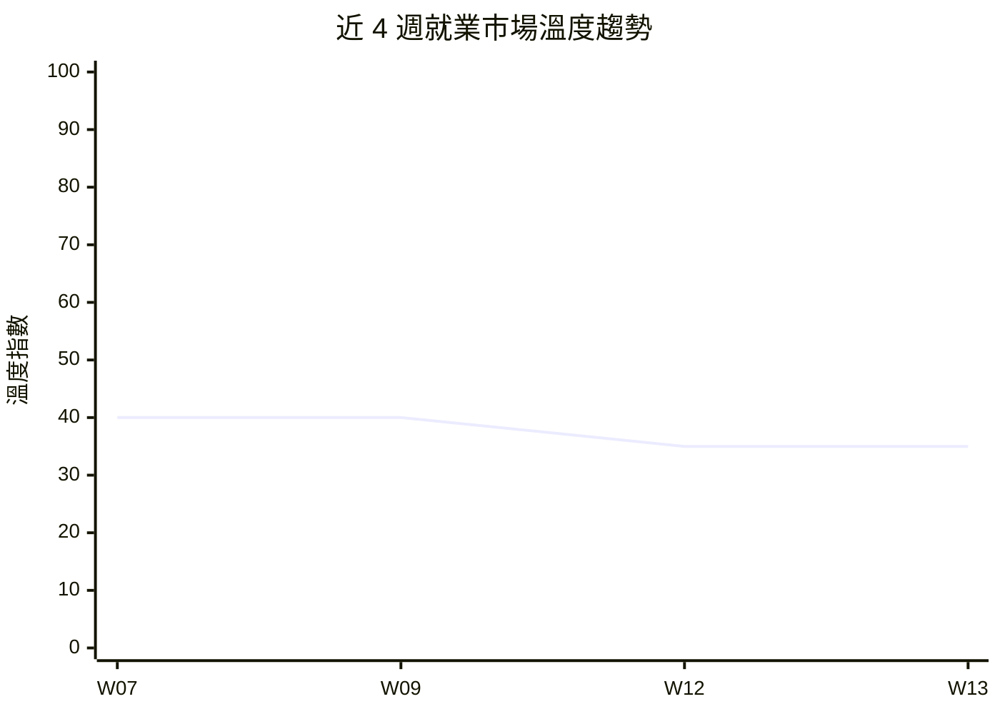

# 就業景氣溫度計 — 2026年第13週

## 本週溫度：🟠 偏冷

> 非農負增長效應持續發酵，裁員從大廠擴散至中小平台，市場處於停滯觀望期。

> 本報告使用 Qdrant 向量搜尋取得相關資料

> **本週核心發現：**
> - 市場溫度維持 🟠 偏冷（指數 35），連續第 4 週未回升——美國 2 月非農 -92K 效應持續，3 月數據尚未公布（來源：global_bls、global_indeed_hiring）
> - Digg 裁員並關閉 App，因 AI 機器人垃圾內容破壞平台機制，裁員信號從大廠擴散至中小型內容平台（來源：workforce_news）
> - 台灣政府平台職缺維持 1,040 筆，零售服務佔 48%、科技 9%，結構無顯著變化（來源：tw_govjobs）
> - AI-adjacent 職缺持續為唯一正成長領域，獨角獸數量年增 61% 至 187 家，國防科技 IPO 熱潮延續（來源：global_hn_hiring、funding_signals）
> - Meta 裁員 20% 傳聞仍未獲官方確認，若屬實將成為 2026 年最大裁員案（來源：workforce_news）

> 資料來源：W07-W13 景氣溫度計報告綜合判讀。W13 溫度指數維持 35，非農負增長效應持續但無新重大惡化因素。

[查看上週報告 →](/reports/climate-index-w12/)

## 核心指標

### 台灣市場

| 指標 | 本週 | 前週（W12） | 變化 | 來源 |
|------|------|------|------|------|
| 政府平台職缺數 | 1,040 | 1,040 | 0, 0% | tw_govjobs |
| 主要職缺類型分布 | 零售服務 48%、科技 9%、專業 9% | 零售服務 48%、科技 9%、專業 9% | 結構穩定 | tw_govjobs |
| 薪資觀測區間 | 29,500-40,000 TWD | 29,500-40,000 TWD | → | tw_govjobs |
| 裁員事件數（全球科技） | 3（累計） | 2（新增） | +1（Digg） | workforce_news |
| 融資/IPO 事件數 | 2 | 2 | → 數據未更新 | funding_signals |

**備註**：tw_104_jobs、tw_company_reviews 因 API 限制持續停用。台灣科技業職缺佔比維持 9%（95 筆），專業類 89 筆、醫療保健 67 筆、零售服務 499 筆。政府平台以基層服務業為主，無法完整反映台灣科技人才市場動態。

### 全球市場

| 指標 | 最新值 | 前期值 | 趨勢 | 來源 |
|------|--------|--------|------|------|
| 美國非農就業（月增） | -92K（2 月） | +126K（1 月） | ↓ 大幅惡化 | global_bls |
| 美國失業率 | 4.4%（2 月） | 4.3%（1 月） | ↑ +0.1pp | global_bls |
| 美國 JOLTS 職缺 | 6,946K（1 月） | 6,550K（12 月） | ↑ +6.0% | global_bls |
| 美國平均時薪 | $37.32（2 月） | $37.17（1 月） | ↑ +0.4% | global_bls |
| 澳洲失業率 | 4.28%（2 月） | 4.07%（1 月） | ↑ +0.21pp | global_abs |
| 加拿大失業率 | 6.9%（2 月） | 6.7%（1 月） | ↑ +0.2pp | global_statcan |
| 歐盟就業人數（年度） | 19,433K（2025） | 19,416K（2024） | ↑ +17K（增速驟降） | global_eurostat |
| ManpowerGroup NEO（Q2） | 數據未更新 | — | — | global_manpower_outlook |
| Indeed 招聘趨勢 | 科技業低於疫情前 30%+ | — | ↓ | global_indeed_hiring |
| 聯準會利率 | 3.50%-3.75%（3 月維持） | 同 | → | global_indeed_hiring |

> **數據覆蓋說明**：本週共有 **10/14 個 Layer 提供有效數據**。缺失的 Layer：tw_104_jobs（API 限制停用）、tw_company_reviews（已停用）、global_linkedin_workforce（本週無新數據）、global_manpower_outlook（WebFetch 失敗，Q2 數據待確認）。本週多數 Layer 數據與 W12 一致，新增事件為 Digg 裁員（workforce_news）。

---

## 溫度判讀依據

**台灣市場核心態勢**：政府就業通平台職缺數維持 1,040 筆，與 W12 持平。零售服務業佔 48%（499 筆）仍為最大宗，科技類維持 9%（95 筆），專業類 89 筆，醫療保健 67 筆，創意類 57 筆。薪資觀測區間維持 29,500-40,000 元未變。台灣市場結構短期內無顯著波動，但由於 tw_104_jobs 持續停用，科技人才市場的完整動態仍無法精確評估。（來源：tw_govjobs）

**全球市場背景——2 月非農效應持續發酵**：美國 2 月非農就業 -92K 的衝擊在本週持續發酵，市場等待 3 月數據（預計 4 月初公布）以確認是否為趨勢性惡化。澳洲失業率 4.28%（+0.21pp）、加拿大 6.9%（+0.2pp）、歐盟就業增速驟降 88% 等多國同步走弱的格局未改。JOLTS 職缺 1 月反彈至 6,946K 與平均時薪 +3.8% YoY 提供部分緩衝，但 Indeed Hiring Lab 指出近六個月淨就業創造趨近零，勞動力參與率 62% 為 2021 年底以來最低，市場基本面持續承壓。（來源：global_bls、global_abs、global_statcan、global_eurostat、global_indeed_hiring）

**事件面信號——裁員從大廠擴散至中小平台**：本週新增事件為 Digg 裁員並關閉 App。值得注意的是，Digg 的裁員原因並非直接「以 AI 投資取代人力」，而是 AI 機器人垃圾內容破壞了平台的核心投票機制，迫使公司縮減規模重新定向。這代表 AI 對就業市場的衝擊正在展現第二種路徑：不僅透過「企業主動用 AI 取代員工」（如 Atlassian、Block），也透過「AI 破壞既有商業模式」間接造成職位流失。此外，W12 報導的 Atlassian 裁員 10%（1,600 人）與 Meta 潛在裁員 20% 的效應仍在市場中發酵。（來源：workforce_news）

**綜合研判——偏冷持穩，等待 3 月數據確認方向**：本週維持「🟠 偏冷」判讀，溫度指數維持 35。主要原因為本週無重大新宏觀數據公布，2 月非農 -92K 的效應仍在消化中。支撐不進一步惡化的因素包括：JOLTS 職缺維持正向、時薪正增長、AI 相關職缺逆勢擴張、國防科技 IPO 活躍。但風險因素亦未消退：多國失業率同步上升、醫療保健業轉負、科技裁員持續擴散。市場處於等待 3 月就業數據的觀望期。（來源：綜合判讀）

**與前期銜接**：W12 溫度指數從 W09 的 40 下調至 35，反映非農負增長與 Atlassian 裁員的衝擊。W13 維持 35 不變，因本週無新的重大惡化因素，但也缺乏回暖信號。若 3 月非農數據持續為負或 Meta 裁員確認，下期可能調降至「🔴 寒冷」；若 3 月數據回正，則可能回升至 40。

---

## 產業亮點與警訊

### 擴張信號

- 🟢 **AI/ML 職缺**：Indeed 報告顯示提及 AI 的職缺為整體招聘市場中唯一正成長類別，HN Hiring 中 AI-adjacent 領域（法律科技、生技 ML、金融科技）招聘持續活躍（來源：global_indeed_hiring、global_hn_hiring）
- 🟢 **國防科技**：Swarmer IPO 首日暴漲 520% 效應延續，12 家國防科技新創具 IPO 潛力，該領域人才需求涵蓋工程、硬體與 AI/ML（來源：funding_signals）
- 🟢 **後端工程**：HN Hiring 累計 906 筆後端職缺、650 筆全端職缺，薪資維持 $80K-$400K 競爭力區間（來源：global_hn_hiring）

### 收縮信號

- 🔴 **企業軟體/B2B SaaS**：Atlassian 裁員 10%（1,600 人）效應持續，AI 主題裁員已擴散至企業工具市場（來源：workforce_news）
- 🔴 **醫療保健業**：美國 2 月醫療保健就業 -28K，過去一年就業增長主力首次轉負（來源：global_indeed_hiring）
- 🔴 **內容平台**：Digg 裁員並關閉 App，非 AI 原生的內容平台面臨 AI 機器人垃圾內容的結構性威脅（來源：workforce_news）
- 🔴 **休閒餐旅業**：2 月損失 27,000 個職位，Kaiser Permanente 罷工影響超過 30,000 名勞工（來源：global_indeed_hiring）

### 值得關注

- 🟡 **社群媒體**：Meta 據報考慮 20% 裁員（約 15,000 人），若確認將重塑科技就業版圖，消息仍未獲官方證實（來源：workforce_news）
- 🟡 **停滯性通膨風險**：油價四週漲 27%、PPI 超預期，聯準會預期 2026 年僅 0-1 次降息，薪資購買力恐受壓（來源：global_indeed_hiring）
- 🟡 **3 月就業數據觀望**：市場等待 3 月非農數據（預計 4 月初公布），將確認 2 月 -92K 是短期異常還是趨勢性轉折

---

## 本週重大事件

1. **Digg 裁員並關閉 App，AI 機器人垃圾內容破壞平台機制**（來源：workforce_news）
   社群連結分享平台 Digg 宣布裁員並下架 App，主因是 AI 機器人垃圾帳號大量入侵，已封禁數萬帳號仍無法有效控制。創辦人 Kevin Rose 將全職回歸主導重建。此事件代表 AI 對就業的間接衝擊路徑——破壞既有平台商業模式導致職位流失。

2. **美國 2 月非農 -92K 效應持續發酵，市場等待 3 月數據**（來源：global_bls、global_indeed_hiring）
   2 月非農就業下降 92,000 人的衝擊持續影響市場情緒。六個月淨就業創造趨近零，醫療保健（-28K）與休閒餐旅（-27K）為最大拖累。3 月數據將於 4 月初公布，市場高度關注是否為趨勢性惡化。

3. **Atlassian 裁員 1,600 人效應擴散，「AI 取代人力」敘事強化**（來源：workforce_news）
   Atlassian 以 AI 投資為由裁員 10% 的決定持續在產業中引發討論，成為繼 Block、Pinterest 之後的系統性趨勢。企業軟體（B2B SaaS）領域首次受波及，相關從業者面臨重新評估職涯方向的壓力。

4. **Meta 裁員 20% 傳聞持續未獲確認**（來源：workforce_news）
   TechCrunch 報導 Meta 考慮裁員 20%（約 15,000 人）的消息已逾一週仍未獲官方確認或否認（[REVIEW_NEEDED]）。市場對此保持觀望，若屬實將成為科技業 2026 年單一最大裁員案。

5. **聯準會維持利率不變，停滯性通膨風險持續**（來源：global_indeed_hiring）
   FOMC 維持利率於 3.50%-3.75%，面對非農負增長與油價上漲的雙重壓力。Indeed Hiring Lab 以「hold on to your hats」形容當前局勢，多數委員預測 2026 年僅 0-1 次降息。

---

## [AI 取代向量](/glossary/#ai-取代向量)觀察

| 取代向量 | 本週信號 | 代表性事件/數據 |
|----------|----------|-----------------|
| [認知例行](/glossary/#認知例行cognitive-routine)（cognitive_routine） | 升溫 | Atlassian 裁員效應持續；Digg 因 AI 機器人問題裁員，內容審核與平台營運職能受衝擊 |
| [認知非例行](/glossary/#認知非例行cognitive-non-routine)（cognitive_nonroutine） | 升溫 | AI 編碼工具持續降低「從頭寫程式碼」需求；但 AI 研究員/ML 工程師需求仍強，市場深度分化 |
| [體力例行](/glossary/#體力例行physical-routine)（physical_routine） | 持平 | 台灣製造業職缺 14 筆（1.3%），倉儲自動化趨勢持續但短期衝擊有限 |
| [體力非例行](/glossary/#體力非例行physical-non-routine)（physical_nonroutine） | 持平 | 零售服務業職缺佔台灣最大宗 48%（499 筆），醫療保健 67 筆，人力需求穩定（來源：tw_govjobs） |
| [高度人際](/glossary/#高度人際interpersonal)（interpersonal） | 持平 | 教育 16 筆、照護 12 筆，人際導向職缺需求穩定，AI 短期難以取代 |

---

## 本週行動清單

基於本週數據，建議以下行動：

### HR 主管

- [ ] **評估 AI 對平台商業模式的間接影響**：Digg 因 AI 機器人破壞平台機制而裁員，建議評估自家產品是否面臨類似風險，並預先規劃因應人力調整（依據：workforce_news Digg 裁員事件）
- [ ] **關注 Atlassian 裁員釋出人才**：1,600 名企業軟體領域人才正進入市場，若有 B2B SaaS 相關職缺需求，本週是接觸優質人才的窗口期（依據：workforce_news）
- [ ] **為 3 月數據做招聘策略預案**：若 3 月非農持續為負，市場可能進一步降溫；建議準備兩種情境（回暖 vs. 惡化）的招聘預算方案（依據：global_bls 非農 -92K 趨勢）

### 求職者

- [ ] **優先投遞 AI-adjacent 職缺**：法律科技、生技 ML、金融科技等 AI 交叉應用領域持續活躍招聘，機會窗口相對較大（依據：global_hn_hiring 中 CiceroAI 等案例）
- [ ] **關注國防科技新興機會**：Swarmer IPO 帶動的國防科技熱潮延續，12 家新創具上市潛力，工程與 AI/ML 人才需求將擴大（依據：funding_signals）
- [ ] **評估目標公司的 AI 抵抗力**：Digg 案例顯示非 AI 原生平台可能因 AI 機器人問題被迫縮減，投遞前建議評估目標公司的商業模式是否具備 AI 時代韌性
- [ ] **強化 AI 工具協作技能**：AI 編碼工具（Copilot、Cursor）已成業界標配，建議從「寫程式碼」轉向「AI 協同開發」定位，提升市場競爭力
- [ ] **追蹤 3 月就業數據**：預計 4 月初公布的 3 月非農數據將確認市場方向，建議據此調整求職策略節奏

### 研究者

- [ ] **分析 AI 對就業的雙重衝擊路徑**：建議區分「企業主動用 AI 取代人力」（Atlassian 模式）與「AI 破壞商業模式致間接裁員」（Digg 模式），量化兩種路徑的影響規模差異
- [ ] **追蹤 3 月非農數據**：2 月 -92K 為關鍵轉折信號，3 月數據將決定是否確認為結構性惡化趨勢，值得密切關注

### 下週關注

- 美國 3 月就業數據（預計 4 月初公布，確認非農負增長是否為趨勢性）
- Meta 裁員消息是否獲官方確認及具體規模
- 聯準會官員對經濟前景的最新表態
- 台灣科技業是否出現新的裁員或招聘信號

---

[查看本週完整技能漂移分析 →](/reports/skills-drift-w13/)

---

## 資料來源明細

> 本報告使用 Qdrant 向量搜尋取得相關資料，資料來源包括：

| Layer | 筆數 | 更新時間 | 狀態 |
|-------|------|----------|------|
| tw_govjobs | 1,040 | 2026-03-04 | 有效 |
| global_bls | 5 指標 | 2026-03-22 | 有效 |
| global_abs | 失業率 | 2026-03-22 | 有效 |
| global_statcan | 失業率 | 2026-03-22 | 有效 |
| global_eurostat | 就業人數 | 2026-03-22 | 有效 |
| global_manpower_outlook | Q2 元數據 | 2026-03-22 | 部分（WebFetch 失敗） |
| global_indeed_hiring | 5 篇分析 | 2026-03-22 | 有效 |
| global_hn_hiring | 2,355 | 2026-03-22 | 有效 |
| workforce_news | 5 事件（+1 Digg） | 2026-03-23 | 有效 |
| funding_signals | 2 事件 | 2026-03-22 | 有效 |

**未提供數據的 Layer**：
- tw_104_jobs：API 限制停用
- tw_company_reviews：已停用
- global_linkedin_workforce：本週無新數據
- global_manpower_outlook：Q2 報告 WebFetch 失敗，僅有元數據

**總計**：約 3,400+ 筆觀測數據

---

## 免責聲明

本報告為自動化分析產出，僅供參考。就業市場判讀基於有限的觀測數據源，不代表完整的市場狀況。「[景氣溫度](/glossary/#景氣溫度)」指標為綜合性定性判斷，非精確量化指數。任何就業或投資決策請諮詢專業人士。

資料來源的更新頻率不一（部分為即時、部分為月度或季度），跨來源比較時應注意時間差異。tw_104_jobs 與 tw_company_reviews 因 API 存取限制暫時停用，台灣專業人才市場動態資訊有所不足。Meta 裁員消息標記為 [REVIEW_NEEDED]，為未經確認的媒體報導，引用時請注意此不確定性。

---

最後更新：2026-03-23
