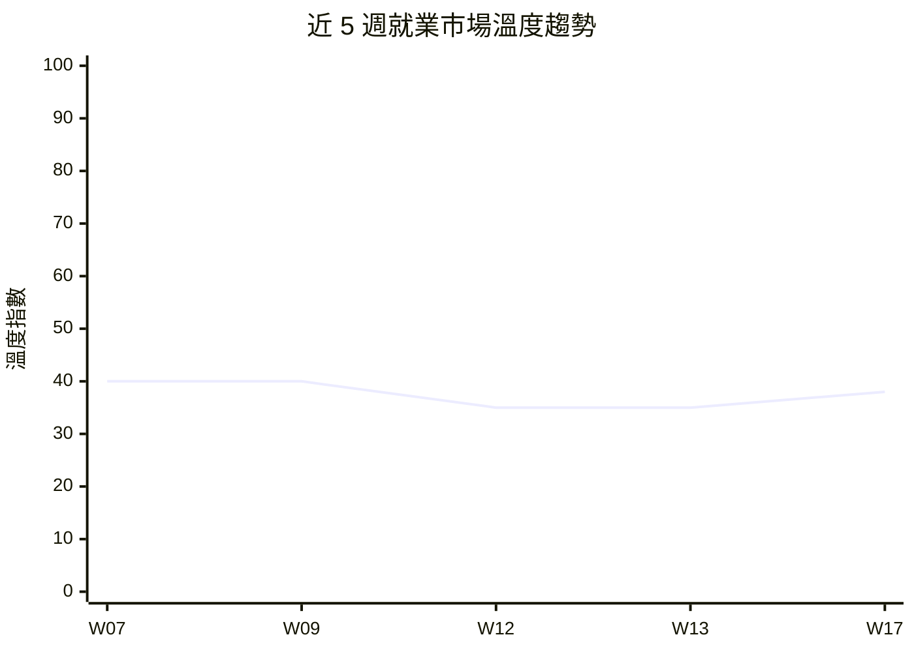

# 就業景氣溫度計 — 2026年第17週

## 本週溫度：🟠 偏冷

> 非農回彈+178K終結負增長，但失業率升至4.3%，市場呈「有量無質」分化復甦。

> 本報告使用 Qdrant 向量搜尋取得相關資料

> **本週核心發現：**
> - 市場溫度微升至 🟠 偏冷（指數 38），較 W13 的 35 回升 3 點——3 月非農 +178K 終結 2 月 -92K 負增長，但力度仍低於歷史均值（來源：global_bls）
> - 失業率升至 4.3%（+0.2pp）、U-6 達 8.0%，勞動市場鬆弛信號增強，「有工作但品質下降」的分化格局浮現（來源：global_bls）
> - 平均時薪 $37.38（+3.5% YoY）超越 CPI +3.3% YoY，實質薪資維持正增長，為市場提供底部支撐（來源：global_bls）
> - HN Hiring 4 月維持 115+ 筆貼文，全端（34）、後端（25）為大宗；Adzuna 全球 530+ 筆職缺，科技人才需求穩定（來源：global_hn_hiring、global_adzuna）
> - OpenAI 完成 $110B 史上最大融資，AI 資本狂熱延續；但 SaaS IPO 持續缺席，產業冷熱分化加劇（來源：funding_signals）

> 資料來源：W07-W17 景氣溫度計報告綜合判讀。W17 溫度指數從 35 微升至 38，非農回彈提供正向信號但失業率上升限制回升幅度。

[查看上週報告 →](/reports/climate-index-w13/)

## 核心指標

### 台灣市場

| 指標 | 本週 | 前期（W13） | 變化 | 來源 |
|------|------|------|------|------|
| 政府平台職缺數 | 數據未更新 | 1,040 | — | tw_govjobs |
| 主要職缺類型分布 | 數據未更新 | 零售服務 48%、科技 9% | — | tw_govjobs |
| 薪資觀測區間 | 數據未更新 | 29,500-40,000 TWD | — | tw_govjobs |
| 裁員事件數（全球科技） | 3（累計） | 3（累計） | → | workforce_news |
| 融資/IPO 事件數 | 6+（累計） | 2 | +4（新增 OpenAI 等） | funding_signals |

**備註**：tw_104_jobs、tw_govjobs、tw_company_reviews 因 API 限制或網路問題本週未更新。台灣市場數據依賴政府平台為主，科技人才市場動態無法精確評估。

### 全球市場

| 指標 | 最新值 | 前期值 | 趨勢 | 來源 |
|------|--------|--------|------|------|
| 美國非農就業（月增） | +178K（3 月） | -92K（2 月） | ↑ 回彈 | global_bls |
| 美國失業率（U-3） | 4.3%（3 月） | 4.1%（2 月） | ↑ +0.2pp | global_bls |
| 美國 U-6 未充分就業率 | 8.0%（3 月） | 7.9%（2 月） | ↑ +0.1pp | global_bls |
| 美國平均時薪 | $37.38（3 月） | $36.98（2 月） | ↑ +1.1% MoM | global_bls |
| 美國 CPI 年增率 | +3.3%（3 月） | — | → 通膨持續 | global_bls |
| HN Hiring 月度貼文 | 115+（4 月） | ~2,355 累計 | → 穩定 | global_hn_hiring |
| Adzuna 全球職缺 | 530+（累計） | 429+ | ↑ +101 筆 | global_adzuna |

> **數據覆蓋說明**：本週共有 **5/14 個 Layer 提供有效數據**。缺失的 Layer：tw_104_jobs（API 限制停用）、tw_govjobs（網路問題）、tw_company_reviews（已停用）、global_abs（本週無新數據）、global_statcan（網路問題）、global_eurostat（網路問題）、global_linkedin_workforce（本週無新數據）、global_manpower_outlook（本週無新數據）、global_indeed_hiring（本週無新數據）。數據覆蓋率較 W13（10/14）下降，判讀信心相應調降。

---

## 溫度判讀依據

**台灣市場核心態勢**：受 tw_govjobs 與 tw_104_jobs 網路問題與 API 限制影響，本週台灣市場無新增數據。依 W13 基準，政府平台職缺維持 1,040 筆，零售服務業佔 48%，科技類 9%。由於台灣資料來源本週全數缺失，溫度判讀主要依賴全球市場數據。（來源：tw_govjobs W13 基準數據）

**全球市場背景——非農回彈但品質分化**：3 月非農就業 +178K 終結了 2 月 -92K 的負增長衝擊，市場最擔憂的「連續負增長」情境並未發生。然而，+178K 的回彈力度低於 2025 年月均水準，且同月失業率從 4.1% 升至 4.3%（+0.2pp），U-6 未充分就業率達 8.0%，顯示勞動市場正在鬆弛化。正向信號為平均時薪 $37.38（+3.5% YoY）持續超越 CPI +3.3% YoY，實質薪資維持正增長。（來源：global_bls）

**事件面信號——AI 資本狂熱與 SaaS 冰封並存**：OpenAI 完成 $110B 史上最大單輪融資，AI 產業資本投入持續打破紀錄。太空科技融資 2025 年達 $12B 新高，國防科技 IPO 熱潮延續。然而，SaaS 公司 IPO 持續缺席，反映企業軟體產業面臨 AI 轉型壓力下的估值困境。資本市場呈現極度分化：AI 與硬科技熱錢湧入，傳統軟體與內容平台資金趨冷。（來源：funding_signals）

**綜合研判——偏冷微升，分化格局深化**：本週溫度指數從 35 微升至 38，主要反映 3 月非農回彈終結了市場最擔憂的連續負增長情境。但未能回升至 40（W07-W09 水準）的原因在於：失業率同步上升、U-6 攀升、數據覆蓋率下降。HN Hiring（115+ 筆/月）與 Adzuna（530+ 筆）的科技職缺保持穩定，AI 相關職缺持續為唯一明確擴張領域。整體而言，市場從「急凍觀望」轉為「溫和分化」，但遠未達回暖門檻。（來源：綜合判讀）

**與前期銜接**：W12-W13 因 2 月非農 -92K 衝擊，溫度指數降至 35。W17 隨 3 月數據回正，微升至 38。若 4 月非農持續正增長且失業率穩定，下期可能回升至 40（持平區間下緣）；若失業率持續攀升或出現新的大規模裁員事件，則可能回落至 35。

---

## 產業亮點與警訊

### 擴張信號

- 🟢 **AI/ML 職缺**：OpenAI $110B 融資帶動 AI 產業人才需求持續擴張，HN Hiring 中 data 類別 93 筆、security 類別 59 筆持續活躍，AI 研究員、ML 工程師、AI 產品經理為核心需求職位（來源：funding_signals、global_hn_hiring）
- 🟢 **全端/後端工程**：HN Hiring 累計全端 700 筆、後端 938 筆，4 月新增全端 34 筆、後端 25 筆，技術工程師需求穩定，薪資區間維持 $80K-$400K（來源：global_hn_hiring）
- 🟢 **太空科技**：2025 年融資達 $12B 新高，2026 年延續強勁勢頭，工程與硬體人才需求走升（來源：funding_signals）

### 收縮信號

- 🔴 **SaaS / 企業軟體**：SaaS IPO 持續缺席，Atlassian 裁員 1,600 人效應延續，企業軟體產業面臨 AI 轉型壓力下的估值與招聘雙重困境（來源：funding_signals、workforce_news）
- 🔴 **內容平台**：Digg 裁員並關閉 App 的效應持續，非 AI 原生的內容平台面臨結構性壓力，相關從業者就業前景承壓（來源：workforce_news）

### 值得關注

- 🟡 **薪資 vs. 通膨**：平均時薪 +3.5% YoY 略勝 CPI +3.3% YoY，實質薪資正增長但幅度極窄（僅 0.2pp），若通膨再度攀升將迅速翻負（來源：global_bls）
- 🟡 **失業率趨勢**：U-3 從 4.1% 升至 4.3%，U-6 達 8.0%，已接近 2020 年疫後復甦完成前的水準，需密切觀察是否為趨勢性惡化（來源：global_bls）
- 🟡 **聯準會政策**：通膨維持 3.3%、失業率上升的雙重壓力下，聯準會的利率決策將直接影響企業招聘意願

---

## 本週重大事件

1. **美國 3 月非農 +178K 回彈，終結 2 月負增長**（來源：global_bls）
   3 月非農就業增加 178K，終結了 2 月 -92K 的衝擊。2 月數據同時從初值 -92K 修正確認為 158,459K 水準。回彈力度雖低於 2025 年月均值，但市場最擔憂的「連續負增長」情境已排除。

2. **失業率升至 4.3%，U-6 達 8.0%，勞動市場鬆弛化**（來源：global_bls）
   3 月失業率從 4.1% 升至 4.3%（+0.2pp），U-6 未充分就業率從 7.9% 升至 8.0%。失業率已連續多月維持在 4% 以上，顯示勞動市場供需平衡正在向寬鬆端移動。

3. **OpenAI 完成 $110B 史上最大單輪融資**（來源：funding_signals）
   OpenAI 於 2 月底宣布完成 1,100 億美元融資，打破全球創投紀錄。此融資規模反映 AI 產業資本投入仍處於加速階段，將帶動 AI 研究員、ML 工程師、基礎設施工程師等職位的持續擴張需求。

4. **SaaS IPO 持續缺席，企業軟體產業承壓**（來源：funding_signals）
   2026 年前兩個月 IPO 市場中，建築科技、太空科技、生技等產業活躍上市，但長期主導 IPO 市場的 SaaS 公司明顯缺席。此趨勢反映 AI 對企業軟體商業模式的顛覆壓力，相關從業者面臨產業轉型風險。

5. **平均時薪 +3.5% YoY 微幅超越 CPI +3.3% YoY**（來源：global_bls）
   3 月平均時薪 $37.38（+$1.27 YoY），CPI 年增率 3.3%。實質薪資維持正增長但幅度極窄，為勞動者購買力提供微弱支撐。通膨若再度攀升，實質薪資將迅速翻負。

---

## [AI 取代向量](/glossary/#ai-取代向量)觀察

| 取代向量 | 本週信號 | 代表性事件/數據 |
|----------|----------|-----------------|
| [認知例行](/glossary/#認知例行cognitive-routine)（cognitive_routine） | 升溫 | SaaS IPO 缺席反映企業軟體自動化壓力加劇；OpenAI $110B 融資加速 AI 工具對例行認知工作的替代 |
| [認知非例行](/glossary/#認知非例行cognitive-non-routine)（cognitive_nonroutine） | 分化 | AI 研究員/ML 工程師需求持續強勁（HN Hiring data 93 筆），但非 AI 原生的軟體工程師面臨轉型壓力 |
| [體力例行](/glossary/#體力例行physical-routine)（physical_routine） | 持平 | 本週無顯著新信號，倉儲自動化與製造業機器人化趨勢持續但短期衝擊有限 |
| [體力非例行](/glossary/#體力非例行physical-non-routine)（physical_nonroutine） | 持平 | 台灣數據未更新；全球零售服務與醫療保健人力需求預期穩定 |
| [高度人際](/glossary/#高度人際interpersonal)（interpersonal） | 持平 | 教育、照護等人際導向職缺需求穩定，AI 短期難以取代直接人際互動 |

---

## 本週行動清單

基於本週數據，建議以下行動：

### HR 主管

- [ ] **把握非農回彈窗口啟動招聘**：3 月非農 +178K 回彈，市場情緒從極度悲觀轉為觀望，建議趁競爭對手仍在猶豫時啟動關鍵職位招聘（依據：global_bls 非農數據）
- [ ] **重新評估 AI 職位薪資競爭力**：OpenAI $110B 融資將推高 AI 人才薪資預期，建議對照 HN Hiring $80K-$400K 區間調整開價策略（依據：funding_signals、global_hn_hiring）
- [ ] **關注失業率上升帶來的人才供給增加**：失業率升至 4.3% 意味求職者增加，建議加大被動求職者接觸力道（依據：global_bls 失業率數據）

### 求職者

- [ ] **積極投遞 AI 交叉領域職缺**：AI+生技、AI+半導體、AI+金融等交叉領域資本充足、招聘活躍，機會窗口相對較大（依據：funding_signals OpenAI、太空科技融資）
- [ ] **把握非農回彈的求職窗口**：3 月就業數據回正，企業招聘意願有所恢復，建議加速投遞節奏（依據：global_bls 非農 +178K）
- [ ] **避開 SaaS 產業轉型風險**：SaaS IPO 缺席、Atlassian 裁員效應延續，投遞 SaaS 公司前建議確認其 AI 轉型策略與財務健康度（依據：funding_signals SaaS IPO 缺席）
- [ ] **強化 AI 工具協作技能**：OpenAI $110B 融資加速 AI 普及，建議從「寫程式碼」轉向「AI 協同開發」定位，掌握 Copilot、Cursor 等工具使用經驗
- [ ] **追蹤 4 月非農數據**：預計 5 月初公布，將確認 3 月回彈是否為趨勢性改善

### 研究者

- [ ] **分析非農回彈與失業率同步上升的矛盾信號**：3 月非農 +178K 回正但失業率升至 4.3%，建議深入分析勞動力參與率變化、兼職 vs. 全職結構，釐清「有量無質」的復甦本質（依據：global_bls）
- [ ] **追蹤 AI 融資規模與就業創造的關聯**：OpenAI $110B 融資是否轉化為等比例的就業機會，或加速自動化取代？值得建立量化追蹤模型

### 下週關注

- 4 月非農就業數據（預計 5 月初公布），確認 3 月回彈是否為趨勢性
- 聯準會 FOMC 會議紀要與利率決策方向
- AI 產業是否出現新的大規模融資或裁員事件
- 台灣資料來源（tw_govjobs）連線恢復後的最新數據

---

[查看本週完整技能漂移分析 →](/reports/skills-drift-w17/)

---

## 資料來源明細

> 本報告使用 Qdrant 向量搜尋取得相關資料，資料來源包括：

| Layer | 筆數 | 更新時間 | 狀態 |
|-------|------|----------|------|
| global_bls | 5 指標（NFP、U-3、U-6、時薪、CPI） | 2026-04-26 | 有效 |
| global_hn_hiring | 2,500+（累計），4 月 115+ | 2026-04-26 | 有效 |
| global_adzuna | 530+（累計），W13 後新增 101 | 2026-04-26 | 有效 |
| funding_signals | 6+ 事件 | 2026-02-28 | 有效（最新至 2 月底） |
| workforce_news | 5 事件（累計） | 2026-03-23 | 有效（最新至 W13） |

**未提供數據的 Layer**：
- tw_104_jobs：API 限制停用
- tw_govjobs：網路問題，本週未更新
- tw_company_reviews：已停用
- global_abs：本週無新數據
- global_statcan：網路問題
- global_eurostat：網路問題
- global_linkedin_workforce：本週無新數據
- global_manpower_outlook：本週無新數據
- global_indeed_hiring：本週無新數據

**總計**：約 3,100+ 筆觀測數據（因多個 Layer 未更新，較 W13 略減）

---

## 免責聲明

本報告為自動化分析產出，僅供參考。就業市場判讀基於有限的觀測數據源，不代表完整的市場狀況。「[景氣溫度](/glossary/#景氣溫度)」指標為綜合性定性判斷，非精確量化指數。任何就業或投資決策請諮詢專業人士。

資料來源的更新頻率不一（部分為即時、部分為月度或季度），跨來源比較時應注意時間差異。本週僅 5/14 個 Layer 提供有效數據，數據覆蓋率較前期（10/14）下降，溫度判讀的精確度相應受限。tw_104_jobs、tw_govjobs 等台灣資料來源持續缺失，台灣專業人才市場動態資訊不足。

---

最後更新：2026-04-26
