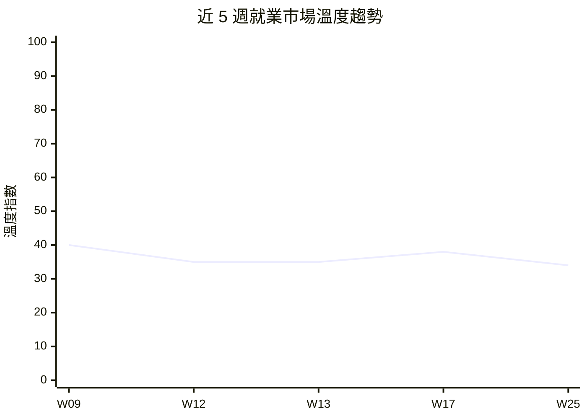

# 就業景氣溫度計 — 2026年第25週

## 本週溫度：🟠 偏冷

> AI 驅動裁員潮密集發生逾 1.9 萬人，多在營收創高下歸因 AI，市場結構性轉冷。

> 本報告數據直接讀取自 Extractor Layer 萃取結果（docs/Extractor/）。註：本週 Qdrant 向量搜尋因 OpenAI API 金鑰失效（HTTP 401）暫停，改以 Layer 語料庫直接讀取，底層資料一致。

> **本週核心發現：**
> - 市場溫度降至 🟠 偏冷（指數 34），較 W17 的 38 下降 4 點——本週事件面出現科技業 AI 驅動裁員潮，Meta 8,000、Cisco 4,000、Intuit 3,000 等密集發生，合計逾 1.9 萬人（來源：workforce_news）
> - 多起裁員發生在營收創新高背景下：Cloudflare 1,100 職位因 AI「變得多餘」、Cisco 近 4,000 人裁員同季創紀錄營收，顯示本輪為「結構性 AI 取代」而非景氣性收縮（來源：workforce_news）
> - 資本端與勞動端背離：SpaceX 完成史上最大 IPO 並以 $60B 收購 AI 編碼工具 Cursor，為 2026 年最大新創併購；ElevenLabs ARR 突破 $500M（估值 $110 億）（來源：funding_signals）
> - 美國總經數據本週無更新——最新仍為 3 月非農 +178K、失業率 4.3%、平均時薪 $37.38（+3.5% YoY），底層基本面延續 W17 判讀（來源：global_bls）
> - HN Hiring 本週累計約 2,677 筆有效徵才貼文，後端（968）、全端（765）、前端（248）為大宗，技術職缺維持基本盤但無明顯擴張動能（來源：global_hn_hiring）

> 資料來源：W09-W25 景氣溫度計報告綜合判讀。W25 溫度指數從 38 回落至 34，主因事件面密集的 AI 驅動裁員潮抵銷了 W17 非農回彈帶來的正向信號。

[查看上週報告 →](/reports/climate-index-w17/)

## 核心指標

### 台灣市場

| 指標 | 本週 | 前期（W17） | 變化 | 來源 |
|------|------|------|------|------|
| 政府平台職缺數 | 數據未更新 | 1,040（W13 基準） | — | tw_govjobs |
| 主要職缺類型分布 | 數據未更新 | 零售服務 48%、科技 9%（W13 基準） | — | tw_govjobs |
| 薪資觀測區間 | 數據未更新 | 29,500-40,000 TWD（W13 基準） | — | tw_govjobs |
| 裁員事件數（全球科技，本週萃取） | 18+（W17 後新增） | 5（累計） | ↑ 大幅增加 | workforce_news |
| 融資/IPO 事件數（本週萃取） | 20+（W17 後新增） | 6+（累計） | ↑ 大幅增加 | funding_signals |

**備註**：tw_104_jobs、tw_govjobs、tw_company_reviews 因 API 限制或已停用，本週無台灣本地數據。台灣市場數據持續缺失，本週溫度判讀以全球事件面與總經數據為主。

### 全球市場

| 指標 | 最新值 | 前期值 | 趨勢 | 來源 |
|------|--------|--------|------|------|
| 美國非農就業（月增） | +178K（3 月，無更新） | -92K（2 月） | → 未更新 | global_bls |
| 美國失業率（U-3） | 4.3%（3 月，無更新） | 4.1%（2 月） | → 未更新 | global_bls |
| 美國平均時薪 | $37.38（3 月，無更新） | $36.98（2 月） | → 未更新 | global_bls |
| 美國 CPI 年增率 | +3.3%（3 月，無更新） | — | → 未更新 | global_bls |
| JOLTS 職缺數 | 6,946K（1 月，無更新） | 6,550K（去年 12 月） | → 未更新 | global_bls |
| HN Hiring 累計徵才貼文 | ~2,677（本週擷取） | 2,500+（W17） | → 穩定 | global_hn_hiring |

> **數據覆蓋說明**：本週共有 **4/14 個 Layer 提供有效數據**（global_bls 為延續 W17 的 3 月數據，無新值；workforce_news 與 funding_signals 為本週新萃取；global_hn_hiring 本週重新擷取）。缺失或未更新的 Layer：tw_104_jobs（API 限制停用）、tw_govjobs（無新數據）、tw_company_reviews（已停用）、global_oecd_employment、global_ilo_stats、global_wef_jobs、global_stackoverflow、global_manpower_outlook、global_hays_salary、global_indeed_hiring、global_linkedin_workforce、global_arbeitnow（本週無新萃取資料）。總經面（BLS）本週無新數據，溫度判讀的調整主要來自事件面（裁員與融資）信號。

---

## 溫度判讀依據

**台灣市場核心態勢**：本週台灣三個本地資料來源（tw_104_jobs、tw_govjobs、tw_company_reviews）全數缺失。依 W13 基準，政府平台職缺維持約 1,040 筆、零售服務業佔 48%。由於台灣資料持續無法更新，本週溫度判讀以全球事件面為主要依據，台灣專業人才市場動態無法精確評估。（來源：tw_govjobs W13 基準數據）

**全球總經背景——基本面延續，無新增信號**：美國 BLS 數據本週無更新，最新仍為 3 月非農 +178K、失業率 4.3%、U-6 8.0%、平均時薪 $37.38（+3.5% YoY，略勝 CPI +3.3%）。基本面延續 W17 的「有量無質、溫和分化」格局，本身既不構成升溫也不構成新的降溫信號。需注意此為 3 月數據，與本週（6 月）事件面存在約 3 個月的時間落差，跨來源比較時應審慎。（來源：global_bls）

**事件面信號——AI 驅動裁員潮為本週主導變數**：本週新萃取的 workforce_news 顯示一波密集的科技業裁員：Meta 8,000（10%）、Cisco 近 4,000（5%，同季創紀錄營收）、Intuit 3,000（聚焦 AI 重整）、Cloudflare 1,100（AI 使支援職位「變得多餘」）、Snap 1,000（16%，CEO 引用 AI）、Epic Games 1,000、Coinbase 700（14%，AI 提升小團隊產能）、GM 600 名 IT（改招 AI 原生人才）、GitLab 350（14%）、Robinhood 290（10%）。合計逾 1.9 萬人，且多家在營收創高下仍裁員，明確歸因 AI 效率。這是與過往景氣性裁員性質不同的「結構性 AI 取代」信號。（來源：workforce_news）

**綜合研判——偏冷下移，結構性收縮深化**：本週溫度指數從 38 回落至 34。判讀矛盾點在於：總經數據（BLS 3 月）未惡化、資本市場熱絡（SpaceX 史上最大 IPO、$60B 收購 Cursor、ElevenLabs $500M ARR），但事件面的 AI 裁員潮密集且性質結構化。系統依「事件面對就業的直接衝擊優先於資本熱度」原則，將溫度下調——資本湧入 AI 基礎設施並不等比例轉化為就業，反而透過效率提升加速既有人力縮減。微軟 CEO Nadella 本週公開警告 AI 可能「空洞化整個產業」，與此信號相互呼應。（來源：workforce_news、funding_signals）

**與前期銜接**：W17 因 3 月非農回彈微升至 38。W25 雖總經未惡化，但事件面出現 W17 後累積的密集 AI 裁員，故下調至 34（仍在偏冷區間，未進入寒冷）。**推測**：若後續 BLS 4-5 月數據反映此裁員潮（失業率上行或非農轉弱），下期可能進一步回落至 30 附近；若裁員潮為一次性集中釋放且總經數據維持穩定，則可能回穩於 34-38 區間。此為推測，須待新數據驗證。

---

## 產業亮點與警訊

### 擴張信號

- 🟢 **AI 基礎設施 / 太空科技**：SpaceX 完成史上最大 IPO，上市後資本充裕，預期擴大火箭工程、衛星通訊（Starlink）與 AI 軟體招募；同日以 $60B 收購 Cursor 切入企業軟體市場（來源：funding_signals）
- 🟢 **語音 / 生成式 AI**：ElevenLabs ARR 突破 $500M、估值 $110 億，Q1 單季 ARR 增 $100M，將吸收語音工程師、TTS/ASR 研究員及企業 AI 整合工程師（來源：funding_signals）
- 🟢 **AI 原生開發職能**：GM 裁減 600 名傳統 IT 的同時，明確招募 AI 原生開發、資料工程、雲端工程、Agent 與模型開發、Prompt Engineering 人才，反映職能重構而非單純縮編（來源：workforce_news）

### 收縮信號

- 🔴 **科技業支援 / 中後台職能**：Cloudflare 1,100 個支援職位因 AI「變得多餘」、Coinbase 700 人重整（AI 使小團隊高效化），中後台與支援職能面臨 AI 直接取代（來源：workforce_news）
- 🔴 **大型平台與社群媒體**：Meta 裁員 8,000（10%）並取消 6,000 空缺、Snap 裁員 1,000（16%）、Epic Games 1,000，大型消費科技平台同步縮編（來源：workforce_news）
- 🔴 **傳統 IT / SaaS 職能**：Intuit 3,000、Cisco 近 4,000、GitLab 350，財務軟體、網路基礎設施與 DevOps 在「投入 AI、削減人力」邏輯下持續承壓（來源：workforce_news）

### 值得關注

- 🟡 **營收創高仍裁員的悖論**：Cloudflare、Cisco 等在營收創歷史新高下仍大規模裁員，顯示裁員與景氣脫鉤、由 AI 生產力驅動，是本輪最值得追蹤的結構性信號（來源：workforce_news）
- 🟡 **AI 資金高度集中美國**：2026 年至今美國吸納全球種子至成長階段融資約 80%，非美國地區（含台灣、歐洲）AI 人才紅利有限，加劇人才外流壓力（來源：funding_signals）
- 🟡 **M&A 取代 IPO 成主流退場**：SpaceX、OpenAI、Anthropic 上市後將成超大型收購方，acqui-hire 升溫但被收購方常面臨整合裁員（來源：funding_signals）

## 本週重大事件

1. **科技業 AI 驅動裁員潮，逾 1.9 萬人受影響**（來源：workforce_news）
   W17 以來密集發生：Meta 8,000、Cisco 近 4,000、Intuit 3,000、Cloudflare 1,100、Snap 1,000、Epic 1,000、Coinbase 700、GM 600 IT、GitLab 350、Robinhood 290。多家公司明確將裁員歸因於 AI 效率提升，且部分發生在營收創高背景下。

2. **Cloudflare 與 Cisco：營收創高仍裁員，AI 取代的典型案例**（來源：workforce_news）
   Cloudflare CEO 明言 1,100 個支援職位因 AI 而「變得多餘」，且發生在營收創歷史新高之際；Cisco 近 4,000 人裁員同季創紀錄營收。兩案直接說明裁員主因是 AI 取代而非業務萎縮。

3. **SpaceX 完成史上最大 IPO，同日 $60B 收購 Cursor**（來源：funding_signals）
   SpaceX 上市首日收漲 19%，為史上最大 IPO；同日以 $60B 收購 AI 編碼工具 Cursor，為 2026 年最大新創併購。AI 編碼工具成為大型企業核心戰略資產，可能加速削減初中階工程師人力。

4. **微軟 CEO Nadella 警告 AI 可能「空洞化整個產業」**（來源：funding_signals）
   Nadella 將 AI 經濟風險比擬全球化對製造業的衝擊，警告少數前沿模型可能吸收大量勞動價值，知識工作者面臨的結構性失業威脅尤為迫切。

5. **GM 以 AI 技能重構取代傳統 IT 人力**（來源：workforce_news）
   GM 裁減約 600 名 IT 員工（部門逾 10%）同時招募 AI 原生人才，定性為「技能組合重構」而非成本削減，是傳統產業以 AI 技能升級替換既有人力的代表案例。

## [AI 取代向量](/glossary/#ai-取代向量)觀察

| 取代向量 | 本週信號 | 代表性事件/數據 |
|----------|----------|-----------------|
| [認知例行](/glossary/#認知例行cognitive-routine)（cognitive_routine） | 升溫 | Cloudflare 1,100 支援職位因 AI「變得多餘」；Coinbase 以 AI 使小團隊高效化裁員 700，中後台與支援職能直接被取代 |
| [認知非例行](/glossary/#認知非例行cognitive-non-routine)（cognitive_nonroutine） | 分化 | GM 裁傳統 IT 改招 AI 原生工程師、SpaceX $60B 收購 Cursor 加速 AI 編碼普及，非 AI 原生工程師承壓但 AI 原生人才需求升溫 |
| [體力例行](/glossary/#體力例行physical-routine)（physical_routine） | 持平 | 本週無顯著新信號，相關 Layer 未更新 |
| [體力非例行](/glossary/#體力非例行physical-non-routine)（physical_nonroutine） | 持平 | 台灣數據未更新；本週事件集中於科技業白領，體力非例行職類無新信號 |
| [高度人際](/glossary/#高度人際interpersonal)（interpersonal） | 持平 | 本週裁員集中於科技中後台與工程，人際導向職類無直接衝擊；ElevenLabs 語音 AI 擴張對配音/電話客服形成中長期替代壓力 |

## 本週行動清單

基於本週數據，建議以下行動：

### HR 主管

- [ ] **檢視 AI 效率對人力配置的影響**：本週多家公司在營收創高下仍以 AI 效率為由裁員，建議重新盤點哪些中後台與支援職能可由 AI 流程重構（依據：workforce_news，Cloudflare 1,100、Coinbase 700）
- [ ] **把握科技人才釋出窗口**：逾 1.9 萬名科技人才本週釋出市場，被動求職者供給增加，建議針對 AI 原生與工程職缺加快接觸（依據：workforce_news 裁員規模）
- [ ] **參照 AI 原生職能需求調整 JD**：GM 公開招募 AI 原生開發、Agent/模型開發、Prompt Engineering，建議比對自身 JD 是否反映技能組合轉向（依據：workforce_news GM 案例）

### 求職者

- [ ] **優先布局 AI 原生與 AI 協作技能**：GM、Coinbase、Cisco 均以 AI 技能重構取代既有人力，建議從「執行職能」轉向「AI 協同 / AI 原生開發」定位（依據：workforce_news 多起 AI 重構案例）
- [ ] **謹慎評估中後台與支援職能風險**：Cloudflare 支援職位因 AI「變得多餘」，投遞前建議確認目標職能是否易被 AI 流程取代（依據：workforce_news Cloudflare 案例）
- [ ] **關注 AI 基礎設施與太空科技機會**：SpaceX IPO 後擴張、ElevenLabs 規模化，相關工程與研究職缺資金充足（依據：funding_signals SpaceX、ElevenLabs）
- [ ] **留意 AI 資金的美國集中現象**：2026 年至今美國吸納全球約 80% AI 融資，非美國地區機會相對有限，跨境職涯規劃可納入考量（依據：funding_signals 美國融資集中）
- [ ] **追蹤 BLS 4-5 月就業數據**：將驗證本週裁員潮是否反映於總體失業率與非農（依據：global_bls 數據時間落差）

### 研究者

- [ ] **建立「營收創高仍裁員」案例庫追蹤 AI 取代**：Cloudflare、Cisco 等案例使裁員與景氣脫鉤，建議量化追蹤 AI 驅動裁員占比，區分結構性與景氣性收縮（依據：workforce_news）
- [ ] **分析 AI 融資與就業創造的背離**：SpaceX/ElevenLabs 等鉅額資本是否轉化為等比例就業，或加速自動化取代，值得建立量化模型（依據：funding_signals、workforce_news）

### 下週關注

- BLS 4-5 月非農與失業率數據，驗證本週 AI 裁員潮是否反映於總經面
- AI 產業是否出現新的大規模裁員或鉅額融資/併購事件
- 台灣資料來源（tw_govjobs）連線恢復後的最新數據
- Qdrant 向量搜尋恢復（OpenAI API 金鑰修復）後的跨來源檢索能力

---

[查看本週完整技能漂移分析 →](/reports/skills-drift-w25/)

---

## 資料來源明細

> 本報告數據直接讀取自 Extractor Layer 萃取結果，資料來源包括：

| Layer | 筆數 | 更新時間 | 狀態 |
|-------|------|----------|------|
| workforce_news | 18+ 事件（本週新萃取，W17 後累積） | 2026-06-17 | 有效 |
| funding_signals | 20+ 事件（本週新萃取，W17 後累積） | 2026-06-17 | 有效 |
| global_hn_hiring | ~2,677（本週重新擷取） | 2026-06-17 | 有效 |
| global_bls | 5 指標（NFP、U-3、時薪、CPI、JOLTS） | 2026-04-26（3 月數據，無新值） | 延續（最新至 3 月） |

**未提供數據的 Layer**：
- tw_104_jobs：API 限制停用
- tw_govjobs：本週無新數據
- tw_company_reviews：已停用
- global_arbeitnow：本週無新萃取資料
- global_oecd_employment、global_ilo_stats、global_wef_jobs、global_stackoverflow、global_manpower_outlook、global_hays_salary、global_indeed_hiring、global_linkedin_workforce：本週無新數據

**總計**：約 2,700+ 筆觀測數據（以本週新萃取的事件面與 HN Hiring 為主）。

> **REVIEW_NEEDED 說明**：本週 workforce_news 中 Tools for Humanity 裁員一則因消息來自未具名來源、公司未確認，已於萃取階段標記 [REVIEW_NEEDED]，本報告未將其計入裁員規模統計。

---

## 免責聲明

本報告為自動化分析產出，僅供參考。就業市場判讀基於有限的觀測數據源，不代表完整的市場狀況。「[景氣溫度](/glossary/#景氣溫度)」指標為綜合性定性判斷，非精確量化指數。任何就業或投資決策請諮詢專業人士。

資料來源的更新頻率不一（部分為即時、部分為月度或季度），跨來源比較時應注意時間差異。本週 BLS 總經數據最新僅至 3 月，與事件面（6 月）存在約 3 個月時間落差；溫度下調主要反映事件面的 AI 裁員信號，總經面尚未確認。本週僅 4/14 個 Layer 提供有效數據，台灣本地資料持續缺失，台灣市場動態資訊不足，溫度判讀的精確度相應受限。本週「AI 驅動裁員潮」之結論為基於事件面密度的綜合研判，其對總體就業率的實際影響須待後續官方統計驗證。

---

最後更新：2026-06-17
