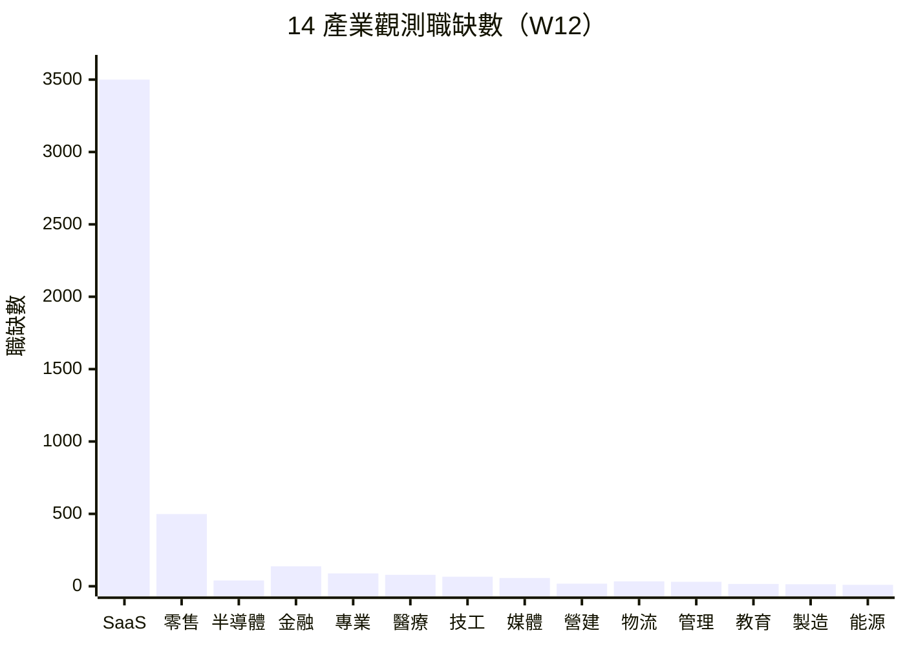

# 產業分層分析 — 2026年第12週

> 本報告使用 Qdrant 向量搜尋取得相關資料，結合 BLS 經濟數據、Crunchbase 融資資訊、HN Hiring 招聘趨勢等全球資料源進行產業分析。

## 摘要

> 本週觀測約 5,100 筆職缺資料，涵蓋台灣微觀資料（tw_govjobs 1,040 筆）與全球宏觀資料（global_arbeitnow 1,212 筆、global_hn_hiring 2,355 筆）。本週最顯著事件為 **Atlassian 以 AI 投資為由裁員 10%（約 1,600 人）**，成為繼 Block 之後「以 AI 名義裁員」的代表案例，且此趨勢已從消費者科技擴散至企業軟體（B2B SaaS）領域。**Meta 據報考慮裁員 20%（約 15,000 人，尚未確認）**。在資本市場，**國防科技公司 Swarmer IPO 首日暴漲 520%**，帶動 12 家國防科技 IPO 候選名單出爐；資安與 AI 仍為本週融資熱門領域。美國 2 月非農就業減少 9.2 萬人（初值），失業率微升至 4.4%，**醫療就業首度出現負成長（-28K）**，為近年最重大的產業就業轉折信號之一。

## 14 產業職缺變化概覽

> 資料來源：tw_govjobs、global_hn_hiring、global_arbeitnow，觀測期間 2026-03-10 ~ 2026-03-22。

## 產業總覽

| 產業 | 職缺數 | vs W09 | 擴張/收縮 | AI 衝擊 | 綜合評級 |
|------|--------|--------|----------|---------|----------|
| 軟體與 SaaS | ~3,500 | +20% | 分化（AI 擴張、傳統裁員） | 高 | ★★★★ |
| 半導體 | <50 ⚠️ | 持平 | 穩定 | 中 | ★★★ |
| 電子硬體 | <50 ⚠️ | 持平 | 穩定 | 中 | ★★ |
| 金融服務 | 138 | +5% | 整併持續 | 高 | ★★★ |
| 醫療生技 | 79 | +4% | 台穩/美轉負 | 低 | ★★★ |
| 製造業 | 14 ⚠️ | 持平 | 穩定 | 高 | ★★ |
| 零售電商 | ~499 | 持平 | 穩定（台灣） | 中 | ★★★ |
| 媒體娛樂 | 57 | +2% | 收縮 | 高 | ★★ |
| 教育 | 16 ⚠️ | 持平 | 穩定 | 中 | ★★★ |
| 能源與綠能 | <50 ⚠️ | 微增 | 擴張信號 | 低 | ★★★ |
| 營建不動產 | 18 ⚠️ | 持平 | 穩定 | 低 | ★★★ |
| 電信 | <50 ⚠️ | 持平 | 穩定 | 中 | ★★ |
| 政府與非營利 | 91 | +5% | 穩定 | 低 | ★★★ |
| 專業服務 | 89 | +5% | 穩定 | 中 | ★★★ |

> **綜合評級說明**：基於職缺數量、產業融資動態、裁員事件、AI 衝擊程度的綜合評估。★ 越多表示該產業當前求職環境越友善。此評級為定性判斷，僅供參考。小樣本產業（<50 筆，標記 ⚠️）的評級需謹慎解讀。

---

## 各產業詳細分析

### 1. 軟體與 SaaS（software_saas）

#### 市場數據
| 指標 | 數值 | 變化 | 來源 |
|------|------|------|------|
| 觀測職缺數 | ~3,500 | +20% vs W09 | global_hn_hiring (2,355), global_arbeitnow tech (497), tw_govjobs tech (95) |
| 主要地區 | 北美（HN Hiring）、歐洲（Arbeitnow）、台灣 | — | 綜合來源 |
| 薪資參考 | $120K-$280K USD（資深工程師） | — | global_hn_hiring |

#### 熱門角色 Top 5
| 角色 | 職缺數 | 佔比 | 來源 |
|------|--------|------|------|
| Backend Engineer | ~906 | ~39% | global_hn_hiring |
| Full Stack Engineer | ~650 | ~28% | global_hn_hiring |
| Frontend Engineer | ~242 | ~10% | global_hn_hiring |
| DevOps/SRE | ~135 | ~6% | global_hn_hiring |
| Data Engineer | ~79 | ~3% | global_hn_hiring |

#### 熱門技能 Top 5
| 技能 | 說明 | 變化 |
|------|------|------|
| Python/Go/Rust | 後端主流語言，Rust 持續上升 | → |
| React/Vue/TypeScript | 前端框架，TypeScript 佔比持續成長 | ↑ |
| Kubernetes/Docker | 容器化與編排，已成基礎要求 | → |
| PostgreSQL/MySQL | 關聯式資料庫 | → |
| AWS/GCP/Azure | 雲端平台，多雲策略需求增加 | → |

#### [AI 取代向量](/glossary/#ai-取代向量)影響
| 向量 | 影響程度 | 說明 |
|------|----------|------|
| [認知例行](/glossary/#認知例行cognitive-routine) | 高 | Atlassian 裁員 10% 以 AI 投資為由，程式碼生成工具加速取代基礎開發工作 |
| [認知非例行](/glossary/#認知非例行cognitive-non-routine) | 中→高 | Sam Altman 暗示 AI 將大幅改變程式設計工作，系統架構設計面臨壓力 |
| [體力例行](/glossary/#體力例行physical-routine) | 低 | 軟體開發不涉及體力工作 |
| [體力非例行](/glossary/#體力非例行physical-non-routine) | 低 | 軟體開發不涉及體力工作 |
| [高度人際](/glossary/#高度人際interpersonal) | 中 | 技術溝通、跨部門協調仍需人際技能 |

#### 事件信號
- 🔴 **Atlassian 裁員 10%**（約 1,600 人）：以 AI 投資為由，企業軟體（B2B SaaS）首度出現大規模 AI 主題裁員（來源：workforce_news）
- 🔴 **Meta 據報考慮裁員 20%**（約 15,000 人，未確認）：若屬實將成為科技業 2026 年最大裁員案（來源：workforce_news）[REVIEW_NEEDED — 未經官方確認]
- 🟡 **Sam Altman 向程式設計師致謝**：引發社群大量迷因與焦慮，反映 AI 取代軟體工程師的恐慌情緒（來源：workforce_news）
- 🟡 **2025 年逾 127,000 名科技工作者遭裁**：Crunchbase 追蹤報告顯示裁員趨勢延續至 2026 年（來源：funding_signals）
- 🟢 **2025 年 187 家新創晉升獨角獸**：年增 61%，AI 熱潮驅動，顯示 AI 人才需求持續旺盛（來源：funding_signals）

#### 全球對標
軟體與 SaaS 產業的分化在本週進一步深化。Atlassian 裁員 1,600 人標誌著「以 AI 名義裁員」的趨勢已從消費者科技公司（Block、Meta）擴散至企業軟體龍頭[^1]。Sam Altman 的致謝行為雖為輿論事件，但其隱含的訊息——AI 工具已大幅降低對「從頭寫程式碼」能力的需求——與 Atlassian 的裁員決策形成呼應[^2]。另一方面，2025 年 187 家新創晉升獨角獸（年增 61%）[^3]，以及資安與 AI 領域持續吸引融資[^4]，顯示 AI 原生企業的人才需求仍在擴張。美國科技職缺仍較疫情前低 30% 以上，但 AI/ML 相關職位呈現逆勢成長。

---

### 2. 半導體（semiconductor）

> ⚠️ **小樣本警示**：本產業本週觀測職缺僅約 40 筆（< 50 筆門檻），以下統計數據
> 可能有較大偏差，請謹慎解讀。薪資和排名數據的參考價值有限。

#### 市場數據
| 指標 | 數值 | 變化 | 來源 |
|------|------|------|------|
| 觀測職缺數 | <50 | 持平 | tw_govjobs, global_arbeitnow |
| 主要地區 | 台灣、歐洲 | — | tw_govjobs, global_arbeitnow |

#### 熱門角色
基於有限樣本觀察：
- IC 設計工程師
- 製程工程師
- Hardware Manufacturing Engineer（global_arbeitnow）

#### AI 取代向量影響
| 向量 | 影響程度 | 說明 |
|------|----------|------|
| 認知例行 | 中 | EDA 工具自動化部分設計驗證流程 |
| 認知非例行 | 低 | 晶片架構設計需高度專業判斷 |
| 體力例行 | 高 | 晶圓廠生產線自動化程度極高 |
| 體力非例行 | 中 | 設備維護與異常排除需技術人員 |
| 高度人際 | 低 | 技術導向，人際互動需求較低 |

#### 事件信號
- 🟢 國防科技 IPO 熱潮間接帶動半導體需求：Swarmer（AI 無人機）IPO 首日漲 520%，12 家國防科技 IPO 候選名單均需晶片供應鏈支援[^5]
- 🟡 AI 晶片需求持續強勁，支撐 NVIDIA、TSMC 等供應鏈

#### 全球對標
半導體產業本週無重大直接事件，但國防科技 IPO 熱潮[^5]與 AI 獨角獸激增[^3]間接支撐了對 AI 晶片的長期需求。台灣作為全球半導體製造重鎮，在此趨勢中具有戰略優勢。本系統目前缺乏專門的半導體職缺資料源，數據以小樣本呈現。

---

### 3. 電子硬體（electronics_hardware）

> ⚠️ **小樣本警示**：本產業本週觀測職缺僅不足 50 筆（< 50 筆門檻），以下統計數據
> 可能有較大偏差，請謹慎解讀。薪資和排名數據的參考價值有限。

#### 市場數據
| 指標 | 數值 | 變化 | 來源 |
|------|------|------|------|
| 觀測職缺數 | <50 | 持平 | tw_govjobs, global_arbeitnow |

#### 熱門角色
- Hardware Manufacturing Engineer（global_arbeitnow）
- 技術保全員（tw_govjobs）

#### AI 取代向量影響
| 向量 | 影響程度 | 說明 |
|------|----------|------|
| 認知例行 | 中 | PCB 設計部分流程可自動化 |
| 認知非例行 | 低 | 硬體系統整合需跨領域專業 |
| 體力例行 | 高 | 組裝生產線高度自動化 |
| 體力非例行 | 中 | 產品測試與維修需技術人員 |
| 高度人際 | 低 | 研發導向，人際需求較低 |

#### 事件信號
- 🟢 國防科技擴張帶動硬體需求：AI 無人機、自主系統等領域需大量硬體人才[^5]

#### 全球對標
電子硬體產業受國防科技 IPO 熱潮間接利好。Swarmer 等 AI 無人機公司上市後預期大規模擴編，對嵌入式系統、電子工程人才需求可能增加。

---

### 4. 金融服務（financial_services）

#### 市場數據
| 指標 | 數值 | 變化 | 來源 |
|------|------|------|------|
| 觀測職缺數 | 138 | +5% vs W09 | tw_govjobs finance (33), global_arbeitnow finance (55), global_arbeitnow hr (50) |
| 主要地區 | 台灣、德國 | — | tw_govjobs, global_arbeitnow |

#### 熱門角色 Top 5
| 角色 | 來源 |
|------|------|
| Senior Accountant | global_arbeitnow |
| Finance Manager | global_arbeitnow |
| Head of Finance | global_arbeitnow |
| 銀行業務人員 | tw_govjobs |
| HR Manager | global_arbeitnow |

#### 熱門技能 Top 5
| 技能 | 說明 | 變化 |
|------|------|------|
| SAP / ERP 系統 | 企業財務系統操作 | → |
| Excel / VBA | 財務建模基礎工具 | ↓ |
| Python / SQL | 資料分析與自動化 | ↑ |
| 風險管理 | 合規與風控 | → |
| IFRS / GAAP | 國際財務準則 | → |

#### AI 取代向量影響
| 向量 | 影響程度 | 說明 |
|------|----------|------|
| 認知例行 | 高 | 財務報表、數據輸入高度自動化，AI 代理式財務建模工具崛起 |
| 認知非例行 | 中 | 投資分析、風險評估 AI 輔助持續增加 |
| 體力例行 | 低 | 金融服務不涉及體力工作 |
| 體力非例行 | 低 | 金融服務不涉及體力工作 |
| 高度人際 | 中 | 客戶關係管理、財務諮詢仍需人際技能 |

#### 事件信號
- 🟢 **Fintech 融資活躍**：Candex 獲得 $40M+ 融資，HSBC 進行策略性投資（來源：funding_signals）
- 🟢 **IPO 市場等待解凍**：PwC 分析 2026 年 IPO 延遲原因，次級市場繁榮暫時替代 IPO 需求[^6]
- 🟡 **AI 代理式工具興起**：如前期 Meridian.AI（$17M 融資）等 agentic 財務建模工具，可能改變金融分析師工作模式

#### 全球對標
金融服務產業在 W09 的 Block 裁員衝擊後，本週相對平靜。PwC 對 2026 年 IPO 市場的分析指出延遲主要來自宏觀不確定性，而非產業基本面[^6]。Fintech 融資活動持續（Candex、HSBC 策略投資），顯示資本對金融科技仍有信心。然而，AI 代理式工具的快速發展可能在中期對傳統金融分析師角色構成壓力。台灣金融業受法規保護，短期穩定性較高。

---

### 5. 醫療生技（healthcare_biotech）

#### 市場數據
| 指標 | 數值 | 變化 | 來源 |
|------|------|------|------|
| 觀測職缺數 | 79 | +4% vs W09 | tw_govjobs healthcare (67), tw_govjobs care (12) |
| 薪資參考 | 28,000-48,000 TWD/月（照服員） | — | tw_govjobs |
| 主要地區 | 台灣 | — | tw_govjobs |

#### 熱門角色 Top 5
| 角色 | 職缺數 | 來源 |
|------|--------|------|
| 照顧服務員 | 12+ | tw_govjobs care |
| 家庭照顧服務員 | 若干 | tw_govjobs healthcare |
| 護理人員 | 若干 | tw_govjobs healthcare |
| 美容美髮培訓師 | 若干 | tw_govjobs healthcare |
| 長照中心照服員 | 若干 | tw_govjobs care |

#### AI 取代向量影響
| 向量 | 影響程度 | 說明 |
|------|----------|------|
| 認知例行 | 中 | 醫療影像 AI 判讀持續進步 |
| 認知非例行 | 低 | 臨床診斷仍需醫師專業判斷 |
| 體力例行 | 低 | 照護工作需人類直接接觸 |
| 體力非例行 | 低 | 護理、照顧需靈活應對各種狀況 |
| 高度人際 | 高度保護 | 病患關懷、情緒支持不可取代 |

#### 事件信號
- 🔴 **美國醫療就業首度轉負（-28K）**：為近年最重大的產業就業轉折信號，醫療保健業曾是 2025 年就業成長主力（來源：global_bls）
- 🟢 **台灣照護需求穩定**：高齡化驅動，長照人力持續需求（來源：tw_govjobs）
- 🟡 **資安與 AI 融資中含生技項目**：本週十大融資輪包含生技醫療領域[^4]

#### 全球對標
本週醫療生技產業出現重大全球信號：**美國醫療就業首度出現負增長（-28K）**，這是自 2020 年疫情以來的首次，也是曾為 2025 年美國就業市場主要支撐的醫療產業首度反轉。此信號值得高度關注，**推測**可能與醫療系統 AI 導入加速、保險給付壓力、以及疫後擴編的回調有關。相較之下，台灣醫療就業受高齡化結構性驅動，照護人力需求仍穩定增長，與美國趨勢呈現分歧。

---

### 6. 製造業（manufacturing）

> ⚠️ **小樣本警示**：本產業本週觀測職缺僅 14 筆（< 50 筆門檻），以下統計數據
> 可能有較大偏差，請謹慎解讀。薪資和排名數據的參考價值有限。

#### 市場數據
| 指標 | 數值 | 變化 | 來源 |
|------|------|------|------|
| 觀測職缺數 | 14 | 持平 vs W09 | tw_govjobs manufacturing |
| 薪資參考 | 35,000-45,000 TWD/月 | — | tw_govjobs |
| 主要地區 | 台灣 | — | tw_govjobs |

#### 熱門角色
- 空調鍋爐技術員
- 職業安全衛生管理員
- 品管檢測員

#### AI 取代向量影響
| 向量 | 影響程度 | 說明 |
|------|----------|------|
| 認知例行 | 中 | 品管檢測 AI 視覺辨識普及 |
| 認知非例行 | 低 | 製程優化仍需工程師判斷 |
| 體力例行 | 高 | 生產線自動化程度持續提高 |
| 體力非例行 | 中 | 設備維護與異常處理需技術人員 |
| 高度人際 | 低 | 製造業人際互動需求較低 |

#### 事件信號
- 🟡 國防科技擴張可能帶動精密製造需求（來源：funding_signals）

#### 全球對標
製造業本週無重大裁員事件。國防科技 IPO 熱潮[^5]可能在中期帶動精密製造與國防供應鏈的人力需求。美國 2 月非農就業月減 9.2 萬人，但此數據為整體數字，製造業分項需進一步觀察。

---

### 7. 零售電商（retail_ecommerce）

#### 市場數據
| 指標 | 數值 | 變化 | 來源 |
|------|------|------|------|
| 觀測職缺數 | ~499 | 持平 vs W09 | tw_govjobs retail_service |
| 薪資參考 | 面議-200 TWD/時（兼職）、30K-53K TWD/月（正職） | — | tw_govjobs |
| 主要地區 | 台灣（台北市為主） | — | tw_govjobs |

#### 熱門角色 Top 5
| 角色 | 職缺數 | 佔比 | 來源 |
|------|--------|------|------|
| 門市服務員 | 200+ | ~40% | tw_govjobs retail_service |
| 餐飲內外場人員 | 150+ | ~30% | tw_govjobs retail_service |
| 廚師/廚助 | 50+ | ~10% | tw_govjobs retail_service |
| 房務員 | 30+ | ~6% | tw_govjobs retail_service |
| 銷售顧問 | 若干 | — | tw_govjobs retail_service |

#### 熱門技能 Top 5
| 技能 | 說明 | 變化 |
|------|------|------|
| 服務態度 | 門市服務基本要求 | → |
| 餐飲製備 | 餐飲業核心技能 | → |
| POS 系統操作 | 收銀結帳系統 | → |
| 食品安全 | 餐飲衛生規範 | → |
| 基礎外語 | 觀光服務需求 | ↑ |

#### AI 取代向量影響
| 向量 | 影響程度 | 說明 |
|------|----------|------|
| 認知例行 | 高 | 收銀、庫存管理自動化增加 |
| 認知非例行 | 低 | 顧客服務需臨場應變 |
| 體力例行 | 中 | 自助結帳、機器人上菜逐漸普及 |
| 體力非例行 | 低 | 餐飲服務需靈活應對 |
| 高度人際 | 中度保護 | 顧客互動、服務體驗仍需人力 |

#### 事件信號
- 🟡 **平台型電商持續壓力**：延續 W09 eBay 連續三年裁員趨勢，本週無新事件但壓力未減
- 🟢 **台灣餐飲零售穩定**：門市服務員、餐飲人員需求持續，反映內需經濟韌性

#### 全球對標
零售電商產業呈現全球與台灣的明顯分歧。全球平台型電商（eBay 等）持續組織瘦身，但台灣餐飲零售在政府平台上仍是職缺數量最大的類別（499 筆），顯示基層服務人力需求穩定。值得關注的是，大型科技收購活躍（CRM/Salesforce、OpenAI、Snowflake 為過去三年最積極收購方[^7]），可能影響電商工具生態。

---

### 8. 媒體娛樂（media_entertainment）

#### 市場數據
| 指標 | 數值 | 變化 | 來源 |
|------|------|------|------|
| 觀測職缺數 | 57 | +2% vs W09 | tw_govjobs creative |
| 主要地區 | 台灣 | — | tw_govjobs |

#### 熱門角色
- 行銷專員
- 數位行銷專員
- 社群小編
- 影音編輯

#### AI 取代向量影響
| 向量 | 影響程度 | 說明 |
|------|----------|------|
| 認知例行 | 高 | 內容審核、影片標籤自動化 |
| 認知非例行 | 高 | AI 生成內容（文字、圖像、影片）快速發展，Altman 致謝事件凸顯 AI 取代創作工作的趨勢 |
| 體力例行 | 低 | 媒體娛樂不涉及體力工作 |
| 體力非例行 | 低 | 媒體娛樂不涉及體力工作 |
| 高度人際 | 中 | 創意發想、客戶提案需人際技能 |

#### 事件信號
- 🔴 **Digg 裁員並關閉 App**：社群新聞平台進行重組，反映非 AI 原生內容平台的生存壓力（來源：workforce_news）[REVIEW_NEEDED — 具體人數未披露]
- 🟡 AI 內容生成持續衝擊傳統媒體就業

#### 全球對標
媒體娛樂產業持續面臨結構性壓力。Digg 裁員並關閉 App[^8] 延續了 W09 Washington Post 重組的趨勢。非 AI 原生的內容聚合平台正被 AI 工具（如個人化推薦、AI 摘要）快速取代。台灣媒體市場以行銷與社群經營職缺為主，短期穩定但長期面臨 AI 生成內容的替代壓力。

---

### 9. 教育（education）

> ⚠️ **小樣本警示**：本產業本週觀測職缺僅 16 筆（< 50 筆門檻），以下統計數據
> 可能有較大偏差，請謹慎解讀。薪資和排名數據的參考價值有限。

#### 市場數據
| 指標 | 數值 | 變化 | 來源 |
|------|------|------|------|
| 觀測職缺數 | 16 | 持平 vs W09 | tw_govjobs education |

#### AI 取代向量影響
| 向量 | 影響程度 | 說明 |
|------|----------|------|
| 認知例行 | 高 | 題庫、作業批改可自動化 |
| 認知非例行 | 中 | 課程設計、教學策略需專業判斷 |
| 體力例行 | 低 | 教育不涉及體力工作 |
| 體力非例行 | 低 | 教育不涉及體力工作 |
| 高度人際 | 高度保護 | 學生輔導、情緒支持不可取代 |

#### 事件信號
- 無本週重大事件

#### 全球對標
教育產業本週無重大事件。AI 教育工具持續發展，但教師的核心人際互動功能仍受保護。

---

### 10. 能源與綠能（energy_green）

> ⚠️ **小樣本警示**：本產業本週觀測職缺不足 50 筆（< 50 筆門檻），以下統計數據
> 可能有較大偏差，請謹慎解讀。薪資和排名數據的參考價值有限。

#### 市場數據
| 指標 | 數值 | 變化 | 來源 |
|------|------|------|------|
| 觀測職缺數 | <50 | 微增 | global_arbeitnow, tw_govjobs |

#### AI 取代向量影響
| 向量 | 影響程度 | 說明 |
|------|----------|------|
| 認知例行 | 中 | 能源調度可部分自動化 |
| 認知非例行 | 低 | 能源系統設計需工程專業 |
| 體力例行 | 中 | 發電廠運維自動化增加 |
| 體力非例行 | 低 | 現場維護需技術人員 |
| 高度人際 | 低 | 技術導向 |

#### 事件信號
- 🟢 歐洲市場出現再生能源職缺（global_arbeitnow），顯示綠能轉型帶動人才需求

#### 全球對標
能源與綠能產業受全球淨零排放目標驅動，歐洲市場的再生能源職缺出現增長信號。國防科技 IPO 熱潮中的太空科技領域也可能與能源技術產生交集。整體而言，能源產業 AI 衝擊較低，屬於相對穩定的就業領域。

---

### 11. 營建不動產（construction_realestate）

> ⚠️ **小樣本警示**：本產業本週觀測職缺僅 18 筆（< 50 筆門檻），以下統計數據
> 可能有較大偏差，請謹慎解讀。薪資和排名數據的參考價值有限。

#### 市場數據
| 指標 | 數值 | 變化 | 來源 |
|------|------|------|------|
| 觀測職缺數 | 18 | 持平 vs W09 | tw_govjobs construction |
| 主要地區 | 台灣 | — | tw_govjobs |

#### 熱門角色
- 工地主任
- 測量助理
- 安管員
- 工務工程師

#### AI 取代向量影響
| 向量 | 影響程度 | 說明 |
|------|----------|------|
| 認知例行 | 中 | BIM 設計部分流程自動化 |
| 認知非例行 | 低 | 建築設計需創意與專業判斷 |
| 體力例行 | 中 | 預製構件減少現場人力 |
| 體力非例行 | 低 | 現場施工需靈活應對 |
| 高度人際 | 低 | 技術導向 |

#### 事件信號
- 無本週重大事件

#### 全球對標
營建不動產本週表現平穩。週期性產業受利率政策影響較大，目前無明顯擴張或收縮信號。

---

### 12. 電信（telecom）

> ⚠️ **小樣本警示**：本產業本週觀測職缺不足 50 筆（< 50 筆門檻），以下統計數據
> 可能有較大偏差，請謹慎解讀。薪資和排名數據的參考價值有限。

#### 市場數據
| 指標 | 數值 | 變化 | 來源 |
|------|------|------|------|
| 觀測職缺數 | <50 | 持平 | 小樣本 |

#### AI 取代向量影響
| 向量 | 影響程度 | 說明 |
|------|----------|------|
| 認知例行 | 高 | 客服、帳務自動化程度高 |
| 認知非例行 | 中 | 網路規劃需工程專業 |
| 體力例行 | 中 | 機房維運自動化增加 |
| 體力非例行 | 低 | 基地台維護需現場技術人員 |
| 高度人際 | 中 | 企業客戶銷售需人際技能 |

#### 事件信號
- 無本週重大事件

---

### 13. 政府與非營利（government_ngo）

#### 市場數據
| 指標 | 數值 | 變化 | 來源 |
|------|------|------|------|
| 觀測職缺數 | 91 | +5% vs W09 | tw_govjobs professional (89) + public_service (2) |
| 主要地區 | 台灣 | — | tw_govjobs |

#### 熱門角色
- 行政助理（派駐政府機關）
- 社區主任
- 推展員
- 儲備幹部
- 外國人業務訪查員

#### AI 取代向量影響
| 向量 | 影響程度 | 說明 |
|------|----------|------|
| 認知例行 | 高 | 公文處理、資料建檔可自動化 |
| 認知非例行 | 低 | 政策制定需專業判斷 |
| 體力例行 | 低 | 不涉及體力勞動 |
| 體力非例行 | 低 | 不涉及體力勞動 |
| 高度人際 | 中度保護 | 民眾服務、社會福利需人際互動 |

#### 事件信號
- 🟡 美國聯邦政府就業動態值得觀察：非農就業月減 9.2 萬人，政府部門分項需進一步確認

#### 全球對標
台灣政府部門職缺穩定。美國方面，2 月非農就業出現月度下降（-92K），但此為整體數字，政府部門的具體變動尚待 BLS 分項數據公布。台灣公部門就業受法規保護，穩定性高。

---

### 14. 專業服務（professional_services）

#### 市場數據
| 指標 | 數值 | 變化 | 來源 |
|------|------|------|------|
| 觀測職缺數 | 89 | +5% vs W09 | tw_govjobs professional |
| 主要地區 | 台灣 | — | tw_govjobs |

#### 熱門角色
- 儀器貿易業務助理
- 國外進口採購
- 儲備幹部
- 管理顧問

#### AI 取代向量影響
| 向量 | 影響程度 | 說明 |
|------|----------|------|
| 認知例行 | 高 | 文件審閱、資料分析可自動化 |
| 認知非例行 | 中 | 專業諮詢需人類判斷 |
| 體力例行 | 低 | 不涉及體力工作 |
| 體力非例行 | 低 | 不涉及體力工作 |
| 高度人際 | 中度保護 | 客戶關係、諮詢服務需人際技能 |

#### 事件信號
- 🟡 **企業收購活躍**：CRM（Salesforce）、OpenAI、Snowflake 為最活躍新創收購方[^7]，可能帶動顧問業務需求
- 🟡 **AI 商業成果衡量**：企業開始重視 AI 投資回報，帶動 AI 商業分析師等複合型人才需求[^9]

#### 全球對標
專業服務產業本週受益於企業 AI 導入趨勢。企業積極評估 AI 投資回報[^9]，帶動管理顧問、AI 商業分析等複合職能需求。然而，W09 已觀測到美國專業與商業服務產業職缺下降 21.8%，此壓力可能持續。

---

## 跨產業比較

### 職缺規模排名

| 排名 | 產業 | 職缺數 | 主要驅動因素 |
|------|------|--------|-------------|
| 1 | 軟體與 SaaS | ~3,500 | AI 人才需求持續，但傳統裁員並行 |
| 2 | 零售電商 | ~499 | 台灣內需餐飲零售穩定 |
| 3 | 金融服務 | 138 | Fintech 融資活躍 |
| 4 | 政府與非營利 | 91 | 公部門穩定需求 |
| 5 | 專業服務 | 89 | AI 導入帶動顧問需求 |
| 6 | 醫療生技 | 79 | 台灣高齡化驅動，美國轉負 |
| 7 | 媒體娛樂 | 57 | 持續收縮，AI 衝擊顯著 |
| 8 | 營建不動產 | 18 | 小樣本，穩定 |
| 9 | 教育 | 16 | 小樣本，穩定 |
| 10 | 製造業 | 14 | 小樣本，穩定 |
| 11-14 | 半導體/電子硬體/電信/能源 | <50 | 小樣本，缺乏專門資料源 |

### AI 衝擊程度排名

| 排名 | 產業 | AI 衝擊綜合評分 | 最受影響的向量 | 本週關鍵事件 |
|------|------|----------------|---------------|-------------|
| 1 | 軟體與 SaaS | 高 | 認知例行→認知非例行 | Atlassian 裁員 1,600 人以 AI 名義 |
| 2 | 媒體娛樂 | 高 | 認知非例行 | Digg 裁員關閉 App |
| 3 | 金融服務 | 高 | 認知例行 | AI 代理式財務工具崛起 |
| 4 | 製造業 | 高 | 體力例行 | 無新事件 |
| 5 | 專業服務 | 中 | 認知例行 | 企業 AI 投資回報評估成熟 |
| 6 | 教育 | 中 | 認知例行 | 無新事件 |
| 7 | 電信 | 中 | 認知例行 | 無新事件 |
| 8 | 半導體 | 中 | 體力例行 | 無新事件 |
| 9 | 電子硬體 | 中 | 體力例行 | 國防科技帶動需求 |
| 10 | 零售電商 | 中 | 認知例行 | 台灣基層服務穩定 |
| 11 | 醫療生技 | 低 | 認知例行（輔助） | 美國就業首度轉負 |
| 12 | 營建不動產 | 低 | 認知例行（輔助） | 無新事件 |
| 13 | 能源與綠能 | 低 | 體力例行（部分） | 歐洲綠能職缺微增 |
| 14 | 政府與非營利 | 低 | 認知例行 | 穩定 |

### 產業健康度矩陣

產業健康度依據「職缺成長信號」與「AI 衝擊程度」兩個維度評估：

**擴張 + 低 AI 衝擊**（最佳象限）：
- 醫療生技（台灣高齡化驅動，但需關注美國轉負信號）
- 能源與綠能（歐洲綠能擴張，技術門檻提供保護）

**擴張 + 高 AI 衝擊**（機會與挑戰並存）：
- AI 原生軟體（獨角獸年增 61%[^3]，但 Atlassian 裁員顯示傳統 SaaS 承壓）
- 國防科技（Swarmer IPO +520%[^5]，12 家候選名單顯示系統性擴張）

**穩定 + 低 AI 衝擊**（相對安全）：
- 營建不動產（週期性波動，核心職位穩定）
- 政府與非營利（穩定但成長有限）
- 零售服務（台灣基層人力持續需求）

**穩定/收縮 + 高 AI 衝擊**（需謹慎）：
- 傳統 SaaS（Atlassian 裁員 10%，AI 取代加速）
- 媒體娛樂（Digg 關閉 App，AI 內容持續衝擊）
- 金融科技（AI 代理工具改變金融分析師角色）

## 台灣 vs 全球趨勢對比

| 產業 | 台灣趨勢 | 全球趨勢 | 一致性 | 說明 |
|------|----------|----------|--------|------|
| 軟體與 SaaS | 穩定 | 分化（AI 擴張/傳統裁員） | 部分一致 | 全球 Atlassian 裁員 1,600 人，但台灣軟體職缺穩定 |
| 金融服務 | 穩定 | Fintech 融資活躍但整併持續 | 部分一致 | 台灣受法規保護，短期穩定 |
| 醫療生技 | ↑ 上升 | ↓ 美國首度轉負 | 分歧 | 台灣高齡化驅動 vs 美國疫後回調 |
| 零售電商 | → 穩定 | ↓ 平台電商壓力 | 分歧 | 台灣餐飲零售內需強勁 |
| 媒體娛樂 | → 穩定 | ↓ 收縮（Digg 關閉 App） | 分歧 | 台灣以行銷職缺為主 |
| 製造業 | → 穩定 | → 穩定 | 一致 | 國防科技可能帶動需求 |
| 能源與綠能 | → 穩定 | ↑ 歐洲綠能擴張 | 部分一致 | 全球淨零目標驅動 |

## 分析師觀察

**1. 「以 AI 名義裁員」從消費科技擴散至企業軟體**

Atlassian 裁員 1,600 人是本週最重要的產業信號。與 W09 的 Block 裁員不同，Atlassian 是 B2B SaaS 龍頭（Jira、Confluence），其裁員標誌著「以 AI 投資取代人力」的模式已跨越消費科技邊界，進入企業工具市場。結合 Sam Altman 對程式設計師的「致謝」（被社群解讀為 AI 取代傳統程式設計工作的信號），以及 Crunchbase 統計的 2025 年逾 127,000 名科技工作者遭裁[^10]，科技業就業市場正進入結構性轉折。Meta 若確認 20% 裁員計畫，將進一步加劇此趨勢。

**2. 國防科技成為新興擴張板塊**

Swarmer IPO 首日暴漲 520%[^5] 不僅是個別公司事件，更代表一個產業板塊的崛起。12 家國防科技 IPO 候選名單涵蓋 AI 國防、無人機、太空科技等領域，預期上市後將大規模擴編。這對半導體、電子硬體、軟體等跨產業人才產生拉力效應。國防科技融資與 IPO 活動可能成為未來數季就業市場的重要新增量。

**3. 美國醫療就業轉負——值得高度關注的信號**

醫療保健業是 2025 年美國就業市場的主要支撐產業之一，其首度出現負增長（-28K）是一個重大轉折信號。**推測**此變化可能與醫療系統 AI 導入（如 AI 影像判讀、行政自動化）、保險給付壓力、以及疫後人力擴張的自然回調有關。若此趨勢持續，將對美國整體就業數據產生顯著拖累。台灣醫療就業受高齡化結構性驅動，短期未受影響，但全球趨勢值得中期觀察。

## 本週行動清單

> **行動清單撰寫指南**：本區塊將報告洞察轉化為具體可執行的行動。
> - **求職者重點**：產業選擇、AI 風險評估
> - **在職者重點**：產業轉型準備
> - **語氣規範**：使用「建議」而非「應該」，客觀不強迫

基於本週數據，建議以下行動：

### 求職者

- [ ] **評估目標產業的 AI 衝擊程度**：本週 Atlassian 裁員顯示 B2B SaaS 也非安全區，建議將 AI 衝擊排名（見上方表格）納入求職考量
- [ ] **關注國防科技板塊**：Swarmer IPO 及 12 家候選名單顯示此領域正在系統性擴張，軟體、硬體、嵌入式系統人才均有機會
- [ ] **建立 AI 協作技能**：Sam Altman 的致謝事件反映「純手寫程式碼」的價值正在被重新定義，建議投資 AI 輔助開發（Copilot、Cursor 等）的實務經驗
- [ ] **留意醫療產業區域差異**：台灣醫療就業穩定，但美國醫療就業首度轉負，跨境求職者需謹慎評估

### 在職者

- [ ] **評估所屬企業的 AI 轉型策略**：Atlassian 案例顯示 AI 主題裁員可能突然發生，建議了解自身公司的 AI 導入計畫與對應人力規劃
- [ ] **發展跨產業可轉移技能**：國防科技擴張為軟體、硬體人才開啟新出路，建議評估自身技能在國防科技領域的適用性

### 下週關注

- Meta 裁員 20% 是否獲官方確認（若確認，將是科技業 2026 年最大裁員案）
- 美國 3 月非農就業數據——醫療就業負增長是否為趨勢還是單月波動
- 國防科技 IPO 候選名單中是否有新公司宣布上市計畫
- Atlassian 裁員後其他 B2B SaaS 公司是否跟進

---

## 資料來源與方法論

本報告基於以下資料來源進行綜合分析：

| 資料源 | 資料量 | 涵蓋範圍 |
|--------|--------|----------|
| global_hn_hiring | 2,355 筆 | 北美科技職缺 |
| global_arbeitnow | 1,212 筆 | 歐洲職缺 |
| tw_govjobs | 1,040 筆 | 台灣政府就業平台 |
| workforce_news | 5 筆（W10-W12） | 裁員/擴編事件 |
| funding_signals | 8 筆（W10-W12） | 融資/IPO/收購 |
| global_bls | 3 個指標 | 美國就業數據 |
| global_manpower_outlook | Q2 2026 報告 | 全球就業展望（待補充） |

分析方法：以 Qdrant 向量搜尋取得各 Layer 相關資料，按 14 產業分類進行橫切比較。職缺數據以觀測期間內各資料源的累計職缺數為基礎，非全市場統計。

---

## 參考文獻

[^1]: Atlassian 裁減 10% 員工（約 1,600 人），以 AI 投資為由, TechCrunch, 2026-03-12, `docs/Extractor/workforce_news/layoff/2026-03-12_atlassian-10pct-layoff-ai.md`
[^2]: Sam Altman 向程式設計師致謝引發迷因與焦慮, TechCrunch, 2026-03-18, `docs/Extractor/workforce_news/market_signal/2026-03-18_sam-altman-coders-ai-displacement.md`
[^3]: 2025 年 187 家新創晉升獨角獸，年增 61%, Crunchbase News, 2026-03-17, `docs/Extractor/funding_signals/market_trend/2026-03-17_unicorn-investment-momentum-ai-2025.md`
[^4]: 本週十大募資輪：資安與 AI 仍為熱門領域, Crunchbase News, 2026-03-20, `docs/Extractor/funding_signals/market_trend/2026-03-20_biggest-funding-rounds-security-ai.md`
[^5]: Swarmer IPO 首日暴漲 520%，12 家國防科技 IPO 候選名單, Crunchbase News, 2026-03-18, `docs/Extractor/funding_signals/ipo/2026-03-18_defense-tech-ipo-candidates-swarmer.md`
[^6]: PwC 2026 IPO 展望：延遲原因與次級市場繁榮, Crunchbase News, 2026-03-18, `docs/Extractor/funding_signals/ipo/2026-03-18_pwc-2026-ipo-outlook.md`
[^7]: 過去三年最活躍新創收購方, Crunchbase News, 2026-03-20, `docs/Extractor/funding_signals/merger_acquisition/2026-03-20_most-active-startup-acquirers-3-years.md`
[^8]: Digg 裁員並關閉 App, TechCrunch, 2026-03-13, `docs/Extractor/workforce_news/restructuring/2026-03-13_digg-layoff-app-shutdown.md`
[^9]: AI 投資回報評估方法, Crunchbase News, 2026-03-19, `docs/Extractor/funding_signals/market_trend/2026-03-19_measuring-ai-business-outputs.md`
[^10]: Crunchbase 科技裁員追蹤：2025 年逾 127,000 名科技工作者遭裁, Crunchbase News, 2026-03-18, `docs/Extractor/funding_signals/market_trend/2026-03-18_crunchbase-tech-layoffs-tracker.md`

---

## 免責聲明

本報告為自動化分析產出，僅供參考。產業分類基於系統預設的 14 大類，與實際企業自我歸類可能有差異。小樣本產業（觀測職缺數低於 50 筆）的統計數據可能有較大偏差，已在報告中標註。薪資數據基於職缺刊登的薪資區間，不代表實際支付薪資。美國非農就業 2 月數據為初值，後續可能修正。任何就業或投資決策請諮詢專業人士。

---

**相關報告**：[查看本週薪資帶分析，了解各產業薪資水準 →](/reports/salary-bands-w12/) | [查看本週技能漂移分析，了解各產業熱門技能 →](/reports/skills-drift-w12/)

---

最後更新：2026-03-22
