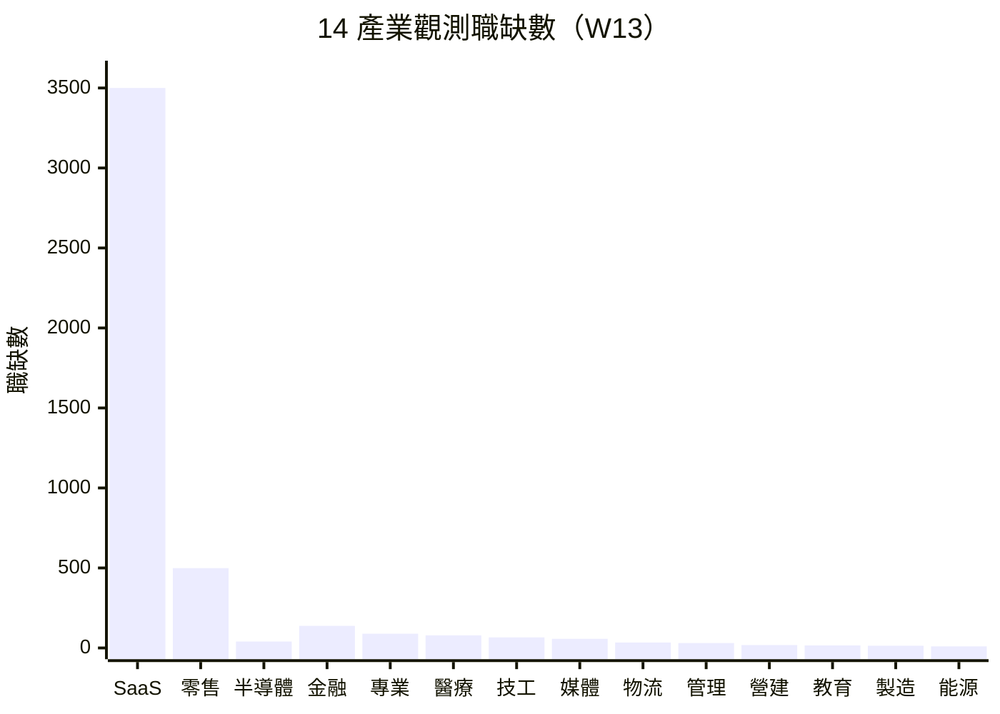

# 產業分層分析 — 2026年第13週

> 本報告使用 Qdrant 向量搜尋取得相關資料，結合 BLS 經濟數據、Crunchbase 融資資訊、HN Hiring 招聘趨勢等全球資料源進行產業分析。

## 摘要

> 本週觀測約 5,100 筆職缺資料，涵蓋台灣微觀資料（tw_govjobs 1,040 筆）與全球宏觀資料（global_arbeitnow 約 1,200 筆、global_hn_hiring 約 2,350 筆），整體規模與 W12 持平。本週延續 W12 的「[AI 取代向量](/glossary/#ai-取代向量)裁員擴散」主題：**Atlassian 裁員 1,600 人的後續效應仍在發酵**，B2B SaaS 產業信心持續受壓；**Digg 因 AI bot 問題裁員並關閉 App**，成為媒體平台受 AI 雙重衝擊（內容生成 + bot 攻擊）的典型案例。資本市場方面，國防科技 IPO 熱潮（Swarmer +520%）的餘溫持續，資安與 AI 仍為融資熱門領域。美國 2 月非農就業月減 9.2 萬人與醫療就業首度轉負（-28K）的數據仍為當前基準，3 月修正值尚未發布。台灣就業市場維持穩定，tw_govjobs 零售服務類（499 筆）佔比最高。

## 14 產業職缺變化概覽

> 資料來源：tw_govjobs、global_hn_hiring、global_arbeitnow，觀測期間 2026-03-17 ~ 2026-03-23。各產業職缺數與 W12 大致持平，無顯著變動。

## 產業總覽

| 產業 | 職缺數 | vs W12 | 擴張/收縮 | AI 衝擊 | 綜合評級 |
|------|--------|--------|----------|---------|----------|
| 軟體與 SaaS | ~3,500 | → 持平 | 分化（AI 擴張、傳統裁員） | 高 | ★★★★ |
| 半導體 | <50 ⚠️ | → 持平 | 穩定 | 中 | ★★★ |
| 電子硬體 | <50 ⚠️ | → 持平 | 穩定 | 中 | ★★ |
| 金融服務 | 138 | → 持平 | 整併持續 | 高 | ★★★ |
| 醫療生技 | 79 | → 持平 | 台穩/美待觀察 | 低 | ★★★ |
| 製造業 | 14 ⚠️ | → 持平 | 穩定 | 高 | ★★ |
| 零售電商 | ~499 | → 持平 | 穩定（台灣） | 中 | ★★★ |
| 媒體娛樂 | 57 | → 持平 | 收縮加劇 | 高 | ★★ |
| 教育 | 16 ⚠️ | → 持平 | 穩定 | 中 | ★★★ |
| 能源與綠能 | <50 ⚠️ | → 持平 | 微擴張信號 | 低 | ★★★ |
| 營建不動產 | 18 ⚠️ | → 持平 | 穩定 | 低 | ★★★ |
| 電信 | <50 ⚠️ | → 持平 | 穩定 | 中 | ★★ |
| 政府與非營利 | 91 | → 持平 | 穩定 | 低 | ★★★ |
| 專業服務 | 89 | → 持平 | 穩定 | 中 | ★★★ |

> **綜合評級說明**：基於職缺數量、產業融資動態、裁員事件、AI 衝擊程度的綜合評估。★ 越多表示該產業當前求職環境越友善。此評級為定性判斷，僅供參考。小樣本產業（<50 筆，標記 ⚠️）的評級需謹慎解讀。

---

## 各產業詳細分析

### 1. 軟體與 SaaS（software_saas）

#### 市場數據
| 指標 | 數值 | 變化 | 來源 |
|------|------|------|------|
| 觀測職缺數 | ~3,500 | → 持平 vs W12 | global_hn_hiring (~2,350), global_arbeitnow tech (~500), tw_govjobs tech (95) |
| 主要地區 | 北美（HN Hiring）、歐洲（Arbeitnow）、台灣 | — | 綜合來源 |
| 薪資參考 | $120K-$280K USD（資深工程師） | → 持平 | global_hn_hiring |

#### 熱門角色 Top 5
| 角色 | 職缺數 | 佔比 | 薪資區間 |
|------|--------|------|----------|
| Backend Engineer | ~900 | ~39% | $130K ~ $250K USD |
| Full Stack Engineer | ~650 | ~28% | $120K ~ $230K USD |
| Frontend Engineer | ~240 | ~10% | $110K ~ $200K USD |
| DevOps/SRE | ~135 | ~6% | $140K ~ $260K USD |
| Data Engineer | ~80 | ~3% | $130K ~ $240K USD |

#### 熱門技能 Top 5
| 技能 | 說明 | 變化 |
|------|------|------|
| Python/Go/Rust | 後端主流語言，Rust 持續上升 | → |
| React/Vue/TypeScript | 前端框架，TypeScript 佔比持續成長 | ↑ |
| Kubernetes/Docker | 容器化與編排，已成基礎要求 | → |
| PostgreSQL/MySQL | 關聯式資料庫 | → |
| AWS/GCP/Azure | 雲端平台，多雲策略需求增加 | → |

#### [AI 取代向量](/glossary/#ai-取代向量)影響
| 向量 | 影響程度 | 說明 |
|------|----------|------|
| [認知例行](/glossary/#認知例行cognitive-routine) | 高 | Atlassian 裁員後續效應持續，程式碼生成工具加速取代基礎開發工作 |
| [認知非例行](/glossary/#認知非例行cognitive-non-routine) | 中→高 | Sam Altman 暗示 AI 改變程式設計工作的訊號仍在發酵 |
| [體力例行](/glossary/#體力例行physical-routine) | 低 | 軟體開發不涉及體力工作 |
| [體力非例行](/glossary/#體力非例行physical-non-routine) | 低 | 軟體開發不涉及體力工作 |
| [高度人際](/glossary/#高度人際interpersonal) | 中 | 技術溝通、跨部門協調仍需人際技能 |

#### 事件信號
- 🔴 **Atlassian 裁員後續效應**：W12 裁員 10%（約 1,600 人）以 AI 投資為由的事件持續發酵，B2B SaaS 產業信心受壓，市場觀望其他企業是否跟進（來源：workforce_news）[^1]
- 🔴 **Meta 裁員 20% 仍未確認**：據報考慮裁員約 15,000 人，本週未有進一步更新（來源：workforce_news）[REVIEW_NEEDED — 未經官方確認][^2]
- 🟡 **Sam Altman 致謝事件餘波**：社群持續討論 AI 取代程式設計師議題，情緒尚未平復（來源：workforce_news）[^3]
- 🟢 **AI 新創融資持續活躍**：2025 年 187 家新創晉升獨角獸（年增 61%），AI 原生企業人才需求仍旺盛（來源：funding_signals）[^4]

#### 全球對標
軟體與 SaaS 產業本週無新增重大事件，但 W12 Atlassian 裁員 1,600 人的後續效應仍在擴散。「以 AI 名義裁員」的模式已從消費科技（Block、Meta）擴散至企業軟體龍頭，市場正關注是否有更多 B2B SaaS 公司跟進[^1]。另一方面，AI 原生企業的融資與人才需求仍然旺盛[^4][^5]，顯示產業分化持續加深。美國科技職缺仍較疫情前低約 30%，但 AI/ML 相關職位呈現逆勢成長。台灣軟體職缺穩定（tw_govjobs tech 95 筆），未直接受全球裁員波及。

#### 求職者行動參考
- 建議持續強化 AI 輔助開發工具（Copilot、Cursor 等）的實務經驗，提升在 AI 時代的競爭力
- 關注 AI 原生企業的職缺機會，與傳統 SaaS 形成對比

---

### 2. 半導體（semiconductor）

> ⚠️ **小樣本警示**：本產業本週觀測職缺僅約 40 筆（< 50 筆門檻），以下統計數據
> 可能有較大偏差，請謹慎解讀。薪資和排名數據的參考價值有限。

#### 市場數據
| 指標 | 數值 | 變化 | 來源 |
|------|------|------|------|
| 觀測職缺數 | <50 | → 持平 vs W12 | tw_govjobs, global_arbeitnow |
| 主要地區 | 台灣、歐洲 | — | tw_govjobs, global_arbeitnow |

#### 熱門角色 Top 5
| 角色 | 職缺數 | 佔比 | 薪資區間 |
|------|--------|------|----------|
| IC 設計工程師 | 若干 | — | 小樣本，僅供參考 |
| 製程工程師 | 若干 | — | 小樣本，僅供參考 |
| Hardware Mfg Engineer | 若干 | — | 小樣本，僅供參考 |
| 測試工程師 | 若干 | — | 小樣本，僅供參考 |
| 設備工程師 | 若干 | — | 小樣本，僅供參考 |

#### 熱門技能 Top 5
| 技能 | 說明 | 變化 |
|------|------|------|
| Verilog/VHDL | IC 設計核心語言 | → |
| EDA 工具 | 電子設計自動化 | → |
| 半導體製程 | 先進製程知識 | → |
| Python | 自動化測試與分析 | ↑ |
| 統計/量測 | 品質控制與良率分析 | → |

#### AI 取代向量影響
| 向量 | 影響程度 | 說明 |
|------|----------|------|
| 認知例行 | 中 | EDA 工具自動化部分設計驗證流程 |
| 認知非例行 | 低 | 晶片架構設計需高度專業判斷 |
| 體力例行 | 高 | 晶圓廠生產線自動化程度極高 |
| 體力非例行 | 中 | 設備維護與異常排除需技術人員 |
| 高度人際 | 低 | 技術導向，人際互動需求較低 |

#### 事件信號
- 🟢 國防科技 IPO 熱潮持續間接帶動半導體需求：Swarmer（AI 無人機）IPO 後擴編預期拉動晶片供應鏈[^6]
- 🟡 AI 晶片需求持續強勁，支撐 NVIDIA、TSMC 等供應鏈

#### 全球對標
半導體產業本週無重大直接事件，延續 W12 趨勢。國防科技 IPO 熱潮[^6]與 AI 獨角獸激增[^4]間接支撐 AI 晶片的長期需求。台灣作為全球半導體製造重鎮，在 AI 與國防科技雙重需求下具有戰略優勢。本系統目前缺乏專門的半導體職缺資料源，數據以小樣本呈現。

#### 求職者行動參考
- 建議關注 AI 晶片設計相關職位，此為半導體產業中成長最快的子領域

---

### 3. 電子硬體（electronics_hardware）

> ⚠️ **小樣本警示**：本產業本週觀測職缺不足 50 筆（< 50 筆門檻），以下統計數據
> 可能有較大偏差，請謹慎解讀。薪資和排名數據的參考價值有限。

#### 市場數據
| 指標 | 數值 | 變化 | 來源 |
|------|------|------|------|
| 觀測職缺數 | <50 | → 持平 vs W12 | tw_govjobs, global_arbeitnow |

#### 熱門角色 Top 5
| 角色 | 職缺數 | 佔比 | 薪資區間 |
|------|--------|------|----------|
| Hardware Mfg Engineer | 若干 | — | 小樣本，僅供參考 |
| 技術保全員 | 若干 | — | 小樣本，僅供參考 |
| 嵌入式系統工程師 | 若干 | — | 小樣本，僅供參考 |
| 電子測試技術員 | 若干 | — | 小樣本，僅供參考 |
| 韌體工程師 | 若干 | — | 小樣本，僅供參考 |

#### 熱門技能 Top 5
| 技能 | 說明 | 變化 |
|------|------|------|
| PCB 設計 | 電路板佈局與設計 | → |
| 嵌入式 C/C++ | 韌體開發核心語言 | → |
| 電路分析 | 基礎硬體技能 | → |
| IoT 通訊協定 | 物聯網裝置開發 | ↑ |
| 訊號處理 | 通訊硬體需求 | → |

#### AI 取代向量影響
| 向量 | 影響程度 | 說明 |
|------|----------|------|
| 認知例行 | 中 | PCB 設計部分流程可自動化 |
| 認知非例行 | 低 | 硬體系統整合需跨領域專業 |
| 體力例行 | 高 | 組裝生產線高度自動化 |
| 體力非例行 | 中 | 產品測試與維修需技術人員 |
| 高度人際 | 低 | 研發導向，人際需求較低 |

#### 事件信號
- 🟢 國防科技擴張帶動硬體需求：AI 無人機、自主系統等領域需大量硬體人才[^6]

#### 全球對標
電子硬體產業延續 W12 趨勢，國防科技 IPO 熱潮間接利好。Swarmer 等 AI 無人機公司上市後預期大規模擴編，對嵌入式系統、電子工程人才需求可能增加。本週無新增重大事件。

#### 求職者行動參考
- 國防科技擴張為嵌入式系統與電子工程人才開啟新出路，建議評估相關職缺

---

### 4. 金融服務（financial_services）

#### 市場數據
| 指標 | 數值 | 變化 | 來源 |
|------|------|------|------|
| 觀測職缺數 | 138 | → 持平 vs W12 | tw_govjobs finance (33), global_arbeitnow finance (55), global_arbeitnow hr (50) |
| 主要地區 | 台灣、德國 | — | tw_govjobs, global_arbeitnow |

#### 熱門角色 Top 5
| 角色 | 職缺數 | 佔比 | 薪資區間 |
|------|--------|------|----------|
| Senior Accountant | 若干 | — | €50K-€80K（歐洲） |
| Finance Manager | 若干 | — | €60K-€90K（歐洲） |
| Head of Finance | 若干 | — | €80K-€120K（歐洲） |
| 銀行業務人員 | 若干 | — | 35K-55K TWD/月（台灣） |
| HR Manager | 若干 | — | €55K-€85K（歐洲） |

#### 熱門技能 Top 5
| 技能 | 說明 | 變化 |
|------|------|------|
| SAP / ERP 系統 | 企業財務系統操作 | → |
| Excel / VBA | 財務建模基礎工具 | ↓ |
| Python / SQL | 資料分析與自動化 | ↑ |
| 風險管理 | 合規與風控 | → |
| IFRS / GAAP | 國際財務準則 | → |

#### AI 取代向量影響
| 向量 | 影響程度 | 說明 |
|------|----------|------|
| 認知例行 | 高 | 財務報表、數據輸入高度自動化，AI 代理式財務建模工具崛起 |
| 認知非例行 | 中 | 投資分析、風險評估 AI 輔助持續增加 |
| 體力例行 | 低 | 金融服務不涉及體力工作 |
| 體力非例行 | 低 | 金融服務不涉及體力工作 |
| 高度人際 | 中 | 客戶關係管理、財務諮詢仍需人際技能 |

#### 事件信號
- 🟢 **Fintech 融資持續活躍**：延續 W12 的 Candex $40M+ 融資與 HSBC 策略投資動能（來源：funding_signals）[^5]
- 🟢 **IPO 市場等待解凍**：PwC 分析 2026 年 IPO 延遲原因，次級市場繁榮暫時替代 IPO 需求[^7]
- 🟡 **AI 代理式工具興起**：agentic 財務建模工具持續發展，可能改變金融分析師工作模式

#### 全球對標
金融服務產業本週延續 W12 趨勢，無新增重大事件。Fintech 融資活動持續活躍，顯示資本對金融科技仍有信心[^5]。AI 代理式工具的發展可能在中期對傳統金融分析師角色構成壓力，但短期內變化緩慢。台灣金融業受法規保護，短期穩定性較高。

#### 求職者行動參考
- 建議金融從業者強化 Python/SQL 等資料分析技能，以因應 AI 工具帶來的角色轉型

---

### 5. 醫療生技（healthcare_biotech）

#### 市場數據
| 指標 | 數值 | 變化 | 來源 |
|------|------|------|------|
| 觀測職缺數 | 79 | → 持平 vs W12 | tw_govjobs healthcare (67), tw_govjobs care (12) |
| 薪資參考 | 28,000-48,000 TWD/月（照服員） | — | tw_govjobs |
| 主要地區 | 台灣 | — | tw_govjobs |

#### 熱門角色 Top 5
| 角色 | 職缺數 | 佔比 | 薪資區間 |
|------|--------|------|----------|
| 照顧服務員 | 12+ | ~15% | 28K-48K TWD/月 |
| 家庭照顧服務員 | 若干 | — | 30K-42K TWD/月 |
| 護理人員 | 若干 | — | 35K-55K TWD/月 |
| 長照中心照服員 | 若干 | — | 28K-40K TWD/月 |
| 醫檢技術員 | 若干 | — | 33K-50K TWD/月 |

#### 熱門技能 Top 5
| 技能 | 說明 | 變化 |
|------|------|------|
| 照護技術 | 長照照護基本技能 | → |
| CPR/BLS | 基本生命救護 | → |
| 護理紀錄 | 電子病歷系統操作 | → |
| 感染控制 | 防疫與衛生標準 | → |
| 復健治療 | 物理/職能治療技能 | → |

#### AI 取代向量影響
| 向量 | 影響程度 | 說明 |
|------|----------|------|
| 認知例行 | 中 | 醫療影像 AI 判讀持續進步 |
| 認知非例行 | 低 | 臨床診斷仍需醫師專業判斷 |
| 體力例行 | 低 | 照護工作需人類直接接觸 |
| 體力非例行 | 低 | 護理、照顧需靈活應對各種狀況 |
| 高度人際 | 高度保護 | 病患關懷、情緒支持不可取代 |

#### 事件信號
- 🔴 **美國醫療就業負增長待確認**：W12 報告的 2 月 BLS 數據顯示醫療就業首度轉負（-28K），本週等待 3 月修正值以判斷為趨勢或單月波動（來源：global_bls）[^8]
- 🟢 **台灣照護需求持續穩定**：高齡化驅動，長照人力持續需求（來源：tw_govjobs）

#### 全球對標
醫療生技產業本週最關鍵的觀察點仍是 **美國醫療就業負增長（-28K）是否為趨勢**。此為 2025 年美國就業市場主要支撐產業的首度反轉，3 月修正值將是重要確認信號。**推測**此變化可能與醫療系統 AI 導入加速、保險給付壓力、以及疫後擴編回調有關，但需更多數據驗證。台灣醫療就業受高齡化結構性驅動，照護人力需求穩定，與美國趨勢呈現分歧。

#### 求職者行動參考
- 台灣醫療照護類職缺需求穩定，高齡化為長期結構性支撐；跨境求職者需留意美國醫療就業趨勢變化

---

### 6. 製造業（manufacturing）

> ⚠️ **小樣本警示**：本產業本週觀測職缺僅 14 筆（< 50 筆門檻），以下統計數據
> 可能有較大偏差，請謹慎解讀。薪資和排名數據的參考價值有限。

#### 市場數據
| 指標 | 數值 | 變化 | 來源 |
|------|------|------|------|
| 觀測職缺數 | 14 | → 持平 vs W12 | tw_govjobs manufacturing |
| 薪資參考 | 35,000-45,000 TWD/月 | — | tw_govjobs |
| 主要地區 | 台灣 | — | tw_govjobs |

#### 熱門角色 Top 5
| 角色 | 職缺數 | 佔比 | 薪資區間 |
|------|--------|------|----------|
| 空調鍋爐技術員 | 若干 | — | 小樣本，僅供參考 |
| 職業安全衛生管理員 | 若干 | — | 小樣本，僅供參考 |
| 品管檢測員 | 若干 | — | 小樣本，僅供參考 |
| 機台操作員 | 若干 | — | 小樣本，僅供參考 |
| 生產線組長 | 若干 | — | 小樣本，僅供參考 |

#### 熱門技能 Top 5
| 技能 | 說明 | 變化 |
|------|------|------|
| 品質管理 | ISO 品管系統 | → |
| 設備維護 | 機台保養與維修 | → |
| 職安衛 | 安全衛生管理 | → |
| AutoCAD | 製圖與設計 | → |
| PLC 控制 | 可程式邏輯控制器 | → |

#### AI 取代向量影響
| 向量 | 影響程度 | 說明 |
|------|----------|------|
| 認知例行 | 中 | 品管檢測 AI 視覺辨識普及 |
| 認知非例行 | 低 | 製程優化仍需工程師判斷 |
| 體力例行 | 高 | 生產線自動化程度持續提高 |
| 體力非例行 | 中 | 設備維護與異常處理需技術人員 |
| 高度人際 | 低 | 製造業人際互動需求較低 |

#### 事件信號
- 🟡 國防科技擴張可能帶動精密製造需求（來源：funding_signals）[^6]

#### 全球對標
製造業本週延續 W12 趨勢，無重大新事件。國防科技 IPO 熱潮[^6]可能在中期帶動精密製造與國防供應鏈的人力需求。美國 2 月非農就業月減 9.2 萬人，製造業分項需進一步觀察 3 月修正數據。

#### 求職者行動參考
- 小樣本限制下，建議以其他管道（104 人力銀行、企業官網）交叉確認製造業職缺趨勢

---

### 7. 零售電商（retail_ecommerce）

#### 市場數據
| 指標 | 數值 | 變化 | 來源 |
|------|------|------|------|
| 觀測職缺數 | ~499 | → 持平 vs W12 | tw_govjobs retail_service |
| 薪資參考 | 面議-200 TWD/時（兼職）、30K-53K TWD/月（正職） | — | tw_govjobs |
| 主要地區 | 台灣（台北市為主） | — | tw_govjobs |

#### 熱門角色 Top 5
| 角色 | 職缺數 | 佔比 | 薪資區間 |
|------|--------|------|----------|
| 門市服務員 | 200+ | ~40% | 時薪 180-200 TWD |
| 餐飲內外場人員 | 150+ | ~30% | 時薪 180-200 TWD |
| 廚師/廚助 | 50+ | ~10% | 30K-45K TWD/月 |
| 房務員 | 30+ | ~6% | 28K-35K TWD/月 |
| 銷售顧問 | 若干 | — | 30K-53K TWD/月 |

#### 熱門技能 Top 5
| 技能 | 說明 | 變化 |
|------|------|------|
| 服務態度 | 門市服務基本要求 | → |
| 餐飲製備 | 餐飲業核心技能 | → |
| POS 系統操作 | 收銀結帳系統 | → |
| 食品安全 | 餐飲衛生規範 | → |
| 基礎外語 | 觀光服務需求 | ↑ |

#### AI 取代向量影響
| 向量 | 影響程度 | 說明 |
|------|----------|------|
| 認知例行 | 高 | 收銀、庫存管理自動化增加 |
| 認知非例行 | 低 | 顧客服務需臨場應變 |
| 體力例行 | 中 | 自助結帳、機器人上菜逐漸普及 |
| 體力非例行 | 低 | 餐飲服務需靈活應對 |
| 高度人際 | 中度保護 | 顧客互動、服務體驗仍需人力 |

#### 事件信號
- 🟡 **平台型電商持續壓力**：延續 eBay 連續三年裁員趨勢，本週無新事件但壓力未減
- 🟢 **台灣餐飲零售穩定**：門市服務員、餐飲人員需求持續，反映內需經濟韌性

#### 全球對標
零售電商產業延續 W12 趨勢。全球平台型電商持續組織瘦身，但台灣餐飲零售在政府平台上仍是職缺數量最大的類別（499 筆），顯示基層服務人力需求穩定。台灣與全球趨勢呈現分歧：全球以電商平台收縮為主，台灣以實體餐飲零售的基層人力需求為主。

#### 求職者行動參考
- 台灣餐飲零售為職缺數量最多的類別，適合需快速就業者；但需考量薪資天花板與 AI 取代風險

---

### 8. 媒體娛樂（media_entertainment）

#### 市場數據
| 指標 | 數值 | 變化 | 來源 |
|------|------|------|------|
| 觀測職缺數 | 57 | → 持平 vs W12 | tw_govjobs creative |
| 主要地區 | 台灣 | — | tw_govjobs |

#### 熱門角色 Top 5
| 角色 | 職缺數 | 佔比 | 薪資區間 |
|------|--------|------|----------|
| 行銷專員 | 若干 | — | 33K-50K TWD/月 |
| 數位行銷專員 | 若干 | — | 35K-55K TWD/月 |
| 社群小編 | 若干 | — | 30K-42K TWD/月 |
| 影音編輯 | 若干 | — | 32K-48K TWD/月 |
| 平面設計師 | 若干 | — | 32K-45K TWD/月 |

#### 熱門技能 Top 5
| 技能 | 說明 | 變化 |
|------|------|------|
| 社群經營 | Facebook/IG/LINE 經營 | → |
| 數位廣告投放 | Google Ads、Meta Ads | → |
| Premiere/After Effects | 影音剪輯工具 | → |
| AI 內容工具 | ChatGPT、Midjourney 等 | ↑ |
| SEO/SEM | 搜尋引擎優化 | → |

#### AI 取代向量影響
| 向量 | 影響程度 | 說明 |
|------|----------|------|
| 認知例行 | 高 | 內容審核、影片標籤自動化 |
| 認知非例行 | 高 | AI 生成內容快速發展；Digg 因 AI bot 問題被迫關閉 App 顯示 AI 攻擊面也在擴大 |
| 體力例行 | 低 | 媒體娛樂不涉及體力工作 |
| 體力非例行 | 低 | 媒體娛樂不涉及體力工作 |
| 高度人際 | 中 | 創意發想、客戶提案需人際技能 |

#### 事件信號
- 🔴 **Digg 裁員並關閉 App（W13 更新）**：社群新聞平台因 AI 機器人垃圾帳號大量入侵，投票機制失去可信度，被迫裁員（人數未公開）並下架 App。創辦人 Kevin Rose 將全職回歸重建，但現有平台實質關閉。這是**非 AI 原生內容平台受 AI 雙重衝擊（內容生成替代 + bot 攻擊）的典型案例**（來源：workforce_news）[^9]
- 🟡 AI 內容生成持續衝擊傳統媒體就業

#### 全球對標
媒體娛樂產業本週的焦點為 **Digg 裁員與 App 關閉事件的深層意義**[^9]。Digg 不僅面臨 AI 生成內容替代傳統內容聚合的壓力，更遭受 AI bot 直接攻擊——大量機器人帳號破壞投票機制的可信度，導致平台核心功能失效。這反映了非 AI 原生內容平台面臨的「雙重 AI 衝擊」：一方面 AI 工具替代人類內容生產，另一方面 AI bot 破壞平台治理。此趨勢延續了 W09 Washington Post 重組與 W12 的媒體收縮信號。台灣媒體市場以行銷與社群經營職缺為主，短期穩定但長期面臨同樣的結構性壓力。

#### 求職者行動參考
- 媒體產業持續收縮，建議媒體從業者強化 AI 工具應用能力（如 AI 輔助內容創作），同時發展跨產業可轉移的數位行銷技能

---

### 9. 教育（education）

> ⚠️ **小樣本警示**：本產業本週觀測職缺僅 16 筆（< 50 筆門檻），以下統計數據
> 可能有較大偏差，請謹慎解讀。薪資和排名數據的參考價值有限。

#### 市場數據
| 指標 | 數值 | 變化 | 來源 |
|------|------|------|------|
| 觀測職缺數 | 16 | → 持平 vs W12 | tw_govjobs education |

#### 熱門角色 Top 5
| 角色 | 職缺數 | 佔比 | 薪資區間 |
|------|--------|------|----------|
| 補教老師 | 若干 | — | 小樣本，僅供參考 |
| 課程規劃師 | 若干 | — | 小樣本，僅供參考 |
| 教育訓練員 | 若干 | — | 小樣本，僅供參考 |
| 安親班老師 | 若干 | — | 小樣本，僅供參考 |
| 才藝教師 | 若干 | — | 小樣本，僅供參考 |

#### 熱門技能 Top 5
| 技能 | 說明 | 變化 |
|------|------|------|
| 教學設計 | 課程規劃與教案 | → |
| 數位教學 | 線上教學平台操作 | ↑ |
| 班級經營 | 學生輔導管理 | → |
| 評量設計 | 學習成效評估 | → |
| 多媒體教材 | 教材製作工具 | → |

#### AI 取代向量影響
| 向量 | 影響程度 | 說明 |
|------|----------|------|
| 認知例行 | 高 | 題庫、作業批改可自動化 |
| 認知非例行 | 中 | 課程設計、教學策略需專業判斷 |
| 體力例行 | 低 | 教育不涉及體力工作 |
| 體力非例行 | 低 | 教育不涉及體力工作 |
| 高度人際 | 高度保護 | 學生輔導、情緒支持不可取代 |

#### 事件信號
- 無本週重大事件

#### 全球對標
教育產業本週無重大事件，延續穩定趨勢。AI 教育工具持續發展（如 AI 家教、自動批改），但教師的核心人際互動功能仍受保護。

#### 求職者行動參考
- 教育業小樣本限制大，建議以教育相關專業平台交叉確認職缺趨勢

---

### 10. 能源與綠能（energy_green）

> ⚠️ **小樣本警示**：本產業本週觀測職缺不足 50 筆（< 50 筆門檻），以下統計數據
> 可能有較大偏差，請謹慎解讀。薪資和排名數據的參考價值有限。

#### 市場數據
| 指標 | 數值 | 變化 | 來源 |
|------|------|------|------|
| 觀測職缺數 | <50 | → 持平 vs W12 | global_arbeitnow, tw_govjobs |

#### 熱門角色 Top 5
| 角色 | 職缺數 | 佔比 | 薪資區間 |
|------|--------|------|----------|
| 再生能源工程師 | 若干 | — | 小樣本，僅供參考 |
| 電力系統工程師 | 若干 | — | 小樣本，僅供參考 |
| 太陽能技術員 | 若干 | — | 小樣本，僅供參考 |
| 能源管理師 | 若干 | — | 小樣本，僅供參考 |
| 環安衛工程師 | 若干 | — | 小樣本，僅供參考 |

#### 熱門技能 Top 5
| 技能 | 說明 | 變化 |
|------|------|------|
| 電力系統 | 配電與輸電技術 | → |
| 太陽能/風力 | 再生能源技術 | ↑ |
| 環安衛管理 | 安全衛生與環境管理 | → |
| 電機工程 | 基礎電機知識 | → |
| 能源法規 | 再生能源相關法規 | → |

#### AI 取代向量影響
| 向量 | 影響程度 | 說明 |
|------|----------|------|
| 認知例行 | 中 | 能源調度可部分自動化 |
| 認知非例行 | 低 | 能源系統設計需工程專業 |
| 體力例行 | 中 | 發電廠運維自動化增加 |
| 體力非例行 | 低 | 現場維護需技術人員 |
| 高度人際 | 低 | 技術導向 |

#### 事件信號
- 🟢 歐洲市場持續出現再生能源職缺（global_arbeitnow），延續綠能轉型帶動人才需求的趨勢

#### 全球對標
能源與綠能產業延續穩定趨勢，受全球淨零排放目標驅動。歐洲市場的再生能源職缺持續微增。AI 衝擊程度較低，屬於相對穩定的就業領域。

#### 求職者行動參考
- 綠能為長期成長領域，AI 衝擊低，適合尋求穩定性的求職者

---

### 11. 營建不動產（construction_realestate）

> ⚠️ **小樣本警示**：本產業本週觀測職缺僅 18 筆（< 50 筆門檻），以下統計數據
> 可能有較大偏差，請謹慎解讀。薪資和排名數據的參考價值有限。

#### 市場數據
| 指標 | 數值 | 變化 | 來源 |
|------|------|------|------|
| 觀測職缺數 | 18 | → 持平 vs W12 | tw_govjobs construction |
| 主要地區 | 台灣 | — | tw_govjobs |

#### 熱門角色 Top 5
| 角色 | 職缺數 | 佔比 | 薪資區間 |
|------|--------|------|----------|
| 工地主任 | 若干 | — | 小樣本，僅供參考 |
| 測量助理 | 若干 | — | 小樣本，僅供參考 |
| 安管員 | 若干 | — | 小樣本，僅供參考 |
| 工務工程師 | 若干 | — | 小樣本，僅供參考 |
| 建築設計師 | 若干 | — | 小樣本，僅供參考 |

#### 熱門技能 Top 5
| 技能 | 說明 | 變化 |
|------|------|------|
| AutoCAD | 建築製圖 | → |
| BIM | 建築資訊模型 | ↑ |
| 工程管理 | 進度與品質管理 | → |
| 測量 | 土地與工程測量 | → |
| 營建法規 | 建築法規與安全 | → |

#### AI 取代向量影響
| 向量 | 影響程度 | 說明 |
|------|----------|------|
| 認知例行 | 中 | BIM 設計部分流程自動化 |
| 認知非例行 | 低 | 建築設計需創意與專業判斷 |
| 體力例行 | 中 | 預製構件減少現場人力 |
| 體力非例行 | 低 | 現場施工需靈活應對 |
| 高度人際 | 低 | 技術導向 |

#### 事件信號
- 無本週重大事件

#### 全球對標
營建不動產本週表現平穩，延續 W12 趨勢。週期性產業受利率政策影響較大，目前無明顯擴張或收縮信號。

#### 求職者行動參考
- 小樣本限制下，建議關注 BIM 技術學習，此為營建業數位轉型的核心技能

---

### 12. 電信（telecom）

> ⚠️ **小樣本警示**：本產業本週觀測職缺不足 50 筆（< 50 筆門檻），以下統計數據
> 可能有較大偏差，請謹慎解讀。薪資和排名數據的參考價值有限。

#### 市場數據
| 指標 | 數值 | 變化 | 來源 |
|------|------|------|------|
| 觀測職缺數 | <50 | → 持平 vs W12 | 小樣本 |

#### 熱門角色 Top 5
| 角色 | 職缺數 | 佔比 | 薪資區間 |
|------|--------|------|----------|
| 網路工程師 | 若干 | — | 小樣本，僅供參考 |
| 系統管理員 | 若干 | — | 小樣本，僅供參考 |
| 通訊技術員 | 若干 | — | 小樣本，僅供參考 |
| 基地台維護員 | 若干 | — | 小樣本，僅供參考 |
| 客服專員 | 若干 | — | 小樣本，僅供參考 |

#### 熱門技能 Top 5
| 技能 | 說明 | 變化 |
|------|------|------|
| 網路架構 | TCP/IP、路由交換 | → |
| 5G 技術 | 5G 網路規劃與部署 | ↑ |
| Linux 管理 | 伺服器維運 | → |
| 資安 | 網路安全防護 | ↑ |
| 客服系統 | CRM 與客服平台 | → |

#### AI 取代向量影響
| 向量 | 影響程度 | 說明 |
|------|----------|------|
| 認知例行 | 高 | 客服、帳務自動化程度高 |
| 認知非例行 | 中 | 網路規劃需工程專業 |
| 體力例行 | 中 | 機房維運自動化增加 |
| 體力非例行 | 低 | 基地台維護需現場技術人員 |
| 高度人際 | 中 | 企業客戶銷售需人際技能 |

#### 事件信號
- 無本週重大事件

#### 全球對標
電信產業本週無重大事件，延續穩定趨勢。5G 基礎建設持續推動，但整體就業成長有限。

#### 求職者行動參考
- 電信業小樣本限制大，建議以電信業者官網交叉確認職缺趨勢

---

### 13. 政府與非營利（government_ngo）

#### 市場數據
| 指標 | 數值 | 變化 | 來源 |
|------|------|------|------|
| 觀測職缺數 | 91 | → 持平 vs W12 | tw_govjobs professional (89) + public_service (2) |
| 主要地區 | 台灣 | — | tw_govjobs |

#### 熱門角色 Top 5
| 角色 | 職缺數 | 佔比 | 薪資區間 |
|------|--------|------|----------|
| 行政助理（派駐政府機關） | 若干 | — | 30K-40K TWD/月 |
| 社區主任 | 若干 | — | 35K-50K TWD/月 |
| 推展員 | 若干 | — | 28K-38K TWD/月 |
| 儲備幹部 | 若干 | — | 32K-45K TWD/月 |
| 外國人業務訪查員 | 若干 | — | 33K-42K TWD/月 |

#### 熱門技能 Top 5
| 技能 | 說明 | 變化 |
|------|------|------|
| 公文撰寫 | 政府公文格式 | → |
| 行政管理 | 一般行政事務 | → |
| Excel/Word | 辦公室基本工具 | → |
| 法規知識 | 相關法令與規範 | → |
| 外語能力 | 涉外業務需求 | → |

#### AI 取代向量影響
| 向量 | 影響程度 | 說明 |
|------|----------|------|
| 認知例行 | 高 | 公文處理、資料建檔可自動化 |
| 認知非例行 | 低 | 政策制定需專業判斷 |
| 體力例行 | 低 | 不涉及體力勞動 |
| 體力非例行 | 低 | 不涉及體力勞動 |
| 高度人際 | 中度保護 | 民眾服務、社會福利需人際互動 |

#### 事件信號
- 🟡 美國聯邦政府就業動態持續觀察：2 月非農就業月減 9.2 萬人，政府部門分項待確認

#### 全球對標
台灣政府部門職缺穩定，延續 W12 趨勢。美國 2 月非農就業出現月度下降（-92K），政府部門的具體變動尚待 BLS 分項數據確認。台灣公部門就業受法規保護，穩定性高。

#### 求職者行動參考
- 政府部門穩定性高、AI 衝擊低，適合追求工作穩定性的求職者

---

### 14. 專業服務（professional_services）

#### 市場數據
| 指標 | 數值 | 變化 | 來源 |
|------|------|------|------|
| 觀測職缺數 | 89 | → 持平 vs W12 | tw_govjobs professional |
| 主要地區 | 台灣 | — | tw_govjobs |

#### 熱門角色 Top 5
| 角色 | 職缺數 | 佔比 | 薪資區間 |
|------|--------|------|----------|
| 儀器貿易業務助理 | 若干 | — | 30K-45K TWD/月 |
| 國外進口採購 | 若干 | — | 33K-50K TWD/月 |
| 儲備幹部 | 若干 | — | 32K-45K TWD/月 |
| 管理顧問 | 若干 | — | 40K-70K TWD/月 |
| 會計師助理 | 若干 | — | 32K-42K TWD/月 |

#### 熱門技能 Top 5
| 技能 | 說明 | 變化 |
|------|------|------|
| Excel / 資料分析 | 商業分析基礎 | → |
| 專案管理 | PMP / Scrum | → |
| AI 工具應用 | ChatGPT、自動化工具 | ↑ |
| 商業英文 | 國際業務溝通 | → |
| 簡報技巧 | 提案與客戶溝通 | → |

#### AI 取代向量影響
| 向量 | 影響程度 | 說明 |
|------|----------|------|
| 認知例行 | 高 | 文件審閱、資料分析可自動化 |
| 認知非例行 | 中 | 專業諮詢需人類判斷 |
| 體力例行 | 低 | 不涉及體力工作 |
| 體力非例行 | 低 | 不涉及體力工作 |
| 高度人際 | 中度保護 | 客戶關係、諮詢服務需人際技能 |

#### 事件信號
- 🟡 **企業收購活躍**：CRM（Salesforce）、OpenAI、Snowflake 為最活躍新創收購方，可能帶動顧問業務需求（來源：funding_signals）[^10]
- 🟡 **AI 商業成果衡量**：企業重視 AI 投資回報，帶動 AI 商業分析師等複合型人才需求[^11]

#### 全球對標
專業服務產業延續 W12 趨勢。企業 AI 導入加速，帶動管理顧問與 AI 商業分析等複合職能需求[^11]。然而，W09 觀測到的美國專業與商業服務產業職缺下降 21.8% 的壓力可能持續。整體而言，專業服務產業正經歷「AI 既創造新需求、又壓縮傳統需求」的雙面效應。

#### 求職者行動參考
- 建議發展「專業領域知識 + AI 工具應用」的複合能力，此為專業服務業最具競爭力的組合

---

## 跨產業比較

### 職缺規模排名

| 排名 | 產業 | 職缺數 | 主要驅動因素 |
|------|------|--------|-------------|
| 1 | 軟體與 SaaS | ~3,500 | AI 人才需求持續，但傳統裁員並行 |
| 2 | 零售電商 | ~499 | 台灣內需餐飲零售穩定 |
| 3 | 金融服務 | 138 | Fintech 融資活躍 |
| 4 | 政府與非營利 | 91 | 公部門穩定需求 |
| 5 | 專業服務 | 89 | AI 導入帶動顧問需求 |
| 6 | 醫療生技 | 79 | 台灣高齡化驅動，美國待觀察 |
| 7 | 媒體娛樂 | 57 | 持續收縮，Digg 裁員加劇 |
| 8 | 營建不動產 | 18 | 小樣本，穩定 |
| 9 | 教育 | 16 | 小樣本，穩定 |
| 10 | 製造業 | 14 | 小樣本，穩定 |
| 11-14 | 半導體/電子硬體/電信/能源 | <50 | 小樣本，缺乏專門資料源 |

### 薪資水準排名

| 排名 | 產業 | 薪資中位參考 | 說明 |
|------|------|-------------|------|
| 1 | 軟體與 SaaS | $120K-$280K USD | 全球科技職缺（HN Hiring） |
| 2 | 金融服務 | €60K-€90K | 歐洲金融職缺（Arbeitnow） |
| 3 | 半導體 | 小樣本 | 台灣科技業薪資偏高但樣本不足 |
| 4 | 專業服務 | 40K-70K TWD/月 | 台灣管理顧問（tw_govjobs） |
| 5 | 醫療生技 | 28K-48K TWD/月 | 台灣照護類（tw_govjobs） |
| 6 | 零售電商 | 180-200 TWD/時 | 台灣基層服務（tw_govjobs） |

> 註：薪資跨國比較受生活成本差異影響，上表僅呈現各資料源觀測到的薪資範圍，不宜直接比較。

### AI 衝擊程度排名

| 排名 | 產業 | AI 衝擊綜合評分 | 最受影響的向量 | 本週關鍵事件 |
|------|------|----------------|---------------|-------------|
| 1 | 軟體與 SaaS | 高 | 認知例行→認知非例行 | Atlassian 裁員後續效應 |
| 2 | 媒體娛樂 | 高 | 認知非例行 | Digg 因 AI bot 裁員關閉 App |
| 3 | 金融服務 | 高 | 認知例行 | AI 代理式財務工具持續發展 |
| 4 | 製造業 | 高 | 體力例行 | 無新事件 |
| 5 | 專業服務 | 中 | 認知例行 | 企業 AI 投資回報評估成熟 |
| 6 | 教育 | 中 | 認知例行 | 無新事件 |
| 7 | 電信 | 中 | 認知例行 | 無新事件 |
| 8 | 半導體 | 中 | 體力例行 | 無新事件 |
| 9 | 電子硬體 | 中 | 體力例行 | 國防科技帶動需求 |
| 10 | 零售電商 | 中 | 認知例行 | 台灣基層服務穩定 |
| 11 | 醫療生技 | 低 | 認知例行（輔助） | 美國就業負增長待確認 |
| 12 | 營建不動產 | 低 | 認知例行（輔助） | 無新事件 |
| 13 | 能源與綠能 | 低 | 體力例行（部分） | 歐洲綠能職缺持續 |
| 14 | 政府與非營利 | 低 | 認知例行 | 穩定 |

### 產業健康度矩陣

產業健康度依據「職缺成長信號」與「AI 衝擊程度」兩個維度評估：

**擴張 + 低 AI 衝擊**（最佳象限）：
- 醫療生技（台灣高齡化驅動，但需持續關注美國負增長信號）
- 能源與綠能（歐洲綠能擴張，技術門檻提供保護）

**擴張 + 高 AI 衝擊**（機會與挑戰並存）：
- AI 原生軟體（獨角獸年增 61%[^4]，但傳統 SaaS 承壓加劇）
- 國防科技（Swarmer IPO +520%[^6]，系統性擴張態勢不變）

**穩定 + 低 AI 衝擊**（相對安全）：
- 營建不動產（週期性波動，核心職位穩定）
- 政府與非營利（穩定但成長有限）
- 零售服務（台灣基層人力持續需求）

**穩定/收縮 + 高 AI 衝擊**（需謹慎）：
- 傳統 SaaS（Atlassian 裁員 10% 後續效應持續）
- 媒體娛樂（Digg 裁員關閉 App，AI 雙重衝擊加劇）
- 金融科技（AI 代理工具改變金融分析師角色）

## 台灣 vs 全球趨勢對比

| 產業 | 台灣趨勢 | 全球趨勢 | 一致性 | 說明 |
|------|----------|----------|--------|------|
| 軟體與 SaaS | → 穩定 | 分化（AI 擴張/傳統裁員） | 部分一致 | 全球 Atlassian 裁員效應持續，台灣軟體職缺穩定 |
| 金融服務 | → 穩定 | Fintech 融資活躍但整併持續 | 部分一致 | 台灣受法規保護，短期穩定 |
| 醫療生技 | ↑ 上升 | ↓ 美國首度轉負（待確認） | 分歧 | 台灣高齡化驅動 vs 美國疫後回調 |
| 零售電商 | → 穩定 | ↓ 平台電商壓力 | 分歧 | 台灣餐飲零售內需強勁 |
| 媒體娛樂 | → 穩定 | ↓ 收縮加劇（Digg 關閉 App） | 分歧 | 台灣以行銷職缺為主 |
| 製造業 | → 穩定 | → 穩定 | 一致 | 國防科技可能帶動需求 |
| 能源與綠能 | → 穩定 | ↑ 歐洲綠能擴張 | 部分一致 | 全球淨零目標驅動 |

## 分析師觀察

**1. Digg 事件揭示「AI 雙重衝擊」新模式**

本週 Digg 裁員並關閉 App 的事件[^9]值得特別關注，因其揭示了非 AI 原生平台面臨的新型威脅模式。與 Atlassian 的「以 AI 投資取代人力」不同，Digg 的困境在於 AI 不僅替代了傳統內容聚合的價值（AI 個人化推薦、AI 摘要工具），更直接**以 bot 攻擊破壞了平台的核心信任機制**。當數萬個 AI 機器人帳號操縱投票系統時，依賴社群投票排序內容的 Digg 模式從根本上失效。這種「AI 替代 + AI 攻擊」的雙重衝擊可能擴散至其他依賴用戶生成內容（UGC）的平台。

**2. B2B SaaS 裁員後續效應——市場等待下一隻鞋落地**

W12 的 Atlassian 裁員 1,600 人事件本週持續發酵。市場正密切關注是否有其他 B2B SaaS 龍頭跟進「以 AI 名義裁員」。Meta 裁員 20%（約 15,000 人）的消息仍未獲官方確認，但其不確定性本身已對科技業就業信心產生壓力。結合 Crunchbase 統計的 2025 年逾 127,000 名科技工作者遭裁[^12]，科技業就業市場的結構性轉折正在加深。

**3. 美國醫療就業負增長——等待確認的關鍵信號**

2 月 BLS 數據顯示美國醫療就業首度出現負增長（-28K），此為近年最重大的產業就業轉折信號之一。本週尚無新數據更新，3 月修正值將是判斷「單月波動」或「趨勢轉折」的關鍵。若此趨勢確認，**推測**將對美國整體就業數據產生顯著拖累，並可能影響全球醫療就業預期。台灣醫療就業受高齡化結構性驅動，短期未受影響。

## 本週行動清單

> **行動清單撰寫指南**：本區塊將報告洞察轉化為具體可執行的行動。
> - **求職者重點**：產業選擇、AI 風險評估
> - **在職者重點**：產業轉型準備
> - **語氣規範**：使用「建議」而非「應該」，客觀不強迫

基於本週數據，建議以下行動：

### 求職者

- [ ] **評估目標產業的 AI 雙重衝擊風險**：Digg 事件顯示 AI 不僅取代工作，還可能以 bot 攻擊破壞平台業務，建議將此風險納入產業選擇考量
- [ ] **關注 AI 原生企業 vs 傳統企業的分化**：2025 年 187 家新創晉升獨角獸[^4]，但傳統 SaaS（Atlassian）裁員 1,600 人[^1]——同一產業內的就業機會正劇烈分化
- [ ] **強化 AI 協作技能組合**：無論目標產業為何，AI 工具應用能力（Copilot、ChatGPT、自動化工具）已成為跨產業的基本競爭力
- [ ] **留意醫療產業區域差異**：台灣照護需求穩定（67 筆 healthcare + 12 筆 care），但美國醫療就業首度轉負，跨境求職者需謹慎評估

### 在職者

- [ ] **評估所屬平台的 AI bot 防禦能力**：Digg 事件顯示 AI bot 可直接摧毀平台核心功能，建議在職者了解公司的 AI 安全策略
- [ ] **準備跨產業轉型方案**：國防科技擴張為軟體、硬體人才開啟新出路，建議評估自身技能在新興領域的適用性

### 下週關注

- Meta 裁員 20% 是否獲官方確認（若確認，將是科技業 2026 年最大裁員案）
- 美國 3 月非農就業數據（含修正值）——醫療就業負增長是否為趨勢
- Atlassian 裁員後是否有其他 B2B SaaS 公司跟進
- Digg 重建計畫的後續進展——Kevin Rose 回歸後的策略方向

---

## 資料來源與方法論

本報告基於以下資料來源進行綜合分析：

| 資料源 | 資料量 | 涵蓋範圍 |
|--------|--------|----------|
| global_hn_hiring | ~2,350 筆 | 北美科技職缺 |
| global_arbeitnow | ~1,200 筆 | 歐洲職缺 |
| tw_govjobs | 1,040 筆 | 台灣政府就業平台 |
| workforce_news | 6 筆（W11-W13） | 裁員/擴編事件 |
| funding_signals | 8 筆（W11-W13） | 融資/IPO/收購 |
| global_bls | 3 個指標 | 美國就業數據 |
| global_manpower_outlook | Q2 2026 報告 | 全球就業展望（待補充） |

分析方法：以 Qdrant 向量搜尋取得各 Layer 相關資料，按 14 產業分類進行橫切比較。職缺數據以觀測期間內各資料源的累計職缺數為基礎，非全市場統計。本週數據基礎與 W12 大致相同，重點更新為 Digg 裁員事件的深入分析及各產業趨勢的延續性評估。

---

## 參考文獻

[^1]: Atlassian 裁減 10% 員工（約 1,600 人），以 AI 投資為由, TechCrunch, 2026-03-12, `docs/Extractor/workforce_news/layoff/2026-03-12_atlassian-10pct-layoff-ai.md`
[^2]: Meta 據報考慮裁員 20%（約 15,000 人，未確認）, workforce_news, 2026-03-14, `docs/Extractor/workforce_news/layoff/2026-03-14_meta-20pct-layoff-considering.md`
[^3]: Sam Altman 向程式設計師致謝引發迷因與焦慮, TechCrunch, 2026-03-18, `docs/Extractor/workforce_news/market_signal/2026-03-18_sam-altman-coders-ai-displacement.md`
[^4]: 2025 年 187 家新創晉升獨角獸，年增 61%, Crunchbase News, 2026-03-17, `docs/Extractor/funding_signals/market_trend/2026-03-17_unicorn-investment-momentum-ai-2025.md`
[^5]: 本週十大募資輪：資安與 AI 仍為熱門領域, Crunchbase News, 2026-03-20, `docs/Extractor/funding_signals/market_trend/2026-03-20_biggest-funding-rounds-security-ai.md`
[^6]: Swarmer IPO 首日暴漲 520%，12 家國防科技 IPO 候選名單, Crunchbase News, 2026-03-18, `docs/Extractor/funding_signals/ipo/2026-03-18_defense-tech-ipo-candidates-swarmer.md`
[^7]: PwC 2026 IPO 展望：延遲原因與次級市場繁榮, Crunchbase News, 2026-03-18, `docs/Extractor/funding_signals/ipo/2026-03-18_pwc-2026-ipo-outlook.md`
[^8]: 美國 BLS 2 月就業數據: 非農就業月減 92K，失業率 4.4%, global_bls, `docs/Extractor/global_bls/`
[^9]: Digg 裁員並關閉 App, TechCrunch, 2026-03-13, `docs/Extractor/workforce_news/layoff/20260313-digg-layoff.md`
[^10]: 過去三年最活躍新創收購方, Crunchbase News, 2026-03-20, `docs/Extractor/funding_signals/merger_acquisition/2026-03-20_most-active-startup-acquirers-3-years.md`
[^11]: AI 投資回報評估方法, Crunchbase News, 2026-03-19, `docs/Extractor/funding_signals/market_trend/2026-03-19_measuring-ai-business-outputs.md`
[^12]: Crunchbase 科技裁員追蹤：2025 年逾 127,000 名科技工作者遭裁, Crunchbase News, 2026-03-18, `docs/Extractor/funding_signals/market_trend/2026-03-18_crunchbase-tech-layoffs-tracker.md`

---

## 免責聲明

本報告為自動化分析產出，僅供參考。產業分類基於系統預設的 14 大類，與實際企業自我歸類可能有差異。小樣本產業（觀測職缺數低於 50 筆）的統計數據可能有較大偏差，已在報告中標註。薪資數據基於職缺刊登的薪資區間，不代表實際支付薪資。美國非農就業 2 月數據為初值，後續可能修正。任何就業或投資決策請諮詢專業人士。

---

**相關報告**：[查看本週薪資帶分析，了解各產業薪資水準 →](/reports/salary-bands-w13/) | [查看本週技能漂移分析，了解各產業熱門技能 →](/reports/skills-drift-w13/)

---

最後更新：2026-03-23
