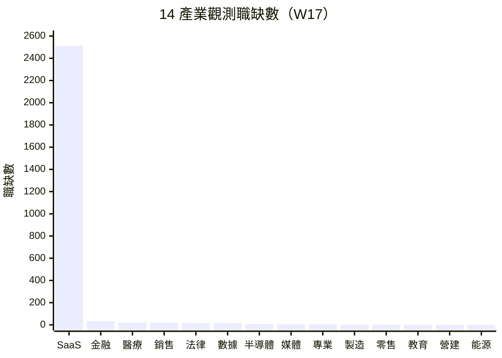

# 產業分層分析 — 2026年第17週

> 本報告使用 Qdrant 向量搜尋取得相關資料，結合 BLS 經濟數據、Crunchbase 融資資訊、HN Hiring 招聘趨勢、Adzuna 職缺資料等全球資料源進行產業分析。

## 摘要

> 本週觀測約 3,040 筆職缺資料，涵蓋全球科技職缺（global_hn_hiring 約 2,512 筆）與 Adzuna 歐美職缺（global_adzuna 約 528 筆）。tw_104_jobs 本週未更新，tw_govjobs 資料未納入本次觀測。本週最關鍵的總體經濟更新為**美國 3 月 BLS 數據出爐：非農就業回穩至 +178K，但失業率升至 4.3%**（+0.2pp），確認勞動市場溫和降溫趨勢。資本市場方面，**OpenAI 完成史上最大規模 $110B 融資（估值 $840B）**[^1]，標誌 AI 產業資金規模進入新量級；國防科技 IPO 熱潮與太空科技融資持續走高[^2][^3]。產業分化格局延續：AI 原生企業擴張不減，傳統 SaaS 承壓加深，Adzuna 數據顯示金融與法律類職缺相對活躍。

## 14 產業職缺變化概覽

> 資料來源：global_hn_hiring、global_adzuna，觀測期間 2026-04-20 ~ 2026-04-26。本週因 tw_govjobs 與 tw_104_jobs 未納入觀測，台灣微觀資料缺失，職缺分布以全球科技職缺為主。與 W13 相比，總量因資料源覆蓋差異而下降，非實質市場收縮。

## 產業總覽

| 產業 | 職缺數 | vs W13 | 擴張/收縮 | AI 衝擊 | 綜合評級 |
|------|--------|--------|----------|---------|----------|
| 軟體與 SaaS | ~2,512 | ↓ 資料源差異 | 分化（AI 擴張、傳統承壓） | 高 | ★★★★ |
| 半導體 | <50 ⚠️ | → 持平 | 穩定（AI 晶片需求支撐） | 中 | ★★★ |
| 電子硬體 | <50 ⚠️ | → 持平 | 穩定 | 中 | ★★ |
| 金融服務 | 34 ⚠️ | ↓ 資料源差異 | Fintech 活躍 | 高 | ★★★ |
| 醫療生技 | 21 ⚠️ | ↓ 資料源差異 | 美國失業率升 | 低 | ★★★ |
| 製造業 | <50 ⚠️ | → 持平 | 穩定 | 高 | ★★ |
| 零售電商 | <50 ⚠️ | ↓ 資料源差異 | 穩定 | 中 | ★★★ |
| 媒體娛樂 | <50 ⚠️ | → 持平 | 收縮持續 | 高 | ★★ |
| 教育 | <50 ⚠️ | → 持平 | 穩定 | 中 | ★★★ |
| 能源與綠能 | <50 ⚠️ | → 持平 | 微擴張信號 | 低 | ★★★ |
| 營建不動產 | <50 ⚠️ | → 持平 | 穩定 | 低 | ★★★ |
| 電信 | <50 ⚠️ | → 持平 | 穩定 | 中 | ★★ |
| 政府與非營利 | 資料不足 ⚠️ | — | 穩定 | 低 | ★★★ |
| 專業服務 | <50 ⚠️ | ↓ 資料源差異 | 穩定 | 中 | ★★★ |

> **綜合評級說明**：基於職缺數量、產業融資動態、裁員事件、AI 衝擊程度的綜合評估。★ 越多表示該產業當前求職環境越友善。此評級為定性判斷，僅供參考。本週因 tw_govjobs/tw_104_jobs 資料缺失，多數產業標記 ⚠️ 小樣本，評級主要依據全球資料與趨勢延續性判斷。

---

## 各產業詳細分析

### 1. 軟體與 SaaS（software_saas）

#### 市場數據
| 指標 | 數值 | 變化 | 來源 |
|------|------|------|------|
| 觀測職缺數 | ~2,512 | HN Hiring 為主 | global_hn_hiring (2,512), global_adzuna software_engineer (8) |
| 主要地區 | 北美（HN Hiring）、歐洲（Adzuna） | — | 綜合來源 |
| 薪資參考 | $120K-$280K USD（資深工程師） | → 持平 | global_hn_hiring |

#### 熱門角色 Top 5
| 角色 | 職缺數 | 佔比 | 薪資區間 |
|------|--------|------|----------|
| Backend Engineer | ~938 | ~37% | $130K ~ $250K USD |
| Full Stack Engineer | ~704 | ~28% | $120K ~ $230K USD |
| Frontend Engineer | ~245 | ~10% | $110K ~ $200K USD |
| DevOps/SRE | ~142 | ~6% | $140K ~ $260K USD |
| Data Engineer | ~93 | ~4% | $130K ~ $240K USD |

#### 熱門技能 Top 5
| 技能 | 說明 | 變化 |
|------|------|------|
| Python/Go/Rust | 後端主流語言，Rust 持續上升 | → |
| React/Vue/TypeScript | 前端框架，TypeScript 佔比持續成長 | ↑ |
| Kubernetes/Docker | 容器化與編排，已成基礎要求 | → |
| PostgreSQL/MySQL | 關聯式資料庫 | → |
| AWS/GCP/Azure | 雲端平台，多雲策略需求增加 | → |

#### [AI 取代向量](/glossary/#ai-取代向量)影響
| 向量 | 影響程度 | 說明 |
|------|----------|------|
| [認知例行](/glossary/#認知例行cognitive-routine) | 高 | AI 程式碼生成工具持續加速取代基礎開發工作，OpenAI $110B 融資加劇此趨勢 |
| [認知非例行](/glossary/#認知非例行cognitive-non-routine) | 中→高 | AI 代理式工具（Cursor、Copilot Agent）進入系統設計層面 |
| [體力例行](/glossary/#體力例行physical-routine) | 低 | 軟體開發不涉及體力工作 |
| [體力非例行](/glossary/#體力非例行physical-non-routine) | 低 | 軟體開發不涉及體力工作 |
| [高度人際](/glossary/#高度人際interpersonal) | 中 | 技術溝通、跨部門協調仍需人際技能 |

#### 事件信號
- 🟢 **OpenAI 完成 $110B 融資**：史上最大創投交易，估值 $840B，AI 人才需求將進一步爆發（來源：funding_signals）[^1]
- 🟢 **AI 獨角獸持續激增**：2025 年 187 家新創晉升獨角獸（年增 61%），AI 原生企業人才需求旺盛（來源：funding_signals）[^4]
- 🟡 **SaaS IPO 持續延遲**：PwC 分析 2026 IPO 窗口不確定，次級市場暫時替代 IPO 需求（來源：funding_signals）[^5]
- 🟡 **科技裁員延續**：2025 年逾 127,000 名科技工作者遭裁，趨勢延續至 2026 年（來源：funding_signals）[^6]
- 🟢 **Security 職缺成長**：HN Hiring 資安類職缺 59 筆，較歷史趨勢持續上升

#### 全球對標
美國 3 月非農就業回穩（+178K），但失業率升至 4.3%，顯示勞動市場整體溫和降溫[^7]。軟體與 SaaS 產業呈現明顯分化：OpenAI 的 $110B 融資[^1]與 Ricursive Intelligence $300M A 輪[^8]等巨額交易顯示 AI 原生企業資金充沛、擴編意願強烈；同時 SaaS IPO 持續延遲[^5]、科技裁員未止息[^6]，傳統軟體企業承壓。HN Hiring 數據顯示 fullstack 工程師佔比維持高位（28%），security 職缺持續成長，反映企業對資安人才的結構性需求。

#### 求職者行動參考
- 建議關注 AI 原生企業的職缺機會，OpenAI 等融資充沛的公司正大規模擴編
- 資安（security）為持續成長子領域，建議軟體工程師評估資安技能轉型路徑

---

### 2. 半導體（semiconductor）

> ⚠️ **小樣本警示**：本產業本週觀測職缺不足 50 筆（< 50 筆門檻），以下統計數據
> 可能有較大偏差，請謹慎解讀。薪資和排名數據的參考價值有限。

#### 市場數據
| 指標 | 數值 | 變化 | 來源 |
|------|------|------|------|
| 觀測職缺數 | <50 | → 持平 vs W13 | global_adzuna |
| 主要地區 | 歐洲 | — | global_adzuna |

#### 熱門角色 Top 5
| 角色 | 職缺數 | 佔比 | 薪資區間 |
|------|--------|------|----------|
| IC 設計工程師 | 若干 | — | 小樣本，僅供參考 |
| 製程工程師 | 若干 | — | 小樣本，僅供參考 |
| Hardware Mfg Engineer | 若干 | — | 小樣本，僅供參考 |
| 測試工程師 | 若干 | — | 小樣本，僅供參考 |
| 設備工程師 | 若干 | — | 小樣本，僅供參考 |

#### 熱門技能 Top 5
| 技能 | 說明 | 變化 |
|------|------|------|
| Verilog/VHDL | IC 設計核心語言 | → |
| EDA 工具 | 電子設計自動化 | → |
| 半導體製程 | 先進製程知識 | → |
| Python | 自動化測試與分析 | ↑ |
| 統計/量測 | 品質控制與良率分析 | → |

#### AI 取代向量影響
| 向量 | 影響程度 | 說明 |
|------|----------|------|
| 認知例行 | 中 | EDA 工具自動化部分設計驗證流程 |
| 認知非例行 | 低 | 晶片架構設計需高度專業判斷 |
| 體力例行 | 高 | 晶圓廠生產線自動化程度極高 |
| 體力非例行 | 中 | 設備維護與異常排除需技術人員 |
| 高度人際 | 低 | 技術導向，人際互動需求較低 |

#### 事件信號
- 🟢 **OpenAI 融資帶動 AI 晶片需求**：$110B 融資將大量投入算力基礎建設，間接支撐 NVIDIA、TSMC 等供應鏈[^1]
- 🟢 國防科技 IPO 熱潮持續間接帶動半導體需求[^2]

#### 全球對標
半導體產業延續穩定趨勢。OpenAI 的 $110B 融資[^1]與持續擴大的 AI 訓練/推論需求，將在中長期支撐 AI 晶片的供應鏈人才需求。國防科技 IPO 熱潮[^2]與太空科技融資走高[^3]進一步擴大晶片應用場景。本系統目前缺乏專門的半導體職缺資料源，數據以小樣本呈現。

#### 求職者行動參考
- 建議關注 AI 晶片設計相關職位，OpenAI 等公司的巨額融資將持續推升此領域人才需求

---

### 3. 電子硬體（electronics_hardware）

> ⚠️ **小樣本警示**：本產業本週觀測職缺不足 50 筆（< 50 筆門檻），以下統計數據
> 可能有較大偏差，請謹慎解讀。薪資和排名數據的參考價值有限。

#### 市場數據
| 指標 | 數值 | 變化 | 來源 |
|------|------|------|------|
| 觀測職缺數 | <50 | → 持平 vs W13 | global_adzuna |

#### 熱門角色 Top 5
| 角色 | 職缺數 | 佔比 | 薪資區間 |
|------|--------|------|----------|
| Hardware Mfg Engineer | 若干 | — | 小樣本，僅供參考 |
| 嵌入式系統工程師 | 若干 | — | 小樣本，僅供參考 |
| 韌體工程師 | 若干 | — | 小樣本，僅供參考 |
| 電子測試技術員 | 若干 | — | 小樣本，僅供參考 |
| 技術保全員 | 若干 | — | 小樣本，僅供參考 |

#### 熱門技能 Top 5
| 技能 | 說明 | 變化 |
|------|------|------|
| PCB 設計 | 電路板佈局與設計 | → |
| 嵌入式 C/C++ | 韌體開發核心語言 | → |
| 電路分析 | 基礎硬體技能 | → |
| IoT 通訊協定 | 物聯網裝置開發 | ↑ |
| 訊號處理 | 通訊硬體需求 | → |

#### AI 取代向量影響
| 向量 | 影響程度 | 說明 |
|------|----------|------|
| 認知例行 | 中 | PCB 設計部分流程可自動化 |
| 認知非例行 | 低 | 硬體系統整合需跨領域專業 |
| 體力例行 | 高 | 組裝生產線高度自動化 |
| 體力非例行 | 中 | 產品測試與維修需技術人員 |
| 高度人際 | 低 | 研發導向，人際需求較低 |

#### 事件信號
- 🟢 國防科技擴張帶動硬體需求：AI 無人機、自主系統等領域需大量硬體人才[^2]
- 🟢 太空科技融資走高：Northwood Space $100M B 輪、Zipline $600M 成長輪，拉動硬體供應鏈[^3]

#### 全球對標
電子硬體產業延續穩定趨勢。國防科技 IPO 熱潮[^2]與太空科技融資走高[^3]間接利好嵌入式系統與電子工程人才需求。機器人領域融資持續活躍（Coco Robotics $80M），帶動硬體人才跨領域需求。

#### 求職者行動參考
- 國防科技、太空科技、機器人領域為嵌入式系統與電子工程人才的新出路，建議評估相關職缺

---

### 4. 金融服務（financial_services）

> ⚠️ **小樣本警示**：本產業本週 Adzuna 觀測職缺僅 34 筆（< 50 筆門檻），因 tw_govjobs 未納入本次觀測。
> 以下統計數據可能有較大偏差，請謹慎解讀。

#### 市場數據
| 指標 | 數值 | 變化 | 來源 |
|------|------|------|------|
| 觀測職缺數 | 34 | ↓ 資料源差異（W13 含 tw_govjobs 為 138） | global_adzuna finance (34) |
| 主要地區 | 歐洲（德國為主） | — | global_adzuna |

#### 熱門角色 Top 5
| 角色 | 職缺數 | 佔比 | 薪資區間 |
|------|--------|------|----------|
| Senior Accountant | 若干 | — | €50K-€80K（歐洲） |
| Finance Manager | 若干 | — | €60K-€90K（歐洲） |
| Head of Finance | 若干 | — | €80K-€120K（歐洲） |
| Financial Analyst | 若干 | — | €45K-€70K（歐洲） |
| Compliance Officer | 若干 | — | €55K-€85K（歐洲） |

#### 熱門技能 Top 5
| 技能 | 說明 | 變化 |
|------|------|------|
| SAP / ERP 系統 | 企業財務系統操作 | → |
| Excel / VBA | 財務建模基礎工具 | ↓ |
| Python / SQL | 資料分析與自動化 | ↑ |
| 風險管理 | 合規與風控 | → |
| IFRS / GAAP | 國際財務準則 | → |

#### AI 取代向量影響
| 向量 | 影響程度 | 說明 |
|------|----------|------|
| 認知例行 | 高 | 財務報表、數據輸入高度自動化，AI 代理式財務建模工具崛起 |
| 認知非例行 | 中 | 投資分析、風險評估 AI 輔助持續增加 |
| 體力例行 | 低 | 金融服務不涉及體力工作 |
| 體力非例行 | 低 | 金融服務不涉及體力工作 |
| 高度人際 | 中 | 客戶關係管理、財務諮詢仍需人際技能 |

#### 事件信號
- 🟢 **Fintech 融資持續活躍**：Stripe 估值 $159B、Plaid $8B、Candex $40M+、Zocks $45M B 輪（AI 財務顧問助理）（來源：funding_signals）[^9]
- 🟢 **IPO 市場等待解凍**：PwC 分析 2026 年 IPO 延遲，次級市場繁榮暫代 IPO 需求[^5]
- 🟡 **AI 代理式工具持續發展**：Meridian AI $17M 種子輪（AI 試算表）顯示金融自動化加速[^10]

#### 全球對標
金融服務產業本週延續穩定趨勢。美國失業率升至 4.3%[^7]但平均時薪年增 3.5%，顯示薪資增長仍具韌性。Fintech 融資活動持續活躍（Stripe $159B、Zocks $45M），但 AI 代理式工具的發展可能在中期改變金融分析師角色。Adzuna 數據中金融類為第二大職缺類別（34 筆），反映歐洲金融市場需求穩定。

#### 求職者行動參考
- 建議金融從業者強化 Python/SQL 等資料分析技能，AI 代理式財務工具（如 Zocks、Meridian）正在改變行業工作方式

---

### 5. 醫療生技（healthcare_biotech）

> ⚠️ **小樣本警示**：本產業本週觀測職缺僅 21 筆（< 50 筆門檻，因 tw_govjobs 未納入觀測），
> 以下統計數據可能有較大偏差，請謹慎解讀。

#### 市場數據
| 指標 | 數值 | 變化 | 來源 |
|------|------|------|------|
| 觀測職缺數 | 21 | ↓ 資料源差異（W13 含 tw_govjobs 為 79） | global_adzuna healthcare (21) |
| 主要地區 | 歐美 | — | global_adzuna |

#### 熱門角色 Top 5
| 角色 | 職缺數 | 佔比 | 薪資區間 |
|------|--------|------|----------|
| 臨床研究員 | 若干 | — | 小樣本，僅供參考 |
| 護理人員 | 若干 | — | 小樣本，僅供參考 |
| 醫療資訊工程師 | 若干 | — | 小樣本，僅供參考 |
| 藥廠業務代表 | 若干 | — | 小樣本，僅供參考 |
| 醫檢技術員 | 若干 | — | 小樣本，僅供參考 |

#### 熱門技能 Top 5
| 技能 | 說明 | 變化 |
|------|------|------|
| 臨床試驗管理 | GCP 法規與試驗設計 | → |
| 醫療影像 | AI 輔助判讀持續進步 | ↑ |
| 電子病歷系統 | EMR/EHR 操作 | → |
| 感染控制 | 防疫與衛生標準 | → |
| 數據分析 | 生物統計與臨床數據 | ↑ |

#### AI 取代向量影響
| 向量 | 影響程度 | 說明 |
|------|----------|------|
| 認知例行 | 中 | 醫療影像 AI 判讀持續進步 |
| 認知非例行 | 低 | 臨床診斷仍需醫師專業判斷 |
| 體力例行 | 低 | 照護工作需人類直接接觸 |
| 體力非例行 | 低 | 護理、照顧需靈活應對各種狀況 |
| 高度人際 | 高度保護 | 病患關懷、情緒支持不可取代 |

#### 事件信號
- 🟡 **美國失業率升至 4.3%**：3 月 BLS 數據確認勞動市場降溫，醫療產業需持續關注分項數據（來源：global_bls）[^7]
- 🟢 **生技融資持續**：資安與 AI 之外，生技醫療仍為融資熱門領域之一（來源：funding_signals）[^11]

#### 全球對標
美國 3 月非農就業回穩（+178K），2 月數據下修為 158,459K（前次初值 158,466K），失業率升至 4.3%[^7]。2 月醫療就業負增長（-28K）是否為趨勢，3 月分項數據將是重要確認信號。台灣醫療就業受高齡化結構性驅動，照護人力需求穩定（本週因 tw_govjobs 未納入觀測，無法提供台灣最新數據）。

#### 求職者行動參考
- 醫療生技 AI 衝擊低，高齡化為長期結構性支撐；跨境求職者需留意美國失業率上升趨勢

---

### 6. 製造業（manufacturing）

> ⚠️ **小樣本警示**：本產業本週觀測職缺僅 2 筆（< 50 筆門檻），以下統計數據
> 可能有較大偏差，請謹慎解讀。薪資和排名數據的參考價值有限。

#### 市場數據
| 指標 | 數值 | 變化 | 來源 |
|------|------|------|------|
| 觀測職缺數 | 2 | ↓ 資料源差異（W13 含 tw_govjobs 為 14） | global_adzuna manufacturing |
| 主要地區 | 歐洲 | — | global_adzuna |

#### 熱門角色 Top 5
| 角色 | 職缺數 | 佔比 | 薪資區間 |
|------|--------|------|----------|
| 品管工程師 | 若干 | — | 小樣本，僅供參考 |
| 製程工程師 | 若干 | — | 小樣本，僅供參考 |
| 機台操作員 | 若干 | — | 小樣本，僅供參考 |
| 職安衛管理員 | 若干 | — | 小樣本，僅供參考 |
| 生產線組長 | 若干 | — | 小樣本，僅供參考 |

#### 熱門技能 Top 5
| 技能 | 說明 | 變化 |
|------|------|------|
| 品質管理 | ISO 品管系統 | → |
| 設備維護 | 機台保養與維修 | → |
| 職安衛 | 安全衛生管理 | → |
| AutoCAD | 製圖與設計 | → |
| PLC 控制 | 可程式邏輯控制器 | → |

#### AI 取代向量影響
| 向量 | 影響程度 | 說明 |
|------|----------|------|
| 認知例行 | 中 | 品管檢測 AI 視覺辨識普及 |
| 認知非例行 | 低 | 製程優化仍需工程師判斷 |
| 體力例行 | 高 | 生產線自動化程度持續提高 |
| 體力非例行 | 中 | 設備維護與異常處理需技術人員 |
| 高度人際 | 低 | 製造業人際互動需求較低 |

#### 事件信號
- 🟡 國防科技擴張可能帶動精密製造需求（來源：funding_signals）[^2]
- 🟢 機器人融資活躍（Coco Robotics $80M），可能加速製造業自動化

#### 全球對標
製造業延續穩定趨勢。美國 3 月非農就業回穩[^7]，但製造業分項需進一步觀察。國防科技[^2]與機器人融資活躍帶動精密製造與自動化設備的人力需求。

#### 求職者行動參考
- 小樣本限制下，建議以其他管道（104 人力銀行、企業官網）交叉確認製造業職缺趨勢

---

### 7. 零售電商（retail_ecommerce）

> ⚠️ **小樣本警示**：本產業本週觀測不足 50 筆（因 tw_govjobs 未納入觀測），
> 以下分析主要基於趨勢延續性判斷。

#### 市場數據
| 指標 | 數值 | 變化 | 來源 |
|------|------|------|------|
| 觀測職缺數 | <50 | ↓ 資料源差異（W13 含 tw_govjobs 為 ~499） | global_adzuna sales (19) |
| 主要地區 | 歐洲 | — | global_adzuna |

#### 熱門角色 Top 5
| 角色 | 職缺數 | 佔比 | 薪資區間 |
|------|--------|------|----------|
| New Business Dev Manager | 若干 | — | 小樣本，僅供參考 |
| Sales Representative | 若干 | — | 小樣本，僅供參考 |
| Underwriter | 若干 | — | 小樣本，僅供參考 |
| Customer Advisor | 若干 | — | 小樣本，僅供參考 |
| 銷售顧問 | 若干 | — | 小樣本，僅供參考 |

#### 熱門技能 Top 5
| 技能 | 說明 | 變化 |
|------|------|------|
| 服務態度 | 零售服務基本要求 | → |
| CRM 系統 | 客戶關係管理 | → |
| 數位行銷 | 電商行銷工具 | ↑ |
| POS 系統操作 | 收銀結帳系統 | → |
| 基礎外語 | 跨境電商需求 | ↑ |

#### AI 取代向量影響
| 向量 | 影響程度 | 說明 |
|------|----------|------|
| 認知例行 | 高 | 收銀、庫存管理自動化增加 |
| 認知非例行 | 低 | 顧客服務需臨場應變 |
| 體力例行 | 中 | 自助結帳、機器人上菜逐漸普及 |
| 體力非例行 | 低 | 餐飲服務需靈活應對 |
| 高度人際 | 中度保護 | 顧客互動、服務體驗仍需人力 |

#### 事件信號
- 🟡 **平台型電商持續壓力**：延續 eBay 連續三年裁員趨勢，壓力未減
- 🟢 **美國薪資增長超通膨**：平均時薪年增 3.5%[^7]，對消費力有正面支撐

#### 全球對標
零售電商延續 W13 趨勢。本週因 tw_govjobs 未納入觀測，無法提供台灣餐飲零售最新數據。全球平台型電商持續組織瘦身，但美國薪資增長超通膨（+3.5% YoY）[^7]對消費力有正面支撐。Adzuna sales 類別（19 筆）以歐洲 B2B 銷售為主。

#### 求職者行動參考
- 零售電商小樣本限制大，台灣求職者建議以 tw_govjobs、104 人力銀行交叉確認

---

### 8. 媒體娛樂（media_entertainment）

> ⚠️ **小樣本警示**：本產業本週觀測不足 50 筆（< 50 筆門檻），以下統計數據
> 可能有較大偏差，請謹慎解讀。

#### 市場數據
| 指標 | 數值 | 變化 | 來源 |
|------|------|------|------|
| 觀測職缺數 | <50 | ↓ 資料源差異（W13 含 tw_govjobs 為 57） | global_adzuna marketing (1) |

#### 熱門角色 Top 5
| 角色 | 職缺數 | 佔比 | 薪資區間 |
|------|--------|------|----------|
| 數位行銷專員 | 若干 | — | 小樣本，僅供參考 |
| 社群經營 | 若干 | — | 小樣本，僅供參考 |
| 影音編輯 | 若干 | — | 小樣本，僅供參考 |
| 平面設計師 | 若干 | — | 小樣本，僅供參考 |
| 內容策略師 | 若干 | — | 小樣本，僅供參考 |

#### 熱門技能 Top 5
| 技能 | 說明 | 變化 |
|------|------|------|
| 社群經營 | Facebook/IG/LINE 經營 | → |
| 數位廣告投放 | Google Ads、Meta Ads | → |
| AI 內容工具 | ChatGPT、Midjourney 等 | ↑ |
| Premiere/After Effects | 影音剪輯工具 | → |
| SEO/SEM | 搜尋引擎優化 | → |

#### AI 取代向量影響
| 向量 | 影響程度 | 說明 |
|------|----------|------|
| 認知例行 | 高 | 內容審核、影片標籤自動化 |
| 認知非例行 | 高 | AI 生成內容快速發展，Digg 因 AI bot 關閉 App 為前車之鑑 |
| 體力例行 | 低 | 媒體娛樂不涉及體力工作 |
| 體力非例行 | 低 | 媒體娛樂不涉及體力工作 |
| 高度人際 | 中 | 創意發想、客戶提案需人際技能 |

#### 事件信號
- 🔴 **媒體收縮趨勢延續**：W13 Digg 裁員關閉 App 的「AI 雙重衝擊」模式仍在擴散，非 AI 原生內容平台持續承壓
- 🟢 **Substack $100M 融資**：估值 $1.1B，創作者經濟平台仍獲資本青睞，但就業帶動效應有限
- 🟡 AI 內容生成持續衝擊傳統媒體就業

#### 全球對標
媒體娛樂產業延續收縮趨勢。W13 的 Digg 裁員關閉 App 事件揭示了非 AI 原生內容平台面臨的「AI 雙重衝擊」（內容替代 + bot 攻擊），此模式可能擴散至其他 UGC 平台。Substack 的 $100M 融資反映創作者經濟仍有活力，但就業帶動效果集中於平台運營團隊。

#### 求職者行動參考
- 媒體產業持續收縮，建議強化 AI 內容工具應用能力，同時發展跨產業可轉移的數位行銷技能

---

### 9. 教育（education）

> ⚠️ **小樣本警示**：本產業本週觀測職缺僅 1 筆（< 50 筆門檻），以下分析
> 主要基於趨勢延續性判斷。

#### 市場數據
| 指標 | 數值 | 變化 | 來源 |
|------|------|------|------|
| 觀測職缺數 | 1 | ↓ 資料源差異（W13 含 tw_govjobs 為 16） | global_adzuna education |

#### 熱門角色 Top 5
| 角色 | 職缺數 | 佔比 | 薪資區間 |
|------|--------|------|----------|
| 教學設計師 | 若干 | — | 小樣本，僅供參考 |
| 課程規劃師 | 若干 | — | 小樣本，僅供參考 |
| 教育訓練員 | 若干 | — | 小樣本，僅供參考 |
| 數位學習專員 | 若干 | — | 小樣本，僅供參考 |
| 才藝教師 | 若干 | — | 小樣本，僅供參考 |

#### 熱門技能 Top 5
| 技能 | 說明 | 變化 |
|------|------|------|
| 教學設計 | 課程規劃與教案 | → |
| 數位教學 | 線上教學平台操作 | ↑ |
| 班級經營 | 學生輔導管理 | → |
| AI 教學工具 | AI 家教、自動批改 | ↑ |
| 多媒體教材 | 教材製作工具 | → |

#### AI 取代向量影響
| 向量 | 影響程度 | 說明 |
|------|----------|------|
| 認知例行 | 高 | 題庫、作業批改可自動化 |
| 認知非例行 | 中 | 課程設計、教學策略需專業判斷 |
| 體力例行 | 低 | 教育不涉及體力工作 |
| 體力非例行 | 低 | 教育不涉及體力工作 |
| 高度人際 | 高度保護 | 學生輔導、情緒支持不可取代 |

#### 事件信號
- 🟡 **AI 教育工具加速發展**：OpenAI $110B 融資後將加速 AI 在教育領域的滲透（AI 家教、個性化學習）
- 無本週其他重大事件

#### 全球對標
教育產業延續穩定趨勢。AI 教育工具持續發展，但教師的核心人際互動功能仍受保護。OpenAI 的巨額融資[^1]將加速 AI 教育工具的開發與推廣，**推測**可能在中期改變輔助教學人員的需求結構，但核心教師角色穩定。

#### 求職者行動參考
- 教育業小樣本限制大，建議以教育相關專業平台交叉確認職缺趨勢

---

### 10. 能源與綠能（energy_green）

> ⚠️ **小樣本警示**：本產業本週觀測職缺不足 50 筆（< 50 筆門檻），以下統計數據
> 可能有較大偏差，請謹慎解讀。

#### 市場數據
| 指標 | 數值 | 變化 | 來源 |
|------|------|------|------|
| 觀測職缺數 | <50 | → 持平 vs W13 | global_adzuna |

#### 熱門角色 Top 5
| 角色 | 職缺數 | 佔比 | 薪資區間 |
|------|--------|------|----------|
| 再生能源工程師 | 若干 | — | 小樣本，僅供參考 |
| 電力系統工程師 | 若干 | — | 小樣本，僅供參考 |
| 太陽能技術員 | 若干 | — | 小樣本，僅供參考 |
| 能源管理師 | 若干 | — | 小樣本，僅供參考 |
| 環安衛工程師 | 若干 | — | 小樣本，僅供參考 |

#### 熱門技能 Top 5
| 技能 | 說明 | 變化 |
|------|------|------|
| 電力系統 | 配電與輸電技術 | → |
| 太陽能/風力 | 再生能源技術 | ↑ |
| 環安衛管理 | 安全衛生與環境管理 | → |
| 電機工程 | 基礎電機知識 | → |
| 能源法規 | 再生能源相關法規 | → |

#### AI 取代向量影響
| 向量 | 影響程度 | 說明 |
|------|----------|------|
| 認知例行 | 中 | 能源調度可部分自動化 |
| 認知非例行 | 低 | 能源系統設計需工程專業 |
| 體力例行 | 中 | 發電廠運維自動化增加 |
| 體力非例行 | 低 | 現場維護需技術人員 |
| 高度人際 | 低 | 技術導向 |

#### 事件信號
- 🟢 **AI 算力需求帶動能源投資**：OpenAI 等 AI 公司的巨額融資將轉化為大規模資料中心建設，推動電力需求[^1]
- 🟢 綠能轉型持續：全球淨零排放目標驅動長期人才需求

#### 全球對標
能源與綠能產業延續穩定趨勢。值得注意的是，AI 訓練與推論的電力需求正成為能源產業的新成長動力——OpenAI $110B 融資中相當部分將用於算力基礎建設，間接帶動資料中心電力供應與綠能技術人才需求。

#### 求職者行動參考
- 綠能為長期成長領域，AI 衝擊低；資料中心電力供應為新興機會

---

### 11. 營建不動產（construction_realestate）

> ⚠️ **小樣本警示**：本產業本週觀測職缺不足 50 筆（< 50 筆門檻），以下統計數據
> 可能有較大偏差，請謹慎解讀。

#### 市場數據
| 指標 | 數值 | 變化 | 來源 |
|------|------|------|------|
| 觀測職缺數 | <50 | → 持平 vs W13 | 小樣本 |

#### 熱門角色 Top 5
| 角色 | 職缺數 | 佔比 | 薪資區間 |
|------|--------|------|----------|
| 工地主任 | 若干 | — | 小樣本，僅供參考 |
| 建築設計師 | 若干 | — | 小樣本，僅供參考 |
| 工務工程師 | 若干 | — | 小樣本，僅供參考 |
| 測量助理 | 若干 | — | 小樣本，僅供參考 |
| 安管員 | 若干 | — | 小樣本，僅供參考 |

#### 熱門技能 Top 5
| 技能 | 說明 | 變化 |
|------|------|------|
| AutoCAD | 建築製圖 | → |
| BIM | 建築資訊模型 | ↑ |
| 工程管理 | 進度與品質管理 | → |
| 測量 | 土地與工程測量 | → |
| 營建法規 | 建築法規與安全 | → |

#### AI 取代向量影響
| 向量 | 影響程度 | 說明 |
|------|----------|------|
| 認知例行 | 中 | BIM 設計部分流程自動化 |
| 認知非例行 | 低 | 建築設計需創意與專業判斷 |
| 體力例行 | 中 | 預製構件減少現場人力 |
| 體力非例行 | 低 | 現場施工需靈活應對 |
| 高度人際 | 低 | 技術導向 |

#### 事件信號
- 🟢 **PropTech 融資持續**：Cambio $18M A 輪（AI 商用不動產軟體，估值 $100M）顯示不動產科技有資本支持[^12]
- 無本週其他重大事件

#### 全球對標
營建不動產本週表現平穩。PropTech 融資持續（Cambio $18M）[^12]，但整體為週期性產業，受利率政策影響較大。

#### 求職者行動參考
- 小樣本限制下，建議關注 BIM 技術與 PropTech 工具學習

---

### 12. 電信（telecom）

> ⚠️ **小樣本警示**：本產業本週觀測職缺不足 50 筆（< 50 筆門檻），以下統計數據
> 可能有較大偏差，請謹慎解讀。

#### 市場數據
| 指標 | 數值 | 變化 | 來源 |
|------|------|------|------|
| 觀測職缺數 | <50 | → 持平 vs W13 | 小樣本 |

#### 熱門角色 Top 5
| 角色 | 職缺數 | 佔比 | 薪資區間 |
|------|--------|------|----------|
| 網路工程師 | 若干 | — | 小樣本，僅供參考 |
| 系統管理員 | 若干 | — | 小樣本，僅供參考 |
| 通訊技術員 | 若干 | — | 小樣本，僅供參考 |
| 基地台維護員 | 若干 | — | 小樣本，僅供參考 |
| 客服專員 | 若干 | — | 小樣本，僅供參考 |

#### 熱門技能 Top 5
| 技能 | 說明 | 變化 |
|------|------|------|
| 網路架構 | TCP/IP、路由交換 | → |
| 5G 技術 | 5G 網路規劃與部署 | ↑ |
| Linux 管理 | 伺服器維運 | → |
| 資安 | 網路安全防護 | ↑ |
| 客服系統 | CRM 與客服平台 | → |

#### AI 取代向量影響
| 向量 | 影響程度 | 說明 |
|------|----------|------|
| 認知例行 | 高 | 客服、帳務自動化程度高 |
| 認知非例行 | 中 | 網路規劃需工程專業 |
| 體力例行 | 中 | 機房維運自動化增加 |
| 體力非例行 | 低 | 基地台維護需現場技術人員 |
| 高度人際 | 中 | 企業客戶銷售需人際技能 |

#### 事件信號
- 無本週重大事件

#### 全球對標
電信產業延續穩定趨勢，5G 基礎建設持續推動，但整體就業成長有限。AI 資料中心建設可能間接帶動網路基礎建設需求。

#### 求職者行動參考
- 電信業小樣本限制大，建議以電信業者官網交叉確認職缺趨勢

---

### 13. 政府與非營利（government_ngo）

> ⚠️ **小樣本警示**：本週因 tw_govjobs 未納入觀測，政府類職缺數據不足。
> 以下分析主要基於趨勢延續性與 BLS 總體數據判斷。

#### 市場數據
| 指標 | 數值 | 變化 | 來源 |
|------|------|------|------|
| 觀測職缺數 | 資料不足 | — | 本週 tw_govjobs 未納入觀測 |

#### 熱門角色 Top 5
| 角色 | 職缺數 | 佔比 | 薪資區間 |
|------|--------|------|----------|
| 行政助理 | 若干 | — | 資料不足 |
| 社區主任 | 若干 | — | 資料不足 |
| 推展員 | 若干 | — | 資料不足 |
| 儲備幹部 | 若干 | — | 資料不足 |
| 外國人業務訪查員 | 若干 | — | 資料不足 |

#### 熱門技能 Top 5
| 技能 | 說明 | 變化 |
|------|------|------|
| 公文撰寫 | 政府公文格式 | → |
| 行政管理 | 一般行政事務 | → |
| Excel/Word | 辦公室基本工具 | → |
| 法規知識 | 相關法令與規範 | → |
| 外語能力 | 涉外業務需求 | → |

#### AI 取代向量影響
| 向量 | 影響程度 | 說明 |
|------|----------|------|
| 認知例行 | 高 | 公文處理、資料建檔可自動化 |
| 認知非例行 | 低 | 政策制定需專業判斷 |
| 體力例行 | 低 | 不涉及體力勞動 |
| 體力非例行 | 低 | 不涉及體力勞動 |
| 高度人際 | 中度保護 | 民眾服務、社會福利需人際互動 |

#### 事件信號
- 🟡 **美國失業率升至 4.3%**：政府部門就業分項待確認[^7]

#### 全球對標
台灣公部門就業穩定性高，受法規保護。美國 3 月失業率升至 4.3%[^7]，政府部門的具體變動尚待 BLS 分項數據確認。

#### 求職者行動參考
- 政府部門穩定性高、AI 衝擊低，適合追求工作穩定性的求職者

---

### 14. 專業服務（professional_services）

> ⚠️ **小樣本警示**：本產業本週觀測不足 50 筆（< 50 筆門檻），以下統計數據
> 可能有較大偏差，請謹慎解讀。

#### 市場數據
| 指標 | 數值 | 變化 | 來源 |
|------|------|------|------|
| 觀測職缺數 | <50 | ↓ 資料源差異（W13 含 tw_govjobs 為 89） | global_adzuna hr (3), product_manager (3), other (6) |
| 主要地區 | 歐洲 | — | global_adzuna |

#### 熱門角色 Top 5
| 角色 | 職缺數 | 佔比 | 薪資區間 |
|------|--------|------|----------|
| HR Manager | 若干 | — | 小樣本，僅供參考 |
| Product Manager | 若干 | — | 小樣本，僅供參考 |
| 管理顧問 | 若干 | — | 小樣本，僅供參考 |
| 會計師助理 | 若干 | — | 小樣本，僅供參考 |
| 專案經理 | 若干 | — | 小樣本，僅供參考 |

#### 熱門技能 Top 5
| 技能 | 說明 | 變化 |
|------|------|------|
| Excel / 資料分析 | 商業分析基礎 | → |
| 專案管理 | PMP / Scrum | → |
| AI 工具應用 | ChatGPT、自動化工具 | ↑ |
| 商業英文 | 國際業務溝通 | → |
| 簡報技巧 | 提案與客戶溝通 | → |

#### AI 取代向量影響
| 向量 | 影響程度 | 說明 |
|------|----------|------|
| 認知例行 | 高 | 文件審閱、資料分析可自動化 |
| 認知非例行 | 中 | 專業諮詢需人類判斷 |
| 體力例行 | 低 | 不涉及體力工作 |
| 體力非例行 | 低 | 不涉及體力工作 |
| 高度人際 | 中度保護 | 客戶關係、諮詢服務需人際技能 |

#### 事件信號
- 🟡 **企業收購活躍**：OpenAI、Salesforce、Snowflake 為最活躍新創收購方，帶動顧問業務需求（來源：funding_signals）[^13]
- 🟡 **AI 商業成果衡量**：企業重視 AI 投資回報，帶動 AI 商業分析師等複合型人才需求[^14]

#### 全球對標
專業服務產業延續穩定趨勢。企業 AI 導入加速帶動管理顧問與 AI 商業分析的複合職能需求[^14]。OpenAI 等公司的積極收購策略[^13]將帶動顧問業務的整合與盡職調查需求。

#### 求職者行動參考
- 建議發展「專業領域知識 + AI 工具應用」的複合能力，此為專業服務業最具競爭力的組合

---

## 跨產業比較

### 職缺規模排名

| 排名 | 產業 | 職缺數 | 主要驅動因素 |
|------|------|--------|-------------|
| 1 | 軟體與 SaaS | ~2,512 | HN Hiring 科技職缺為主，AI 人才需求持續 |
| 2 | 金融服務 | 34 ⚠️ | Adzuna 歐洲金融類，Fintech 融資活躍 |
| 3 | 醫療生技 | 21 ⚠️ | Adzuna 歐美醫療類 |
| 4 | 銷售相關 | 19 ⚠️ | Adzuna 歐洲 B2B 銷售 |
| 5 | 法律 | 17 ⚠️ | Adzuna 歐洲法務類 |
| 6 | 數據科學 | 16 ⚠️ | Adzuna 數據分析類 |
| 7-14 | 其他產業 | <10 | 小樣本，資料源差異 |

> **注意**：本週因 tw_govjobs、tw_104_jobs 未納入觀測，多數產業為小樣本。排名主要反映 global_hn_hiring 與 global_adzuna 的觀測結果，不代表全市場職缺分布。

### 薪資水準排名

| 排名 | 產業 | 薪資中位參考 | 說明 |
|------|------|-------------|------|
| 1 | 軟體與 SaaS | $120K-$280K USD | 全球科技職缺（HN Hiring） |
| 2 | 金融服務 | €60K-€90K | 歐洲金融職缺（Adzuna） |
| 3 | 半導體 | 小樣本 | 台灣科技業薪資偏高但樣本不足 |
| 4 | 專業服務 | 小樣本 | 本週資料不足 |
| — | 美國整體 | $37.38/時 (+3.5% YoY) | BLS 平均時薪 |

> 註：薪資跨國比較受生活成本差異影響，上表僅呈現各資料源觀測到的薪資範圍，不宜直接比較。

### AI 衝擊程度排名

| 排名 | 產業 | AI 衝擊綜合評分 | 最受影響的向量 | 本週關鍵事件 |
|------|------|----------------|---------------|-------------|
| 1 | 軟體與 SaaS | 高 | 認知例行→認知非例行 | OpenAI $110B 融資加速 AI 滲透 |
| 2 | 媒體娛樂 | 高 | 認知非例行 | AI 內容生成持續衝擊 |
| 3 | 金融服務 | 高 | 認知例行 | AI 代理式財務工具持續發展 |
| 4 | 製造業 | 高 | 體力例行 | 機器人融資活躍 |
| 5 | 專業服務 | 中 | 認知例行 | 企業 AI 投資回報評估成熟 |
| 6 | 教育 | 中 | 認知例行 | AI 教育工具加速發展 |
| 7 | 電信 | 中 | 認知例行 | 無新事件 |
| 8 | 半導體 | 中 | 體力例行 | AI 晶片需求支撐 |
| 9 | 電子硬體 | 中 | 體力例行 | 國防科技帶動需求 |
| 10 | 零售電商 | 中 | 認知例行 | 基層服務穩定 |
| 11 | 醫療生技 | 低 | 認知例行（輔助） | 失業率升至 4.3% |
| 12 | 營建不動產 | 低 | 認知例行（輔助） | PropTech 融資持續 |
| 13 | 能源與綠能 | 低 | 體力例行（部分） | AI 算力帶動電力需求 |
| 14 | 政府與非營利 | 低 | 認知例行 | 穩定 |

### 產業健康度矩陣

產業健康度依據「職缺成長信號」與「AI 衝擊程度」兩個維度評估：

**擴張 + 低 AI 衝擊**（最佳象限）：
- 能源與綠能（AI 算力需求帶動電力投資，技術門檻提供保護）
- 醫療生技（高齡化結構性驅動，但需關注美國失業率上升信號）

**擴張 + 高 AI 衝擊**（機會與挑戰並存）：
- AI 原生軟體（OpenAI $110B[^1]、獨角獸年增 61%[^4]，但傳統 SaaS 承壓）
- 國防科技（Swarmer IPO +520%[^2]，系統性擴張態勢不變）
- 資安（HN Hiring security 持續成長，融資活躍[^11]）

**穩定 + 低 AI 衝擊**（相對安全）：
- 營建不動產（週期性波動，核心職位穩定，PropTech 投資持續）
- 政府與非營利（穩定但成長有限）

**穩定/收縮 + 高 AI 衝擊**（需謹慎）：
- 傳統 SaaS（科技裁員延續，SaaS IPO 持續延遲[^5]）
- 媒體娛樂（AI 雙重衝擊模式擴散，傳統平台持續收縮）
- 金融科技（AI 代理工具改變金融分析師角色）

## 台灣 vs 全球趨勢對比

| 產業 | 台灣趨勢 | 全球趨勢 | 一致性 | 說明 |
|------|----------|----------|--------|------|
| 軟體與 SaaS | 資料不足 | 分化（AI 擴張/傳統裁員） | — | 本週缺 tw_104_jobs 資料 |
| 金融服務 | 資料不足 | Fintech 融資活躍 | — | 本週缺台灣微觀資料 |
| 醫療生技 | 資料不足 | ↓ 美國失業率升至 4.3% | — | 台灣高齡化驅動（趨勢延續） |
| 零售電商 | 資料不足 | → 穩定（薪資增長超通膨） | — | 本週缺 tw_govjobs 資料 |
| 媒體娛樂 | 資料不足 | ↓ 收縮持續 | — | 全球趨勢明確 |
| 製造業 | 資料不足 | → 穩定 | — | 國防科技可能帶動需求 |
| 能源與綠能 | 資料不足 | ↑ AI 算力帶動電力需求 | — | 新成長動力出現 |

> **注意**：本週因台灣微觀資料源（tw_govjobs、tw_104_jobs）未納入觀測，台灣趨勢欄位無法更新，保留歷史趨勢判斷作為參考。

## 分析師觀察

**1. OpenAI $110B 融資的產業衝擊波**

本週最重要的事件為 OpenAI 完成史上最大創投交易（$110B，估值 $840B）[^1]。此融資規模將在多個維度影響產業就業結構：（一）直接帶動 AI 人才需求的大幅擴張；（二）加速 AI 工具對傳統軟體工作的替代壓力；（三）巨額資金投入算力基礎建設，間接帶動半導體、能源、營建等供應鏈人力需求。結合 2025 年 187 家新創晉升獨角獸[^4]的趨勢，AI 產業的人才虹吸效應正在加劇——其他產業可能面臨更嚴峻的人才競爭壓力。

**2. 美國勞動市場進入溫和降溫通道**

3 月 BLS 數據呈現矛盾信號：非農就業回穩（+178K），但失業率升至 4.3%（+0.2pp），平均時薪年增 3.5%仍超通膨[^7]。這組數據**推測**反映的是結構性調整而非全面衰退——就業增長集中於特定領域（AI、醫療、政府），而其他領域（傳統科技、媒體、零售電商）持續承壓。失業率連續三個月維持在 4% 以上，確認勞動市場降溫趨勢。

**3. 產業分化加深——資金與人才的極端集中**

OpenAI $110B、Ricursive Intelligence $300M[^8]、Stripe $159B 估值[^9]——資金正極端集中於 AI 與金融科技頭部企業。同時，SaaS IPO 持續延遲[^5]、科技裁員延續至 2026 年[^6]。這種「頭部巨額融資 + 尾部持續裁員」的格局正在改變就業市場的供需結構：中小型傳統軟體公司面臨人才流失與資金枯竭的雙重壓力。

## 本週行動清單

> **行動清單撰寫指南**：本區塊將報告洞察轉化為具體可執行的行動。
> - **求職者重點**：產業選擇、AI 風險評估
> - **在職者重點**：產業轉型準備
> - **語氣規範**：使用「建議」而非「應該」，客觀不強迫

基於本週數據，建議以下行動：

### 求職者

- [ ] **評估 AI 原生企業的就業機會**：OpenAI $110B 融資[^1]帶動 AI 人才需求爆發，建議主動了解 AI 基礎模型、AI 代理、AI 安全等方向的職位需求
- [ ] **關注資安領域的成長趨勢**：HN Hiring security 職缺持續增加，融資持續活躍[^11]，資安為跨產業需求成長的結構性趨勢
- [ ] **強化 AI 協作技能組合**：無論目標產業為何，AI 工具應用能力（Copilot、ChatGPT、自動化工具）已成跨產業基本競爭力
- [ ] **留意美國勞動市場降溫信號**：失業率升至 4.3%[^7]，跨境求職者需評估目標市場的景氣狀況

### 在職者

- [ ] **評估 AI 對所屬產業的滲透速度**：OpenAI $110B 融資將加速 AI 在各產業的應用，建議了解公司的 AI 策略與潛在影響
- [ ] **建立跨產業技能轉移準備**：國防科技、資安、綠能等領域為軟體人才的新出路，建議評估自身技能的跨領域適用性

### 下週關注

- 美國 3 月就業數據分項（醫療、科技、製造業各自表現）
- OpenAI 融資後的人才招募動態與產業連鎖反應
- SaaS IPO 窗口是否出現鬆動信號
- tw_govjobs / tw_104_jobs 資料源恢復觀測後的台灣微觀數據更新

---

## 資料來源與方法論

本報告基於以下資料來源進行綜合分析：

| 資料源 | 資料量 | 涵蓋範圍 |
|--------|--------|----------|
| global_hn_hiring | ~2,512 筆 | 北美科技職缺（backend 938, fullstack 704, frontend 245, other 189, devops 142, data 93, management 90, security 59, mobile 52） |
| global_adzuna | ~528 筆 | 歐美職缺（job_posting 397, finance 34, healthcare 21, sales 19, legal 17, data_scientist 16, software_engineer 8, other 16） |
| funding_signals | 26+ 筆 | 融資/IPO/收購事件 |
| global_bls | 4 個指標 | 美國就業數據（NFP、失業率、時薪、JOLTS） |
| workforce_news | 延續追蹤 | 裁員/擴編事件 |

**本週未納入**：tw_govjobs、tw_104_jobs（台灣微觀資料缺失）

分析方法：以 Qdrant 向量搜尋取得各 Layer 相關資料，按 14 產業分類進行橫切比較。職缺數據以觀測期間內各資料源的累計職缺數為基礎，非全市場統計。本週因台灣微觀資料缺失，重點更新為 BLS 3 月數據與 OpenAI $110B 融資的跨產業影響分析。

---

## 參考文獻

[^1]: OpenAI 完成 $110B 融資（估值 $840B），史上最大創投交易, Crunchbase News, 2026-02-27, `docs/Extractor/funding_signals/funding_round/20260227-openai-funding_round.md`
[^2]: Swarmer IPO 首日暴漲 520%，12 家國防科技 IPO 候選名單, Crunchbase News, 2026-03-18, `docs/Extractor/funding_signals/ipo/2026-03-18_defense-tech-ipo-candidates-swarmer.md`
[^3]: 太空科技新創融資持續走高, Crunchbase News, 2026-02-27, `docs/Extractor/funding_signals/market_trend/20260227-space-tech-funding-market_trend.md`
[^4]: 2025 年 187 家新創晉升獨角獸，年增 61%, Crunchbase News, 2026-03-17, `docs/Extractor/funding_signals/market_trend/2026-03-17_unicorn-investment-momentum-ai-2025.md`
[^5]: PwC 2026 IPO 展望：延遲原因與次級市場繁榮, Crunchbase News, 2026-03-18, `docs/Extractor/funding_signals/ipo/2026-03-18_pwc-2026-ipo-outlook.md`
[^6]: Crunchbase 科技裁員追蹤：2025 年逾 127,000 名科技工作者遭裁, Crunchbase News, 2026-03-18, `docs/Extractor/funding_signals/market_trend/2026-03-18_crunchbase-tech-layoffs-tracker.md`
[^7]: 美國 BLS 3 月就業數據: NFP 158,637K (+178K MoM), 失業率 4.3%, 時薪 $37.38, global_bls, `docs/Extractor/global_bls/`
[^8]: Ricursive Intelligence $300M A 輪（估值 $4B）, Crunchbase News, 2026-01-26, `docs/Extractor/funding_signals/funding_round/20260126-ricursive-intelligence-funding_round.md`
[^9]: Stripe 估值 $159B（次級市場交易）、Plaid $8B、Candex $40M+, funding_signals, `docs/Extractor/funding_signals/funding_round/`
[^10]: Meridian AI $17M 種子輪（AI 試算表工具）, TechCrunch, 2026-02-11, `docs/Extractor/funding_signals/funding_round/20260211-meridian-funding_round.md`
[^11]: 本週十大募資輪：資安與 AI 仍為熱門領域, Crunchbase News, 2026-03-20, `docs/Extractor/funding_signals/market_trend/2026-03-20_biggest-funding-rounds-security-ai.md`
[^12]: Cambio $18M A 輪（AI 商用不動產軟體，估值 $100M）, Crunchbase News, 2026-01-22, `docs/Extractor/funding_signals/funding_round/20260122-cambio-funding_round.md`
[^13]: 過去三年最活躍新創收購方, Crunchbase News, 2026-03-20, `docs/Extractor/funding_signals/merger_acquisition/2026-03-20_most-active-startup-acquirers-3-years.md`
[^14]: AI 投資回報評估方法, Crunchbase News, 2026-03-19, `docs/Extractor/funding_signals/market_trend/2026-03-19_measuring-ai-business-outputs.md`

---

## 免責聲明

本報告為自動化分析產出，僅供參考。產業分類基於系統預設的 14 大類，與實際企業自我歸類可能有差異。本週因 tw_govjobs 與 tw_104_jobs 未納入觀測，多數產業為小樣本（觀測職缺數低於 50 筆），統計數據可能有較大偏差，已在報告中標註。薪資數據基於職缺刊登的薪資區間，不代表實際支付薪資。美國 3 月非農就業數據為初值，後續可能修正。任何就業或投資決策請諮詢專業人士。

---

**相關報告**：[查看本週薪資帶分析，了解各產業薪資水準 →](/reports/salary-bands-w17/) | [查看本週技能漂移分析，了解各產業熱門技能 →](/reports/skills-drift-w17/)

---

最後更新：2026-04-26
