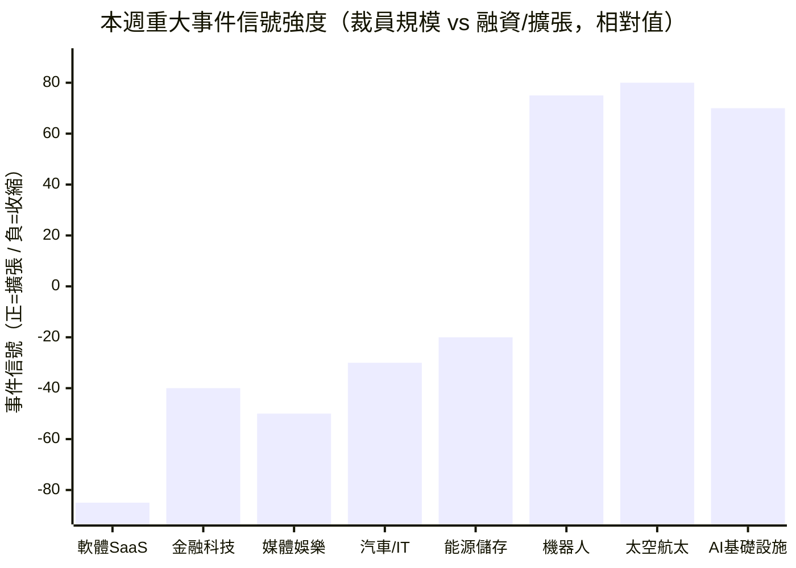

# 產業分層分析 — 2026年第25週

> 本報告數據直接讀取自 Extractor Layer 萃取結果（docs/Extractor/）。註：本週 Qdrant 向量搜尋因 OpenAI API 金鑰失效（HTTP 401）暫停，改以 Layer 語料庫直接讀取，底層資料一致。

## 摘要

> 本週產業格局呈現高度兩極化的「裁員潮 × 巨額融資」雙重信號。workforce_news 觀測到 **18 起人力調整事件，科技業占絕大多數**：Meta（8,000）、Cisco（近 4,000）、Intuit（逾 3,000）、Cloudflare（1,100，明確歸因 AI）、Snap（1,000）、Epic Games（1,000）、Coinbase（700）、GM（600 名 IT 員工）、GitLab（350）、Robinhood（290）等（來源：workforce_news）。值得注意的是 Cisco 與 Cloudflare **皆在營收創新高之際裁員**，直指 AI 效率提升而非業務萎縮。同時 funding_signals 顯示資本面熱絡：**SpaceX 完成史上最大 IPO 並同日以 $60B 收購 AI 程式碼工具 Cursor**（2026 年最大新創 M&A）、晶片商 AMD/Arm/Qualcomm 共同投資自駕新創 Wayve、Neura Robotics $1.4B、ElevenLabs $500M（來源：funding_signals）。總體經濟方面，美國 3 月 BLS 數據確認勞動市場溫和降溫（失業率 4.3%、U-6 升至 8.0%）（來源：global_bls）。微軟 CEO Nadella 公開警告「AI 可能空洞化整個產業」，為本週最具份量的就業市場信號。

## 14 產業職缺變化概覽

> 資料來源：workforce_news（裁員事件）、funding_signals（融資/IPO/M&A），觀測期間 2026-04-20 ~ 2026-06-17。**本圖為事件信號的定性相對強度示意（非職缺絕對數量）**：負值代表本週密集收縮信號（裁員），正值代表擴張信號（融資、IPO、招募）。tw_govjobs 與 global_manpower_outlook 本觀測期未更新，台灣微觀職缺與淨就業展望資料缺失。

## 產業總覽

| 產業 | 本週事件信號 | 主要驅動 | 擴張/收縮 | AI 衝擊 | 綜合評級 |
|------|--------------|----------|----------|---------|----------|
| 軟體與 SaaS | 密集裁員（Cloudflare/Intuit/GitLab）+ Cursor $60B 被收購 | AI 取代基礎開發、SaaS 模式轉型 | 🔴 分化（AI 原生擴張、傳統承壓） | 高 | ★★★ |
| 半導體 | 晶片商投資自駕（Wayve）、深科技回潮 | AI 算力 + 硬體投資論文回歸 | 🟢 穩定偏擴張 | 中 | ★★★ |
| 電子硬體 | Neura Robotics $1.4B、Standard Bots $200M | 機器人/硬體融資強勁 | 🟢 擴張信號 | 中 | ★★★★ |
| 金融服務 | Coinbase -700、Robinhood -290 裁員 | 加密/金融科技組織瘦身 + AI | 🔴 收縮 | 高 | ★★ |
| 醫療生技 | Beren $300M、City Therapeutics 等生技融資 | 生技醫療資本持續 | 🟢 穩定 | 低 | ★★★ |
| 製造業 | Mistral 工業 AI、Base10 真實經濟自動化 | 製程自動化加速 | 🟡 結構轉型 | 高 | ★★ |
| 零售電商 | 無重大本週事件 | — | 🟡 穩定 | 中 | ★★★ |
| 媒體娛樂 | Epic Games -1,000、Truecaller -70、Snap -1,000 | 參與度下滑、廣告營收萎縮 | 🔴 收縮 | 高 | ★★ |
| 教育 | 無重大本週事件 | — | 🟡 穩定 | 中 | ★★★ |
| 能源與綠能 | Redwood Materials -135、Convective $85M 氣候基金 | 電池回收轉型 + 氣候科技融資 | 🟡 結構轉型 | 低 | ★★★ |
| 營建不動產 | Base10 建築科技自動化投資 | PropTech/建築自動化 | 🟡 穩定 | 低 | ★★★ |
| 電信 | 無重大本週事件 | — | 🟡 穩定 | 中 | ★★ |
| 政府與非營利 | tw_govjobs 未更新 ⚠️ | 資料不足 | 🟡 穩定 | 低 | ★★★ |
| 專業服務 | Zip AI 採購代理、AI 治理合規需求 | AI 行政自動化 + 合規新職能 | 🟡 兩極（行政壓縮、合規擴張） | 中 | ★★★ |

> **綜合評級說明**：基於本週事件信號（裁員/融資）、AI 衝擊程度與趨勢延續性的綜合定性評估。★ 越多表示該產業當前求職環境相對友善。此評級為定性判斷，僅供參考。**本觀測期因 tw_govjobs、global_manpower_outlook 未更新，且 Qdrant 暫停，職缺絕對數量無法精確統計，總覽以事件信號方向為主。**

---

## 各產業詳細分析

### 1. 軟體與 SaaS（software_saas）

#### 市場數據
| 指標 | 數值 | 變化 | 來源 |
|------|------|------|------|
| 本週裁員事件 | Intuit 逾 3,000、GitLab 350、Snap 1,000、Meta 數百+8,000、Oracle 估 20K-30K | 🔴 密集 | workforce_news |
| 重大 M&A | SpaceX 以 $60B 收購 Cursor（年度最大新創 M&A） | 🟢 | funding_signals |
| AI 公司擴張 | ElevenLabs $500M Series D（ARR 達 $500M、估值 $110 億） | 🟢 | funding_signals |

#### 熱門角色 Top 5
| 角色 | 觀測信號 | 說明 | 薪資區間參考 |
|------|----------|------|--------------|
| Backend Engineer | global_hn_hiring backend 968 筆 | 仍為最大需求池 | $130K ~ $250K USD（HN Hiring 歷史參考） |
| Full Stack Engineer | global_hn_hiring fullstack 765 筆 | 高位需求 | $120K ~ $230K USD |
| Frontend Engineer | global_hn_hiring frontend 248 筆 | 穩定 | $110K ~ $200K USD |
| DevOps/SRE | global_hn_hiring devops 150 筆 | 穩定 | $140K ~ $260K USD |
| Security | global_hn_hiring security 68 筆 | 結構性成長 | $130K ~ $250K USD |

> 註：HN Hiring 各類別計數為 Layer 語料庫累計檔案數，反映需求結構而非單週新增量。

#### 熱門技能 Top 5
| 技能 | 說明 | 變化 |
|------|------|------|
| AI 協作工具（Cursor/Copilot Agent） | SpaceX $60B 收購 Cursor 標誌 AI 編碼工具成核心戰略資產 | ↑ |
| Python/Go/Rust | 後端主流語言 | → |
| Kubernetes/Docker | 容器化已成基礎要求 | → |
| Agentic workloads 架構 | GitLab 重建基礎設施因應 agentic 工作負載 | ↑ |
| 資安（Security） | 跨產業結構性需求 | ↑ |

#### [AI 取代向量](/glossary/#ai-取代向量)影響
| 向量 | 影響程度 | 說明 |
|------|----------|------|
| [認知例行](/glossary/#認知例行cognitive-routine) | 高 | Cloudflare 明確指 AI 使 1,100 個支援職位「過時」（來源：workforce_news） |
| [認知非例行](/glossary/#認知非例行cognitive-non-routine) | 中→高 | SpaceX 收購 Cursor、企業削減對人類工程師依賴；Coinbase 推「單人團隊」模式 |
| [體力例行](/glossary/#體力例行physical-routine) | 低 | 軟體開發不涉及體力工作 |
| [體力非例行](/glossary/#體力非例行physical-non-routine) | 低 | 軟體開發不涉及體力工作 |
| [高度人際](/glossary/#高度人際interpersonal) | 中 | 技術溝通、跨部門協調仍需人際技能 |

#### 事件信號
- 🔴 **Cloudflare：AI 使 1,100 個職位「過時」**：CEO Matthew Prince 明確表示營收創新高仍裁員，純 AI 效率取代（來源：workforce_news）[^1]
- 🔴 **Intuit 裁逾 3,000 人「重新聚焦 AI」**：近年最大裁員，CEO 致信員工降低複雜度、加碼 AI 產品（來源：workforce_news）[^2]
- 🔴 **GitLab 裁 350 人（14%）並退出 22 國**：CEO 稱 agentic workloads 對開發者基礎設施造成前所未有壓力（來源：workforce_news）[^3]
- 🟢 **SpaceX 以 $60B 收購 Cursor**：2026 年最大新創 M&A，AI 編碼工具成核心戰略資產（來源：funding_signals）[^4]
- 🟢 **ElevenLabs $500M Series D**：語音 AI 進規模化，ARR 季增 $100M（來源：funding_signals）[^5]
- 🟡 **Oracle 估裁 2 萬-3 萬人**：人數為估計範圍，部分遠端員工失 WARN Act 保護（來源：workforce_news，標記 REVIEW_NEEDED）[^6]

#### 全球對標
軟體與 SaaS 本週呈現極端分化。一方面，**AI 直接取代訊號空前明確**——Cloudflare 與 Cisco 皆在營收創新高之際裁員，明言是 AI 效率提升而非業務萎縮，這與過往「業務萎縮導致裁員」的邏輯根本不同（來源：workforce_news）。另一方面，AI 原生與工具型企業持續吸金：SpaceX $60B 收購 Cursor[^4]、ElevenLabs $500M[^5] 顯示資本仍重押 AI 軟體。Crunchbase 數據另指出 **2026 年至今美國公司吸納全球種子至成長階段融資約 80%**，AI 融資熱潮高度集中於美國（來源：funding_signals）[^7]。**推測**：在 AI 工具壓縮初中階工程需求的同時，AI 基礎模型與 agentic 架構人才的搶奪將更激烈，形成軟體業內部的人才兩極化。

#### 求職者行動參考
- 建議將 AI 協作工具（Cursor、Copilot Agent）熟練度視為基本競爭力，而非加分項
- 資安（security）與 agentic 基礎設施為軟體業內相對抗 AI 取代的子領域，建議評估轉型路徑

---

### 2. 半導體（semiconductor）

> ⚠️ **小樣本警示**：本系統無專門半導體職缺資料源，本段以 funding_signals 事件信號為主，職缺數據參考價值有限，請謹慎解讀。

#### 市場數據
| 指標 | 數值 | 變化 | 來源 |
|------|------|------|------|
| 重大投資信號 | AMD/Arm/Qualcomm 共同投資 Wayve（$60M，Series D 整輪 $1.2B） | 🟢 | funding_signals |
| 深科技回潮 | Playground Global「Silicon Is Back」硬體/深科技投資論文獲驗證 | 🟢 | funding_signals |

#### 熱門角色 Top 5
| 角色 | 觀測信號 | 說明 |
|------|----------|------|
| IC 設計工程師 | 小樣本 | 僅供參考 |
| 嵌入式 AI 工程師 | 自駕晶片投資帶動 | 需求趨勢正向 |
| 製程工程師 | 小樣本 | 僅供參考 |
| 測試/驗證工程師 | 小樣本 | 僅供參考 |
| GPU 系統工程師 | TensorWave $350M（AI 基礎設施） | AI 算力帶動 |

#### 熱門技能 Top 5
| 技能 | 說明 | 變化 |
|------|------|------|
| 端到端神經網路（自駕） | Wayve 架構可在 OEM 現有晶片平台運行 | ↑ |
| Verilog/VHDL | IC 設計核心 | → |
| EDA 工具 | 電子設計自動化 | → |
| GPU/算力系統 | TensorWave 等 AI 基礎設施融資帶動 | ↑ |
| 軟硬整合 | 深科技投資回潮，跨域能力成差異化 | ↑ |

#### AI 取代向量影響
| 向量 | 影響程度 | 說明 |
|------|----------|------|
| 認知例行 | 中 | EDA 工具自動化部分設計驗證 |
| 認知非例行 | 低 | 晶片架構設計需高度專業判斷 |
| 體力例行 | 高 | 晶圓廠生產線高度自動化 |
| 體力非例行 | 中 | 設備維護與異常排除需技術人員 |
| 高度人際 | 低 | 技術導向 |

#### 事件信號
- 🟢 **晶片商投資自駕新創**：AMD、Arm、Qualcomm 共同投資 Wayve，代表端到端自駕系統進入跨硬體平台量產前夕（來源：funding_signals）[^8]
- 🟢 **「Silicon Is Back」**：Playground Global 指 AI 浪潮帶動軟體以外的科學與工程突破受市場重視（來源：funding_signals）[^9]

#### 全球對標
半導體與硬體本週信號偏正向。晶片商領投自駕 AI 新創[^8]、創投界對硬體/深科技論文的重新肯定[^9]，**推測**將在未來 3-5 年拉動嵌入式 AI 工程師、自動駕駛系統驗證工程師與 GPU 系統工程師需求。本系統缺乏專門半導體職缺資料源，數據以事件信號呈現。

#### 求職者行動參考
- 建議關注嵌入式 AI 與自駕系統驗證職位，晶片商與汽車 OEM 的策略投資正推升此領域人才需求

---

### 3. 電子硬體（electronics_hardware）

> ⚠️ **小樣本警示**：本系統無專門電子硬體職缺資料源，本段以 funding_signals 事件信號為主，職缺數據參考價值有限。

#### 市場數據
| 指標 | 數值 | 變化 | 來源 |
|------|------|------|------|
| 機器人重大融資 | Neura Robotics $1.4B（全球本週最大）、Standard Bots $200M | 🟢 強勁 | funding_signals |
| 太空硬體 | SpaceX 史上最大 IPO、Iceye $520M Series F（衛星） | 🟢 | funding_signals |

#### 熱門角色 Top 5
| 角色 | 觀測信號 | 說明 |
|------|----------|------|
| 機器人軟體工程師 | Neura Robotics、Standard Bots 融資帶動 | 需求趨勢正向 |
| 嵌入式系統工程師 | 自駕/機器人/太空帶動 | 跨領域需求 |
| 韌體工程師 | 小樣本 | 僅供參考 |
| 衛星通訊工程師 | Iceye、SpaceX Starlink | 太空科技帶動 |
| 電子測試技術員 | 小樣本 | 僅供參考 |

#### 熱門技能 Top 5
| 技能 | 說明 | 變化 |
|------|------|------|
| 機器人軟體/ROS | 機器人融資強勁 | ↑ |
| 嵌入式 C/C++ | 韌體開發核心 | → |
| PCB 設計 | 電路板佈局 | → |
| 衛星/RF 通訊 | 太空科技帶動 | ↑ |
| 軟硬整合 | 跨域能力成競爭力 | ↑ |

#### AI 取代向量影響
| 向量 | 影響程度 | 說明 |
|------|----------|------|
| 認知例行 | 中 | PCB 設計部分流程可自動化 |
| 認知非例行 | 低 | 硬體系統整合需跨領域專業 |
| 體力例行 | 高 | 組裝生產線高度自動化 |
| 體力非例行 | 中 | 產品測試與維修需技術人員 |
| 高度人際 | 低 | 研發導向 |

#### 事件信號
- 🟢 **Neura Robotics $1.4B Series C**：德國機器人公司，本週全球最大融資輪（來源：funding_signals）[^10]
- 🟢 **Standard Bots $200M**：General Catalyst 領投，機器人自動化持續吸金（來源：funding_signals）[^10]
- 🟢 **SpaceX 史上最大 IPO**：資本充裕將擴大火箭工程、衛星通訊（Starlink）人才招募（來源：funding_signals）[^11]

#### 全球對標
電子硬體本週表現為各產業中信號最正向者之一。機器人（Neura Robotics $1.4B、Standard Bots $200M）[^10]與太空科技（SpaceX IPO、Iceye $520M）[^11] 的大額融資，**推測**將在中期顯著拉動嵌入式系統、機器人軟體與衛星通訊人才需求。對純軟體背景人才而言，軟硬整合能力正成為跨入此領域的差異化籌碼[^9]。

#### 求職者行動參考
- 機器人、太空科技為硬體與嵌入式人才的高成長新出路，建議評估相關職缺與軟硬整合技能補強

---

### 4. 金融服務（financial_services）

> ⚠️ **小樣本警示**：本週 tw_govjobs 未更新，無台灣金融職缺微觀數據；本段以 workforce_news 事件信號為主。

#### 市場數據
| 指標 | 數值 | 變化 | 來源 |
|------|------|------|------|
| 本週裁員 | Coinbase 700（14%）、Robinhood 290（10%） | 🔴 收縮 | workforce_news |
| AI 採購自動化 | Zip 推 5 款 AI Agent（估值 $2.2B），自動化財務/採購流程 | 🟡 | funding_signals |

#### 熱門角色 Top 5
| 角色 | 觀測信號 | 說明 | 薪資區間參考 |
|------|----------|------|--------------|
| 金融科技工程師 | Coinbase/Robinhood 裁員 | 組織瘦身 | 小樣本 |
| 合規/風控 | AI 治理合規需求上升 | 結構性成長 | 小樣本 |
| 採購/合約管理 | Zip AI Agent 直接衝擊 | 行政壓縮 | 小樣本 |
| 財務分析師 | AI 代理式工具崛起 | 中期壓力 | 小樣本 |
| 隱私工程師 | DataGrail 報告凸顯 AI 資料治理 | 新興需求 | 小樣本 |

#### 熱門技能 Top 5
| 技能 | 說明 | 變化 |
|------|------|------|
| Python/SQL 資料分析 | 財務自動化基本盤 | ↑ |
| AI 治理/合規 | DataGrail 報告凸顯供應商 AI 資料風險 | ↑ |
| 風險管理 | 合規與風控 | → |
| Excel/VBA | 傳統財務建模 | ↓ |
| 加密/區塊鏈 | Digital Asset $355M 等仍有資本 | → |

#### AI 取代向量影響
| 向量 | 影響程度 | 說明 |
|------|----------|------|
| 認知例行 | 高 | Zip AI Agent 自動化採購與合約審核，直接衝擊行政職能（來源：funding_signals） |
| 認知非例行 | 中 | 投資分析、風險評估 AI 輔助持續增加 |
| 體力例行 | 低 | 金融服務不涉及體力工作 |
| 體力非例行 | 低 | 金融服務不涉及體力工作 |
| 高度人際 | 中 | 客戶關係、財務諮詢仍需人際技能 |

#### 事件信號
- 🔴 **Coinbase 裁 700 人（14%）並推「單人團隊」模式**：CEO Brian Armstrong 強調 AI 大幅提升小團隊生產力，扁平化至五層管理（來源：workforce_news）[^12]
- 🔴 **Robinhood 裁 290 人（10%）**：CEO 刻意未以 AI 為由，與同業 AI 重組說法形成對比（來源：workforce_news）[^13]
- 🟡 **Zip AI 採購代理上線**：衝擊企業採購專員、合約管理員，同時催生 AI 實施整合新職缺（來源：funding_signals）[^14]

#### 全球對標
金融服務本週呈現明確收縮信號。Coinbase（700）與 Robinhood（290）的裁員[^12][^13] 反映金融科技業的組織瘦身潮——值得注意的是兩者敘事不同：Coinbase 明言 AI 提升生產力，Robinhood 則刻意迴避 AI 歸因，凸顯「AI 作為裁員理由」本身正成為被檢視的議題（參見 workforce_news 對「AI psychosis」與「blaming AI isn't cutting it」的記錄）。美國 3 月平均時薪年增 3.5%[^15] 顯示整體薪資仍具韌性，但 AI 代理式工具（Zip）[^14] 正加速壓縮金融行政職能。

#### 求職者行動參考
- 建議金融從業者強化 Python/SQL 與 AI 治理/合規能力；AI 代理式工具正快速改變採購、合約、財務分析等職能

---

### 5. 醫療生技（healthcare_biotech）

> ⚠️ **小樣本警示**：本週無台灣醫療職缺微觀數據（tw_govjobs 未更新），本段以 funding_signals 生技融資信號為主。

#### 市場數據
| 指標 | 數值 | 變化 | 來源 |
|------|------|------|------|
| 生技融資 | Beren Therapeutics $300M、City Therapeutics、GT Medical 等 | 🟢 持續 | funding_signals |
| 醫療器材 | 本週十大融資輪含醫療器材多筆 | 🟢 | funding_signals |

#### 熱門角色 Top 5
| 角色 | 觀測信號 | 說明 |
|------|----------|------|
| 臨床研究員 | 小樣本 | 僅供參考 |
| 生物統計/數據分析 | 生技融資帶動 | 需求正向 |
| 醫療資訊工程師 | 小樣本 | 僅供參考 |
| 護理人員 | 高齡化結構驅動 | 穩定需求 |
| 藥物研發科學家 | Beren/City Therapeutics 等融資 | 需求正向 |

#### 熱門技能 Top 5
| 技能 | 說明 | 變化 |
|------|------|------|
| 臨床試驗管理 | GCP 法規與試驗設計 | → |
| 生物統計/數據分析 | 生技融資帶動 | ↑ |
| 醫療影像 AI | AI 輔助判讀持續進步 | ↑ |
| 電子病歷系統 | EMR/EHR 操作 | → |
| 藥物研發 | 新藥開發融資活躍 | ↑ |

#### AI 取代向量影響
| 向量 | 影響程度 | 說明 |
|------|----------|------|
| 認知例行 | 中 | 醫療影像 AI 判讀持續進步 |
| 認知非例行 | 低 | 臨床診斷仍需醫師專業判斷 |
| 體力例行 | 低 | 照護工作需人類直接接觸 |
| 體力非例行 | 低 | 護理、照顧需靈活應對 |
| 高度人際 | 高度保護 | 病患關懷、情緒支持不可取代 |

#### 事件信號
- 🟢 **生技醫療融資持續**：Beren Therapeutics $300M、City Therapeutics、GT Medical（Viking Global 投資）等多筆百萬美元以上交易（來源：funding_signals）[^10]
- 🟡 **美國失業率升至 4.3%、U-6 升至 8.0%**：3 月 BLS 數據確認勞動市場降溫（來源：global_bls）[^15][^16]

#### 全球對標
醫療生技本週延續穩定偏正向趨勢，是少數 **AI 衝擊低且有資本支持**的產業。生技與醫療器材在本週十大融資輪中占多席[^10]，反映資本對生命科學的持續興趣。美國 3 月失業率升至 4.3%、U-6 升至 8.0%[^15][^16] 顯示整體勞動市場降溫，但醫療業受高齡化結構性驅動，照護人力需求穩定（本週因 tw_govjobs 未更新，無台灣最新數據）。

#### 求職者行動參考
- 醫療生技 AI 衝擊低、高齡化長期支撐，適合追求穩定性的求職者；生物統計與醫療 AI 為成長子領域

---

### 6. 製造業（manufacturing）

> ⚠️ **小樣本警示**：本系統無專門製造業職缺資料源（tw_govjobs 未更新），本段以 funding_signals 自動化投資信號為主。

#### 市場數據
| 指標 | 數值 | 變化 | 來源 |
|------|------|------|------|
| 工業 AI | Mistral AI 進軍工業製造 AI、建推理資料中心 | 🟡 結構轉型 | funding_signals |
| 真實經濟自動化 | Base10 Partners $850M 投資物流/建築/製造自動化 | 🟡 | funding_signals |

#### 熱門角色 Top 5
| 角色 | 觀測信號 | 說明 |
|------|----------|------|
| 製程工程師 | 小樣本 | 僅供參考 |
| 自動化/機器人工程師 | Mistral 工業 AI、機器人融資 | 需求正向 |
| 品管工程師 | AI 視覺檢測普及 | 部分被替代 |
| 設備維護技師 | 小樣本 | 僅供參考 |
| MLOps/製程 AI | 工廠 AI 應用加速 | 新興需求 |

#### 熱門技能 Top 5
| 技能 | 說明 | 變化 |
|------|------|------|
| 工業 AI/製程優化 | Mistral 進軍工業 AI | ↑ |
| 機器人/自動化整合 | 真實經濟自動化投資 | ↑ |
| 品質管理 | ISO 品管系統 | → |
| PLC 控制 | 可程式邏輯控制器 | → |
| AutoCAD/設備維護 | 基礎製造技能 | → |

#### AI 取代向量影響
| 向量 | 影響程度 | 說明 |
|------|----------|------|
| 認知例行 | 中 | 品管檢測 AI 視覺辨識普及 |
| 認知非例行 | 低 | 製程優化仍需工程師判斷 |
| 體力例行 | 高 | Mistral 工業 AI、Base10 自動化投資加速生產線自動化（來源：funding_signals） |
| 體力非例行 | 中 | 設備維護與異常處理需技術人員 |
| 高度人際 | 低 | 製造業人際互動需求較低 |

#### 事件信號
- 🟡 **Mistral AI 進軍工業製造 AI**：工廠自動化與製程優化 AI 應用加速，可能衝擊技術工人與品管人員（來源：funding_signals）[^17]
- 🟡 **Base10 Partners $850M 投資真實經濟自動化**：資金流向物流、建築、製造等雇用大量藍領的傳統行業（來源：funding_signals）[^18]

#### 全球對標
製造業本週信號為「結構轉型」而非單純擴張或收縮。Mistral 進軍工業 AI[^17]、Base10 專注「真實經濟」自動化投資 $850M[^18]，**推測**將加速製造業的製程自動化，對技術工人與品管人員形成結構性壓力，同時為自動化整合工程師、製程 AI（MLOps）人才創造新機會。本系統缺製造業職缺資料源，數據以事件信號呈現。

#### 求職者行動參考
- 建議製造業從業者評估自動化整合與製程 AI 技能；傳統作業職類面臨結構性自動化壓力，跨域升級為較穩健路徑

---

### 7. 零售電商（retail_ecommerce）

> ⚠️ **小樣本警示**：本週無重大零售電商事件，且 tw_govjobs 未更新，以下主要基於趨勢延續性判斷。

#### 市場數據
| 指標 | 數值 | 變化 | 來源 |
|------|------|------|------|
| 本週事件 | 無重大裁員/融資事件 | 🟡 持平 | workforce_news/funding_signals |
| 消費力支撐 | 美國平均時薪年增 3.5%（超 CPI 3.3%） | 🟢 正向 | global_bls |

#### 熱門角色 Top 5
| 角色 | 觀測信號 | 說明 |
|------|----------|------|
| 數位行銷專員 | 小樣本 | 僅供參考 |
| 電商營運 | 小樣本 | 僅供參考 |
| 客戶服務 | AI 客服替代壓力 | 部分被替代 |
| 物流協調 | Base10 物流自動化投資 | 中期壓力 |
| 銷售顧問 | 小樣本 | 僅供參考 |

#### 熱門技能 Top 5
| 技能 | 說明 | 變化 |
|------|------|------|
| 數位行銷 | 電商行銷工具 | ↑ |
| CRM 系統 | 客戶關係管理 | → |
| 資料分析 | 消費者行為分析 | ↑ |
| AI 客服工具 | 對話式 AI 應用 | ↑ |
| 供應鏈/物流 | 物流自動化趨勢 | → |

#### AI 取代向量影響
| 向量 | 影響程度 | 說明 |
|------|----------|------|
| 認知例行 | 高 | 收銀、庫存、客服自動化增加 |
| 認知非例行 | 低 | 顧客服務需臨場應變 |
| 體力例行 | 中 | 物流自動化（Base10 投資）逐漸普及 |
| 體力非例行 | 低 | 零售服務需靈活應對 |
| 高度人際 | 中度保護 | 顧客互動、服務體驗仍需人力 |

#### 事件信號
- 🟢 **美國薪資增長超通膨**：3 月平均時薪年增 3.5%（超 CPI 3.3%），實質薪資正成長，對消費力有正面支撐（來源：global_bls）[^15]
- 🟡 **物流自動化投資**：Base10 $850M 投資真實經濟自動化（含物流），中期可能壓縮物流人力（來源：funding_signals）[^18]

#### 全球對標
零售電商本週無重大事件，延續穩定格局。美國薪資增長持續超通膨[^15] 對消費力形成正面支撐，但物流與客服的自動化趨勢[^18] 持續對基層職能構成中期壓力。本週因 tw_govjobs 未更新，無台灣零售職缺最新數據。

#### 求職者行動參考
- 零售電商小樣本限制大，台灣求職者建議以 tw_govjobs、104 人力銀行交叉確認；數位行銷與資料分析為相對抗替代方向

---

### 8. 媒體娛樂（media_entertainment）

#### 市場數據
| 指標 | 數值 | 變化 | 來源 |
|------|------|------|------|
| 本週裁員 | Epic Games 1,000、Snap 1,000、Truecaller 70（廣告營收 -44%）、Meta 數百（含 Reality Labs） | 🔴 密集收縮 | workforce_news |

#### 熱門角色 Top 5
| 角色 | 觀測信號 | 說明 |
|------|----------|------|
| 遊戲開發 | Epic Games 裁 1,000（Fortnite 參與度下滑） | 🔴 收縮 |
| 數位行銷/廣告 | Truecaller 廣告營收 -44% | 🔴 壓力 |
| 社群經營 | Snap 裁 1,000（16%） | 🔴 收縮 |
| 影音內容製作 | AI 內容生成衝擊 | 中期壓力 |
| 內容策略師 | AI 工具應用為新要求 | 轉型 |

#### 熱門技能 Top 5
| 技能 | 說明 | 變化 |
|------|------|------|
| AI 內容工具 | ChatGPT、生成式 AI 應用 | ↑ |
| 數位廣告投放 | 廣告市場緊縮環境下要求更高 | → |
| 社群經營 | 多平台經營 | → |
| 影音剪輯 | Premiere/After Effects | → |
| 遊戲引擎 | Unreal/Unity | → |

#### AI 取代向量影響
| 向量 | 影響程度 | 說明 |
|------|----------|------|
| 認知例行 | 高 | 內容審核、影片標籤自動化 |
| 認知非例行 | 高 | AI 生成內容快速發展，衝擊創意與內容製作職能 |
| 體力例行 | 低 | 媒體娛樂不涉及體力工作 |
| 體力非例行 | 低 | 媒體娛樂不涉及體力工作 |
| 高度人際 | 中 | 創意發想、客戶提案需人際技能 |

#### 事件信號
- 🔴 **Epic Games 裁 1,000 人**：Fortnite 玩家參與度自 2025 年持續下滑，識別逾 5 億美元成本節約（來源：workforce_news）[^19]
- 🔴 **Snap 裁 1,000 人（16%）**：CEO Evan Spiegel 引用 AI 技術進步為主因（來源：workforce_news）[^20]
- 🔴 **Truecaller 裁 70 人**：廣告營收下滑 44%，反映行動廣告科技業壓力（來源：workforce_news）[^21]

#### 全球對標
媒體娛樂為本週收縮信號最密集的產業之一。Epic Games（遊戲參與度下滑）[^19]、Snap（AI 歸因）[^20]、Truecaller（廣告營收 -44%）[^21] 反映三種不同壓力：產品生命週期、AI 取代、廣告市場萎縮。**推測**：AI 內容生成的普及將持續壓縮傳統內容製作與廣告職能，媒體業面臨「需求結構性下移 + AI 工具替代」雙重衝擊。

#### 求職者行動參考
- 媒體產業持續收縮，建議強化 AI 內容工具應用能力，並培養跨產業可轉移的數位行銷/資料分析技能

---

### 9. 教育（education）

> ⚠️ **小樣本警示**：本週無重大教育事件，且無台灣教育職缺微觀數據，以下主要基於趨勢延續性判斷。

#### 市場數據
| 指標 | 數值 | 變化 | 來源 |
|------|------|------|------|
| 本週事件 | 無重大裁員/融資事件 | 🟡 持平 | workforce_news/funding_signals |

#### 熱門角色 Top 5
| 角色 | 觀測信號 | 說明 |
|------|----------|------|
| 教學設計師 | 小樣本 | 僅供參考 |
| 數位學習專員 | AI 教學工具發展 | 需求正向 |
| 課程規劃師 | 小樣本 | 僅供參考 |
| 教育訓練員 | 小樣本 | 僅供參考 |
| 才藝/學科教師 | 人際核心受保護 | 穩定 |

#### 熱門技能 Top 5
| 技能 | 說明 | 變化 |
|------|------|------|
| AI 教學工具 | AI 家教、自動批改 | ↑ |
| 數位教學 | 線上教學平台 | ↑ |
| 教學設計 | 課程規劃與教案 | → |
| 班級經營 | 學生輔導管理 | → |
| 多媒體教材 | 教材製作工具 | → |

#### AI 取代向量影響
| 向量 | 影響程度 | 說明 |
|------|----------|------|
| 認知例行 | 高 | 題庫、作業批改可自動化 |
| 認知非例行 | 中 | 課程設計、教學策略需專業判斷 |
| 體力例行 | 低 | 教育不涉及體力工作 |
| 體力非例行 | 低 | 教育不涉及體力工作 |
| 高度人際 | 高度保護 | 學生輔導、情緒支持不可取代 |

#### 事件信號
- 無本週重大事件
- 🟡 **AI 知識工作衝擊延伸**：小參數模型（Weibo VibeThinker-3B）追平大模型性能的趨勢，可能降低 AI 教育工具門檻（來源：funding_signals）[^22]

#### 全球對標
教育產業延續穩定趨勢，AI 教育工具持續發展但教師核心人際功能受保護。小參數高性能模型趨勢[^22] **推測**將降低 AI 教育應用的部署成本，加速 AI 家教與個性化學習普及，但核心教師角色穩定。

#### 求職者行動參考
- 教育業小樣本限制大，建議以教育專業平台交叉確認；AI 教學工具應用能力為加分項

---

### 10. 能源與綠能（energy_green）

> ⚠️ **小樣本警示**：本系統無專門能源職缺資料源，本段以 workforce_news 與 funding_signals 事件信號為主。

#### 市場數據
| 指標 | 數值 | 變化 | 來源 |
|------|------|------|------|
| 本週裁員 | Redwood Materials 135（10%，電池回收轉型能源儲存） | 🟡 結構轉型 | workforce_news |
| 氣候科技融資 | Convective Capital Fund II $85M（災害韌性） | 🟢 | funding_signals |
| AI 算力需求 | 多家 AI 公司資料中心投資推升電力需求 | 🟢 | funding_signals |

#### 熱門角色 Top 5
| 角色 | 觀測信號 | 說明 |
|------|----------|------|
| 能源儲存工程師 | Redwood 轉型能源儲存業務 | 需求正向 |
| 電力系統工程師 | AI 資料中心電力需求 | 需求正向 |
| 再生能源工程師 | 氣候科技融資 | 需求正向 |
| 資料中心工程師 | AI 算力基礎建設 | 新興需求 |
| 環安衛工程師 | 小樣本 | 僅供參考 |

#### 熱門技能 Top 5
| 技能 | 說明 | 變化 |
|------|------|------|
| 能源儲存系統 | 電池/儲能技術 | ↑ |
| 電力系統 | 配電與輸電（AI 資料中心帶動） | ↑ |
| 太陽能/風力 | 再生能源技術 | ↑ |
| 氣候韌性技術 | AI 攝影機、消防機器人等 | ↑ |
| 能源法規 | 再生能源相關法規 | → |

#### AI 取代向量影響
| 向量 | 影響程度 | 說明 |
|------|----------|------|
| 認知例行 | 中 | 能源調度可部分自動化 |
| 認知非例行 | 低 | 能源系統設計需工程專業 |
| 體力例行 | 中 | 發電廠運維自動化增加 |
| 體力非例行 | 低 | 現場維護需技術人員 |
| 高度人際 | 低 | 技術導向 |

#### 事件信號
- 🟡 **Redwood Materials 裁 135 人（10%）**：電池回收轉型整合型能源儲存業務，五個月內第二次裁員，但 CEO 稱公司處於最強狀態（來源：workforce_news）[^23]
- 🟢 **Convective Capital Fund II $85M**：氣候韌性 VC，較 Fund I 成長 143%，投入防火、電力線巡檢等領域（來源：funding_signals）[^24]
- 🟢 **AI 算力帶動電力需求**：多家 AI 公司資料中心投資推升電力與能源技術人才需求（來源：funding_signals）

#### 全球對標
能源與綠能本週呈現「轉型中成長」格局。Redwood Materials 的裁員[^23] 屬業務聚焦（電池回收→能源儲存）而非萎縮，CEO 強調公司處於最強狀態。氣候科技融資（Convective $85M）[^24] 持續活躍，AI 資料中心的電力需求正成為能源產業新成長動力。此產業 **AI 衝擊低**，是相對穩健的領域。

#### 求職者行動參考
- 綠能與能源儲存為長期成長領域、AI 衝擊低；AI 資料中心電力供應為新興機會，建議關注儲能與電力系統技能

---

### 11. 營建不動產（construction_realestate）

> ⚠️ **小樣本警示**：本系統無專門營建職缺資料源，本段以 funding_signals 事件信號為主。

#### 市場數據
| 指標 | 數值 | 變化 | 來源 |
|------|------|------|------|
| 建築自動化投資 | Base10 Partners $850M（含建築科技自動化） | 🟡 | funding_signals |

#### 熱門角色 Top 5
| 角色 | 觀測信號 | 說明 |
|------|----------|------|
| BIM 工程師 | 建築數位化趨勢 | 需求正向 |
| 建築科技工程師 | Base10 建築自動化投資 | 新興需求 |
| 工地主任 | 小樣本 | 僅供參考 |
| 工務工程師 | 小樣本 | 僅供參考 |
| 測量/工程管理 | 小樣本 | 僅供參考 |

#### 熱門技能 Top 5
| 技能 | 說明 | 變化 |
|------|------|------|
| BIM | 建築資訊模型 | ↑ |
| 建築自動化/PropTech | 建築科技工具 | ↑ |
| AutoCAD | 建築製圖 | → |
| 工程管理 | 進度與品質管理 | → |
| 營建法規 | 建築法規與安全 | → |

#### AI 取代向量影響
| 向量 | 影響程度 | 說明 |
|------|----------|------|
| 認知例行 | 中 | BIM 設計部分流程自動化 |
| 認知非例行 | 低 | 建築設計需創意與專業判斷 |
| 體力例行 | 中 | 預製構件與建築自動化減少現場人力 |
| 體力非例行 | 低 | 現場施工需靈活應對 |
| 高度人際 | 低 | 技術導向 |

#### 事件信號
- 🟡 **建築自動化投資**：Base10 Partners $850M 基金涵蓋建築科技自動化（來源：funding_signals）[^18]

#### 全球對標
營建不動產本週表現平穩，AI 衝擊低。Base10 對建築自動化的投資[^18] **推測**將推動 BIM、建築科技工具的應用，但整體為週期性產業，受利率政策影響較大。

#### 求職者行動參考
- 小樣本限制下，建議關注 BIM 與建築科技（PropTech）工具學習，提升數位化競爭力

---

### 12. 電信（telecom）

> ⚠️ **小樣本警示**：本系統無專門電信職缺資料源，本週無重大電信事件，以下主要基於趨勢延續性判斷。

#### 市場數據
| 指標 | 數值 | 變化 | 來源 |
|------|------|------|------|
| 本週事件 | 無重大裁員/融資事件 | 🟡 持平 | workforce_news/funding_signals |
| 間接帶動 | AI 資料中心建設帶動網路基礎建設需求 | 🟢 | funding_signals |

#### 熱門角色 Top 5
| 角色 | 觀測信號 | 說明 |
|------|----------|------|
| 網路工程師 | AI 資料中心需求 | 需求正向 |
| 5G 工程師 | 5G 基礎建設 | 穩定 |
| 系統管理員 | 小樣本 | 僅供參考 |
| 資安工程師 | 跨產業資安需求 | 需求正向 |
| 客服專員 | AI 客服替代壓力 | 部分被替代 |

#### 熱門技能 Top 5
| 技能 | 說明 | 變化 |
|------|------|------|
| 網路架構 | TCP/IP、路由交換 | → |
| 5G 技術 | 5G 網路規劃與部署 | ↑ |
| 資安 | 網路安全防護 | ↑ |
| Linux 管理 | 伺服器維運 | → |
| 資料中心網路 | AI 算力基礎建設 | ↑ |

#### AI 取代向量影響
| 向量 | 影響程度 | 說明 |
|------|----------|------|
| 認知例行 | 高 | 客服、帳務自動化程度高 |
| 認知非例行 | 中 | 網路規劃需工程專業 |
| 體力例行 | 中 | 機房維運自動化增加 |
| 體力非例行 | 低 | 基地台維護需現場技術人員 |
| 高度人際 | 中 | 企業客戶銷售需人際技能 |

#### 事件信號
- 無本週重大事件
- 🟢 **AI 資料中心間接帶動**：多家 AI 公司資料中心投資（Mistral、TensorWave 等）可能間接帶動網路基礎建設需求（來源：funding_signals）

#### 全球對標
電信產業延續穩定趨勢，5G 基礎建設持續推動。AI 資料中心建設可能間接帶動網路基礎建設與資料中心網路人才需求，但整體就業成長有限，基層客服面臨 AI 自動化壓力。

#### 求職者行動參考
- 電信業小樣本限制大，建議關注 5G、資料中心網路與資安技能；基層客服職能面臨 AI 替代壓力

---

### 13. 政府與非營利（government_ngo）

> ⚠️ **小樣本警示**：本週因 tw_govjobs 未納入觀測，政府類職缺數據不足。以下主要基於趨勢延續性與 BLS 總體數據判斷。

#### 市場數據
| 指標 | 數值 | 變化 | 來源 |
|------|------|------|------|
| 觀測職缺數 | 資料不足 | — | tw_govjobs 未更新 |
| 美國勞動市場 | 失業率 4.3%、U-6 8.0%、NFP +178K | 🟡 溫和降溫 | global_bls |

#### 熱門角色 Top 5
| 角色 | 觀測信號 | 說明 |
|------|----------|------|
| 行政人員 | 資料不足 | tw_govjobs 未更新 |
| 政策分析 | 資料不足 | — |
| 社福推展員 | 資料不足 | — |
| 公共衛生 | 資料不足 | — |
| AI 治理/合規 | 政府數位轉型新需求 | 新興 |

#### 熱門技能 Top 5
| 技能 | 說明 | 變化 |
|------|------|------|
| 公文撰寫 | 政府公文格式 | → |
| 行政管理 | 一般行政事務 | → |
| 資料分析 | 政策數據分析 | ↑ |
| AI 治理 | 公部門 AI 應用治理 | ↑ |
| 法規知識 | 相關法令與規範 | → |

#### AI 取代向量影響
| 向量 | 影響程度 | 說明 |
|------|----------|------|
| 認知例行 | 高 | 公文處理、資料建檔可自動化 |
| 認知非例行 | 低 | 政策制定需專業判斷 |
| 體力例行 | 低 | 不涉及體力勞動 |
| 體力非例行 | 低 | 不涉及體力勞動 |
| 高度人際 | 中度保護 | 民眾服務、社會福利需人際互動 |

#### 事件信號
- 🟡 **美國勞動市場溫和降溫**：3 月失業率 4.3%、U-6 8.0%、NFP +178K，政府部門分項待確認（來源：global_bls）[^15][^16][^25]

#### 全球對標
台灣公部門就業穩定性高、受法規保護、AI 衝擊低。美國 3 月失業率升至 4.3%、U-6 升至 8.0%[^15][^16]，整體勞動市場溫和降溫，政府部門具體變動待 BLS 分項數據確認。本週因 tw_govjobs 未更新，無台灣公部門最新數據。

#### 求職者行動參考
- 政府部門穩定性高、AI 衝擊低，適合追求工作穩定性的求職者；建議補強資料分析與 AI 治理能力

---

### 14. 專業服務（professional_services）

> ⚠️ **小樣本警示**：本系統無專門專業服務職缺資料源，本段以 funding_signals 事件信號為主。

#### 市場數據
| 指標 | 數值 | 變化 | 來源 |
|------|------|------|------|
| AI 行政自動化 | Zip 5 款 AI Agent（採購/財務）、企業 IT 管理 NinjaOne $400M | 🟡 兩極 | funding_signals |
| AI 治理合規 | DataGrail 報告凸顯供應商 AI 資料風險 | 🟢 新興需求 | funding_signals |

#### 熱門角色 Top 5
| 角色 | 觀測信號 | 說明 |
|------|----------|------|
| AI 商業分析師 | 企業 AI 導入評估需求 | 需求正向 |
| 管理顧問 | M&A 整合與盡職調查 | 需求正向 |
| 合規長/隱私工程師 | DataGrail AI 資料治理 | 新興需求 |
| 採購/合約專員 | Zip AI Agent 直接衝擊 | 行政壓縮 |
| IT 運維 | NinjaOne 企業 IT 管理融資 | 需求正向 |

#### 熱門技能 Top 5
| 技能 | 說明 | 變化 |
|------|------|------|
| AI 工具應用 | ChatGPT、自動化工具 | ↑ |
| AI 治理/合規 | 隱私工程、DPO 職能 | ↑ |
| 專案管理 | PMP/Scrum | → |
| 資料分析 | 商業分析基礎 | ↑ |
| 商業英文 | 國際業務溝通 | → |

#### AI 取代向量影響
| 向量 | 影響程度 | 說明 |
|------|----------|------|
| 認知例行 | 高 | Zip AI Agent 自動化採購與合約審核，衝擊行政職能（來源：funding_signals） |
| 認知非例行 | 中 | 專業諮詢需人類判斷 |
| 體力例行 | 低 | 不涉及體力工作 |
| 體力非例行 | 低 | 不涉及體力工作 |
| 高度人際 | 中度保護 | 客戶關係、諮詢服務需人際技能 |

#### 事件信號
- 🟡 **Zip AI 採購代理**：自動化採購與合約審核，衝擊採購專員、合約管理員，同時催生 AI 實施整合新職缺（來源：funding_signals）[^14]
- 🟢 **AI 治理合規需求上升**：DataGrail 報告呼籲企業重審供應商 AI 資料風險，帶動隱私工程師、合規長需求（來源：funding_signals）[^26]
- 🟢 **企業 IT 管理融資**：NinjaOne $400M Series C 延伸輪，帶動 IT 運維與安全職能（來源：funding_signals）[^10]

#### 全球對標
專業服務本週呈現「行政壓縮、合規擴張」的兩極格局。一方面，AI 代理式工具（Zip）[^14] 直接衝擊採購、合約等行政職能；另一方面，AI 治理合規（DataGrail）[^26]、企業 IT 管理（NinjaOne）[^10] 帶動新興職能需求。**推測**：具備「專業領域知識 + AI 工具應用」複合能力的人才，將是專業服務業最具競爭力的組合。

#### 求職者行動參考
- 建議發展「專業領域知識 + AI 工具應用」複合能力；AI 治理/合規為新興且抗替代的職能方向

---

## 跨產業比較

### 本週事件信號排名（擴張 vs 收縮）

| 排名 | 產業 | 信號方向 | 主要事件 |
|------|------|----------|----------|
| 1 | 電子硬體（機器人/太空） | 🟢🟢 強擴張 | Neura Robotics $1.4B、SpaceX IPO、Standard Bots $200M |
| 2 | 半導體 | 🟢 擴張 | 晶片商投資 Wayve、深科技回潮 |
| 3 | 醫療生技 | 🟢 穩定偏擴張 | 生技融資持續（Beren $300M 等） |
| 4 | 能源與綠能 | 🟡→🟢 轉型成長 | AI 算力帶動電力、氣候科技融資 |
| 5 | 專業服務 | 🟡 兩極 | AI 行政壓縮 + 合規/IT 擴張 |
| 6 | 製造業 | 🟡 結構轉型 | 工業 AI、真實經濟自動化 |
| 7 | 軟體與 SaaS | 🔴🟢 極端分化 | 密集裁員 + AI 公司巨額融資 |
| 8 | 金融服務 | 🔴 收縮 | Coinbase -700、Robinhood -290 |
| 9 | 媒體娛樂 | 🔴🔴 密集收縮 | Epic Games -1,000、Snap -1,000、Truecaller -70 |
| 10-14 | 零售/教育/營建/電信/政府 | 🟡 穩定/資料不足 | 無重大本週事件，部分資料源未更新 |

> **注意**：本排名為「本週事件信號方向」的定性排序，非職缺絕對數量排名。本觀測期 tw_govjobs、global_manpower_outlook 未更新，且 Qdrant 暫停，無法提供職缺絕對數量統計。

### 薪資水準參考

| 排名 | 產業 | 薪資中位參考 | 說明 |
|------|------|-------------|------|
| 1 | 軟體與 SaaS | $120K-$280K USD | 全球科技資深工程師（HN Hiring 歷史參考） |
| — | 美國整體 | $37.38/時（+3.5% YoY） | BLS 3 月平均時薪（來源：global_bls） |
| — | 美國通膨 | CPI +3.3% YoY | 實質薪資正成長（來源：global_bls） |

> 註：本觀測期缺薪資微觀資料源（tw_govjobs 未更新、Qdrant 暫停），薪資資料以 BLS 總體數據與 HN Hiring 歷史範圍呈現。詳細薪資帶請見薪資帶分析報告。

### AI 衝擊程度排名

| 排名 | 產業 | AI 衝擊綜合評分 | 最受影響向量 | 本週關鍵事件 |
|------|------|----------------|--------------|--------------|
| 1 | 軟體與 SaaS | 高 | 認知例行→認知非例行 | Cloudflare AI 使 1,100 職位「過時」、Cursor $60B 被收購 |
| 2 | 媒體娛樂 | 高 | 認知非例行 | Snap 引用 AI 裁 1,000、AI 內容生成衝擊 |
| 3 | 金融服務 | 高 | 認知例行 | Coinbase 推「單人團隊」、Zip AI 採購代理 |
| 4 | 製造業 | 高 | 體力例行 | Mistral 工業 AI、真實經濟自動化投資 |
| 5 | 專業服務 | 中 | 認知例行 | Zip AI Agent 衝擊採購/合約行政 |
| 6 | 汽車/IT | 中→高 | 認知例行 | GM 裁 600 IT 員工改聘 AI 技能人才 |
| 7 | 電信 | 中 | 認知例行 | AI 客服自動化 |
| 8 | 教育 | 中 | 認知例行 | AI 教學工具發展 |
| 9 | 半導體 | 中 | 體力例行 | AI 晶片/算力需求支撐（正面） |
| 10 | 零售電商 | 中 | 認知例行 | 物流/客服自動化 |
| 11 | 電子硬體 | 中 | 體力例行 | 機器人融資（人才需求正面） |
| 12 | 醫療生技 | 低 | 認知例行（輔助） | 高度人際受保護 |
| 13 | 營建不動產 | 低 | 認知例行（輔助） | BIM 部分自動化 |
| 14 | 能源與綠能 | 低 | 體力例行（部分） | AI 算力帶動電力需求 |
| — | 政府與非營利 | 低 | 認知例行 | 法規保護、穩定 |

### 產業健康度矩陣

產業健康度依「本週事件信號方向」與「[AI 取代向量](/glossary/#ai-取代向量)衝擊程度」兩維度評估：

**擴張 + 低 AI 衝擊**（最佳象限）：
- 能源與綠能（AI 算力帶動電力、氣候科技融資、AI 衝擊低）
- 醫療生技（生技融資持續、高齡化結構驅動、高度人際受保護）

**擴張 + 中/高 AI 衝擊**（機會與挑戰並存）：
- 電子硬體（機器人 Neura $1.4B[^10]、太空 SpaceX IPO[^11]，但自動化亦衝擊組裝職能）
- 半導體（晶片商投資自駕[^8]、深科技回潮[^9]）
- AI 原生軟體（SpaceX 收 Cursor $60B[^4]、ElevenLabs $500M[^5]，但傳統軟體承壓）

**穩定 + 低 AI 衝擊**（相對安全）：
- 營建不動產（週期性，核心職位穩定，PropTech 投資）
- 政府與非營利（法規保護、穩定但成長有限）

**收縮 + 高 AI 衝擊**（需謹慎）：
- 軟體與 SaaS 傳統段（Cloudflare/Intuit/GitLab 密集裁員[^1][^2][^3]）
- 媒體娛樂（Epic Games/Snap/Truecaller 密集收縮[^19][^20][^21]）
- 金融科技（Coinbase/Robinhood 裁員[^12][^13]、AI 代理工具崛起）

## 台灣 vs 全球趨勢對比

| 產業 | 台灣趨勢 | 全球趨勢 | 一致性 | 說明 |
|------|----------|----------|--------|------|
| 軟體與 SaaS | 資料不足 | 🔴🟢 極端分化（密集裁員 + AI 巨額融資） | — | 本週缺台灣微觀資料 |
| 金融服務 | 資料不足 | 🔴 收縮（Coinbase/Robinhood） | — | 本週缺台灣微觀資料 |
| 媒體娛樂 | 資料不足 | 🔴 密集收縮 | — | 全球趨勢明確 |
| 製造業 | 資料不足 | 🟡 結構轉型（工業 AI/自動化） | — | tw_govjobs 未更新 |
| 電子硬體 | 資料不足 | 🟢 擴張（機器人/太空） | — | 台灣半導體供應鏈可能受惠（趨勢延續） |
| 能源與綠能 | 資料不足 | 🟢 轉型成長 | — | AI 算力帶動電力需求 |

> **注意**：本觀測期因台灣微觀資料源（tw_govjobs）與 global_manpower_outlook 未更新，台灣趨勢欄位無法更新，保留歷史趨勢判斷作為參考。

## 分析師觀察

**1. AI 直接取代訊號達到新明確度——「營收創高仍裁員」成本週主題**

本週最具份量的結構性信號，是科技業裁員與 AI 歸因的**明確化**。Cloudflare CEO Matthew Prince 直言 AI 使 1,100 個支援職位「過時」，且裁員發生在**營收創歷史新高**之際[^1]；Cisco 同樣在創紀錄季度營收下裁近 4,000 人，將資源轉向 AI[^27]。這推翻了過往「業務萎縮→裁員」的傳統邏輯——當企業在賺錢的同時裁員，並明言原因是 AI 效率，代表 AI 取代已從「成本壓力下的選項」轉為「結構性的勞動力重組」。GM 裁 600 名 IT 員工同時招募 AI 技能人才[^28]，更直接示範了「技能組合替換」而非單純減員。微軟 CEO Nadella 本週公開警告「AI 可能空洞化整個產業」[^29]，為這一趨勢提供了最高層級的背書。

**2. 資本兩極化：巨額融資與密集裁員同時發生於同一產業**

本週呈現極端的「冰火並存」。一方面，SpaceX 完成史上最大 IPO 並同日以 $60B 收購 Cursor[^4][^11]、Neura Robotics 募得 $1.4B[^10]、ElevenLabs $500M[^5]；另一方面，軟體與 SaaS、金融科技、媒體娛樂出現本系統觀測以來最密集的單期裁員。Crunchbase 數據揭示這種兩極化的地理維度：**2026 年至今美國吸納全球種子至成長階段融資約 80%**[^7]，AI 資本高度集中於美國頭部企業。$100M+ 融資已成晚期融資中位數[^30]，意味「大者恆大」——達門檻的公司資本充裕、持續擴編，達不到門檻的中小企業則人力壓縮。**推測**：對非美國地區（含台灣）的求職者而言，AI 人才紅利的地理集中將加劇人才外流壓力。

**3. 收縮中的成長亮點——硬體、機器人、太空、能源**

在科技軟體的裁員潮中，**「軟體以外」的領域反而是本週的擴張亮點**。Playground Global 的「Silicon Is Back」論點[^9]、晶片商投資自駕[^8]、機器人巨額融資[^10]、SpaceX 太空 IPO[^11]、AI 算力帶動的能源需求，共同指向一個趨勢：**資本正從純軟體向「軟硬整合」與「真實經濟自動化」轉移**（Base10 $850M 即明確聚焦物流/建築/製造自動化[^18]）。這對求職者的啟示是：純軟體技能面臨 AI 取代壓力時，軟硬整合、嵌入式 AI、機器人、能源系統等領域提供了相對抗替代的轉型路徑。

## 本週行動清單

> **行動清單撰寫指南**：本區塊將報告洞察轉化為具體可執行的行動。
> - **求職者重點**：產業選擇、AI 風險評估
> - **在職者重點**：產業轉型準備
> - **語氣規範**：使用「建議」而非「應該」，客觀不強迫

基於本週數據，建議以下行動：

### 求職者

- [ ] **評估硬體/機器人/太空領域的擴張機會**：本週 Neura Robotics $1.4B[^10]、SpaceX IPO[^11]、晶片商投資自駕[^8] 顯示資本正流向「軟硬整合」，建議評估嵌入式 AI、機器人軟體、能源系統等相對抗 AI 替代的職位
- [ ] **將 AI 協作工具熟練度視為基本門檻**：SpaceX $60B 收購 Cursor[^4]、Cloudflare 因 AI 裁 1,100 人[^1]，AI 工具應用能力已是跨產業基本競爭力而非加分項
- [ ] **謹慎評估高 AI 衝擊產業的初中階職位**：軟體與 SaaS、金融科技、媒體娛樂本週密集裁員[^2][^12][^19]，建議求職者優先選擇 AI 衝擊低（醫療、能源、政府）或擴張中（硬體、機器人）的產業
- [ ] **留意美國勞動市場降溫信號**：失業率升至 4.3%、U-6 升至 8.0%[^15][^16]，跨境求職者需評估目標市場景氣

### 在職者

- [ ] **評估自身職能的 AI 取代風險**：GM 以 AI 技能人才替換 IT 員工[^28]、Coinbase 推「單人團隊」模式[^12]，建議在職者主動了解所屬職能的 AI 取代速度，提前規劃技能升級
- [ ] **建立軟硬整合或跨域轉型準備**：本週資本流向硬體/深科技[^9]，純軟體背景者建議評估軟硬整合、AI 治理/合規等跨域能力的補強路徑

### 下週關注

- 科技業裁員潮是否延續，以及更多企業是否明確以 AI 為裁員歸因
- SpaceX 收購 Cursor 後 AI 編碼工具的企業普及速度與對工程就業的連鎖反應
- 美國 BLS 後續月份就業數據（醫療、科技、製造分項）與失業率走向
- tw_govjobs / global_manpower_outlook 資料源恢復後的台灣與全球淨就業展望更新
- OpenAI API 金鑰恢復後 Qdrant 向量搜尋重新啟用，補回職缺絕對數量統計

---

## 資料來源與方法論

本報告基於以下 Layer 萃取結果進行綜合分析：

| 資料源 | 資料量 | 涵蓋範圍 |
|--------|--------|----------|
| workforce_news | 18 筆（觀測期內） | 科技業為主的裁員/重組事件（Meta、Cisco、Intuit、Cloudflare、Snap、Epic Games、Coinbase、GitLab、Robinhood、GM、Redwood Materials 等） |
| funding_signals | 20 筆（觀測期內） | 融資/IPO/M&A 事件（SpaceX IPO + Cursor $60B、Wayve、ElevenLabs、Neura Robotics、Mistral、Base10 等） |
| global_bls | 5 個指標（2026-03） | 美國就業數據（NFP +178K、失業率 4.3%、U-6 8.0%、時薪 $37.38、CPI +3.3%） |
| tw_govjobs | 本觀測期未更新 | 台灣公部門職缺（缺） |
| global_manpower_outlook | 本觀測期未更新 | 各產業淨就業展望（缺） |

**本期工具狀態**：Qdrant 向量搜尋因 OpenAI API 金鑰失效（HTTP 401）暫停，改以 Extractor Layer 語料庫直接讀取。底層資料一致，但無法提供職缺絕對數量的向量化統計。

分析方法：直接讀取各 Layer 萃取的 .md 檔，按 14 產業分類進行橫切比較。本期以事件信號（裁員規模、融資/IPO 方向）為主要分析依據，非全市場職缺絕對數量統計。

---

## 參考文獻

[^1]: Cloudflare says AI made 1,100 jobs obsolete, even as revenue hit a record high, TechCrunch, 2026-05-08, `docs/Extractor/workforce_news/layoff/2026-05-08_cloudflare-ai-1100-jobs-obsolete.md`
[^2]: Intuit to lay off over 3,000 employees to refocus on AI, TechCrunch, 2026-05-20, `docs/Extractor/workforce_news/layoff/2026-05-20_intuit-to-lay-off-over-3000-employees-to-refocus-on-ai.md`
[^3]: GitLab cuts 14% of staff as it scales its platform to serve AI workloads, TechCrunch, 2026-06-03, `docs/Extractor/workforce_news/restructuring/2026-06-03_gitlab-cuts-14-of-staff-as-it-scales-its-platform-to-serve-ai-workloads.md`
[^4]: SpaceX Acquires AI Coding Tool Cursor For $60B In Year's Largest Startup M&A Deal, Crunchbase News, 2026-06-16, `docs/Extractor/funding_signals/acquisition/2026-06-16_spacex-acquires-cursor-60b.md`
[^5]: ElevenLabs lists BlackRock, Jamie Foxx, and Eva Longoria as new investors ($500M Series D), TechCrunch, 2026-05-05, `docs/Extractor/funding_signals/funding_round/2026-05-05_elevenlabs-series-d.md`
[^6]: Laid-off Oracle workers tried to negotiate better severance（估計裁員 2 萬-3 萬人，標記 REVIEW_NEEDED）, TechCrunch, 2026-05-08, `docs/Extractor/workforce_news/layoff/2026-05-08_oracle-layoffs-severance-warn-act.md`
[^7]: The AI Startup Funding Boom Is Not A Global Phenomenon（美國佔全球 ~80%）, Crunchbase News, 2026-06-15, `docs/Extractor/funding_signals/market_trend/2026-06-15_us-ai-startup-funding-not-global.md`
[^8]: Chipmakers AMD, Arm, and Qualcomm are all investing in this buzzy self-driving tech startup (Wayve), TechCrunch, 2026-04-15, `docs/Extractor/funding_signals/funding_round/2026-04-15_wayve-series-d-extension.md`
[^9]: Silicon Is Back: Playground Global's Decade-Long Bet On Hardware, Energy And Deep Tech, Crunchbase News, 2026-06-16, `docs/Extractor/funding_signals/market_trend/2026-06-16_playground-global-hardware-deep-tech-thesis.md`
[^10]: The Week's 10 Biggest Funding Rounds: NinjaOne Leads With $400M（含 Neura Robotics $1.4B、Standard Bots $200M、Beren Therapeutics $300M、TensorWave $350M、Digital Asset $355M）, Crunchbase News, 2026-06-12, `docs/Extractor/funding_signals/market_trend/2026-06-12_weekly-biggest-funding-rounds-ninjaone-leads.md`
[^11]: SpaceX Shares Close Up 19% After Largest IPO Of All Time, Crunchbase News, 2026-06-12, `docs/Extractor/funding_signals/ipo/2026-06-12_spacex-record-ipo.md`
[^12]: Coinbase to lay off 14% of staff as part of broader restructuring（約 700 人，推「單人團隊」模式）, TechCrunch, 2026-05-05, `docs/Extractor/workforce_news/restructuring/2026-05-05_coinbase-14-percent-layoff-restructuring.md`
[^13]: Robinhood's note on 10% layoffs shows blaming AI isn't cutting it（約 290 人）, TechCrunch, 2026-06-16, `docs/Extractor/workforce_news/layoff/2026-06-16_robinhood-10-layoffs-blaming-ai-isnt-cutting-it.md`
[^14]: Zip's New AI Agents Want To Stop Your Finance Team From Uploading Contracts Into Personal ChatGPT Accounts, VentureBeat, 2026-06-02, `docs/Extractor/funding_signals/market_trend/2026-06-02_zip-ai-agents-procurement-platform.md`
[^15]: 美國 BLS 平均時薪 2026-03: $37.38（+3.5% YoY）, global_bls, `docs/Extractor/global_bls/average_earnings/CES0500000003_2026-03.md`
[^16]: 美國 BLS U-6 未充分就業率 2026-03: 8.0%, global_bls, `docs/Extractor/global_bls/unemployment_rate/LNS13327709_2026-03.md`
[^17]: Mistral AI Launches Vibe, Expands Into Industrial AI And Announces Data Center Push, VentureBeat, 2026-05-28, `docs/Extractor/funding_signals/market_trend/2026-05-28_mistral-ai-vibe-industrial-data-center.md`
[^18]: Base10 Partners Closes 2 Funds Totaling $850M To Invest In Real Economy Automation, Crunchbase News, 2026-06-11, `docs/Extractor/funding_signals/funding_round/2026-06-11_base10-partners-850m-two-funds.md`
[^19]: Epic Games cuts 1,000 jobs, says Fortnite engagement is down, TechCrunch, 2026-03-24, `docs/Extractor/workforce_news/layoff/2026-03-24_epic-games-cuts-1000-jobs-fortnite-down.md`
[^20]: Snap is cutting 1,000 jobs, 16% of its workforce, TechCrunch, 2026-04-15, `docs/Extractor/workforce_news/layoff/2026-04-15_snap-cutting-1000-jobs-16pct-workforce.md`
[^21]: Truecaller slashes 70 jobs amid declining ad sales（廣告營收 -44%）, TechCrunch, 2026-05-08, `docs/Extractor/workforce_news/layoff/2026-05-08_truecaller-70-layoffs-ad-revenue-decline.md`
[^22]: Why Weibo's Tiny VibeThinker-3B Has The AI World Arguing Over Benchmarks Again, VentureBeat, 2026-06-17, `docs/Extractor/funding_signals/market_trend/2026-06-17_weibo-vibethinker-3b-benchmark.md`
[^23]: Redwood Materials lays off 10% in restructuring to chase energy storage business（135 人）, TechCrunch, 2026-04-22, `docs/Extractor/workforce_news/restructuring/2026-04-22_redwood-materials-lays-off-10pct.md`
[^24]: Convective Capital raises an $85 million fund to build disaster resilience, TechCrunch, 2026-05-21, `docs/Extractor/funding_signals/funding_round/2026-05-21_convective-capital-fund-ii.md`
[^25]: 美國 BLS 非農就業 2026-03: 158,637K（+178K MoM）, global_bls, `docs/Extractor/global_bls/nonfarm_payroll/CES0000000001_2026-03.md`
[^26]: DataGrail Report Finds Your Vendor May Be Sending Data To AI Models You Never Approved, VentureBeat, 2026-05-27, `docs/Extractor/funding_signals/market_trend/2026-05-27_datagrail-vendor-ai-data-dpa-report.md`
[^27]: Cisco cuts nearly 4,000 jobs to spend more on AI, reports 'record quarterly revenue', TechCrunch, 2026-05-14, `docs/Extractor/workforce_news/layoff/2026-05-14_cisco-cuts-nearly-4000-jobs-to-spend-more-on-ai-reports-record-quarterly-revenue.md`
[^28]: GM just laid off hundreds of IT workers to hire those with stronger AI skills（約 600 人）, TechCrunch, 2026-05-11, `docs/Extractor/workforce_news/restructuring/2026-05-11_gm-it-layoffs-ai-skills-shift.md`
[^29]: Satya Nadella Warns That AI Could Hollow Out Entire Industries, VentureBeat, 2026-06-15, `docs/Extractor/funding_signals/market_trend/2026-06-15_satya-nadella-ai-hollowing-industries.md`
[^30]: The $100M+ Round Is Now Just Your Typical Late-Stage Financing, Crunchbase News, 2026-06-11, `docs/Extractor/funding_signals/market_trend/2026-06-11_100m-round-now-typical-late-stage.md`

---

## 免責聲明

本報告為自動化分析產出，僅供參考。產業分類基於系統預設的 14 大類，與實際企業自我歸類可能有差異。本觀測期因 tw_govjobs 與 global_manpower_outlook 未更新，且 Qdrant 向量搜尋暫停（OpenAI API 金鑰失效），多數產業缺乏職缺絕對數量統計，本報告以 workforce_news 與 funding_signals 的事件信號為主要分析依據，職缺數據參考價值有限，已在各段標註。薪資數據基於 BLS 總體統計與職缺刊登薪資區間，不代表實際支付薪資。美國 3 月非農就業與平均時薪為初值，後續可能修正。Oracle 裁員人數為媒體估計範圍（標記 REVIEW_NEEDED），實際規模待官方確認。任何就業或投資決策請諮詢專業人士。

---

**相關報告**：[查看本週薪資帶分析，了解各產業薪資水準 →](/reports/salary-bands-w17/) | [查看本週技能漂移分析，了解各產業熱門技能 →](/reports/skills-drift-w17/)

---

最後更新：2026-06-17
