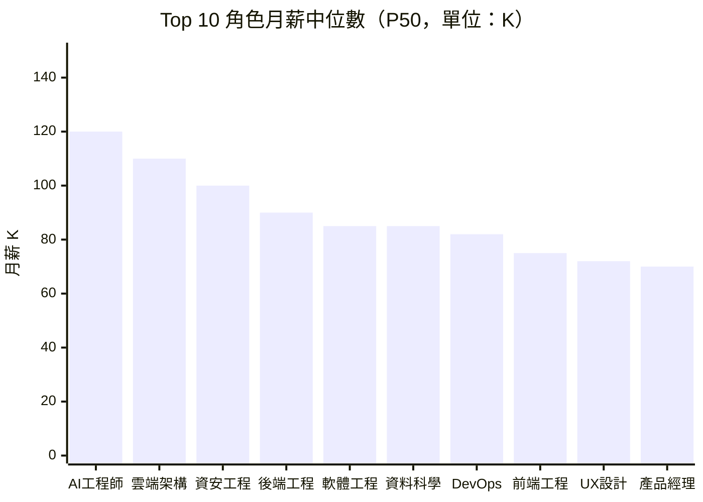

# 內容規格書：salary_bands / 薪資帶分析 — 每週報告

> 內部規劃文件，不發布至 GitHub Pages。
> 產出日期：2026-03-22
> Revamp 階段：Stage 5（Content Specification）
> 本文件直接指導每週報告的 AI 自動化產出。

---

## 1. 頁面目標

### 主要目標

每週分析觀測到的職業角色薪資帶（P25/P50/P75），讓求職者有數據依據設定薪資期望，讓 HR 有外部市場參考做薪資對標。

### 次要目標

1. 透明揭露面議排除率和數據局限性，建立數據信任
2. 提供台灣 vs 全球薪資對標參考
3. 分析 AI 取代向量與薪資趨勢的關係

### 成功指標

| 指標 | 目標值 | 測量方式 |
|------|--------|----------|
| 頁面瀏覽量 | > 1,000 PV/報 | Google Analytics |
| 搜尋排名 | 「{職位}薪資」前 5 | Search Console |
| 跳出率 | < 60% | Analytics |

---

## 2. 目標受眾

| 項目 | 說明 |
|------|------|
| 主要 | 求職者（收到 offer 前查薪資）、HR 薪酬主管（薪資帶設定） |
| 次要 | 職涯顧問/獵頭、薪資政策研究者 |
| 進入方式 | 搜尋「軟體工程師薪資」「{職位}月薪」/ FAQ Schema 精選摘要 |

---

## 3. 關鍵訊息

| 順序 | 訊息 | 呈現方式 |
|------|------|----------|
| 1 | 面議文化導致的數據偏差已透明揭露，本站數據有方法論可信度 | 數據品質聲明（報告最開頭） |
| 2 | 你的角色在市場上的 P25/P50/P75 薪資範圍 | 角色薪資帶表格 + Mermaid 視覺化 |
| 3 | 同一角色在不同產業的薪資差異可能很大 | 跨產業薪資比較 |

---

## 4. 內容結構

### 4.1 區塊規劃

```
┌─────────────────────────────────────┐
│ 區塊 1：數據品質聲明（核心品牌資產） │
├─────────────────────────────────────┤
│ 區塊 2：摘要                         │
├─────────────────────────────────────┤
│ 區塊 3：Top 10 薪資帶 Mermaid 圖     │
├─────────────────────────────────────┤
│ 區塊 4：各角色薪資帶總覽（5 向量）   │
├─────────────────────────────────────┤
│ 區塊 5：跨產業薪資比較               │
├─────────────────────────────────────┤
│ 區塊 6：跨地區薪資比較               │
├─────────────────────────────────────┤
│ 區塊 7：4 週滾動平均趨勢表           │
├─────────────────────────────────────┤
│ 區塊 8：薪資成長趨勢排名             │
├─────────────────────────────────────┤
│ 區塊 9：全球薪資對標                 │
├─────────────────────────────────────┤
│ 區塊 10：AI 取代向量 × 薪資趨勢     │
├─────────────────────────────────────┤
│ 區塊 11：薪資談判參考（Phase 2）     │
├─────────────────────────────────────┤
│ 區塊 12：數據局限性                  │
├─────────────────────────────────────┤
│ 區塊 13：行動清單                    │
├─────────────────────────────────────┤
│ 區塊 14：免責聲明                    │
└─────────────────────────────────────┘
```

### 4.2 核心區塊規格

#### 區塊 1：數據品質聲明

| 項目 | 規格 |
|------|------|
| 目的 | 建立方法論信任，是品牌差異化核心 |
| 位置 | 報告最開頭（摘要之前） |
| 格式 | blockquote 醒目框 |

##### 必含資訊

```markdown
> **重要提醒**：本報告薪資數據存在結構性限制。
> - 「面議」職缺佔比：{X%}（已排除在統計之外）
> - 有效薪資樣本數：{N} 筆（共觀測 {M} 筆職缺）
> - 角色覆蓋率：{N}/53 個目標角色有足夠有效樣本
> - 薪資為刊登區間中位數，非實際支付薪資
> - 詳見報告末「數據局限性」完整說明
```

---

#### 區塊 3：Top 10 薪資帶 Mermaid 圖（新增）

| 項目 | 規格 |
|------|------|
| 目的 | 視覺化呈現不同角色的薪資分布 |
| 格式 | Mermaid xychart-beta 長條圖 |
| 數據 | 有效樣本的 Top 10 角色 P50 薪資（K） |

##### 範例

````markdown

> 資料來源：{N} 筆有效薪資樣本，面議排除率 {X%}
````

---

#### 區塊 4：各角色薪資帶總覽

維持 Mode CLAUDE.md 五向量分類格式。

**強化規格**：
- 樣本 < 10 筆的角色以 ⚠️ 標註且薪資帶以灰色呈現
- 每個向量類別加入該類別的平均 P50 作為小結
- 無數據的角色以「—」填充，不省略

---

#### 區塊 7：4 週滾動平均趨勢表（新增）

| 項目 | 規格 |
|------|------|
| 目的 | 降低單週薪資波動，呈現穩定趨勢 |
| 格式 | 表格，選取有效數據 > 4 週的角色 |

```markdown
| 角色 | W{-3} P50 | W{-2} P50 | W{-1} P50 | W P50 | 4 週均值 | 趨勢 |
|------|-----------|-----------|-----------|-------|----------|------|
```

---

#### 區塊 11：薪資談判參考（Phase 2 新增）

| 項目 | 規格 |
|------|------|
| 目的 | 將 P25/P50/P75 數據轉化為求職者可用的參考框架 |
| 位置 | 數據局限性之前 |
| 風險等級 | 高——必須有醒目免責聲明 |

##### 內容規格

```markdown
## 薪資談判參考

> ⚠️ **重要提醒**：以下僅為基於市場數據的參考框架，不構成薪資談判建議或承諾。
> 實際薪資受個人經驗、技能、公司規模、地區等多重因素影響。

### 如何解讀 P25/P50/P75

- **P25 以下**：低於市場 75% 的同類職缺——若您的經驗和技能符合要求，可參考 P50 作為談判目標
- **P25-P50**：位於市場中段偏低——這是多數初階職位的範圍
- **P50-P75**：位於市場中段偏高——通常對應中高階或熱門技能加成
- **P75 以上**：高於市場 75% 的同類職缺——通常對應資深、稀缺技能或特殊產業

### 本週參考數據

{選取 3-5 個搜尋量最高的角色，列出 P25/P50/P75}

> 以上數據基於 {N} 筆有效樣本，面議排除率 {X%}。高薪職缺傾向面議，
> 因此實際市場薪資中位數可能高於上述數字。
```

##### 文案方向

- 語氣：「參考」「可作為起點」「建議綜合考量」
- 絕對禁止：「你應該要求 X 萬」「低於 P50 就是被低估」

---

## 5. CTA 規格

| 類型 | 文案 | 連結目標 |
|------|------|----------|
| 主要 | 「查看本週產業薪資比較，了解哪個產業給最多 →」 | industry_segments |
| 次要 | 「查看本週求職策略建議 →」 | career_strategy |

---

## 6. SEO 規格

| 項目 | 規格 |
|------|------|
| seo.title | `{YYYY}年第{WW}週薪資趨勢：{高薪角色}月薪{P50}K \| 薪資帶分析` ≤ 60 字元 |
| seo.description | `本週薪資：{角色1}月薪P50達{N}K，{角色2}{趨勢}。涵蓋{N}個角色P25/P50/P75分析。` ≤ 155 字元 |
| keywords | 5-8 個，含高搜尋量角色名+「薪資」（如「軟體工程師薪水」「AI工程師薪資」） |
| FAQ | Q1「{高薪角色}薪資多少」Q2「哪些職業薪資成長最快」Q3「各地區薪資差異」 |

### FAQ 答案規格

- 必須包含具體 P50 數字
- 必須附帶「基於 {N} 筆樣本」的樣本量說明
- 必須可獨立理解（不依賴報告上下文）

---

## 7. 寫作指南

### 語氣調性

| 維度 | 規格 |
|------|------|
| 正式度 | 財務顧問的精確——數字要到千位，不四捨五入 |
| 對求職者 | 賦權語氣——「你有資格知道市場價值」 |
| 對 HR | 專業術語——P25/P50/P75、薪資帶、外部競爭力 |
| 數據透明 | 主動揭露局限性，不迴避面議問題 |

### 用語規範

| 使用 | 避免 |
|------|------|
| 薪資中位數（P50）為 {N}K | 平均薪資為 {N}K（易被極端值扭曲） |
| 面議職缺已排除 | （不提面議問題） |
| 基於 {N} 筆有效樣本 | 根據完整市場數據 |
| 參考價值有限（小樣本） | （不加警示直接呈現） |

### 數字格式

| 項目 | 格式 |
|------|------|
| 薪資 | 千元為單位，加 K 後綴：「85K」 |
| 百分比 | 一位小數：「47.1%」 |
| 樣本數 | 使用逗號：「1,086 筆」 |
| P25/P50/P75 | 首次出現連結到 `/glossary/#p25--p50--p75` |

---

## 8. 品質檢查清單

- [ ] 數據品質聲明在報告最開頭（摘要之前）
- [ ] 面議排除率、有效樣本數、角色覆蓋率均明確標示
- [ ] Mermaid 薪資長條圖存在且數據與表格一致
- [ ] P25 < P50 < P75 順序正確（所有角色）
- [ ] 樣本 < 10 筆的角色有 ⚠️ 標註
- [ ] 無數據角色以「—」填充（不省略）
- [ ] 跨幣別對比有匯率和 PPP 提醒
- [ ] 週變化超過 10% 的角色有特別說明原因
- [ ] 數據局限性段落完整（5 點結構性限制）
- [ ] 薪資談判參考段落（若存在）有醒目免責聲明
- [ ] 免責聲明包含「不構成薪資談判依據」
- [ ] Qdrant 標註存在
- [ ] Jekyll Front Matter 含 `data_coverage.negotiable_excluded`

---

*本規格書為每週 salary_bands 報告的操作手冊。搭配 `core/Narrator/Modes/salary_bands/CLAUDE.md` 使用。*
