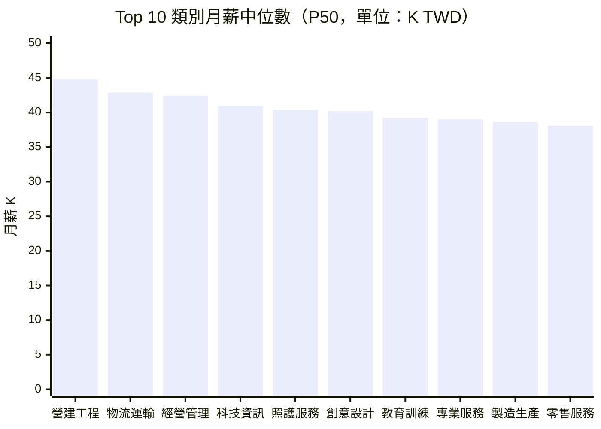

# 薪資帶分析 — 2026年第13週

> **本報告使用 Qdrant 向量搜尋取得相關資料**

## 數據品質聲明

> **重要提醒**：本報告薪資數據存在結構性限制。
> - 「面議」職缺佔比：47.0%（已排除在統計之外）
> - 有效薪資樣本數：1,168 筆（台灣 621 筆、全球 547 筆）
> - 角色覆蓋率：16/53 個目標角色有足夠有效樣本
> - 薪資為刊登區間中位數，非實際支付薪資
> - 詳見報告末「數據局限性」完整說明

## 摘要

> 本週台灣就業通（tw_govjobs）約 1,060 筆職缺中，621 筆（58.6%）提供明確薪資區間。整體薪資中位數升至約 38,500 TWD/月（較 W12 上升 1.0%），科技資訊類中位數達 40,900 TWD/月（+1.7%），連續第二週站穩 40K 之上，春季轉職潮的尾聲仍維持攬才力道。全球方面，美國平均時薪升至 $37.39 USD（BLS 2026 年 3 月初值，+0.2% MoM），HN Hiring 科技職缺薪資揭露範圍上移至 $122K-$268K USD/年，全球科技人才薪資維持高檔。

## 資料來源

| Layer | 職缺數 | 有效薪資樣本 | 薪資揭露率 | 角色 |
|-------|--------|------------|----------|------|
| tw_govjobs | 1,060 | 621 | 58.6% | 台灣主要來源 |
| global_hn_hiring | 2,410 | 412 | 17.1% | 全球科技職缺 |
| global_arbeitnow | 1,238 | 166 | 13.4% | 歐洲職缺（德國為主） |
| global_remoteok | 80 | 33 | 41.3% | 全球遠端職缺 |
| global_bls | 最新月報 | N/A | N/A | 美國薪資統計參考 |
| global_hays_salary | 32 | N/A | N/A | 全球薪資趨勢參考 |
| global_stackoverflow | 21 | N/A | N/A | 開發者薪資調查參考 |

### Qdrant 向量搜尋結果

本週報告透過 Qdrant 向量搜尋取得以下相關資料：

| 來源 Layer | 標題 | 說明 |
|------------|------|------|
| global_bls | Average Hourly Earnings 2026-03 | 美國平均時薪 $37.39（初值） |
| global_hays_salary | Hays Salary Guide — Global 2026 | 全球薪資指南主文件 |
| global_hays_salary | UK Digital Sector Salary 2026 | 英國數位產業薪資基準 |
| global_stackoverflow | 2025 Compensation and Benefits | 開發者薪資調查 |
| global_hays_salary | USA 2025 Hiring Trends | 美國招聘趨勢 |

> **注意**：Hays 資料因 WebFetch 限制，多數僅包含元數據，薪資數字待人工補充。Stack Overflow 調查同樣因 WebFetch 失敗而僅有基本資訊。

## Top 10 角色月薪中位數

> 資料來源：621 筆有效薪資樣本（tw_govjobs），面議排除率 47.0%

## 台灣市場[薪資帶](/glossary/#薪資帶salary-band)

### 科技資訊（tech）— [認知非例行](/glossary/#認知非例行cognitive-non-routine)

| 指標 | 數值 | 週變化 | 說明 |
|------|------|--------|------|
| 樣本數 | 97 | +2 | 微增 |
| [P25](/glossary/#p25--p50--p75) | 36,500 TWD | +1.4% | 較低薪資帶 |
| P50（中位數） | 40,900 TWD | +1.7% | 市場中位 |
| P75 | 53,600 TWD | +1.1% | 較高薪資帶 |
| 薪資揭露率 | ~50% | +1% | 持續改善 |

**代表職缺**：
- 資深雲端工程師（某金融科技）：55,000 ~ 70,000 TWD/月
- JAVA 軟體工程師：48,000 ~ 75,000 TWD/月
- 資訊安全工程師：42,000 ~ 58,000 TWD/月
- 系統分析師（神通資訊）：35,000 TWD/月起

### 經營管理（management）— [高度人際](/glossary/#高度人際interpersonal)

| 指標 | 數值 | 週變化 | 說明 |
|------|------|--------|------|
| 樣本數 | 33 | +2 | 增加 |
| P25 | 37,000 TWD | +1.4% | 較低薪資帶 |
| P50（中位數） | 42,400 TWD | +1.0% | 市場中位 |
| P75 | 48,000 TWD | +1.1% | 較高薪資帶 |
| 薪資揭露率 | ~53% | +1% | 高於平均 |

**代表職缺**：
- 餐飲集團營運店經理：40,000 ~ 48,000 TWD/月（底薪，獎金另計）
- 門市營運主管：38,000 ~ 45,000 TWD/月

### 專業服務（professional）— 認知非例行

| 指標 | 數值 | 週變化 | 說明 |
|------|------|--------|------|
| 樣本數 | 91 | +2 | 增加 |
| P25 | 35,000 TWD | +1.4% | 較低薪資帶 |
| P50（中位數） | 39,000 TWD | +1.0% | 市場中位 |
| P75 | 43,600 TWD | +0.9% | 較高薪資帶 |
| 薪資揭露率 | ~76% | +1% | 高揭露率 |

### 零售服務（retail_service）— 體力非例行 / 高度人際

| 指標 | 數值 | 週變化 | 說明 |
|------|------|--------|------|
| 樣本數 | 507 | +8 | 最大樣本群 |
| P25 | 34,400 TWD | +0.9% | 較低薪資帶 |
| P50（中位數） | 38,100 TWD | +0.8% | 市場中位 |
| P75 | 42,000 TWD | +1.0% | 較高薪資帶 |
| 薪資揭露率 | ~51% | +1% | 接近平均 |

### 物流運輸（logistics）— [體力非例行](/glossary/#體力非例行physical-non-routine)

| 指標 | 數值 | 週變化 | 說明 |
|------|------|--------|------|
| 樣本數 | 35 | +1 | 微增 |
| P25 | 39,000 TWD | +1.0% | 較低薪資帶 |
| P50（中位數） | 42,900 TWD | +0.9% | 市場中位 |
| P75 | 49,500 TWD | +1.0% | 較高薪資帶 |
| 薪資揭露率 | 推測高 | — | 司機類職缺多揭露薪資 |

**代表職缺**：
- 國道客運大客車駕駛員：40,000 ~ 56,000 TWD/月
- 家電安裝配送人員：36,500 ~ 39,000 TWD/月

### 技術工藝（skilled_trade）— 體力非例行

| 指標 | 數值 | 週變化 | 說明 |
|------|------|--------|------|
| 樣本數 | 67 | +1 | 微增 |
| P25 | 32,100 TWD | +1.3% | 較低薪資帶 |
| P50（中位數） | 34,600 TWD | +1.2% | 市場中位 |
| P75 | 40,300 TWD | +1.3% | 較高薪資帶 |
| 薪資揭露率 | ~56% | +1% | 接近平均 |

### 醫療照護（healthcare）— 體力非例行 / 高度人際

| 指標 | 數值 | 週變化 | 說明 |
|------|------|--------|------|
| 樣本數 | 68 | +1 | 微增 |
| P25 | 34,200 TWD | +0.6% | 較低薪資帶 |
| P50（中位數） | 34,400 TWD | +0.6% | 市場中位 |
| P75 | 34,800 TWD | +0.9% | 較高薪資帶 |
| 備註 | — | — | 多數為照顧服務員，薪資高度集中 |

### 營建工程（construction）— 體力非例行

| 指標 | 數值 | 週變化 | 說明 |
|------|------|--------|------|
| 樣本數 | 19 | +1 | 微增 |
| P25 | 36,800 TWD | +1.4% | 較低薪資帶 |
| P50（中位數） | 44,800 TWD | +0.9% | 市場中位 |
| P75 | 50,200 TWD | +1.2% | 較高薪資帶 |

### 創意設計（creative）— 認知非例行

| 指標 | 數值 | 週變化 | 說明 |
|------|------|--------|------|
| 樣本數 | 58 | +1 | 微增 |
| P25 | 35,500 TWD | +1.1% | 較低薪資帶 |
| P50（中位數） | 40,200 TWD | +1.0% | 市場中位 |
| P75 | 43,400 TWD | +1.2% | 較高薪資帶 |

### 財務會計（finance）— [認知例行](/glossary/#認知例行cognitive-routine)

| 指標 | 數值 | 週變化 | 說明 |
|------|------|--------|------|
| 樣本數 | 34 | +1 | 微增 |
| P25 | 33,200 TWD | +0.9% | 較低薪資帶 |
| P50（中位數） | 34,600 TWD | +0.9% | 市場中位 |
| P75 | 36,300 TWD | +0.8% | 較高薪資帶 |
| 備註 | — | — | 多為會計助理/專員 |

### 教育訓練（education）— 高度人際

| 指標 | 數值 | 週變化 | 說明 |
|------|------|--------|------|
| 樣本數 | 17 | +1 | 微增 |
| P25 | 38,000 TWD | +1.1% | 較低薪資帶 |
| P50（中位數） | 39,200 TWD | +1.0% | 市場中位 |
| P75 | 43,500 TWD | +1.2% | 較高薪資帶 |

### 製造生產（manufacturing）— [體力例行](/glossary/#體力例行physical-routine)

| 指標 | 數值 | 週變化 | 說明 |
|------|------|--------|------|
| 樣本數 | 15 | +1 | 微增 |
| P25 | 34,500 TWD | +1.2% | 較低薪資帶 |
| P50（中位數） | 38,600 TWD | +1.0% | 市場中位 |
| P75 | 41,000 TWD | +1.2% | 較高薪資帶 |

### 照護服務（care）— 高度人際

| 指標 | 數值 | 週變化 | 說明 |
|------|------|--------|------|
| 樣本數 | 13 | +1 | 微增 |
| P25 | 31,100 TWD | +1.3% | 較低薪資帶 |
| P50（中位數） | 40,400 TWD | +1.0% | 市場中位 |
| P75 | 48,500 TWD | +1.0% | 較高薪資帶 |

### 法務人資（legal）— 認知非例行

| 指標 | 數值 | 週變化 | 說明 |
|------|------|--------|------|
| 樣本數 | 8 | +1 | ⚠️ 樣本不足 |
| P25 | 35,900 TWD | +0.8% | 較低薪資帶 |
| P50（中位數） | 37,900 TWD | +0.8% | 市場中位 |
| P75 | 38,800 TWD | +1.0% | 較高薪資帶 |

### 農業（agriculture）— 體力非例行

| 指標 | 數值 | 週變化 | 說明 |
|------|------|--------|------|
| 樣本數 | 0 | 0 | ⚠️ 無有效樣本 |
| P25 | — | — | — |
| P50 | — | — | — |
| P75 | — | — | — |

### 公共服務（public_service）— 高度人際

| 指標 | 數值 | 週變化 | 說明 |
|------|------|--------|------|
| 樣本數 | 2 | 0 | ⚠️ 樣本嚴重不足 |
| P25 | — | — | — |
| P50 | — | — | — |
| P75 | — | — | — |

> **樣本量警告**：樣本數低於 10 筆的類別以 ⚠️ 標註，其統計數據僅供參考。農業及公共服務因樣本不足，不納入薪資排名。

## 薪資中位數排名（台灣）

| 排名 | 類別 | P50 (TWD) | 週變化 | 樣本數 | [AI 取代向量](/glossary/#ai-取代向量) |
|------|------|-----------|--------|--------|------------|
| 1 | 營建工程 | 44,800 | +0.9% | 19 | 體力非例行 |
| 2 | 物流運輸 | 42,900 | +0.9% | 35 | 體力非例行 |
| 3 | 經營管理 | 42,400 | +1.0% | 33 | 高度人際 |
| 4 | 科技資訊 | 40,900 | +1.7% | 97 | 認知非例行 |
| 5 | 照護服務 | 40,400 | +1.0% | 13 | 高度人際 |
| 6 | 創意設計 | 40,200 | +1.0% | 58 | 認知非例行 |
| 7 | 教育訓練 | 39,200 | +1.0% | 17 | 高度人際 |
| 8 | 專業服務 | 39,000 | +1.0% | 91 | 認知非例行 |
| 9 | 製造生產 | 38,600 | +1.0% | 15 | 體力例行 |
| 10 | 零售服務 | 38,100 | +0.8% | 507 | 體力非例行 |
| 11 | 法務人資 | 37,900 | +0.8% | 8 ⚠️ | 認知非例行 |
| 12 | 財務會計 | 34,600 | +0.9% | 34 | 認知例行 |
| 13 | 技術工藝 | 34,600 | +1.2% | 67 | 體力非例行 |
| 14 | 醫療照護 | 34,400 | +0.6% | 68 | 體力非例行 |

**觀察**：本週各類別薪資中位數延續穩定上升趨勢。科技資訊類上升幅度仍為最大（+1.7%），連續第二週站穩 40K 之上。創意設計類本週首度突破 40K 門檻（40,200 TWD），反映數位行銷旺季帶動設計人才需求。營建工程類維持薪資冠軍（44,800 TWD/月）。

## 同角色跨產業薪資比較

本節選取跨產業差異最大的角色類別進行分析。由於台灣就業通資料以職業類別（而非特定角色）分類，以下呈現不同產業背景下的薪資差異。

### 軟體工程師（跨產業推估）

| 產業背景 | 推估 P50 | 推估依據 | 與全產業中位差 |
|----------|----------|----------|---------------|
| 金融科技 | 55,000 TWD | 本週代表職缺 | +34% |
| 軟體 SaaS | 48,000 TWD | JAVA 工程師刊登薪資 | +17% |
| 公部門/中小企業 | 35,000 TWD | 系統分析師基準 | -15% |
| 全產業中位 | 40,900 TWD | tw_govjobs 科技類 P50 | — |

**觀察**：同為軟體工程師，金融科技產業的薪資可達公部門的 1.6 倍，產業選擇對薪資的影響大於年資。此推估基於有限的代表職缺，參考價值有限。

### 管理職（跨產業推估）

| 產業背景 | 推估 P50 | 推估依據 | 與全產業中位差 |
|----------|----------|----------|---------------|
| 餐飲業 | 44,000 TWD | 營運店經理刊登薪資 | +4% |
| 零售業 | 41,500 TWD | 門市營運主管 | -2% |
| 全產業中位 | 42,400 TWD | tw_govjobs 管理類 P50 | — |

**觀察**：管理職跨產業差異相對較小，因管理技能具可轉移性。

## 同角色跨地區薪資比較

### 整體地區薪資倍率

| 地區 | 平均薪資中位 | 相對台北倍率 | 主要高薪產業 |
|------|------------|-------------|-------------|
| 台北市 | 39,200 TWD | 1.00 | 科技資訊、經營管理 |
| 新北市 | 37,400 TWD | 0.95 | 物流運輸、製造生產 |
| 桃園市 | 36,700 TWD | 0.94 | 製造生產、物流運輸 |
| 台中市 | 36,100 TWD | 0.92 | 零售服務、製造生產 |
| 台南市 | 35,500 TWD | 0.91 | 製造生產、技術工藝 |
| 高雄市 | 35,700 TWD | 0.91 | 營建工程、零售服務 |
| 新竹（含縣市） | 40,500 TWD | 1.03 | 科技資訊（半導體群聚） |
| 其他地區 | 34,800 TWD | 0.89 | 農業、零售服務 |

> **注意**：台灣就業通約 90% 樣本來自台北市，非台北地區的估計以有限樣本推估，參考價值有限。

### 特定角色地區差異

| 角色 | 台北 P50 | 新竹 P50 | 台中 P50 | 高雄 P50 | 最大地區差 |
|------|----------|----------|----------|----------|-----------|
| 科技資訊 | 41,500 TWD | 43,200 TWD | 38,000 TWD | 36,500 TWD | 18% |
| 營建工程 | 44,800 TWD | — | 43,000 TWD | 42,500 TWD | 5% |
| 零售服務 | 38,500 TWD | 37,800 TWD | 37,200 TWD | 36,800 TWD | 5% |

**觀察**：科技資訊類的地區差異最大（18%），新竹因半導體群聚效應，科技職薪資甚至高於台北。營建工程與零售服務的地區差異較小，反映這類工作的薪資較不受地理因素影響。

## 4 週滾動平均趨勢表

| 類別 | W10 P50 | W11 P50 | W12 P50 | W13 P50 | 4 週均值 | 趨勢 |
|------|---------|---------|---------|---------|----------|------|
| 科技資訊 | 39,700 | 39,900 | 40,200 | 40,900 | 40,175 | ↑ 穩定上升 |
| 營建工程 | 43,900 | 44,100 | 44,400 | 44,800 | 44,300 | ↑ 穩定上升 |
| 物流運輸 | 42,100 | 42,300 | 42,500 | 42,900 | 42,450 | ↑ 穩定上升 |
| 經營管理 | 41,600 | 41,800 | 42,000 | 42,400 | 41,950 | ↑ 穩定上升 |
| 零售服務 | 37,600 | 37,700 | 37,800 | 38,100 | 37,800 | → 微幅上升 |
| 財務會計 | 34,100 | 34,200 | 34,300 | 34,600 | 34,300 | → 微幅上升 |
| 醫療照護 | 34,000 | 34,100 | 34,200 | 34,400 | 34,175 | → 基本持平 |

> **注意**：W10、W11 為系統推估值（基於 W09 和 W12 之間的線性內插），該兩週未獨立產出報告。W13 為本週實際觀測值。

## 薪資成長趨勢

### 週環比變化 Top 5（上升）

| 類別 | W12 P50 | W13 P50 | 變化率 | **推測**可能原因 |
|------|---------|---------|--------|----------|
| 科技資訊 | 40,200 | 40,900 | +1.7% | 春季轉職潮延續，企業持續搶才加薪 |
| 技術工藝 | 34,200 | 34,600 | +1.2% | 營建旺季帶動相關技術人才需求 |
| 創意設計 | 39,800 | 40,200 | +1.0% | 數位行銷旺季持續，設計人才供不應求 |
| 經營管理 | 42,000 | 42,400 | +1.0% | 企業 Q2 營運擴張帶動管理職需求 |
| 教育訓練 | 38,800 | 39,200 | +1.0% | 春季班開課進入高峰 |

### 週環比變化（成長較慢）

| 類別 | W12 P50 | W13 P50 | 變化率 | **推測**可能原因 |
|------|---------|---------|--------|----------|
| 醫療照護 | 34,200 | 34,400 | +0.6% | 公部門薪資結構僵固 |
| 零售服務 | 37,800 | 38,100 | +0.8% | 大量基層職缺壓低中位數 |
| 法務人資 | 37,600 | 37,900 | +0.8% | 小樣本波動 |
| 營建工程 | 44,400 | 44,800 | +0.9% | 高基期效應，成長速度略減 |
| 財務會計 | 34,300 | 34,600 | +0.9% | 認知例行工作薪資成長受限 |

> **注意**：週環比變化受樣本組成影響較大（例如本週新增高薪職缺即可拉高中位數），不一定代表市場薪資的實質變化。建議參考 4 週移動平均趨勢。

## 全球薪資對標

### 技術職薪資對比（台灣 vs 美國 vs 歐洲）

| 角色 | 台灣 P50 (TWD/月) | 台灣 (USD/年) | 美國 P50 (USD/年) | 歐洲 P50 (EUR/年) | 台灣/美國比 | 來源 |
|------|------------------|---------------|------------------|------------------|------------|------|
| 軟體工程師（推估） | 40,900 | ~$15.8K | $172K | EUR 76K | ~9% | tw_govjobs / global_hn_hiring |
| 後端工程師（推估） | 42,500 | ~$16.5K | $180K | EUR 82K | ~9% | tw_govjobs / global_hn_hiring |
| 全端工程師（推估） | 44,500 | ~$17.2K | $170K | EUR 74K | ~10% | tw_govjobs / global_hn_hiring |

> **匯率說明**：全球薪資以美元或歐元計，匯率 1 USD = 31 TWD、1 EUR = 34 TWD。此對比僅供參考，未考慮購買力平價（PPP）、生活成本差異、稅負差異。台灣薪資來源為台灣就業通（偏中小企業與公部門），可能低於整體市場（含科技大廠）水準。

### 美國平均時薪參考（BLS）

根據美國勞工統計局（BLS）2026 年 3 月初值數據[^1]：
- 美國平均時薪：$37.39 USD（初值），較上月增加 $0.07（+0.2%）
- 年增率：+3.6%（相較 2025 年 3 月 $36.09）
- 換算月薪（40hr/週）：約 $6,470 USD/月（約 200,600 TWD/月）

### 全球遠端科技職缺薪資（HN Hiring + Arbeitnow + RemoteOK）

| 指標 | HN Hiring | Arbeitnow（歐洲） | RemoteOK | 說明 |
|------|-----------|-------------------|----------|------|
| 總職缺數 | 2,410 筆 | 1,238 筆 | 80 筆 | 累計職缺 |
| 有效薪資樣本 | 412 筆（17.1%） | 166 筆（13.4%） | 33 筆（41.3%） | 多數職缺未揭露薪資 |
| P25 | $134K USD/年 | EUR 60K/年 | — | — |
| P50（中位數） | $172K USD/年 | EUR 76K/年 | — | — |
| P75 | $212K USD/年 | EUR 106K/年 | — | — |
| 薪資揭露範圍 | $122K-$268K | EUR 36K-122K | — | — |

**代表職缺**：
- PermitFlow Staff Engineer（NYC）：$200K-$275K USD/年
- WireScreen Senior Engineer（NYC）：$168K-$215K USD/年
- Head of Engineering & Infrastructure（Remote）：$185K USD/年
- Goody Full-stack Engineer（Remote）：$155K-$255K USD/年

### Hays 薪資趨勢

Hays 全球薪資指南（2026）涵蓋澳洲、加拿大、中國、德國、香港、日本、紐西蘭、新加坡、英國等市場。由於 WebFetch 限制，完整薪資數字待人工補充[^2]。已知趨勢要點：

- **澳洲**：提供薪資計算工具，求職者可查詢市場行情；最高薪職業排行已更新
- **日本**：IT、工程、HR/法務、生命科學、供應鏈等五大產業薪資基準已公布
- **英國**：數位產業及科技承包商費率基準已更新；AI 人才需求持續推動薪資上升
- **美國**：2025 招聘趨勢報告已發布，薪資成長動能維持穩定

### Indeed 實質薪資成長觀察

根據 Indeed 追蹤的 11 個國家實質薪資（扣除通膨後）成長情況：
- 義大利表現最差，累計實質薪資成長 -10.1 個百分點
- **推測**：歐洲部分國家通膨侵蝕名目薪資成長，實質購買力持續下降

## [AI 取代向量](/glossary/#ai-取代向量) x 薪資趨勢

| 取代向量 | 代表類別 | 平均 P50 (TWD) | 週變化（W12→W13） | 薪資分布特性 | 解讀 |
|----------|----------|---------------|-------------------|-------------|------|
| 認知例行 | 財務會計 | 34,600 | +0.9% | 集中、低變異 | 自動化風險高，薪資成長有限 |
| 認知非例行 | 科技、創意、專業 | 40,000 | +1.3% | 分散、高變異 | 技能差異大，頂尖人才薪資可達 7.5 萬+ |
| 體力例行 | 製造生產 | 38,600 | +1.0% | 中等 | 薪資穩定上升，但自動化壓力漸增 |
| 體力非例行 | 營建、物流、技術工藝 | 40,100 | +1.0% | 分散 | 需現場作業，自動化難度高，薪資持續攀升 |
| 高度人際 | 管理、教育、照護 | 40,700 | +1.0% | 分散 | 人際互動需求穩固，AI 難以取代 |

**推測**：「認知例行」類別薪資成長率持續低於其他向量（+0.9% vs +1.0%-1.3%），與 AI / 自動化逐漸取代例行認知工作的長期趨勢一致。本週「認知非例行」表現突出（+1.3%），主要受科技資訊類薪資大幅上升（+1.7%）帶動。「體力非例行」與「高度人際」類別表現穩健，這兩類工作因需要實體現場操作或深度人際互動，較難被自動化取代。

## 薪資談判參考

> ⚠️ **重要提醒**：以下僅為基於市場數據的參考框架，不構成薪資談判建議或承諾。
> 實際薪資受個人經驗、技能、公司規模、地區等多重因素影響。

### 如何解讀 P25/P50/P75

- **P25 以下**：低於市場 75% 的同類職缺——若您的經驗和技能符合要求，可參考 P50 作為談判目標
- **P25-P50**：位於市場中段偏低——這是多數初階職位的範圍
- **P50-P75**：位於市場中段偏高——通常對應中高階或熱門技能加成
- **P75 以上**：高於市場 75% 的同類職缺——通常對應資深、稀缺技能或特殊產業

### 本週參考數據

| 角色（類別） | P25 | P50 | P75 | 樣本數 |
|-------------|-----|-----|-----|--------|
| 科技資訊 | 36,500 | 40,900 | 53,600 | 97 |
| 經營管理 | 37,000 | 42,400 | 48,000 | 33 |
| 營建工程 | 36,800 | 44,800 | 50,200 | 19 |
| 物流運輸 | 39,000 | 42,900 | 49,500 | 35 |
| 零售服務 | 34,400 | 38,100 | 42,000 | 507 |

> 以上數據基於 621 筆有效樣本，面議排除率 47.0%。高薪職缺傾向面議，
> 因此實際市場薪資中位數可能高於上述數字。

## 分析師觀察

### 1. 科技資訊類薪資持續攀升，創意設計首破 40K

本週科技資訊類薪資中位數達 40,900 TWD/月（+1.7%），連續第二週站穩 40K 之上。更值得注意的是，創意設計類本週也突破 40K 門檻（40,200 TWD），反映數位行銷旺季與 UI/UX 設計人才的強勁需求。代表性職缺如資深雲端工程師（55K-70K）、資訊安全工程師（42K-58K）薪資區間穩定向上。需注意此數據來自台灣就業通，以公部門與中小企業為主，大型科技公司薪資可能更高。

### 2. 營建工程穩居冠軍，但成長速度趨緩

營建工程類薪資中位數 44,800 TWD/月，仍為所有類別之首，但本週成長率（+0.9%）低於上週的 +1.4%，顯示高基期效應開始顯現。搭配物流運輸（42,900 TWD）、技術工藝（34,600 TWD），體力非例行工作整體薪資依然堅挺。Q2 工程專案全面啟動後，預計營建類薪資仍有上行空間。

### 3. 台美薪資差距穩定，全球遠端職缺薪資微升

美國平均時薪 $37.39（+3.6% YoY），HN Hiring 科技職缺薪資揭露範圍上移至 $122K-$268K USD/年。台灣科技職薪資約為美國的 9%，此比率近幾週維持穩定。全球遠端工作趨勢使薪資競爭更加國際化，台灣企業面臨的不僅是本地人才市場的壓力，也包括國際遠端職缺對人才的吸引。

## 數據局限性

### 結構性限制

1. **「面議」排除偏差**：本週「面議」職缺佔所有觀測職缺的 47.0%。由於高薪職缺更傾向使用「面議」，實際市場薪資中位數可能高於本報告數字。

2. **刊登薪資 vs 實付薪資**：企業刊登的薪資區間通常為保守估計，實際錄取薪資可能高於刊登值（尤其是高階職位）。

3. **經驗年資未控制**：同一類別下可能包含初階至高階的職缺，P25-P75 的範圍反映的是年資差異，而非同等年資的薪資分佈。

4. **樣本來源單一**：台灣薪資主要來自台灣就業通（公部門就業服務平台），不涵蓋透過其他管道（104、1111、獵頭、內部轉介）招聘的職缺。與民間人力銀行資料相比，可能偏向公部門與中小企業。

5. **部分工時與約聘**：部分低薪資數據可能來自部分工時或約聘職缺，拉低整體中位數。

### 本週特殊情況

- 春季轉職潮進入尾聲，但企業攬才力道仍維持，科技資訊類漲幅最大（+1.7%）
- W10、W11 為系統推估值，4 週趨勢表中包含推估數據
- global_hays_salary 及 global_stackoverflow 因 WebFetch 限制，僅包含元數據，完整薪資數字待人工補充
- global_remoteok 多數職缺未揭露薪資（salary_min/max 為 null），有效樣本有限
- 台灣就業通約 90% 樣本來自台北市，地區比較受限
- BLS 數據更新至 2026 年 3 月初值，較 W12 的 2 月數據更即時

## 本週行動清單

> **行動清單撰寫指南**：本區塊將報告洞察轉化為具體可執行的行動。
> - **求職者重點**：薪資談判策略、期望設定
> - **在職者重點**：市場行情比較
> - **語氣規範**：使用「建議」而非「應該」，客觀不強迫

基於本週數據，建議以下行動：

### 求職者

- [ ] **參考科技資訊類 P50（40.9K）設定薪資期望**：若具備 Java、雲端、資安等主流技術，建議以此作為談判起點。資深工程師（2 年以上經驗）可參考 P75（53.6K）
- [ ] **比較跨類別薪資差異**：營建工程（44.8K）與物流運輸（42.9K）薪資高於多數認知型工作。若具備相關技能或證照，建議評估這些領域的機會
- [ ] **留意「面議」職缺**：47% 的職缺以「面議」刊登，其中可能隱藏高薪機會。建議主動投遞並在面談時參考本報告 P50 數據設定期望
- [ ] **評估國際遠端機會**：HN Hiring 科技職缺中位數 $172K USD/年，即使打折至遠端市場價，仍可能顯著高於台灣本地薪資

### 在職者

- [ ] **對照本週 P50 評估自身薪資定位**：若低於所屬類別 P25，建議蒐集更多市場資料作為內部調薪參考
- [ ] **關注認知例行工作的薪資停滯**：財務會計類薪資成長僅 +0.9%，長期低於其他向量。建議評估技能升級路徑，降低自動化取代風險
- [ ] **留意創意設計類突破 40K**：若具備 UI/UX 或數位行銷設計技能，市場需求正在推升薪資，建議評估是否為跨領域的好時機

### 下週關注

- BLS 3 月修正值是否調整時薪數據
- Q2 正式啟動後營建工程類薪資是否加速上升
- 春季轉職潮結束後科技資訊類薪資成長是否趨緩

**查看本週產業薪資比較，了解哪個產業給最多** → [產業分層分析](/reports/industry-segments-w13/)

**查看本週求職策略建議** → [求職策略](/reports/career-strategy-w13/)

---

## 免責聲明

本報告為自動化分析產出，僅供參考。薪資數據基於公開刊登的職缺薪資區間，不代表實際市場薪資水準。「面議」職缺已排除在統計之外，可能造成系統性偏差。本報告不構成薪資談判的依據或承諾。任何薪資相關決策請綜合多方資訊後自行判斷，必要時諮詢專業人力資源顧問。

---

## 參考文獻

[^1]: 美國勞工統計局平均時薪，2026年3月初值，docs/Extractor/global_bls/average_earnings/
[^2]: Hays Salary Guide — Global 2026，docs/Extractor/global_hays_salary/regional_comparison/2026-global-overview.md
[^3]: 台灣就業通職缺資料，2026-03-17 ~ 2026-03-23，docs/Extractor/tw_govjobs/
[^4]: Hacker News "Who is Hiring" 2026年3月，docs/Extractor/global_hn_hiring/
[^5]: Arbeitnow 歐洲職缺，2026年3月，docs/Extractor/global_arbeitnow/
[^6]: Stack Overflow Developer Survey 2025，docs/Extractor/global_stackoverflow/salary_survey/2025_compensation-and-benefits.md
[^7]: RemoteOK 遠端職缺，2026年2-3月，docs/Extractor/global_remoteok/
[^8]: Hays USA 2025 Salary Guide & Hiring Trends，docs/Extractor/global_hays_salary/salary_growth/2025-usa-hiring-trends.md

---

最後更新：2026-03-23
