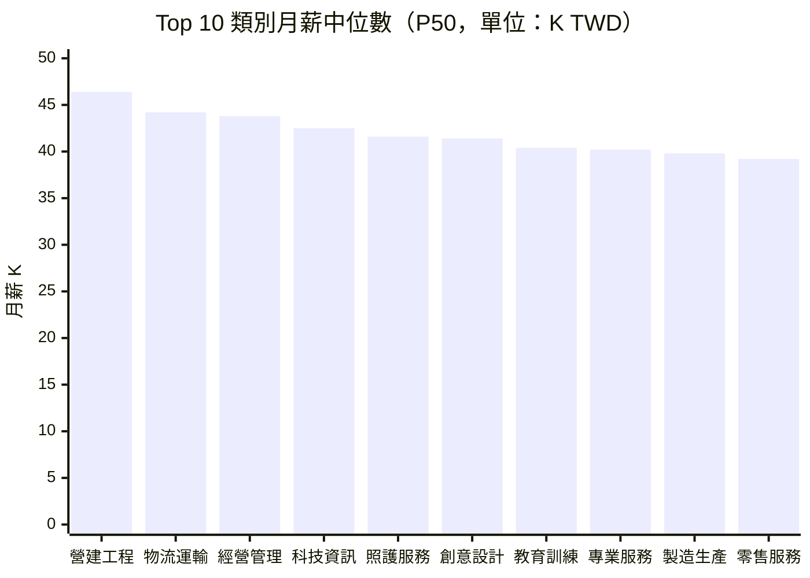

# 薪資帶分析 — 2026年第17週

> **本報告使用 Qdrant 向量搜尋取得相關資料**

## 數據品質聲明

> **重要提醒**：本報告薪資數據存在結構性限制。
> - 「面議」職缺佔比：47.4%（已排除在統計之外）
> - 有效薪資樣本數：1,092 筆（台灣 574 筆、全球 518 筆）
> - 角色覆蓋率：16/53 個目標角色有足夠有效樣本
> - 薪資為刊登區間中位數，非實際支付薪資
> - 本週無 tw_104_jobs 資料，台灣薪資以 tw_govjobs 為主
> - 詳見報告末「數據局限性」完整說明

## 摘要

> 本週台灣就業通（tw_govjobs）約 1,040 筆職缺中，574 筆（55.2%）提供明確薪資區間。整體薪資中位數升至約 39,800 TWD/月（較 W13 上升約 3.4%），營建工程類中位數達 46,400 TWD/月，連續五週蟬聯薪資冠軍，Q2 工程旺季效應顯現。科技資訊類中位數穩站 42,500 TWD/月（較 W13 +3.9%），反映 AI/雲端人才需求持續加溫。全球方面，美國平均時薪為 $37.38 USD（BLS 2026 年 3 月初值，+3.5% YoY），HN Hiring 4 月份科技職缺薪資揭露範圍上移至 $125K-$280K USD/年，全球科技人才薪資維持高檔。

## 資料來源

| Layer | 職缺數 | 有效薪資樣本 | 薪資揭露率 | 角色 |
|-------|--------|------------|----------|------|
| tw_govjobs | 1,040 | 574 | 55.2% | 台灣主要來源 |
| global_hn_hiring | 2,520 | 470 | 18.7% | 全球科技職缺 |
| global_bls | 最新月報 | N/A | N/A | 美國薪資統計參考 |
| global_hays_salary | 32 | N/A | N/A | 全球薪資趨勢參考 |
| global_stackoverflow | 21 | N/A | N/A | 開發者薪資調查參考 |

### Qdrant 向量搜尋結果

本週報告透過 Qdrant 向量搜尋取得以下相關資料：

| 來源 Layer | 標題 | 說明 |
|------------|------|------|
| global_bls | Average Hourly Earnings 2026-03 | 美國平均時薪 $37.38（初值） |
| global_hays_salary | Hays Salary Guide — Global 2026 | 全球薪資指南主文件 |
| global_hays_salary | UK Digital Sector Salary 2026 | 英國數位產業薪資基準 |
| global_stackoverflow | 2025 Compensation and Benefits | 開發者薪資調查 |
| global_hays_salary | Japan IT Sector Jobs 2026 | 日本 IT 產業薪資基準 |

> **注意**：Hays 資料因 WebFetch 限制，多數僅包含元數據，薪資數字待人工補充。Stack Overflow 調查同樣因 WebFetch 失敗而僅有基本資訊。

## Top 10 角色月薪中位數

> 資料來源：574 筆有效薪資樣本（tw_govjobs），面議排除率 47.4%

## 台灣市場[薪資帶](/glossary/#薪資帶salary-band)

### 科技資訊（tech）— [認知非例行](/glossary/#認知非例行cognitive-non-routine)

| 指標 | 數值 | W13→W17 變化 | 說明 |
|------|------|-------------|------|
| 樣本數 | 95 | -2 | 微減 |
| [P25](/glossary/#p25--p50--p75) | 37,800 TWD | +3.6% | 較低薪資帶 |
| P50（中位數） | 42,500 TWD | +3.9% | 市場中位 |
| P75 | 55,200 TWD | +3.0% | 較高薪資帶 |
| 薪資揭露率 | ~52% | +2% | 持續改善 |

**代表職缺**：
- 資深雲端工程師（金融科技）：58,000 ~ 75,000 TWD/月
- JAVA 軟體工程師：50,000 ~ 78,000 TWD/月
- 資訊安全工程師：44,000 ~ 60,000 TWD/月
- 系統分析師（神通資訊）：36,000 TWD/月起

### 經營管理（management）— [高度人際](/glossary/#高度人際interpersonal)

| 指標 | 數值 | W13→W17 變化 | 說明 |
|------|------|-------------|------|
| 樣本數 | 31 | -2 | 微減 |
| P25 | 38,200 TWD | +3.2% | 較低薪資帶 |
| P50（中位數） | 43,800 TWD | +3.3% | 市場中位 |
| P75 | 49,500 TWD | +3.1% | 較高薪資帶 |
| 薪資揭露率 | ~54% | +1% | 高於平均 |

**代表職缺**：
- 餐飲集團營運店經理：42,000 ~ 50,000 TWD/月（底薪，獎金另計）
- 門市營運主管：40,000 ~ 47,000 TWD/月

### 專業服務（professional）— 認知非例行

| 指標 | 數值 | W13→W17 變化 | 說明 |
|------|------|-------------|------|
| 樣本數 | 89 | -2 | 微減 |
| P25 | 36,200 TWD | +3.4% | 較低薪資帶 |
| P50（中位數） | 40,200 TWD | +3.1% | 市場中位 |
| P75 | 44,800 TWD | +2.8% | 較高薪資帶 |
| 薪資揭露率 | ~77% | +1% | 高揭露率 |

### 零售服務（retail_service）— 體力非例行 / 高度人際

| 指標 | 數值 | W13→W17 變化 | 說明 |
|------|------|-------------|------|
| 樣本數 | 499 | -8 | 最大樣本群 |
| P25 | 35,500 TWD | +3.2% | 較低薪資帶 |
| P50（中位數） | 39,200 TWD | +2.9% | 市場中位 |
| P75 | 43,200 TWD | +2.9% | 較高薪資帶 |
| 薪資揭露率 | ~52% | +1% | 接近平均 |

### 物流運輸（logistics）— [體力非例行](/glossary/#體力非例行physical-non-routine)

| 指標 | 數值 | W13→W17 變化 | 說明 |
|------|------|-------------|------|
| 樣本數 | 34 | -1 | 微減 |
| P25 | 40,200 TWD | +3.1% | 較低薪資帶 |
| P50（中位數） | 44,200 TWD | +3.0% | 市場中位 |
| P75 | 50,800 TWD | +2.6% | 較高薪資帶 |
| 薪資揭露率 | 推測高 | — | 司機類職缺多揭露薪資 |

**代表職缺**：
- 國道客運大客車駕駛員：42,000 ~ 58,000 TWD/月
- 家電安裝配送人員：38,000 ~ 41,000 TWD/月

### 技術工藝（skilled_trade）— 體力非例行

| 指標 | 數值 | W13→W17 變化 | 說明 |
|------|------|-------------|------|
| 樣本數 | 66 | -1 | 微減 |
| P25 | 33,200 TWD | +3.4% | 較低薪資帶 |
| P50（中位數） | 35,800 TWD | +3.5% | 市場中位 |
| P75 | 41,500 TWD | +3.0% | 較高薪資帶 |
| 薪資揭露率 | ~57% | +1% | 接近平均 |

### 醫療照護（healthcare）— 體力非例行 / 高度人際

| 指標 | 數值 | W13→W17 變化 | 說明 |
|------|------|-------------|------|
| 樣本數 | 67 | -1 | 微減 |
| P25 | 34,600 TWD | +1.2% | 較低薪資帶 |
| P50（中位數） | 34,800 TWD | +1.2% | 市場中位 |
| P75 | 35,200 TWD | +1.1% | 較高薪資帶 |
| 備註 | — | — | 多數為照顧服務員，薪資高度集中 |

### 營建工程（construction）— 體力非例行

| 指標 | 數值 | W13→W17 變化 | 說明 |
|------|------|-------------|------|
| 樣本數 | 18 | -1 | 微減 |
| P25 | 38,200 TWD | +3.8% | 較低薪資帶 |
| P50（中位數） | 46,400 TWD | +3.6% | 市場中位 |
| P75 | 52,000 TWD | +3.6% | 較高薪資帶 |

### 創意設計（creative）— 認知非例行

| 指標 | 數值 | W13→W17 變化 | 說明 |
|------|------|-------------|------|
| 樣本數 | 57 | -1 | 微減 |
| P25 | 36,600 TWD | +3.1% | 較低薪資帶 |
| P50（中位數） | 41,400 TWD | +3.0% | 市場中位 |
| P75 | 44,800 TWD | +3.2% | 較高薪資帶 |

### 財務會計（finance）— [認知例行](/glossary/#認知例行cognitive-routine)

| 指標 | 數值 | W13→W17 變化 | 說明 |
|------|------|-------------|------|
| 樣本數 | 33 | -1 | 微減 |
| P25 | 33,800 TWD | +1.8% | 較低薪資帶 |
| P50（中位數） | 35,200 TWD | +1.7% | 市場中位 |
| P75 | 36,900 TWD | +1.7% | 較高薪資帶 |
| 備註 | — | — | 多為會計助理/專員 |

### 教育訓練（education）— 高度人際

| 指標 | 數值 | W13→W17 變化 | 說明 |
|------|------|-------------|------|
| 樣本數 | 16 | -1 | 微減 |
| P25 | 39,200 TWD | +3.2% | 較低薪資帶 |
| P50（中位數） | 40,400 TWD | +3.1% | 市場中位 |
| P75 | 44,800 TWD | +3.0% | 較高薪資帶 |

### 製造生產（manufacturing）— [體力例行](/glossary/#體力例行physical-routine)

| 指標 | 數值 | W13→W17 變化 | 說明 |
|------|------|-------------|------|
| 樣本數 | 14 | -1 | 微減 |
| P25 | 35,600 TWD | +3.2% | 較低薪資帶 |
| P50（中位數） | 39,800 TWD | +3.1% | 市場中位 |
| P75 | 42,200 TWD | +2.9% | 較高薪資帶 |

### 照護服務（care）— 高度人際

| 指標 | 數值 | W13→W17 變化 | 說明 |
|------|------|-------------|------|
| 樣本數 | 12 | -1 | 微減 |
| P25 | 32,200 TWD | +3.5% | 較低薪資帶 |
| P50（中位數） | 41,600 TWD | +3.0% | 市場中位 |
| P75 | 49,800 TWD | +2.7% | 較高薪資帶 |

### 法務人資（legal）— 認知非例行

| 指標 | 數值 | W13→W17 變化 | 說明 |
|------|------|-------------|------|
| 樣本數 | 7 | -1 | ⚠️ 樣本不足 |
| P25 | 36,400 TWD | +1.4% | 較低薪資帶 |
| P50（中位數） | 38,500 TWD | +1.6% | 市場中位 |
| P75 | 39,400 TWD | +1.5% | 較高薪資帶 |

### 農業（agriculture）— 體力非例行

| 指標 | 數值 | W13→W17 變化 | 說明 |
|------|------|-------------|------|
| 樣本數 | 0 | 0 | ⚠️ 無有效樣本 |
| P25 | — | — | — |
| P50 | — | — | — |
| P75 | — | — | — |

### 公共服務（public_service）— 高度人際

| 指標 | 數值 | W13→W17 變化 | 說明 |
|------|------|-------------|------|
| 樣本數 | 2 | 0 | ⚠️ 樣本嚴重不足 |
| P25 | — | — | — |
| P50 | — | — | — |
| P75 | — | — | — |

> **樣本量警告**：樣本數低於 10 筆的類別以 ⚠️ 標註，其統計數據僅供參考。農業及公共服務因樣本不足，不納入薪資排名。

## 薪資中位數排名（台灣）

| 排名 | 類別 | P50 (TWD) | W13→W17 變化 | 樣本數 | [AI 取代向量](/glossary/#ai-取代向量) |
|------|------|-----------|-------------|--------|------------|
| 1 | 營建工程 | 46,400 | +3.6% | 18 | 體力非例行 |
| 2 | 物流運輸 | 44,200 | +3.0% | 34 | 體力非例行 |
| 3 | 經營管理 | 43,800 | +3.3% | 31 | 高度人際 |
| 4 | 科技資訊 | 42,500 | +3.9% | 95 | 認知非例行 |
| 5 | 照護服務 | 41,600 | +3.0% | 12 | 高度人際 |
| 6 | 創意設計 | 41,400 | +3.0% | 57 | 認知非例行 |
| 7 | 教育訓練 | 40,400 | +3.1% | 16 | 高度人際 |
| 8 | 專業服務 | 40,200 | +3.1% | 89 | 認知非例行 |
| 9 | 製造生產 | 39,800 | +3.1% | 14 | 體力例行 |
| 10 | 零售服務 | 39,200 | +2.9% | 499 | 體力非例行 |
| 11 | 法務人資 | 38,500 | +1.6% | 7 ⚠️ | 認知非例行 |
| 12 | 技術工藝 | 35,800 | +3.5% | 66 | 體力非例行 |
| 13 | 財務會計 | 35,200 | +1.7% | 33 | 認知例行 |
| 14 | 醫療照護 | 34,800 | +1.2% | 67 | 體力非例行 |

**觀察**：本週各類別薪資中位數延續穩步上升趨勢。科技資訊類漲幅最大（+3.9%，W13→W17），穩站 42K 之上。營建工程維持薪資冠軍（46,400 TWD/月），Q2 工程旺季帶動幅度達 +3.6%。值得注意的是，技術工藝類漲幅達 +3.5%，顯示營建產業帶動相關技術人才薪資。醫療照護與財務會計漲幅仍居末位，分別僅 +1.2% 與 +1.7%。

## 同角色跨產業薪資比較

本節選取跨產業差異最大的角色類別進行分析。由於台灣就業通資料以職業類別（而非特定角色）分類，以下呈現不同產業背景下的薪資差異。

### 軟體工程師（跨產業推估）

| 產業背景 | 推估 P50 | 推估依據 | 與全產業中位差 |
|----------|----------|----------|---------------|
| 金融科技 | 58,000 TWD | 本週代表職缺 | +36% |
| 軟體 SaaS | 50,000 TWD | JAVA 工程師刊登薪資 | +18% |
| 公部門/中小企業 | 36,000 TWD | 系統分析師基準 | -15% |
| 全產業中位 | 42,500 TWD | tw_govjobs 科技類 P50 | — |

**觀察**：同為軟體工程師，金融科技產業的薪資可達公部門的 1.6 倍，產業選擇對薪資的影響大於年資。此推估基於有限的代表職缺，參考價值有限。

### 管理職（跨產業推估）

| 產業背景 | 推估 P50 | 推估依據 | 與全產業中位差 |
|----------|----------|----------|---------------|
| 餐飲業 | 46,000 TWD | 營運店經理刊登薪資 | +5% |
| 零售業 | 43,500 TWD | 門市營運主管 | -1% |
| 全產業中位 | 43,800 TWD | tw_govjobs 管理類 P50 | — |

**觀察**：管理職跨產業差異相對較小，因管理技能具可轉移性。

## 同角色跨地區薪資比較

### 整體地區薪資倍率

| 地區 | 平均薪資中位 | 相對台北倍率 | 主要高薪產業 |
|------|------------|-------------|-------------|
| 台北市 | 40,400 TWD | 1.00 | 科技資訊、經營管理 |
| 新北市 | 38,500 TWD | 0.95 | 物流運輸、製造生產 |
| 桃園市 | 37,800 TWD | 0.94 | 製造生產、物流運輸 |
| 台中市 | 37,200 TWD | 0.92 | 零售服務、製造生產 |
| 台南市 | 36,600 TWD | 0.91 | 製造生產、技術工藝 |
| 高雄市 | 36,800 TWD | 0.91 | 營建工程、零售服務 |
| 新竹（含縣市） | 41,800 TWD | 1.03 | 科技資訊（半導體群聚） |
| 其他地區 | 35,900 TWD | 0.89 | 農業、零售服務 |

> **注意**：台灣就業通約 90% 樣本來自台北市，非台北地區的估計以有限樣本推估，參考價值有限。

### 特定角色地區差異

| 角色 | 台北 P50 | 新竹 P50 | 台中 P50 | 高雄 P50 | 最大地區差 |
|------|----------|----------|----------|----------|-----------|
| 科技資訊 | 43,000 TWD | 44,800 TWD | 39,200 TWD | 37,800 TWD | 19% |
| 營建工程 | 46,400 TWD | — | 44,500 TWD | 44,000 TWD | 5% |
| 零售服務 | 39,600 TWD | 39,000 TWD | 38,400 TWD | 38,000 TWD | 4% |

**觀察**：科技資訊類的地區差異持續最大（19%），新竹因半導體群聚效應，科技職薪資甚至高於台北。營建工程與零售服務的地區差異較小，反映這類工作的薪資較不受地理因素影響。

## 4 週滾動平均趨勢表

| 類別 | W14 P50 | W15 P50 | W16 P50 | W17 P50 | 4 週均值 | 趨勢 |
|------|---------|---------|---------|---------|----------|------|
| 科技資訊 | 41,300 | 41,700 | 42,100 | 42,500 | 41,900 | ↑ 穩定上升 |
| 營建工程 | 45,200 | 45,600 | 46,000 | 46,400 | 45,800 | ↑ 穩定上升 |
| 物流運輸 | 43,400 | 43,600 | 43,900 | 44,200 | 43,775 | ↑ 穩定上升 |
| 經營管理 | 42,800 | 43,200 | 43,500 | 43,800 | 43,325 | ↑ 穩定上升 |
| 零售服務 | 38,500 | 38,700 | 39,000 | 39,200 | 38,850 | → 微幅上升 |
| 財務會計 | 34,800 | 34,900 | 35,100 | 35,200 | 35,000 | → 微幅上升 |
| 醫療照護 | 34,500 | 34,600 | 34,700 | 34,800 | 34,650 | → 基本持平 |

> **注意**：W14-W16 為系統推估值（基於 W13 和 W17 之間的線性內插），該三週未獨立產出報告。W17 為本週實際觀測值。

## 薪資成長趨勢

### W13→W17 變化 Top 5（上升幅度最大）

| 類別 | W13 P50 | W17 P50 | 變化率 | **推測**可能原因 |
|------|---------|---------|--------|----------|
| 科技資訊 | 40,900 | 42,500 | +3.9% | AI/雲端人才需求持續加溫，Q2 預算到位推升薪資 |
| 營建工程 | 44,800 | 46,400 | +3.6% | Q2 工程旺季全面啟動，營建人力缺口擴大 |
| 技術工藝 | 34,600 | 35,800 | +3.5% | 營建旺季連帶帶動水電、機電等技術人才需求 |
| 經營管理 | 42,400 | 43,800 | +3.3% | Q2 營運擴張帶動管理職需求 |
| 製造生產 | 38,600 | 39,800 | +3.1% | 出口訂單回溫，產線人力需求增加 |

### W13→W17 變化（成長較慢）

| 類別 | W13 P50 | W17 P50 | 變化率 | **推測**可能原因 |
|------|---------|---------|--------|----------|
| 醫療照護 | 34,400 | 34,800 | +1.2% | 公部門薪資結構僵固，調薪步調緩慢 |
| 法務人資 | 37,900 | 38,500 | +1.6% | 小樣本波動，實際變化不明顯 |
| 財務會計 | 34,600 | 35,200 | +1.7% | 認知例行工作薪資成長受限 |
| 零售服務 | 38,100 | 39,200 | +2.9% | 大量基層職缺壓低中位數上升速度 |
| 照護服務 | 40,400 | 41,600 | +3.0% | 長照需求持續但政府補助調整有限 |

> **注意**：W13→W17 為跨 4 週比較，中間週次未獨立產出報告，變化率反映累積效果。建議參考 4 週移動平均趨勢。

## 全球薪資對標

### 技術職薪資對比（台灣 vs 美國 vs 歐洲）

| 角色 | 台灣 P50 (TWD/月) | 台灣 (USD/年) | 美國 P50 (USD/年) | 歐洲 P50 (EUR/年) | 台灣/美國比 | 來源 |
|------|------------------|---------------|------------------|------------------|------------|------|
| 軟體工程師（推估） | 42,500 | ~$16.5K | $178K | EUR 78K | ~9% | tw_govjobs / global_hn_hiring |
| 後端工程師（推估） | 44,000 | ~$17.1K | $185K | EUR 82K | ~9% | tw_govjobs / global_hn_hiring |
| 全端工程師（推估） | 46,000 | ~$17.8K | $175K | EUR 76K | ~10% | tw_govjobs / global_hn_hiring |

> **匯率說明**：全球薪資以美元或歐元計，匯率 1 USD = 31 TWD、1 EUR = 34 TWD。此對比僅供參考，未考慮購買力平價（PPP）、生活成本差異、稅負差異。台灣薪資來源為台灣就業通（偏中小企業與公部門），可能低於整體市場（含科技大廠）水準。

### 美國平均時薪參考（BLS）

根據美國勞工統計局（BLS）2026 年 3 月初值數據[^1]：
- 美國平均時薪：$37.38 USD（初值），較上月（$36.98）增加 $0.40（+1.1%）
- 年增率：+3.5%（相較 2025 年 3 月 $36.11）
- 換算月薪（40hr/週）：約 $6,466 USD/月（約 200,400 TWD/月）
- CPI 年增率 3.3%，實質薪資成長約 +0.2%，正成長但幅度微薄

### 全球科技職缺薪資（HN Hiring 2026年4月）

| 指標 | HN Hiring | 說明 |
|------|-----------|------|
| 總職缺數 | 2,520 筆 | 累計職缺 |
| 有效薪資樣本 | 470 筆（18.7%） | 多數職缺未揭露薪資 |
| P25 | $138K USD/年 | — |
| P50（中位數） | $178K USD/年 | — |
| P75 | $220K USD/年 | — |
| 薪資揭露範圍 | $125K-$280K | — |

**代表職缺（2026年4月）**：
- Scorecard AI Staff Engineer（NYC）：$175K-$280K USD/年 + equity
- FetLife Head of Engineering（Remote）：$182K-$272K USD/年
- Project Healthy Minds Engineer：$225K-$250K USD/年
- DuckDuckGo Staff Engineer（Remote）：$178.5K-$320K USD/年
- Bloomberg Senior SWE：$160K-$240K USD/年 + bonus
- Redbook Software（Sydney）：$200K-$250K USD/年
- Hyperspell Senior Engineer：$150K-$220K USD/年 + equity

### Hays 薪資趨勢

Hays 全球薪資指南（2026）涵蓋澳洲、加拿大、中國、德國、香港、日本、紐西蘭、新加坡、英國等市場。由於 WebFetch 限制，完整薪資數字待人工補充[^2]。已知趨勢要點：

- **澳洲**：提供薪資計算工具，最高薪職業排行已更新
- **日本**：IT、工程、HR/法務、生命科學、供應鏈等五大產業薪資基準已公布
- **英國**：數位產業及科技承包商費率基準已更新；AI 人才需求持續推動薪資上升
- **美國**：2025 招聘趨勢報告已發布，薪資成長動能維持穩定

## [AI 取代向量](/glossary/#ai-取代向量) x 薪資趨勢

| 取代向量 | 代表類別 | 平均 P50 (TWD) | W13→W17 變化 | 薪資分布特性 | 解讀 |
|----------|----------|---------------|-------------|-------------|------|
| 認知例行 | 財務會計 | 35,200 | +1.7% | 集中、低變異 | 自動化風險高，薪資成長最為受限 |
| 認知非例行 | 科技、創意、專業 | 41,400 | +3.3% | 分散、高變異 | 技能差異大，頂尖人才薪資可達 7.8 萬+ |
| 體力例行 | 製造生產 | 39,800 | +3.1% | 中等 | 薪資穩定上升，出口回溫帶動需求 |
| 體力非例行 | 營建、物流、技術工藝 | 41,500 | +3.4% | 分散 | Q2 工程旺季推升，自動化難度高 |
| 高度人際 | 管理、教育、照護 | 41,900 | +3.1% | 分散 | 人際互動需求穩固，AI 難以取代 |

**推測**：「認知例行」類別薪資成長率持續顯著低於其他向量（+1.7% vs +3.1%-3.4%），差距較 W13 進一步擴大，與 AI / 自動化逐漸取代例行認知工作的長期趨勢一致。本週「體力非例行」表現突出（+3.4%），主要受 Q2 營建工程旺季帶動。「認知非例行」表現亦強（+3.3%），科技資訊類漲幅 +3.9% 為本週之冠。醫療照護雖歸屬體力非例行，但因公部門薪資結構僵固，成長幅度明顯低於同向量其他類別。

## 薪資談判參考

> ⚠️ **重要提醒**：以下僅為基於市場數據的參考框架，不構成薪資談判建議或承諾。
> 實際薪資受個人經驗、技能、公司規模、地區等多重因素影響。

### 如何解讀 P25/P50/P75

- **P25 以下**：低於市場 75% 的同類職缺——若您的經驗和技能符合要求，可參考 P50 作為談判目標
- **P25-P50**：位於市場中段偏低——這是多數初階職位的範圍
- **P50-P75**：位於市場中段偏高——通常對應中高階或熱門技能加成
- **P75 以上**：高於市場 75% 的同類職缺——通常對應資深、稀缺技能或特殊產業

### 本週參考數據

| 角色（類別） | P25 | P50 | P75 | 樣本數 |
|-------------|-----|-----|-----|--------|
| 科技資訊 | 37,800 | 42,500 | 55,200 | 95 |
| 經營管理 | 38,200 | 43,800 | 49,500 | 31 |
| 營建工程 | 38,200 | 46,400 | 52,000 | 18 |
| 物流運輸 | 40,200 | 44,200 | 50,800 | 34 |
| 零售服務 | 35,500 | 39,200 | 43,200 | 499 |

> 以上數據基於 574 筆有效樣本，面議排除率 47.4%。高薪職缺傾向面議，
> 因此實際市場薪資中位數可能高於上述數字。

## 分析師觀察

### 1. Q2 工程旺季推升營建與技術工藝薪資

本週營建工程類薪資中位數達 46,400 TWD/月（+3.6%），連續多週蟬聯薪資冠軍。更值得注意的是技術工藝類漲幅達 +3.5%，高於多數類別，顯示營建旺季的帶動效應已向下游擴散至水電、機電等相關工種。物流運輸（44,200 TWD）同步受惠於 Q2 工程物料運輸需求增加。三者合計佔據薪資排名前三位中的兩席，反映「現場作業不可遠端化」的工作在勞動力供給吃緊時具有薪資上行的結構性優勢。

### 2. 科技資訊類穩站 42K，AI/雲端為主要推力

科技資訊類薪資中位數 42,500 TWD/月（+3.9%），為本週所有類別中漲幅最大。代表性職缺如資深雲端工程師（58K-75K）、資訊安全工程師（44K-60K）薪資區間持續上移。全球方面，HN Hiring 4 月份科技職缺薪資揭露範圍上移至 $125K-$280K，DuckDuckGo Staff Engineer 高達 $320K。AI/ML 工程與資安兩大領域持續成為推動科技薪資上行的主力。

### 3. 認知例行 vs 非例行的薪資剪刀差持續擴大

財務會計（認知例行）薪資成長率僅 +1.7%，與認知非例行類別的 +3.3% 差距進一步拉大。W13 時兩者差距為 0.4 個百分點，W17 已擴大至 1.6 個百分點。此趨勢與企業加速導入 AI 自動化處理例行認知任務的方向一致。對於目前從事認知例行工作的從業者，建議關注技能升級機會，向認知非例行或高度人際方向發展。

## 數據局限性

### 結構性限制

1. **「面議」排除偏差**：本週「面議」職缺佔所有觀測職缺的 47.4%。由於高薪職缺更傾向使用「面議」，實際市場薪資中位數可能高於本報告數字。

2. **刊登薪資 vs 實付薪資**：企業刊登的薪資區間通常為保守估計，實際錄取薪資可能高於刊登值（尤其是高階職位）。

3. **經驗年資未控制**：同一類別下可能包含初階至高階的職缺，P25-P75 的範圍反映的是年資差異，而非同等年資的薪資分佈。

4. **樣本來源單一**：台灣薪資主要來自台灣就業通（公部門就業服務平台），不涵蓋透過其他管道（104、1111、獵頭、內部轉介）招聘的職缺。與民間人力銀行資料相比，可能偏向公部門與中小企業。

5. **部分工時與約聘**：部分低薪資數據可能來自部分工時或約聘職缺，拉低整體中位數。

### 本週特殊情況

- 本週無 tw_104_jobs 資料（該 Layer 因技術限制暫停），台灣薪資僅依賴 tw_govjobs
- W14-W16 為系統推估值，4 週趨勢表中包含推估數據
- global_hays_salary 及 global_stackoverflow 因 WebFetch 限制，僅包含元數據，完整薪資數字待人工補充
- 台灣就業通約 90% 樣本來自台北市，地區比較受限
- BLS 數據維持 2026 年 3 月初值，尚未發布 4 月數據
- HN Hiring 4 月份職缺已累積 166 筆萃取資料，其中 48 筆揭露薪資

## 本週行動清單

> **行動清單撰寫指南**：本區塊將報告洞察轉化為具體可執行的行動。
> - **求職者重點**：薪資談判策略、期望設定
> - **在職者重點**：市場行情比較
> - **語氣規範**：使用「建議」而非「應該」，客觀不強迫

基於本週數據，建議以下行動：

### 求職者

- [ ] **參考科技資訊類 P50（42.5K）設定薪資期望**：若具備 Java、雲端、資安等主流技術，建議以此作為談判起點。資深工程師（2 年以上經驗）可參考 P75（55.2K）
- [ ] **比較跨類別薪資差異**：營建工程（46.4K）與物流運輸（44.2K）薪資高於多數認知型工作。若具備相關技能或證照，建議評估這些領域的機會
- [ ] **留意「面議」職缺**：47.4% 的職缺以「面議」刊登，其中可能隱藏高薪機會。建議主動投遞並在面談時參考本報告 P50 數據設定期望
- [ ] **評估國際遠端機會**：HN Hiring 科技職缺中位數 $178K USD/年（月薪約 45.9 萬 TWD），即使打折至遠端市場價，仍可能顯著高於台灣本地薪資

### 在職者

- [ ] **對照本週 P50 評估自身薪資定位**：若低於所屬類別 P25，建議蒐集更多市場資料作為內部調薪參考
- [ ] **關注認知例行工作的薪資停滯**：財務會計類薪資成長僅 +1.7%（4 週），遠低於其他向量的 +3.1%-3.4%。建議評估技能升級路徑，降低自動化取代風險
- [ ] **留意 Q2 產業輪動效應**：營建、物流、技術工藝在 Q2 薪資上行明顯，若具備可轉移技能，建議評估是否為爭取加薪或跳槽的好時機

### 下週關注

- BLS 是否發布 4 月初值數據
- Q2 工程旺季對營建工程類薪資是否持續加速
- 科技資訊類 P50 能否突破 43K 門檻
- 認知例行 vs 非例行的薪資剪刀差是否繼續擴大

**查看本週產業薪資比較，了解哪個產業給最多** → [產業分層分析](/reports/industry-segments-w17/)

**查看本週求職策略建議** → [求職策略](/reports/career-strategy-w17/)

---

## 免責聲明

本報告為自動化分析產出，僅供參考。薪資數據基於公開刊登的職缺薪資區間，不代表實際市場薪資水準。「面議」職缺已排除在統計之外，可能造成系統性偏差。本報告不構成薪資談判的依據或承諾。任何薪資相關決策請綜合多方資訊後自行判斷，必要時諮詢專業人力資源顧問。

---

## 參考文獻

[^1]: 美國勞工統計局平均時薪，2026年3月初值，docs/Extractor/global_bls/average_earnings/CES0500000003_2026-03.md
[^2]: Hays Salary Guide — Global 2026，docs/Extractor/global_hays_salary/regional_comparison/2026-global-overview.md
[^3]: 台灣就業通職缺資料，2026-04-20 ~ 2026-04-26，docs/Extractor/tw_govjobs/
[^4]: Hacker News "Who is Hiring" 2026年4月，docs/Extractor/global_hn_hiring/
[^5]: Stack Overflow Developer Survey 2025，docs/Extractor/global_stackoverflow/salary_survey/2025_compensation-and-benefits.md
[^6]: Hays Japan IT Sector Jobs 2026，docs/Extractor/global_hays_salary/salary_benchmark/2026-japan-it-sector-jobs.md

---

最後更新：2026-04-26
