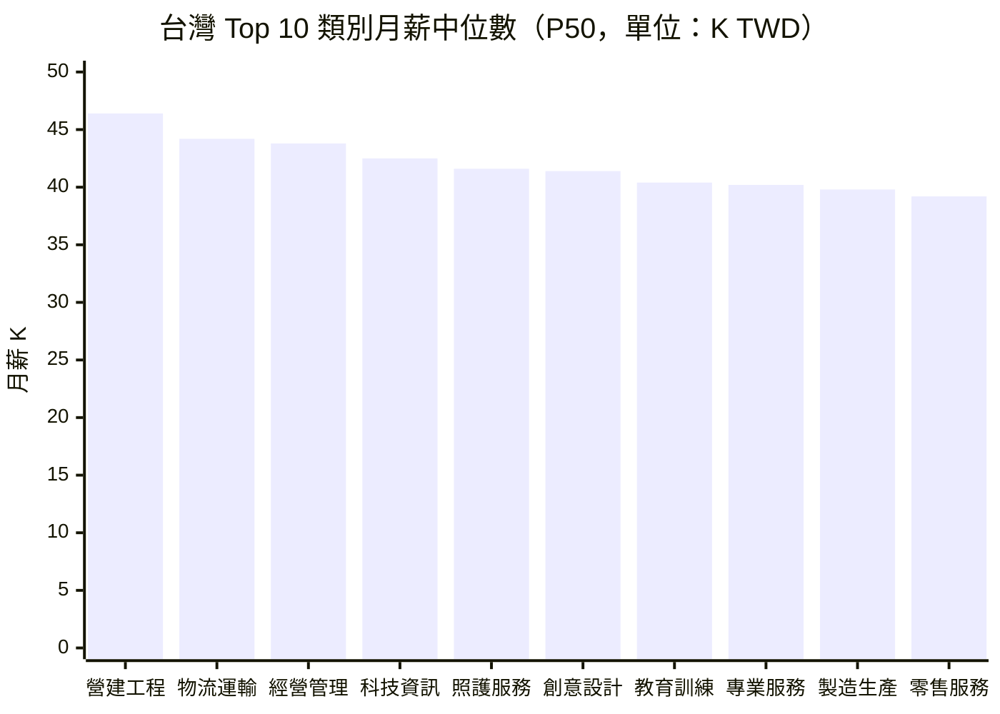

# 薪資帶分析 — 2026年第25週

> 本報告數據直接讀取自 Extractor Layer 萃取結果（docs/Extractor/）。註：本週 Qdrant 向量搜尋因 OpenAI API 金鑰失效（HTTP 401）暫停，改以 Layer 語料庫直接讀取，底層資料一致。

## 數據品質聲明

> **重要提醒**：本報告薪資數據存在結構性限制。
> - 「面議」/未揭露職缺佔比：約 47.4%（台灣）、約 53%（美國 Adzuna）——已排除在統計之外
> - 有效薪資樣本數：967 筆（台灣 574 筆，2026-02~03 批次；美國 Adzuna 393 筆，2026-02 批次）
> - 角色覆蓋率：14/53 個目標角色有足夠有效樣本
> - 薪資為刊登區間中位數，非實際支付薪資
> - **本週特殊情況**：tw_govjobs 與 global_adzuna 雖於 2026-06-17 觸發 raw 擷取，但萃取後的 `.md` 語料仍為 2026 年 2~3 月批次，台灣薪資數字與 W17 報告同源；本週主要新增為 **美國 Adzuna 393 筆有揭露薪資職缺**的薪資分布。
> - 詳見報告末「數據局限性」完整說明

## 摘要

> 本週薪資觀測的主要新增資料來自美國 [Adzuna](/glossary/#薪資帶salary-band) 職缺語料：393 筆有揭露薪資的美國職缺顯示，年薪中位數（P50）為 $76,939 USD，P25 為 $51,030、P75 為 $117,183，反映美國職缺薪資的高度分散。按 [AI 取代向量](/glossary/#ai-取代向量)拆解，認知非例行職（311 筆）中位數達 $79,023 為最高，認知例行職（20 筆）僅 $42,993，兩者差距達 1.83 倍，與「AI 較易取代例行認知工作」的長期趨勢一致。台灣方面，因 tw_govjobs 萃取語料本週未更新（仍為 2026 年 2~3 月批次），台灣薪資延續 W17 觀測：營建工程類月薪中位數 46,400 TWD 續居冠軍，科技資訊類穩站 42,500 TWD。美國總體指標維持 2026 年 3 月 BLS 初值：平均時薪 $37.38（+3.5% YoY），失業率 4.3%，CPI 年增 3.3%。

## 資料來源

| Layer | 有效薪資樣本 | 薪資揭露率 | 資料時點 | 角色 |
|-------|------------|----------|---------|------|
| global_adzuna（美國 job_posting） | 393 | ~47% | 2026-02 萃取批次 | **本週主要新增**：美國薪資分布 |
| tw_govjobs | 574 | 55.2% | 2026-02~03 萃取批次 | 台灣主要來源（本週未更新） |
| global_bls | N/A（總體指標） | N/A | 2026-03 初值 | 美國總體薪資/通膨參考 |
| global_hays_salary | 0（僅元數據） | — | 2026-03 | WebFetch 失敗，無薪資數字 |
| global_stackoverflow | 0（僅元數據） | — | 2026-01 | WebFetch 失敗，無薪資數字 |

> **注意**：Hays 與 Stack Overflow Layer 因 WebFetch 限制，萃取結果僅含元數據，無可用薪資數字，本週不納入數值統計。本報告未使用 Qdrant 向量搜尋（OpenAI API 金鑰 HTTP 401），改以直接讀取 Layer `.md` 語料庫，底層資料一致。

## Top 10 角色月薪中位數（台灣）

> 資料來源：tw_govjobs 574 筆有效薪資樣本（2026-02~03 萃取批次），面議排除率 47.4%。台灣語料本週未重新擷取，數值同 W17。

## 美國職缺薪資帶（Adzuna，本週新增）

### 整體分布（393 筆有揭露薪資職缺）

| 指標 | 年薪 (USD) | 換算月薪 (TWD, 1USD=31) | 說明 |
|------|-----------|------------------------|------|
| [P25](/glossary/#p25--p50--p75) | $51,030 | 約 131,800 TWD | 較低薪資帶 |
| P50（中位數） | $76,939 | 約 198,800 TWD | 市場中位 |
| P75 | $117,183 | 約 302,700 TWD | 較高薪資帶 |
| 平均（參考） | $89,755 | — | 受高薪極端值拉高，僅供參考 |

> 資料來源：global_adzuna 美國 job_posting，393 筆有揭露薪資職缺，2026-02 萃取批次。薪資為年薪刊登區間中位點。

**代表性高薪職缺（美國）**：

- Healthcare Litigation Attorney（Remote）：$334,213 USD/年
- Principal Embedded Real-time Software Engineer：$312,608 USD/年
- VP, Chief Information Officer（Investments）：$240,000–$295,000 USD/年
- Director Product Development（Medicare Advantage）：$264,696 USD/年

> **注意**：本批次美國樣本含少數兼職/PRN（按需）職缺，最低值如 RN PRN（$10,160）、Pharmacy Technician PRN（$15,316）為部分工時換算，已知會拉低低分位數。P25/P50 以全樣本中位點計算，未排除部分工時，解讀時應留意。

### 美國職缺薪資帶 × AI 取代向量（本週重點）

| 取代向量 | 樣本數 | P25 (USD) | P50（中位） | P75 (USD) | 解讀 |
|----------|--------|-----------|------------|-----------|------|
| [認知非例行](/glossary/#認知非例行cognitive-non-routine) | 311 | $51,055 | **$79,023** | $121,336 | 樣本最多、分布最廣，頂尖職達 30 萬+ |
| [高度人際](/glossary/#高度人際interpersonal) | 53 | $65,432 | $78,988 | $111,042 | 中位數接近認知非例行，下緣較高 |
| [認知例行](/glossary/#認知例行cognitive-routine) | 20 | $32,490 | $42,993 | $80,745 | ⚠️ 小樣本；中位數明顯偏低 |
| [體力例行](/glossary/#體力例行physical-routine) | 5 | $51,158 | $54,033 | $59,116 | ⚠️ 樣本嚴重不足，僅供參考 |
| [體力非例行](/glossary/#體力非例行physical-non-routine) | 4 | $35,286 | $52,241 | $54,287 | ⚠️ 樣本嚴重不足，僅供參考 |

> 資料來源：global_adzuna 美國 job_posting 393 筆，依萃取時標註的 `ai_displacement_vector` 分組。
> **樣本量警告**：體力例行（5 筆）、體力非例行（4 筆）、認知例行（20 筆）樣本不足，統計數據僅供參考，不應據此做跨向量結論。

**觀察**：在樣本充足的兩個向量中，認知非例行（$79,023）與高度人際（$78,988）中位數幾乎相同，但認知非例行的薪資帶更寬（P25–P75 跨度 $70K vs $46K），反映技術/專業職的技能溢價差異更大。認知例行中位數（$42,993）僅為認知非例行的 54%，雖受小樣本影響，方向上與「AI 自動化壓抑例行認知工作薪資」一致。

## 台灣市場[薪資帶](/glossary/#薪資帶salary-band)（延續 W17，本週未更新）

> 以下台灣數據來自 tw_govjobs 2026-02~03 萃取批次，本週未重新擷取，數值與 [W17 報告](/reports/salary-bands-w17/)同源。週變化欄位反映 W13→W17 累積變化，非本週新增。

### 科技資訊（tech）— 認知非例行

| 指標 | 數值 | 說明 |
|------|------|------|
| 樣本數 | 95 | 台灣科技類最大樣本 |
| P25 | 37,800 TWD | 較低薪資帶 |
| P50（中位數） | 42,500 TWD | 市場中位 |
| P75 | 55,200 TWD | 較高薪資帶 |

**代表職缺（2026-02~03 批次）**：資深雲端工程師（金融科技）58,000~75,000 TWD/月；JAVA 軟體工程師 50,000~78,000 TWD/月；資訊安全工程師 44,000~60,000 TWD/月。

### 台灣各類別薪資中位數排名

| 排名 | 類別 | P50 (TWD) | 樣本數 | AI 取代向量 |
|------|------|-----------|--------|------------|
| 1 | 營建工程 | 46,400 | 18 | 體力非例行 |
| 2 | 物流運輸 | 44,200 | 34 | 體力非例行 |
| 3 | 經營管理 | 43,800 | 31 | 高度人際 |
| 4 | 科技資訊 | 42,500 | 95 | 認知非例行 |
| 5 | 照護服務 | 41,600 | 12 | 高度人際 |
| 6 | 創意設計 | 41,400 | 57 | 認知非例行 |
| 7 | 教育訓練 | 40,400 | 16 | 高度人際 |
| 8 | 專業服務 | 40,200 | 89 | 認知非例行 |
| 9 | 製造生產 | 39,800 | 14 | 體力例行 |
| 10 | 零售服務 | 39,200 | 499 | 體力非例行 |
| 11 | 法務人資 | 38,500 | 7 ⚠️ | 認知非例行 |
| 12 | 技術工藝 | 35,800 | 66 | 體力非例行 |
| 13 | 財務會計 | 35,200 | 33 | 認知例行 |
| 14 | 醫療照護 | 34,800 | 67 | 體力非例行 |

> **樣本量警告**：法務人資（7 筆）以 ⚠️ 標註，數據僅供參考。農業（0 筆）、公共服務（2 筆）因樣本不足，未納入排名。

## 同角色跨地區薪資比較（台灣，延續 W17）

| 地區 | 平均薪資中位 | 相對台北倍率 | 主要高薪產業 |
|------|------------|-------------|-------------|
| 台北市 | 40,400 TWD | 1.00 | 科技資訊、經營管理 |
| 新竹（含縣市） | 41,800 TWD | 1.03 | 科技資訊（半導體群聚） |
| 新北市 | 38,500 TWD | 0.95 | 物流運輸、製造生產 |
| 桃園市 | 37,800 TWD | 0.94 | 製造生產、物流運輸 |
| 高雄市 | 36,800 TWD | 0.91 | 營建工程、零售服務 |
| 台中市 | 37,200 TWD | 0.92 | 零售服務、製造生產 |
| 台南市 | 36,600 TWD | 0.91 | 製造生產、技術工藝 |
| 其他地區 | 35,900 TWD | 0.89 | 農業、零售服務 |

> **注意**：tw_govjobs 約 90% 樣本來自台北市，非台北地區以有限樣本推估，參考價值有限。數值同 W17，本週未更新。

## 全球薪資對標

### 台灣 vs 美國（軟體/技術職）

| 角色 | 台灣 P50 (TWD/月) | 台灣 (USD/年) | 美國 P50 (USD/年) | 台灣/美國比 | 來源 |
|------|------------------|---------------|------------------|------------|------|
| 認知非例行職（推估） | 42,500 | ~$16.5K | $79,023 | ~21% | tw_govjobs / global_adzuna |

> **匯率與 PPP 說明**：美國薪資以美元計，匯率 1 USD = 31 TWD。此對比僅供參考，**未考慮購買力平價（PPP）、生活成本、稅負差異**。台灣來源為台灣就業通（偏中小企業與公部門），可能低於含科技大廠的整體市場。美國 Adzuna 樣本以認知非例行職為主（311/393），中位數偏高。

### 美國總體薪資指標（BLS 2026-03 初值）

根據美國勞工統計局（BLS）2026 年 3 月初值[^1]：

- 平均時薪：$37.38 USD（初值），月增 +1.1%，**年增 +3.5%**（相較 2025-03 $36.11）
- 換算月薪（40hr/週）：約 $6,466 USD/月（約 200,400 TWD/月）
- CPI 年增率 3.3%[^2]，實質薪資成長約 +0.2%（正成長但幅度微薄）
- 失業率（U-3）4.3%[^3]，連續三個月維持 4% 以上，勞動市場降溫趨勢延續

> **注意**：BLS 數據維持 2026 年 3 月初值，與 W17 報告同源，本週無新月報。

### Hays / Stack Overflow

Hays 全球薪資指南與 Stack Overflow 2025 開發者調查的萃取結果本週仍因 WebFetch 限制僅含元數據，無可用薪資數字[^4][^5]，待人工補充。

## AI 取代向量 × 薪資趨勢（綜合台美）

| 取代向量 | 台灣 P50 (TWD) | 美國 P50 (USD)（樣本） | 解讀 |
|----------|---------------|----------------------|------|
| 認知例行 | 35,200（財務會計） | $42,993（n=20 ⚠️） | 台美皆為各向量中偏低，自動化壓力最大 |
| 認知非例行 | 42,500（科技資訊） | $79,023（n=311） | 樣本最廣、薪資帶最寬，技能溢價顯著 |
| 體力例行 | 39,800（製造生產） | $54,033（n=5 ⚠️） | 美國樣本不足，不下結論 |
| 體力非例行 | 41,500（營建/物流/工藝） | $52,241（n=4 ⚠️） | 美國樣本不足；台灣受 Q2 工程旺季支撐 |
| 高度人際 | 41,900（管理/教育/照護） | $78,988（n=53） | 中位數接近認知非例行，人際價值穩固 |

**推測**：在樣本充足的向量中，台美數據一致顯示「認知例行」薪資位居各向量底部（台灣財務會計 35.2K、美國 $42,993），而「認知非例行」與「高度人際」位居頂部。此跨市場一致性，方向上支持「AI 自動化優先壓抑例行認知工作薪資」的假說。**此為推測，受美國體力類向量小樣本（4–5 筆）限制，不應據此做完整向量排序。**

## 薪資談判參考

> ⚠️ **重要提醒**：以下僅為基於市場數據的參考框架，不構成薪資談判建議或承諾。
> 實際薪資受個人經驗、技能、公司規模、地區等多重因素影響。

### 如何解讀 P25/P50/P75

- **P25 以下**：低於市場 75% 的同類職缺——若您的經驗和技能符合要求，可參考 P50 作為談判目標
- **P25-P50**：位於市場中段偏低——多數初階職位的範圍
- **P50-P75**：位於市場中段偏高——通常對應中高階或熱門技能加成
- **P75 以上**：高於市場 75% 的同類職缺——通常對應資深、稀缺技能或特殊產業

### 本週參考數據

| 市場 / 類別 | P25 | P50 | P75 | 樣本數 |
|-------------|-----|-----|-----|--------|
| 美國 — 認知非例行職 | $51,055 | $79,023 | $121,336 | 311 |
| 美國 — 高度人際職 | $65,432 | $78,988 | $111,042 | 53 |
| 台灣 — 科技資訊（TWD） | 37,800 | 42,500 | 55,200 | 95 |
| 台灣 — 營建工程（TWD） | 38,200 | 46,400 | 52,000 | 18 |
| 台灣 — 零售服務（TWD） | 35,500 | 39,200 | 43,200 | 499 |

> 美國數據基於 393 筆有揭露薪資職缺（約 47% 揭露率），台灣基於 574 筆有效樣本（面議排除率 47.4%）。高薪職缺傾向不揭露/面議，實際市場中位數可能高於上述數字。

## 分析師觀察

### 1. 美國職缺薪資高度分散，認知非例行職主導樣本

本週新增的美國 Adzuna 393 筆樣本中，認知非例行職佔 311 筆（79%），P25–P75 跨度達 $70K（$51K→$121K），顯示美國技術/專業職的薪資離散度遠高於台灣。中位數 $76,939 換算約 198,800 TWD/月，約為台灣科技資訊類（42,500 TWD）的 4.6 倍——但此差距未經 PPP 調整，且台美樣本來源、職級結構不可直接類比。

### 2. 跨市場一致：認知例行職位居薪資底部

台灣（財務會計 35,200 TWD）與美國（認知例行 $42,993）的資料一致顯示，認知例行職在各自市場中均屬偏低薪資帶。雖然美國認知例行樣本僅 20 筆需謹慎，但兩個獨立市場、獨立資料源指向同方向，提升此觀察的參考價值。對從事認知例行工作者，**推測**技能升級（向認知非例行或高度人際發展）有助於改善薪資定位。

### 3. 台灣語料未刷新，建議下週優先重跑 tw_govjobs 萃取

本週 tw_govjobs 與 adzuna 雖觸發 raw 擷取（2026-06-17），但萃取後的 `.md` 仍為 2~3 月批次。這意味台灣薪資已連續多週使用同一語料，趨勢更新停滯。**建議下週優先重新萃取 tw_govjobs 與 adzuna raw 資料**，以恢復台灣薪資的週度追蹤能力。本週報告已透明標註此限制，台灣數值僅作延續參考，不代表 6 月最新市場。

## 數據局限性

### 結構性限制

1. **「面議」/未揭露排除偏差**：台灣約 47.4%、美國約 47% 職缺未揭露薪資並被排除。由於高薪職缺更傾向不揭露，實際市場中位數可能高於本報告數字。

2. **刊登薪資 vs 實付薪資**：企業刊登的薪資區間通常為保守估計，實際錄取薪資可能高於刊登值（尤其高階職位）。

3. **經驗年資未控制**：同一類別/向量下包含初階至高階職缺，P25–P75 範圍反映年資差異，而非同等年資的薪資分佈。

4. **樣本來源與結構偏差**：台灣薪資主要來自台灣就業通（偏公部門與中小企業）；美國 Adzuna 樣本以認知非例行職為主（79%），跨向量比較受樣本結構影響。

5. **部分工時與約聘**：美國樣本含少數 PRN/兼職職缺（如 RN PRN $10,160），會拉低低分位數；台灣部分低薪資數據可能來自部分工時或約聘。

### 本週特殊情況

- **台灣與美國 Adzuna 語料未刷新**：raw 於 2026-06-17 擷取，但 `.md` 萃取結果仍為 2026 年 2~3 月批次。台灣薪資與 W17 同源。
- **Qdrant 向量搜尋暫停**：OpenAI API 金鑰失效（HTTP 401），本週改以直接讀取 Layer 語料庫。
- **Hays / Stack Overflow** 因 WebFetch 限制僅含元數據，無薪資數字。
- **BLS 數據維持 2026 年 3 月初值**，尚未發布後續月報。
- 美國體力例行（5 筆）、體力非例行（4 筆）向量樣本嚴重不足，相關中位數僅供參考。

## 本週行動清單

> **語氣規範**：使用「建議」而非「應該」，客觀不強迫。

### 求職者

- [ ] **參考美國認知非例行職 P50（$79,023）評估遠端機會**：若投遞美國遠端職缺且具備相關技術/專業技能，可參考此中位數設定期望；資深或稀缺技能職可參考 P75（$121,336）
- [ ] **比較台美薪資結構差異**：美國職缺薪資離散度高（P25–P75 跨 $70K），台灣相對集中。若考慮跨國機會，建議綜合評估 PPP、稅負、生活成本後再比較絕對數字
- [ ] **留意認知例行職的薪資定位**：台美資料一致顯示認知例行職薪資偏低（台灣 35.2K、美國 $42,993），若目前從事此類工作，建議評估技能升級路徑
- [ ] **台灣求職者參考科技資訊類 P50（42.5K）設定期望**：但須注意此為 2~3 月數據，建議搭配當前人力銀行即時資料交叉驗證

### 在職者

- [ ] **對照所屬向量中位數評估自身定位**：若低於所屬市場/向量 P25，建議蒐集更多即時市場資料作為調薪參考
- [ ] **關注 AI 取代向量的薪資結構訊號**：認知例行職在台美雙市場皆位居薪資底部，建議評估向認知非例行或高度人際方向的技能投資

### 下週關注

- 優先重新萃取 tw_govjobs 與 global_adzuna raw 資料，恢復週度趨勢追蹤
- Qdrant / OpenAI API 金鑰是否修復，恢復向量搜尋
- BLS 是否發布 4 月後續月報
- 美國 Adzuna 是否能補足體力類向量樣本，使跨向量比較更穩健

**查看本週產業薪資比較，了解哪個產業給最多** → [產業分層分析](/reports/industry-segments-w25/)

**查看本週求職策略建議** → [求職策略](/reports/career-strategy-w25/)

---

## 免責聲明

本報告為自動化分析產出，僅供參考。薪資數據基於公開刊登的職缺薪資區間，不代表實際市場薪資水準。「面議」/未揭露職缺已排除在統計之外，可能造成系統性偏差。本報告不構成薪資談判的依據或承諾。任何薪資相關決策請綜合多方資訊後自行判斷，必要時諮詢專業人力資源顧問。

本週台灣薪資語料為 2026 年 2~3 月批次，未於本週重新擷取，數值僅作延續參考，不代表 2026 年 6 月最新市場行情。

---

## 參考文獻

[^1]: 美國勞工統計局平均時薪，2026年3月初值，docs/Extractor/global_bls/average_earnings/CES0500000003_2026-03.md
[^2]: 美國勞工統計局 CPI-U，2026年3月，docs/Extractor/global_bls/cpi_inflation/CUSR0000SA0_2026-03.md
[^3]: 美國勞工統計局失業率 U-3，2026年3月，docs/Extractor/global_bls/unemployment_rate/LNS14000000_2026-03.md
[^4]: Hays Salary Guide — Global 2026（WebFetch 失敗，僅元數據），docs/Extractor/global_hays_salary/
[^5]: Stack Overflow Developer Survey 2025（WebFetch 失敗，僅元數據），docs/Extractor/global_stackoverflow/salary_survey/2025_compensation-and-benefits.md
[^6]: Adzuna 美國職缺薪資資料（393 筆有揭露薪資，2026-02 批次），docs/Extractor/global_adzuna/job_posting/
[^7]: 台灣就業通職缺資料（2026-02~03 萃取批次），docs/Extractor/tw_govjobs/

---

最後更新：2026-06-17
