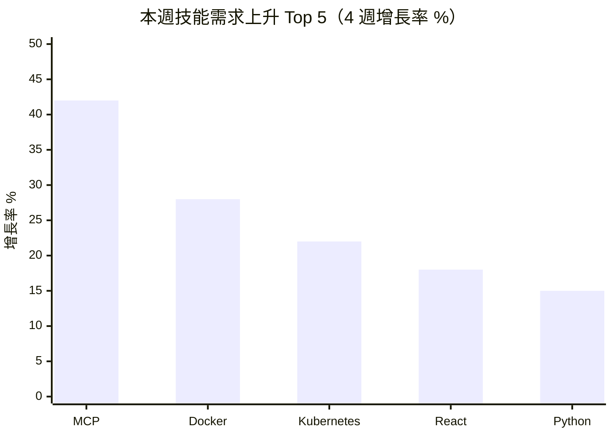

# 內容規格書：skills_drift / 技能需求漂移分析 — 每週報告

> 內部規劃文件，不發布至 GitHub Pages。
> 產出日期：2026-03-22
> Revamp 階段：Stage 5（Content Specification）
> 本文件直接指導每週報告的 AI 自動化產出。

---

## 1. 頁面目標

### 主要目標

每週追蹤 40+ 技能標籤的出現頻率變化，透過視覺化排名和趨勢分析，幫助技術工作者、教育機構和 HR 在技能需求轉移之前看到信號。

### 次要目標

1. 識別新出現的技能標籤，提供早期預警
2. 透過 AI 取代向量交叉分析，連結技能趨勢與職涯安全性
3. 為上升技能提供結構化學習路徑引導

### 成功指標

| 指標 | 目標值 | 測量方式 |
|------|--------|----------|
| 頁面瀏覽量 | > 800 PV/報 | Google Analytics |
| 技術社群分享 | > 5 次/報 | 社群監控 |
| 閱讀深度 | 滾動超過 70% | Analytics 滾動深度 |

---

## 2. 目標受眾

### 主要受眾

| 項目 | 說明 |
|------|------|
| 是誰 | 技術工作者（25-40 歲工程師/資料科學家/設計師）、教育機構課程設計師 |
| 來這頁的目的 | 確認學習投資方向、發現新興技能、驗證課程主題市場需求 |
| 進入方式 | Google 搜尋「{技能名稱} 需求」/ 直接回訪 / 技術社群分享 |
| 下一步期望 | 規劃學習路徑、調整課程設計、更新履歷技能清單 |

---

## 3. 關鍵訊息

| 順序 | 訊息 | 呈現方式 |
|------|------|----------|
| 1 | 本週最值得注意的技能需求變化（上升/下降/新出現） | Top 10 排名 + Mermaid 長條圖 |
| 2 | 技能需求的「方向」比「排名」更重要——關注漂移速度 | 4 週和 12 週趨勢對比 |
| 3 | 每個技能都有 AI 取代向量標籤，技能學習應考慮職涯安全性 | AI 向量 × 技能交叉分析 |

---

## 4. 內容結構

### 4.1 區塊規劃

```
┌─────────────────────────────────────┐
│ 區塊 1：摘要（2-3 句核心變化）       │
├─────────────────────────────────────┤
│ 區塊 2：Top 10 上升 Mermaid 長條圖   │
├─────────────────────────────────────┤
│ 區塊 3：技能上升榜（4 週 + 12 週）   │
├─────────────────────────────────────┤
│ 區塊 4：技能下降榜（含空白處理）     │
├─────────────────────────────────────┤
│ 區塊 5：跨週排名比較表（W-3~W）     │
├─────────────────────────────────────┤
│ 區塊 6：AI 取代向量 × 技能變化      │
├─────────────────────────────────────┤
│ 區塊 7：產業別技能需求（Phase 2）    │
├─────────────────────────────────────┤
│ 區塊 8：新出現 / 消失的技能標籤     │
├─────────────────────────────────────┤
│ 區塊 9：跨源交叉驗證               │
├─────────────────────────────────────┤
│ 區塊 10：分析師觀察                │
├─────────────────────────────────────┤
│ 區塊 11：行動清單（含學習路徑）     │
├─────────────────────────────────────┤
│ 區塊 12：免責聲明                  │
└─────────────────────────────────────┘
```

### 4.2 各區塊詳細規格

#### 區塊 1：摘要

| 項目 | 規格 |
|------|------|
| 目的 | 30 秒掌握本週技能需求核心變化 |
| 格式 | blockquote，2-3 句 |
| 字數 | 80-120 字 |
| 必含 | (1) 最值得注意的技能變化 (2) 影響的產業/角色 (3) 與前週的比較方向 |

---

#### 區塊 2：Top 10 技能上升 Mermaid 長條圖（新增）

| 項目 | 規格 |
|------|------|
| 目的 | 視覺化入口，讓讀者一眼掌握排名 |
| 格式 | Mermaid xychart-beta 水平長條圖 |
| 數據 | Top 5-8 上升技能的 4 週增長率 |

##### 範例

````markdown

> 資料來源：{N} 筆職缺，觀測週期 W{WW-3}~W{WW}
````

---

#### 區塊 3：技能上升榜

維持 Mode CLAUDE.md 定義的表格格式（4 週 + 12 週）。

**強化規格**：
- 每個技能的「主要需求產業」必須具體（如「金融科技」而非「科技業」）
- 變化率小樣本（出現 < 5 次）必須標註「⚠️ 小樣本」

---

#### 區塊 4：技能下降榜（修復）

| 項目 | 規格 |
|------|------|
| 目的 | 告訴讀者「什麼不該投入學習」 |
| 空白處理 | 若無法觀測到下降技能，必須加入以下說明框 |

##### 空白處理範例

```markdown
> **數據透明說明**：本週未觀測到明顯技能需求下降。這可能因為：
> 1. 主要資料源（HN Hiring、Arbeitnow）偏向科技成長領域，傳統技能衰退不易觀測
> 2. 週度觀測窗口過短，部分技能衰退需要月度或季度才能識別
> 3. 台灣本地職缺資料（tw_govjobs）以服務業為主，科技技能下降信號較弱
>
> 如需了解長期技能衰退趨勢，建議參考 [WEF 未來就業報告](/reports/) 或 [Lightcast Skill Projections](https://lightcast.io/)。
```

---

#### 區塊 5：跨週排名比較表（新增）

| 項目 | 規格 |
|------|------|
| 目的 | 讓讀者看到技能排名的穩定性和變化 |
| 格式 | 4 週排名對比表格 |
| 數據 | Top 10 技能在 W-3、W-2、W-1、W 的排名和出現次數 |

---

#### 區塊 6：AI 取代向量 × 技能變化

維持 Mode CLAUDE.md 五向量格式。每個向量段落必含：
1. 整體趨勢（上升/下降/持平）
2. 代表性技能表格（技能標籤、變化方向、變化率、解讀）
3. 1-2 句趨勢解讀

---

#### 區塊 7：產業別技能需求（Phase 2 新增）

| 項目 | 規格 |
|------|------|
| 目的 | 回答「這個技能在我的產業也在上升嗎？」 |
| 格式 | 選取 3-5 個本週最受關注的技能，列出其在不同產業的需求差異 |

---

#### 區塊 11：行動清單（改版，含學習路徑）

| 受眾 | 行動數量 | 內容方向 |
|------|----------|----------|
| 求職者 | 3-5 條 | 技能學習建議、履歷更新、面試準備 |
| 在職者 | 2-3 條 | 技能組合評估、學習規劃 |

**學習路徑規格**（對 Top 3 上升技能）：

| 元素 | 規格 |
|------|------|
| 技能名稱 | 含 AI 向量歸屬標籤 |
| 官方資源 | 1-2 個免費官方文件/教程連結 |
| 平台名稱 | 主流平台名稱（不含特定課程連結） |
| 預估入門時間 | 基於公開資訊的粗估（如「基礎：20-40 小時」） |

---

## 5. CTA 規格

| 類型 | 文案 | 連結目標 |
|------|------|----------|
| 主要 | 「查看本週薪資帶分析，了解這些技能值多少錢 →」 | salary_bands 同週報告 |
| 次要 | 「查看上週技能漂移分析 →」 | 上週 skills_drift |

---

## 6. SEO 規格

| 項目 | 規格 |
|------|------|
| seo.title | `{YYYY}年第{WW}週技能需求：{Top1技能}上升{X%} \| 技能漂移` ≤ 60 字元 |
| seo.description | `本週技能分析：{技能1}需求上升{X%}，{技能2}{趨勢}。分析{N}筆職缺。` ≤ 155 字元 |
| keywords | 5-8 個，含本週 Top 3 技能名稱 + 「技能需求」「程式語言趨勢」 |
| FAQ | 3-5 題：Q1 固定「哪些程式語言需求上升」；Q2 固定「AI 技能需求現況」 |

---

## 7. 寫作指南

### 語氣調性

| 維度 | 規格 |
|------|------|
| 正式度 | 數據分析師的精準——「需求增長 15.6%」而非「需求大幅增長」 |
| 專業度 | 技術人員理解的深度——可使用 Docker、Kubernetes 等專有名詞不需解釋 |
| 情感 | 客觀中立，不炒作「不學就落伍」 |

### 用語規範

| 使用 | 避免 |
|------|------|
| 需求上升/下降 X% | 大幅增長、暴跌 |
| 觀測到的趨勢 | 確定的預測 |
| 值得關注 | 必學、必備 |
| 數據來源有限，需持續觀測 | 肯定會持續上升 |

### 技能標籤規範

- 同義標籤合併，使用最通用名稱
- 首次出現以括號標註別名：「JavaScript（JS）」
- 出現次數 < 5 次的標籤標註「⚠️ 小樣本」
- 分類必須為 8 大類之一（程式語言、框架與工具、雲端、AI/資料、資安、軟技能、領域知識、證照）

---

## 8. 品質檢查清單

- [ ] 摘要存在且 80-120 字
- [ ] Mermaid 長條圖存在且數據與表格一致
- [ ] 技能上升榜 Top 10 含 4 週和 12 週趨勢
- [ ] 技能下降榜非空白（有數據或有解釋說明）
- [ ] 跨週排名比較表存在
- [ ] AI 取代向量五個分類均有涵蓋
- [ ] 小樣本（< 5 次）標註完整
- [ ] 新出現技能有產業/角色上下文
- [ ] 學習資源為公開可驗證的免費資源
- [ ] 無「必學」「不學就落伍」等炒作用語
- [ ] 免責聲明完整
- [ ] Qdrant 標註存在
- [ ] Jekyll Front Matter 完整（title, parent, nav_order, permalink, seo）

---

*本規格書為每週 skills_drift 報告的操作手冊。搭配 `core/Narrator/Modes/skills_drift/CLAUDE.md` 使用。*
