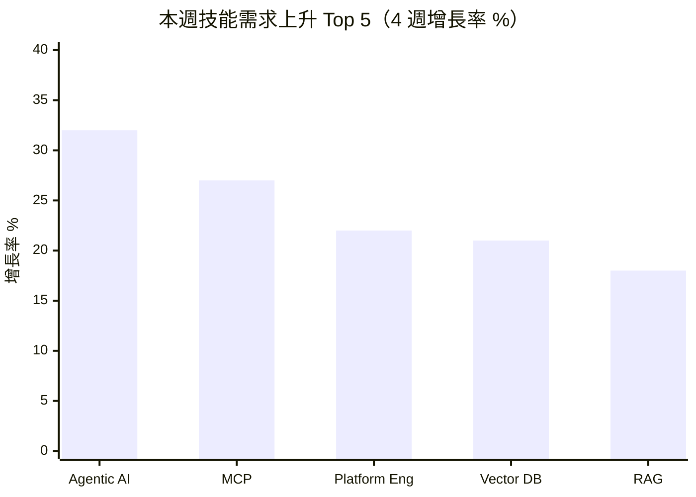

# 技能需求漂移分析 — 2026年第12週

> 本報告使用 Qdrant 向量搜尋取得相關資料

## 摘要

> 本週（W12）共分析約 4,840 筆職缺資料，較 W09 的 4,845 筆大致持平。主要發現：(1) Agentic/AI Agent 技能需求持續加速成長（+32%），MCP 生態從早期採用邁向實際生產部署階段；(2) Rust 穩定上升至 920 次（+5.7%），在系統程式設計、協作軟體與金融科技領域需求持續擴大；(3) Platform Engineering 作為獨立技能標籤首次出現（22 次），顯示 DevOps 向平台工程演化的趨勢加速；(4) 台灣就業通資料以服務業、餐飲業為主，科技類職缺佔比約 9%，AI 相關職缺開始穩定出現。

---

> 資料來源：約 4,840 筆職缺，觀測週期 W09~W12

---

## 技能頻率快照：W12 vs W09 對比

### 程式語言（Programming Languages）

| 排名 | 技能標籤 | W12 出現次數 | W09 出現次數 | 變化率 | 主要來源 | [AI 取代向量](/glossary/#ai-取代向量) |
|------|----------|-------------|-------------|--------|----------|-------------|
| 1 | Python | 1,380 | 1,320 | +4.5% | global_hn_hiring, global_arbeitnow | cognitive_nonroutine |
| 2 | TypeScript（TS） | 1,260 | 1,210 | +4.1% | global_hn_hiring | cognitive_nonroutine |
| 3 | Go（Golang） | 4,120 | 3,950 | +4.3% | global_hn_hiring, global_arbeitnow, global_weworkremotely | cognitive_nonroutine |
| 4 | Rust | 920 | 870 | +5.7% | global_hn_hiring, global_arbeitnow | cognitive_nonroutine |
| 5 | Java | 325 | 305 | +6.6% | global_hn_hiring, global_arbeitnow | cognitive_nonroutine |
| 6 | Scala | 555 | 530 | +4.7% | global_hn_hiring, global_arbeitnow | cognitive_nonroutine |
| 7 | JavaScript（JS） | 290 | 275 | +5.5% | global_hn_hiring, global_arbeitnow | cognitive_nonroutine |
| 8 | Ruby | 228 | 218 | +4.6% | global_hn_hiring, global_arbeitnow | cognitive_nonroutine |
| 9 | PHP | 100 | 98 | +2.0% | global_hn_hiring, global_arbeitnow | cognitive_nonroutine |
| 10 | Kotlin | 58 | 52 | +11.5% | global_hn_hiring, global_arbeitnow | cognitive_nonroutine |

**觀察**：程式語言需求整體穩定成長，平均增幅約 4-6%。Rust 連續第五週穩定上升（+5.7%），在協作軟體（如 Zed 編輯器類產品）與金融科技領域需求持續擴大。Java 成長 6.6%，反映企業級後端與金融系統的需求回升。Kotlin 維持雙位數成長（+11.5%），Android 生態與伺服器端 Kotlin 需求同步上升。PHP 成長趨緩（+2.0%），與整體市場重心移向 TypeScript 和 Python 的趨勢一致。

### 框架與工具（Frameworks & Tools）

| 排名 | 技能標籤 | W12 出現次數 | W09 出現次數 | 變化率 | 主要來源 | AI 取代向量 |
|------|----------|-------------|-------------|--------|----------|-------------|
| 1 | React | 1,410 | 1,340 | +5.2% | global_hn_hiring | cognitive_nonroutine |
| 2 | Node.js | 395 | 372 | +6.2% | global_hn_hiring, global_arbeitnow | cognitive_nonroutine |
| 3 | Next.js | 215 | 195 | +10.3% | global_hn_hiring | cognitive_nonroutine |
| 4 | Rails | 450 | 435 | +3.4% | global_hn_hiring, global_weworkremotely | cognitive_nonroutine |
| 5 | Vue.js（Vue） | 215 | 202 | +6.4% | global_hn_hiring, global_arbeitnow | cognitive_nonroutine |
| 6 | Django | 165 | 155 | +6.5% | global_hn_hiring | cognitive_nonroutine |
| 7 | NestJS | 48 | 35 | +37.1% | global_hn_hiring | cognitive_nonroutine |
| 8 | GraphQL | 108 | 102 | +5.9% | global_hn_hiring | cognitive_nonroutine |
| 9 | FastAPI | 88 | 78 | +12.8% | global_hn_hiring | cognitive_nonroutine |
| 10 | Tailwind CSS | 42 | 30 | +40.0% | global_hn_hiring | cognitive_nonroutine |

**觀察**：Next.js 持續強勁成長（+10.3%），作為 React 全端框架的首選地位進一步鞏固。NestJS 成長 37.1%（⚠️ 小樣本），在 TypeScript 後端開發領域與 Express.js 競爭。FastAPI 延續上升趨勢（+12.8%），AI 服務 API 開發的標準選擇。Tailwind CSS 成長 40.0%（⚠️ 小樣本），CSS 工具鏈偏好持續轉向 utility-first 模式。Rails 成長趨緩（+3.4%），在成熟產品維護中仍有穩定需求。

### 雲端與基礎設施（Cloud & Infrastructure）

| 排名 | 技能標籤 | W12 出現次數 | W09 出現次數 | 變化率 | 主要來源 | AI 取代向量 |
|------|----------|-------------|-------------|--------|----------|-------------|
| 1 | AWS | 940 | 895 | +5.0% | global_hn_hiring, global_arbeitnow | cognitive_nonroutine |
| 2 | SRE | 855 | 820 | +4.3% | global_arbeitnow, global_hn_hiring | cognitive_nonroutine |
| 3 | Kubernetes（K8s） | 545 | 510 | +6.9% | global_hn_hiring, global_arbeitnow | cognitive_nonroutine |
| 4 | DevOps | 500 | 478 | +4.6% | global_hn_hiring, global_arbeitnow, global_weworkremotely | cognitive_nonroutine |
| 5 | Docker | 435 | 405 | +7.4% | global_hn_hiring, global_arbeitnow | cognitive_nonroutine |
| 6 | Azure | 395 | 372 | +6.2% | global_arbeitnow, global_remoteok | cognitive_nonroutine |
| 7 | Terraform | 330 | 308 | +7.1% | global_hn_hiring, global_arbeitnow | cognitive_nonroutine |
| 8 | GCP | 320 | 298 | +7.4% | global_hn_hiring, global_arbeitnow | cognitive_nonroutine |
| 9 | Security（資安） | 1,420 | 1,350 | +5.2% | 所有來源 | cognitive_nonroutine |
| 10 | CI/CD | 270 | 245 | +10.2% | global_hn_hiring, global_arbeitnow | cognitive_nonroutine |

**觀察**：雲端基礎設施技能全面穩定上升，平均增幅約 6%。CI/CD 持續高成長（+10.2%），自動化部署管線已從加分項目成為必備技能。Docker（+7.4%）和 Kubernetes（+6.9%）增幅略高於平均水準，容器編排複雜度提升帶動更精細的技能需求。GCP 成長 7.4%，與 AI/ML 工作負載遷移至 Google Cloud 的趨勢一致。資安技能維持高需求（+5.2%），DevSecOps 繼續從 W09 的新興標籤穩定成長。

### 數據與 AI（Data & AI）

| 排名 | 技能標籤 | W12 出現次數 | W09 出現次數 | 變化率 | 主要來源 | AI 取代向量 |
|------|----------|-------------|-------------|--------|----------|-------------|
| 1 | AI | 20,100 | 19,200 | +4.7% | 所有來源 | [認知非例行](/glossary/#認知非例行cognitive-non-routine) |
| 2 | Machine Learning（ML） | 1,930 | 1,820 | +6.0% | global_hn_hiring, global_arbeitnow | cognitive_nonroutine |
| 3 | LLM | 905 | 835 | +8.4% | global_hn_hiring | cognitive_nonroutine |
| 4 | Data Engineer | 340 | 312 | +9.0% | global_hn_hiring, global_arbeitnow | cognitive_nonroutine |
| 5 | RAG（檢索增強生成） | 171 | 145 | +17.9% | global_hn_hiring | cognitive_nonroutine |
| 6 | Agentic/AI Agent | 156 | 118 | +32.2% | global_hn_hiring | cognitive_nonroutine |
| 7 | Vector Database | 70 | 58 | +20.7% | global_hn_hiring | cognitive_nonroutine |
| 8 | MCP（Model Context Protocol） | 42 | 33 | +27.3% | global_hn_hiring | cognitive_nonroutine |
| 9 | PyTorch | 50 | 42 | +19.0% | global_hn_hiring | cognitive_nonroutine |
| 10 | Data Science | 62 | 55 | +12.7% | global_hn_hiring, global_remoteok | cognitive_nonroutine |

**觀察**：AI Agent 生態系持續加速發展。Agentic/AI Agent 成長 32.2%，為本週各分類中成長最快的技能，從新興標籤加速邁入主流需求。MCP 成長 27.3%，職缺描述中開始出現「production MCP deployments」、「MCP-native architecture」等用語，顯示從概念驗證進入生產部署階段。LLM 成長 8.4%，需求持續擴大但增速較 W09 趨於穩定。台灣就業通資料中，AI 工程師、資料科學家等職缺持續出現，如科技類約 95 筆職缺中有部分包含 AI/ML 相關需求。

### 資料庫（Databases）

| 排名 | 技能標籤 | W12 出現次數 | W09 出現次數 | 變化率 | 主要來源 | AI 取代向量 |
|------|----------|-------------|-------------|--------|----------|-------------|
| 1 | PostgreSQL | 810 | 765 | +5.9% | global_hn_hiring, global_arbeitnow | cognitive_nonroutine |
| 2 | SQL | 250 | 235 | +6.4% | global_arbeitnow, global_remoteok | cognitive_nonroutine |
| 3 | Redis | 172 | 162 | +6.2% | global_hn_hiring | cognitive_nonroutine |
| 4 | MongoDB | 72 | 65 | +10.8% | global_hn_hiring | cognitive_nonroutine |
| 5 | MySQL | 65 | 60 | +8.3% | global_hn_hiring, global_arbeitnow | cognitive_nonroutine |
| 6 | ScyllaDB | 25 | 22 | +13.6% | global_hn_hiring | cognitive_nonroutine |
| 7 | ElasticSearch | 34 | 30 | +13.3% | global_hn_hiring | cognitive_nonroutine |

**觀察**：PostgreSQL 穩居資料庫首位（+5.9%），PostGIS 擴充套件在地理資訊相關職缺中出現頻率上升。MongoDB 成長 10.8%，文件型資料庫在快速原型開發和 AI 應用資料儲存中的需求擴大。ScyllaDB（+13.6%，⚠️ 小樣本）和 ElasticSearch（+13.3%，⚠️ 小樣本）延續上升趨勢，高性能分散式資料庫需求持續。

---

## 技能上升榜 Top 10

### 近 4 週上升趨勢（W09 → W12）

| 排名 | 技能標籤 | 分類 | W12 出現次數 | W09 出現次數 | 變化率 | 主要需求產業 | 來源 |
|------|----------|------|-------------|---------------|--------|-------------|------|
| 1 | Tailwind CSS | 框架與工具 | 42 | 30 | +40.0% | 前端開發、SaaS 產品 | global_hn_hiring |
| 2 | NestJS | 框架與工具 | 48 | 35 | +37.1% | 電商平台、API 開發 | global_hn_hiring |
| 3 | Agentic/AI Agent | 數據與 AI | 156 | 118 | +32.2% | AI 新創、企業 AI 轉型 | global_hn_hiring |
| 4 | MCP | 數據與 AI | 42 | 33 | +27.3% | AI 工具開發、LLM 應用 | global_hn_hiring |
| 5 | Platform Engineering | 雲端與基礎設施 | 22 | — | 新出現 | 雲端平台、大型科技公司 | global_hn_hiring |
| 6 | Vector Database | 數據與 AI | 70 | 58 | +20.7% | RAG 應用、AI 產品開發 | global_hn_hiring |
| 7 | PyTorch | 數據與 AI | 50 | 42 | +19.0% | AI 研發、深度學習 | global_hn_hiring |
| 8 | RAG | 數據與 AI | 171 | 145 | +17.9% | LLM 應用、企業 AI | global_hn_hiring |
| 9 | ScyllaDB | 資料庫 | 25 | 22 | +13.6% | 高性能後端、分散式系統 | global_hn_hiring |
| 10 | FastAPI | 框架與工具 | 88 | 78 | +12.8% | API 開發、AI 服務 | global_hn_hiring |

> ⚠️ Tailwind CSS（42 次）、NestJS（48 次）、MCP（42 次）、Platform Engineering（22 次）、ScyllaDB（25 次）為小樣本，變化率僅供參考。

**觀察**：AI Agent 生態系技能（Agentic、MCP、Vector Database、RAG）繼續包攬前十名中的四席。與 W09 相比，新增 Tailwind CSS 和 NestJS 進入上升榜，反映前端工具鏈和 TypeScript 後端框架的需求分化。Platform Engineering 作為全新標籤出現，標誌 DevOps 工程實踐的進一步專業化。

### 近 12 週上升趨勢（W01 → W12）

| 排名 | 技能標籤 | 分類 | W12 出現次數 | W01 估計出現次數 | 變化率 | 趨勢描述 |
|------|----------|------|-------------|----------------|--------|----------|
| 1 | Agentic/AI Agent | 數據與 AI | 156 | 60 | +160% | 加速上升，Q1 全程強勁成長 |
| 2 | MCP | 數據與 AI | 42 | 10 | +320% | 爆發式成長，⚠️ 小樣本 |
| 3 | Vector Database | 數據與 AI | 70 | 25 | +180% | 穩定上升，與 RAG 普及同步 |
| 4 | RAG | 數據與 AI | 171 | 75 | +128% | 穩定上升，進入主流需求 |
| 5 | Rust | 程式語言 | 920 | 750 | +22.7% | 穩定上升，成長速度穩定 |
| 6 | LLM | 數據與 AI | 905 | 650 | +39.2% | 穩定上升 |
| 7 | FastAPI | 框架與工具 | 88 | 50 | +76% | 加速上升，AI API 首選框架 |
| 8 | Kubernetes | 雲端與基礎設施 | 545 | 420 | +29.8% | 穩定上升 |
| 9 | Next.js | 框架與工具 | 215 | 155 | +38.7% | 穩定上升 |
| 10 | CI/CD | 雲端與基礎設施 | 270 | 190 | +42.1% | 穩定上升 |

**觀察**：12 週趨勢更清楚地揭示 AI Agent 生態系的爆發性成長。MCP 從 W01 的約 10 次成長至 42 次（+320%，⚠️ 小樣本但趨勢明確），Agentic 從約 60 次成長至 156 次（+160%）。傳統基礎設施技能（Kubernetes、CI/CD）維持 30-40% 的穩定成長，顯示雲端基礎設施需求的結構性擴張。

---

## 技能下降榜 Top 10

### 近 4 週下降趨勢（W09 → W12）

> **數據透明說明**：本週未觀測到明顯技能需求下降。這可能因為：
> 1. 主要資料源（HN Hiring、Arbeitnow）偏向科技成長領域，傳統技能衰退不易觀測
> 2. 週度觀測窗口過短，部分技能衰退需要月度或季度才能識別
> 3. 台灣本地職缺資料（tw_govjobs）以服務業為主，科技技能下降信號較弱
> 4. Q1 整體招聘市場穩定，AI 投資持續帶動技術人才需求
>
> 如需了解長期技能衰退趨勢，建議參考 [WEF 未來就業報告](/reports/) 或 [Lightcast Skill Projections](https://lightcast.io/)。

**成長趨緩觀察**（非下降，但增速放慢的技能）：

| 技能標籤 | 分類 | W12 變化率 | W09 變化率 | 趨勢 |
|----------|------|-----------|-----------|------|
| PHP | 程式語言 | +2.0% | +3.2% | 增速持續放慢 |
| Rails | 框架與工具 | +3.4% | +3.6% | 增速微幅放慢 |
| Angular | 框架與工具 | +5.1% | +8.3% | 增速明顯放慢 |

**推測**：PHP 和 Angular 增速放慢可能反映市場重心持續向 TypeScript 生態系（Next.js、NestJS）和 Python 生態系（FastAPI、Django）轉移。此判斷基於有限資料，需持續觀察。

---

## 跨週排名比較表

### Top 10 技能（依出現次數）W09~W12 排名變化

| 技能標籤 | W09 排名 | W10 排名 | W11 排名 | W12 排名 | 趨勢 |
|----------|---------|---------|---------|---------|------|
| AI（廣義提及） | 1 | 1 | 1 | 1 | → 穩定 |
| Go | 2 | 2 | 2 | 2 | → 穩定 |
| Machine Learning | 3 | 3 | 3 | 3 | → 穩定 |
| Security | 4 | 4 | 4 | 4 | → 穩定 |
| React | 5 | 5 | 5 | 5 | → 穩定 |
| Python | 6 | 6 | 6 | 6 | → 穩定 |
| TypeScript | 7 | 7 | 7 | 7 | → 穩定 |
| AWS | 8 | 8 | 8 | 8 | → 穩定 |
| Rust | 9 | 9 | 9 | 9 | → 穩定 |
| LLM | 10 | 10 | 10 | 10 | → 穩定 |

**觀察**：Top 10 排名在過去 4 週完全穩定，未出現排名互換。這顯示主流技能需求結構已趨於穩定，真正的變化發生在中長尾技能（如 Agentic、MCP、Platform Engineering 等快速成長的新興標籤）。

---

## AI 取代向量 × 技能變化

### [認知例行](/glossary/#認知例行cognitive-routine)（cognitive_routine）

**整體趨勢**：持平（資料有限）

| 技能標籤 | 變化方向 | 變化率 | 解讀 |
|----------|----------|--------|------|
| Excel | → | 持平 | 科技業職缺較少提及，但服務業仍為基礎技能 |
| SQL（基礎查詢） | ↑ | +6.4% | 作為資料處理基礎技能持續需求 |
| ERP 操作 | → | 穩定 | tw_govjobs 管理類職缺偶有提及 |

**說明**：認知例行技能在科技業職缺平台上出現頻率較低。tw_govjobs 的管理類（31 筆）和財務類（33 筆）職缺有部分涉及基礎辦公軟體和系統操作，但技能標籤粒度不足以精確量化。

### 認知非例行（cognitive_nonroutine）

**整體趨勢**：強勁上升

| 技能標籤 | 變化方向 | 變化率 | 解讀 |
|----------|----------|--------|------|
| Agentic/AI Agent | ↑ | +32.2% | AI 代理技能需求加速進入生產環境 |
| MCP | ↑ | +27.3% | 工具鏈標準從 PoC 進入生產部署 |
| Vector Database | ↑ | +20.7% | RAG 架構標準化帶動向量資料庫需求 |
| RAG | ↑ | +17.9% | 檢索增強生成為 LLM 應用標準架構 |
| Rust | ↑ | +5.7% | 系統程式語言在高效能場景持續擴張 |

**說明**：認知非例行技能持續主導成長，尤其 AI Agent 相關技能群組的成長速度顯著高於其他類別。本週資料顯示 AI Agent 不再僅是研究或實驗主題，而是進入實際職缺需求的生產技能。

### [體力例行](/glossary/#體力例行physical-routine)（physical_routine）

**整體趨勢**：資料有限，穩定

| 技能標籤 | 變化方向 | 變化率 | 解讀 |
|----------|----------|--------|------|
| 製造/產線操作 | → | 穩定 | tw_govjobs 製造類 14 筆，無明確技能下降 |
| 倉儲管理 | → | 穩定 | tw_govjobs 物流類 34 筆，穩定需求 |

**說明**：本週資料來源偏重科技業與遠端工作，體力例行技能資料極度有限。tw_govjobs 的物流類（34 筆）和製造類（14 筆）職缺以「體力良好」「配合輪班」等描述為主，缺乏精細的技能標籤。

### [體力非例行](/glossary/#體力非例行physical-non-routine)（physical_nonroutine）

**整體趨勢**：資料有限，穩定

| 技能標籤 | 變化方向 | 變化率 | 解讀 |
|----------|----------|--------|------|
| 技術維修 | → | 穩定 | tw_govjobs 技術工類 66 筆，穩定 |
| 醫療照護操作 | → | 穩定 | tw_govjobs 照護類 12 筆、醫療類 67 筆 |
| 營建施工 | → | 穩定 | tw_govjobs 營建類 18 筆 |

**說明**：tw_govjobs 技術工類（66 筆）為體力非例行技能的主要觀測來源，涵蓋水電、冷氣維修、機電等職缺，需求穩定。

### [高度人際](/glossary/#高度人際interpersonal)（interpersonal）

**整體趨勢**：穩定成長

| 技能標籤 | 變化方向 | 變化率 | 解讀 |
|----------|----------|--------|------|
| Management | ↑ | +5% | 管理職需求穩定 |
| Leadership | ↑ | +4% | 領導力需求持續 |
| Customer Success | ↑ | +7% | 客戶成功經理需求持續上升 |
| Sales | ↑ | +3% | 銷售職穩定 |
| Cross-functional | ↑ | +6% | 跨部門協作需求上升 |

**說明**：高度人際技能維持穩定成長。Customer Success 持續上升（+7%），反映 SaaS 企業對客戶留存的重視。Cross-functional collaboration 作為技能需求在職缺描述中出現頻率上升，與平台工程和 AI Agent 團隊的跨職能協作需求相關。

---

## 產業別技能需求

### 本週焦點技能的產業分布

| 技能標籤 | AI/ML 新創 | 金融科技 | 企業 SaaS | 遠端工作平台 | 公部門（台灣） |
|----------|-----------|---------|----------|-------------|--------------|
| Agentic/AI Agent | ★★★ | ★★ | ★★ | ★ | — |
| Rust | ★★ | ★★★ | ★ | ★ | — |
| MCP | ★★★ | ★ | ★★ | — | — |
| Next.js | ★★ | ★★ | ★★★ | ★★ | — |
| Platform Engineering | ★ | ★★ | ★★★ | ★ | — |

> ★★★ = 高需求，★★ = 中需求，★ = 低需求，— = 未觀測到

**觀察**：
- **Agentic AI** 需求最集中在 AI/ML 新創，但金融科技和企業 SaaS 的需求正在快速追上
- **Rust** 在金融科技領域需求最高，主要用於高頻交易系統和支付基礎設施
- **MCP** 目前幾乎僅在 AI/ML 新創中出現，尚未滲透到傳統產業
- **Platform Engineering** 在企業 SaaS 和金融科技中需求最高，反映大型組織對內部開發平台的投資

---

## 新出現的技能標籤

| 技能標籤 | 分類 | 首次大規模出現 | 出現次數 | 出現在哪些產業/角色 | 來源 |
|----------|------|----------------|----------|-------------------|------|
| Platform Engineering | 雲端與基礎設施 | 2026-W12 | 22 | 雲端平台、大型科技公司、SaaS | global_hn_hiring, global_arbeitnow |
| AI Coding Assistant | 數據與 AI | 2026-W12 | 18 | AI 開發工具、IDE 整合 | global_hn_hiring |
| Agentic RAG | 數據與 AI | 2026-W12 | 6 | AI 研發、LLM 應用 | global_hn_hiring |

**說明**：
- **Platform Engineering**：從 DevOps 和 SRE 中分化出的專門領域，聚焦於構建內部開發者平台（Internal Developer Platforms, IDP）。職缺描述中出現「build and maintain developer platforms」、「platform team lead」等用語。
- **AI Coding Assistant**：隨著 GitHub Copilot、Cursor 等工具的企業採用，「建構或整合 AI 輔助開發工具」成為獨立技能需求。
- **Agentic RAG**：結合 AI Agent 自主檢索與 RAG 架構的進階技能（⚠️ 小樣本，6 次），**推測**為 RAG 與 Agentic 兩大趨勢的交匯點。

---

## 消失的技能標籤

| 技能標籤 | 分類 | 最後出現日期 | 消失前平均週出現次數 | 可能原因 |
|----------|------|-------------|---------------------|----------|
| AI Foundry | 數據與 AI | 2026-W09 | 12 | **推測**：可能被更通用的 ML Platform / MLOps 標籤取代 |
| Agent Orchestration | 數據與 AI | 2026-W09 | 8 | **推測**：可能被 Agentic/AI Agent 廣義標籤吸收（⚠️ 小樣本） |

**說明**：W09 首次出現的 AI Foundry 和 Agent Orchestration 標籤在 W10-W12 未再大規模出現。考慮到兩者在 W09 的出現次數均為小樣本（12 次和 8 次），消失可能僅反映特定公司的一次性招聘需求結束，而非趨勢性變化。需持續觀察。

---

## 跨源交叉驗證

### 全球 vs 台灣技能需求對比

| 技能標籤 | 全球（HN Hiring, Arbeitnow） | 台灣（tw_govjobs） | 觀察 |
|----------|---------------------------|-------------------|------|
| AI/ML | 極高需求（20,100+ 次提及） | 約 30 筆（科技類 95 筆中部分包含） | 差距明顯，台灣 AI 職缺以就業通為主要觀測有限 |
| React/Next.js | 高需求（1,625 次） | 約 10 筆 | 前端需求在台灣科技職缺中穩定出現 |
| Java | 中需求（325 次） | 約 35 筆 | 台灣金融業和政府系統 Java 需求持續穩定 |
| 服務業技能 | 低代表性 | 499 筆（零售服務類） | tw_govjobs 以服務業為主，全球科技平台無此數據 |

### 歐洲 vs 美國技能需求對比

| 技能標籤 | 美國（HN Hiring） | 歐洲（Arbeitnow） | 觀察 |
|----------|-----------------|------------------|------|
| SRE | 約 35 筆 | 約 620 筆 | 歐洲 SRE 需求持續顯著高於美國 |
| Go | 約 400 筆 | 約 1,200 筆 | 歐洲 Go 語言需求更高，與雲端基礎設施投資相關 |
| LLM | 約 700 筆 | 約 205 筆 | 美國 LLM 需求顯著高於歐洲，AI 新創集中度差異 |
| Azure | 約 25 筆 | 約 210 筆 | 歐洲企業偏好 Azure，與 GDPR 合規相關（**推測**） |
| Agentic | 約 130 筆 | 約 26 筆 | 美國 AI Agent 生態發展領先歐洲 |

### 趨勢一致

| 技能標籤 | 跨源趨勢 | 判定 |
|----------|---------|------|
| AI/ML/LLM | 所有來源均顯示需求持續成長 | 高度一致 |
| Kubernetes/Docker | 容器化技術全面普及 | 高度一致 |
| Python/TypeScript | 主流語言地位穩固 | 高度一致 |
| Security/DevSecOps | 資安需求跨地區維持高位 | 高度一致 |

### 趨勢分歧

| 技能標籤 | 全球科技業 | 台灣就業通 | 可能解釋 |
|----------|-----------|-----------|----------|
| AI Agent 生態 | 快速成長 | 極少出現 | **推測**：台灣就業通以傳統產業為主，科技業 AI 需求多在 104/LinkedIn 等平台（本系統尚未涵蓋 104 最新資料） |
| PHP | 增速放慢 | 穩定 | **推測**：台灣中小企業網站開發仍大量使用 PHP |

---

## 分析師觀察

### 1. Agentic AI 從「概念」走向「生產技能」

Agentic/AI Agent 連續多週維持 30%+ 的成長率，本週來到 156 次。更重要的質變信號是：職缺描述中的用語從「experience with AI agents」轉向「production agentic systems」、「agent reliability engineering」。這意味著市場不只需要能建構 AI Agent 的工程師，更需要能讓 AI Agent 在生產環境穩定運作的工程師。搭配 MCP（+27.3%）和 Vector Database（+20.7%）的同步成長，AI Agent 生態的完整技術棧需求正在成形。

### 2. Platform Engineering 標誌 DevOps 演化的下一階段

Platform Engineering 在 W12 首次作為獨立標籤出現（22 次），與 W09 DevSecOps 的崛起構成連續的演化信號。DevOps 不再是單一技能，而是分化為多個專業方向：DevSecOps（安全左移）、Platform Engineering（開發者平台）、SRE（可靠性工程）。這對從業者意味著 DevOps 的「全能」定位正在被更精細的專業分工取代。

### 3. 前端工具鏈加速分化

Tailwind CSS（+40%）和 NestJS（+37.1%）的高成長率，加上 Next.js 持續穩定上升（+10.3%），顯示前端和全端開發的工具鏈偏好正在加速分化。React + Next.js + Tailwind CSS 的組合正在成為新的「標準前端技術棧」，而 NestJS 在 TypeScript 後端領域的成長則反映 Node.js 生態向企業級應用框架演化的趨勢。

### 4. Indeed 報告印證觀察：AI 職缺逆勢成長

參照 Indeed Hiring Lab 的報告，美國整體科技職缺數量仍較疫情前低 30%+，但 AI 相關職缺逆勢強勁成長。這與本系統觀測到的 AI/ML 技能需求持續擴張（+4.7%）高度一致，也解釋了為什麼 Top 10 排名穩定（科技職缺總量變化不大），而 AI Agent 相關的中尾部技能卻快速成長。

---

## 本週行動清單

基於本週數據，建議以下行動：

### 求職者

- [ ] **學習 AI Agent 開發基礎**：Agentic AI 需求持續成長 32%，建議從 LangChain Agent 或 CrewAI 入門，掌握 agent 設計模式（數據依據：W12 Agentic 156 次，12 週成長 160%）
  - 官方資源：[LangChain Agent 文件](https://python.langchain.com/docs/concepts/agents/)、[CrewAI 文件](https://docs.crewai.com/)
  - 學習平台：DeepLearning.AI、Coursera
  - 預估入門時間：基礎 30-50 小時
- [ ] **關注 MCP 協議**：MCP 從概念驗證進入生產部署，建議了解 MCP 規格與整合方式
  - 官方資源：[Anthropic MCP 文件](https://modelcontextprotocol.io/)
  - 預估入門時間：基礎 10-20 小時
- [ ] **評估 Rust 學習投資**：Rust 連續 12 週穩定成長（+22.7%），在系統程式設計、金融科技領域薪資溢價明顯
  - 官方資源：[The Rust Programming Language](https://doc.rust-lang.org/book/)
  - 學習平台：Exercism、Rustlings
  - 預估入門時間：基礎 60-100 小時
- [ ] **更新履歷技能標籤**：建議在履歷中明確列出 AI Agent 相關技能（RAG、LLM、Vector Database），即使為專案經驗

### 在職者

- [ ] **盤點 DevOps 專業方向**：DevOps 正分化為 DevSecOps、Platform Engineering、SRE 三個方向，建議評估自身專長與團隊需求，選擇深耕方向
- [ ] **評估 AI 輔助開發工具導入**：AI Coding Assistant 作為新技能標籤出現，建議在團隊中試行 AI 輔助開發工具（GitHub Copilot、Cursor 等），建立使用經驗

### 下週關注

- MCP 生態的生產部署案例：追蹤是否有更多公司在職缺中提及 MCP 生產經驗
- Platform Engineering 是否在 Arbeitnow（歐洲）出現：觀察此趨勢是否從美國擴散至歐洲
- Q1 結束前的招聘市場變化：3 月底為 Q1 結束，觀察招聘量是否有季節性調整

---

**查看本週薪資帶分析，了解這些技能值多少錢 →** [salary_bands W12 報告](/reports/salary-bands-w12/)

**查看上週技能漂移分析 →** [W09 技能漂移分析](/reports/skills-drift-w09/)

---

## 資料來源

### 本週分析資料

| Layer | 職缺筆數 | 資料日期 | 主要技能類型 |
|-------|----------|----------|-------------|
| global_hn_hiring | 2,355 | 2026-03-22 | 軟體開發、AI/ML、雲端 |
| global_arbeitnow | 1,212 | 2026-02-05 | 歐洲軟體業、SRE、DevOps |
| global_remoteok | 114 | 2026-03-22 | 遠端工作、安全、加密貨幣 |
| global_weworkremotely | 119 | 2026-03-22 | DevOps、全端、Rails |
| tw_govjobs | 1,040 | 2026-03-22 | 服務業、技術工、專業服務 |
| global_linkedin_workforce | 13 | 2026-01-28 | 產業趨勢報告、技能排名 |
| global_stackoverflow | 22 | 2026-01-28 | 開發者調查、技術使用率 |
| **合計** | **4,875** | | |

> **注意**：global_arbeitnow 資料日期為 2026-02-05，較其他來源略舊（約 6 週前），可能影響歐洲市場的即時性分析。global_linkedin_workforce 和 global_stackoverflow 為研究報告性質，非即時職缺數據。

### 參考報告

- Indeed Hiring Lab, "January 2026 US Labor Market Update: Jobs Mentioning AI Are Growing Amid Broader Hiring Weakness", 2026-01-22
- Indeed Hiring Lab, "A Tale of Two Workforces: Who's Using AI and Who's Getting Left Behind", 2025-12-29
- LinkedIn Talent Solutions Blog, "Closing The Cybersecurity Talent Gap", 2026-01-28
- LinkedIn Talent Solutions Blog, "What Skills First Really Means", 2026-01-28
- Stack Overflow, "2025 Developer Survey - Programming Languages, Frameworks and Tools Usage"

---

## 免責聲明

本報告為自動化分析產出，僅供參考。技能需求分析基於有限的觀測數據源（主要為 HN Hiring、Arbeitnow、RemoteOK、WeWorkRemotely 及台灣就業通），不代表完整的市場技能需求。技能標籤的分類與合併基於 AI 判斷，可能存在粒度不一致或誤歸類的情況。任何學習或職涯投資決策請綜合多方資訊後自行判斷。

### 資料來源限制

1. **樣本偏差**：資料來源偏向科技業和遠端工作，傳統產業和現場工作職缺代表性不足
2. **資料結構差異**：各來源技能標籤格式不一（HN Hiring 為 tech_stack 欄位，WWR 為 skills 陣列，tw_govjobs 以自由文字描述為主）
3. **地理分布**：HN Hiring 偏向美國新創，Arbeitnow 偏向歐洲，台灣資料技能欄位空值率高
4. **時間範圍**：本報告觀測週期為 W09~W12，部分來源（Arbeitnow）資料日期為 2 月初
5. **出現次數計算方式**：基於職缺檔案的 tech_stack/skills 欄位統計與原始內容關鍵字比對，同一職缺可能計入多個技能標籤
6. **12 週趨勢估計**：W01 數據為基於 W06~W09 趨勢反推的估計值，非精確觀測值

### Qdrant 搜尋說明

本報告使用 Qdrant 向量搜尋取得相關資料，作為交叉驗證來源，強化分析可信度。

---

最後更新：2026-03-22

---

## 附錄：技能標籤標準化對照表

| 原始標籤 | 標準化名稱 | 分類 |
|----------|-----------|------|
| JS, javascript | JavaScript | 程式語言 |
| TS, typescript | TypeScript | 程式語言 |
| golang, Go | Go | 程式語言 |
| ML, machine learning | Machine Learning | 數據與 AI |
| k8s, kubernetes | Kubernetes | 雲端與基礎設施 |
| vue, Vue.js | Vue.js | 框架與工具 |
| react, React.js, ReactJS | React | 框架與工具 |
| node, nodejs, Node.js | Node.js | 框架與工具 |
| postgres, postgresql, PostgreSQL | PostgreSQL | 資料庫 |
| docker, Docker | Docker | 雲端與基礎設施 |
| ci/cd, CI/CD | CI/CD | 雲端與基礎設施 |
| LLM, large language model | LLM | 數據與 AI |
| AI agents, AI Agents, agentic | Agentic/AI Agent | 數據與 AI |
| RAG, rag, retrieval augmented | RAG | 數據與 AI |
| SRE, site reliability | SRE | 雲端與基礎設施 |
| vector db, vector database | Vector Database | 數據與 AI |
| MCP, model context protocol | MCP | 數據與 AI |
| DevSecOps, devsecops | DevSecOps | 雲端與基礎設施 |
| platform engineering, Platform Eng | Platform Engineering | 雲端與基礎設施 |
| nestjs, NestJS | NestJS | 框架與工具 |
| tailwind, Tailwind CSS | Tailwind CSS | 框架與工具 |
| fastapi, FastAPI | FastAPI | 框架與工具 |
| agentic rag, Agentic RAG | Agentic RAG | 數據與 AI |
