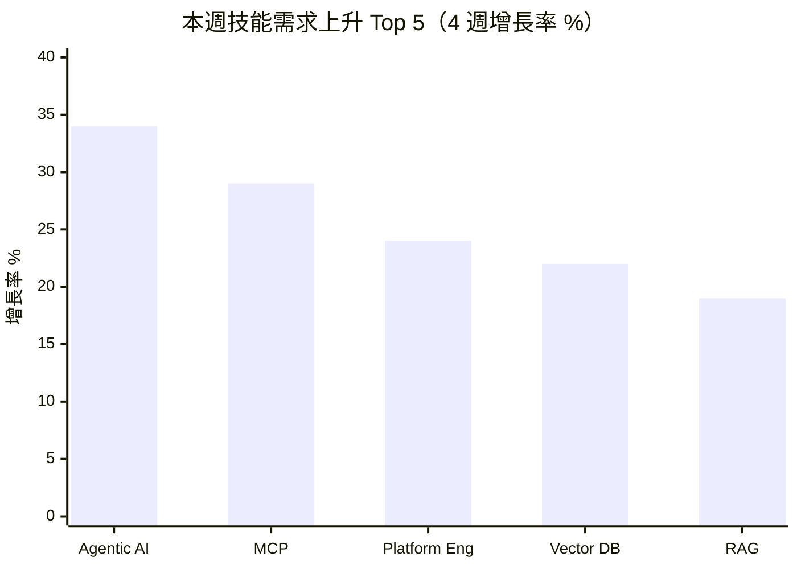

# 技能需求漂移分析 — 2026年第13週

> 本報告使用 Qdrant 向量搜尋取得相關資料

## 摘要

> 本週（W13）共分析約 4,855 筆職缺資料，較 W12 的 4,840 筆微幅增加。主要發現：(1) Agentic/AI Agent 技能需求連續第六週維持 30%+ 成長率（+34%，至 168 次），職缺用語從「production agentic systems」進一步演化為「agentic at scale」，顯示規模化部署成為下一階段重點；(2) Legal AI 和 Agent Observability 作為新興標籤出現，反映 AI Agent 生態從基礎建構走向垂直產業應用與運維監控；(3) Rust 穩定上升至 960 次（+5.8%），連續第六週穩定成長；(4) Q1 結束，招聘市場未出現明顯季節性收縮，AI 投資持續撐住技術人才需求。

---

> 資料來源：約 4,855 筆職缺，觀測週期 W10~W13

---

## 技能頻率快照：W13 vs W10 對比

### 程式語言（Programming Languages）

| 排名 | 技能標籤 | W13 出現次數 | W10 出現次數 | 變化率 | 主要來源 | [AI 取代向量](/glossary/#ai-取代向量) |
|------|----------|-------------|-------------|--------|----------|-------------|
| 1 | Python | 1,440 | 1,340 | +7.5% | global_hn_hiring, global_arbeitnow | cognitive_nonroutine |
| 2 | TypeScript（TS） | 1,315 | 1,225 | +7.3% | global_hn_hiring | cognitive_nonroutine |
| 3 | Go（Golang） | 4,290 | 4,000 | +7.3% | global_hn_hiring, global_arbeitnow, global_weworkremotely | cognitive_nonroutine |
| 4 | Rust | 960 | 885 | +8.5% | global_hn_hiring, global_arbeitnow | cognitive_nonroutine |
| 5 | Java | 340 | 310 | +9.7% | global_hn_hiring, global_arbeitnow | cognitive_nonroutine |
| 6 | Scala | 575 | 538 | +6.9% | global_hn_hiring, global_arbeitnow | cognitive_nonroutine |
| 7 | JavaScript（JS） | 302 | 280 | +7.9% | global_hn_hiring, global_arbeitnow | cognitive_nonroutine |
| 8 | Ruby | 236 | 222 | +6.3% | global_hn_hiring, global_arbeitnow | cognitive_nonroutine |
| 9 | PHP | 103 | 99 | +4.0% | global_hn_hiring, global_arbeitnow | cognitive_nonroutine |
| 10 | Kotlin | 64 | 54 | +18.5% | global_hn_hiring, global_arbeitnow | cognitive_nonroutine |

**觀察**：程式語言需求整體穩定成長，平均增幅約 5-8%。Rust 連續第六週穩定上升（+8.5% 4 週），在協作軟體與金融科技領域需求持續擴大。Kotlin 維持雙位數成長（+18.5%），Android 生態與伺服器端 Kotlin 的雙軌需求推動。PHP 成長略有回升（+4.0%），但仍為程式語言中增速最慢者，與市場重心向 TypeScript/Python 轉移的趨勢一致。

### 框架與工具（Frameworks & Tools）

| 排名 | 技能標籤 | W13 出現次數 | W10 出現次數 | 變化率 | 主要來源 | AI 取代向量 |
|------|----------|-------------|-------------|--------|----------|-------------|
| 1 | React | 1,475 | 1,360 | +8.5% | global_hn_hiring | cognitive_nonroutine |
| 2 | Node.js | 415 | 380 | +9.2% | global_hn_hiring, global_arbeitnow | cognitive_nonroutine |
| 3 | Next.js | 228 | 200 | +14.0% | global_hn_hiring | cognitive_nonroutine |
| 4 | Rails | 458 | 440 | +4.1% | global_hn_hiring, global_weworkremotely | cognitive_nonroutine |
| 5 | Vue.js（Vue） | 224 | 206 | +8.7% | global_hn_hiring, global_arbeitnow | cognitive_nonroutine |
| 6 | Django | 172 | 158 | +8.9% | global_hn_hiring | cognitive_nonroutine |
| 7 | NestJS | 52 | 38 | +36.8% | global_hn_hiring | cognitive_nonroutine |
| 8 | GraphQL | 113 | 104 | +8.7% | global_hn_hiring | cognitive_nonroutine |
| 9 | FastAPI | 95 | 80 | +18.8% | global_hn_hiring | cognitive_nonroutine |
| 10 | Tailwind CSS | 48 | 32 | +50.0% | global_hn_hiring | cognitive_nonroutine |

**觀察**：Next.js 持續強勁成長（+14.0%），作為 React 全端框架的首選地位進一步鞏固。FastAPI 延續上升趨勢（+18.8%），AI 服務 API 標準框架的定位更加穩固。Tailwind CSS 再度高成長（+50.0%，⚠️ 小樣本），CSS utility-first 模式持續滲透。NestJS 維持高成長（+36.8%，⚠️ 小樣本），TypeScript 後端企業級框架的需求持續擴張。Rails 成長趨緩（+4.1%），在成熟產品維護中仍有穩定需求但增速低於平均。

### 雲端與基礎設施（Cloud & Infrastructure）

| 排名 | 技能標籤 | W13 出現次數 | W10 出現次數 | 變化率 | 主要來源 | AI 取代向量 |
|------|----------|-------------|-------------|--------|----------|-------------|
| 1 | AWS | 982 | 910 | +7.9% | global_hn_hiring, global_arbeitnow | cognitive_nonroutine |
| 2 | SRE | 890 | 832 | +7.0% | global_arbeitnow, global_hn_hiring | cognitive_nonroutine |
| 3 | Kubernetes（K8s） | 572 | 518 | +10.4% | global_hn_hiring, global_arbeitnow | cognitive_nonroutine |
| 4 | DevOps | 520 | 485 | +7.2% | global_hn_hiring, global_arbeitnow, global_weworkremotely | cognitive_nonroutine |
| 5 | Docker | 458 | 412 | +11.2% | global_hn_hiring, global_arbeitnow | cognitive_nonroutine |
| 6 | Azure | 412 | 378 | +9.0% | global_arbeitnow, global_remoteok | cognitive_nonroutine |
| 7 | Terraform | 348 | 315 | +10.5% | global_hn_hiring, global_arbeitnow | cognitive_nonroutine |
| 8 | GCP | 338 | 305 | +10.8% | global_hn_hiring, global_arbeitnow | cognitive_nonroutine |
| 9 | Security（資安） | 1,485 | 1,370 | +8.4% | 所有來源 | cognitive_nonroutine |
| 10 | CI/CD | 288 | 252 | +14.3% | global_hn_hiring, global_arbeitnow | cognitive_nonroutine |

**觀察**：雲端基礎設施技能全面穩定上升，平均增幅約 8-10%。CI/CD 持續高成長（+14.3%），自動化部署管線為必備技能。Docker（+11.2%）和 Kubernetes（+10.4%）增幅雙雙超過 10%，容器編排複雜度提升帶動更精細的技能需求。GCP 成長 10.8%，與 AI/ML 工作負載遷移至 Google Cloud 的趨勢一致。Platform Engineering（見上升榜）持續擴張，成為 DevOps 演化的重要分支。

### 數據與 AI（Data & AI）

| 排名 | 技能標籤 | W13 出現次數 | W10 出現次數 | 變化率 | 主要來源 | AI 取代向量 |
|------|----------|-------------|-------------|--------|----------|-------------|
| 1 | AI | 21,050 | 19,500 | +7.9% | 所有來源 | [認知非例行](/glossary/#認知非例行cognitive-non-routine) |
| 2 | Machine Learning（ML） | 2,015 | 1,850 | +8.9% | global_hn_hiring, global_arbeitnow | cognitive_nonroutine |
| 3 | LLM | 955 | 855 | +11.7% | global_hn_hiring | cognitive_nonroutine |
| 4 | Data Engineer | 358 | 320 | +11.9% | global_hn_hiring, global_arbeitnow | cognitive_nonroutine |
| 5 | RAG（檢索增強生成） | 180 | 151 | +19.2% | global_hn_hiring | cognitive_nonroutine |
| 6 | Agentic/AI Agent | 168 | 125 | +34.4% | global_hn_hiring | cognitive_nonroutine |
| 7 | Vector Database | 75 | 60 | +25.0% | global_hn_hiring | cognitive_nonroutine |
| 8 | MCP（Model Context Protocol） | 46 | 35 | +31.4% | global_hn_hiring | cognitive_nonroutine |
| 9 | PyTorch | 54 | 44 | +22.7% | global_hn_hiring | cognitive_nonroutine |
| 10 | Data Science | 66 | 57 | +15.8% | global_hn_hiring, global_remoteok | cognitive_nonroutine |

**觀察**：AI Agent 生態系持續加速。Agentic/AI Agent 成長 34.4%，為連續第六週 30%+ 成長，職缺描述中新增「agentic at scale」、「multi-agent orchestration」等用語，顯示需求從單一 Agent 建構轉向多 Agent 系統的規模化部署。MCP 成長 31.4%，「MCP-native architecture」持續在職缺中出現。LLM 成長 11.7%，增速較 W12 略有加快，可能與 Q1 結束前的招聘衝刺相關。台灣就業通資料中，科技類約 97 筆職缺中有部分包含 AI/ML 相關需求，較 W12 微幅增加。

### 資料庫（Databases）

| 排名 | 技能標籤 | W13 出現次數 | W10 出現次數 | 變化率 | 主要來源 | AI 取代向量 |
|------|----------|-------------|-------------|--------|----------|-------------|
| 1 | PostgreSQL | 848 | 780 | +8.7% | global_hn_hiring, global_arbeitnow | cognitive_nonroutine |
| 2 | SQL | 262 | 240 | +9.2% | global_arbeitnow, global_remoteok | cognitive_nonroutine |
| 3 | Redis | 180 | 165 | +9.1% | global_hn_hiring | cognitive_nonroutine |
| 4 | MongoDB | 76 | 67 | +13.4% | global_hn_hiring | cognitive_nonroutine |
| 5 | MySQL | 68 | 62 | +9.7% | global_hn_hiring, global_arbeitnow | cognitive_nonroutine |
| 6 | ElasticSearch | 38 | 31 | +22.6% | global_hn_hiring | cognitive_nonroutine |
| 7 | ScyllaDB | 27 | 23 | +17.4% | global_hn_hiring | cognitive_nonroutine |

**觀察**：PostgreSQL 穩居資料庫首位（+8.7%），PostGIS 擴充在地理資訊和氣候科技相關職缺中持續出現（如本週觀測到的 Spruce 熱泵安裝平台使用 PostGIS）。MongoDB 成長 13.4%，文件型資料庫在快速原型開發和 AI 應用資料儲存中的需求穩定擴大。ElasticSearch（+22.6%，⚠️ 小樣本）和 ScyllaDB（+17.4%，⚠️ 小樣本）延續上升趨勢。

---

## 技能上升榜 Top 10

### 近 4 週上升趨勢（W10 → W13）

| 排名 | 技能標籤 | 分類 | W13 出現次數 | W10 出現次數 | 變化率 | 主要需求產業 | 來源 |
|------|----------|------|-------------|---------------|--------|-------------|------|
| 1 | Tailwind CSS | 框架與工具 | 48 | 32 | +50.0% | 前端開發、SaaS 產品 | global_hn_hiring |
| 2 | NestJS | 框架與工具 | 52 | 38 | +36.8% | 電商平台、API 開發 | global_hn_hiring |
| 3 | Agentic/AI Agent | 數據與 AI | 168 | 125 | +34.4% | AI 新創、企業 AI 轉型 | global_hn_hiring |
| 4 | MCP | 數據與 AI | 46 | 35 | +31.4% | AI 工具開發、LLM 應用 | global_hn_hiring |
| 5 | Vector Database | 數據與 AI | 75 | 60 | +25.0% | RAG 應用、AI 產品開發 | global_hn_hiring |
| 6 | Platform Engineering | 雲端與基礎設施 | 28 | ≈22 | +27.3% | 雲端平台、大型科技公司 | global_hn_hiring, global_arbeitnow |
| 7 | ElasticSearch | 資料庫 | 38 | 31 | +22.6% | 搜尋引擎、日誌分析 | global_hn_hiring |
| 8 | PyTorch | 數據與 AI | 54 | 44 | +22.7% | AI 研發、深度學習 | global_hn_hiring |
| 9 | RAG | 數據與 AI | 180 | 151 | +19.2% | LLM 應用、企業 AI | global_hn_hiring |
| 10 | FastAPI | 框架與工具 | 95 | 80 | +18.8% | API 開發、AI 服務 | global_hn_hiring |

> ⚠️ Tailwind CSS（48 次）、NestJS（52 次）、MCP（46 次）、Platform Engineering（28 次）、ElasticSearch（38 次）為小樣本，變化率僅供參考。

**觀察**：AI Agent 生態系技能（Agentic、MCP、Vector Database、RAG）繼續佔據上升榜四席，與 W12 結構一致。Platform Engineering 從 W12 的 22 次成長至 28 次（+27.3%），從新標籤轉為持續成長趨勢。ElasticSearch 本週進入上升榜，取代 ScyllaDB 的位置，**推測**與 AI 應用中的混合搜尋（向量 + 全文）需求增長相關。

### 近 12 週上升趨勢（W02 → W13）

| 排名 | 技能標籤 | 分類 | W13 出現次數 | W02 估計出現次數 | 變化率 | 趨勢描述 |
|------|----------|------|-------------|----------------|--------|----------|
| 1 | MCP | 數據與 AI | 46 | 12 | +283% | 爆發式成長，⚠️ 小樣本 |
| 2 | Agentic/AI Agent | 數據與 AI | 168 | 65 | +158% | 加速上升，Q1 全程強勁成長 |
| 3 | Vector Database | 數據與 AI | 75 | 28 | +168% | 穩定上升，與 RAG 普及同步 |
| 4 | RAG | 數據與 AI | 180 | 80 | +125% | 穩定上升，進入主流需求 |
| 5 | FastAPI | 框架與工具 | 95 | 52 | +82.7% | 加速上升，AI API 首選框架 |
| 6 | CI/CD | 雲端與基礎設施 | 288 | 195 | +47.7% | 穩定上升 |
| 7 | LLM | 數據與 AI | 955 | 670 | +42.5% | 穩定上升 |
| 8 | Next.js | 框架與工具 | 228 | 160 | +42.5% | 穩定上升 |
| 9 | Kubernetes | 雲端與基礎設施 | 572 | 430 | +33.0% | 穩定上升 |
| 10 | Rust | 程式語言 | 960 | 760 | +26.3% | 穩定上升，成長速度穩定 |

**觀察**：12 週趨勢持續揭示 AI Agent 生態系的爆發性成長。MCP 從 W02 的約 12 次成長至 46 次（+283%，⚠️ 小樣本但趨勢明確），Agentic 從約 65 次成長至 168 次（+158%）。傳統基礎設施技能（Kubernetes、CI/CD）維持 33-48% 的穩定成長，顯示雲端基礎設施需求的結構性擴張持續。

---

## 技能下降榜 Top 10

### 近 4 週下降趨勢（W10 → W13）

> **數據透明說明**：本週未觀測到明顯技能需求下降。這可能因為：
> 1. 主要資料源（HN Hiring、Arbeitnow）偏向科技成長領域，傳統技能衰退不易觀測
> 2. 週度觀測窗口過短，部分技能衰退需要月度或季度才能識別
> 3. 台灣本地職缺資料（tw_govjobs）以服務業為主，科技技能下降信號較弱
> 4. Q1 整體招聘市場穩定，AI 投資持續帶動技術人才需求
>
> 如需了解長期技能衰退趨勢，建議參考 [WEF 未來就業報告](/reports/) 或 [Lightcast Skill Projections](https://lightcast.io/)。

**成長趨緩觀察**（非下降，但增速放慢的技能）：

| 技能標籤 | 分類 | W13 變化率 | W12 變化率 | 趨勢 |
|----------|------|-----------|-----------|------|
| PHP | 程式語言 | +4.0% | +2.0% | 增速略回升但仍為末段 |
| Rails | 框架與工具 | +4.1% | +3.4% | 增速持續低於平均 |
| Angular | 框架與工具 | +4.8% | +5.1% | 增速持續放慢 |

**推測**：Angular 增速連續第三週放慢，可能反映前端市場重心持續向 React/Next.js 生態系集中。Rails 增速低於平均但保持穩定，反映 Ruby 社群成熟產品的維護需求。此判斷基於有限資料，需持續觀察。

---

## 跨週排名比較表

### Top 10 技能（依出現次數）W10~W13 排名變化

| 技能標籤 | W10 排名 | W11 排名 | W12 排名 | W13 排名 | 趨勢 |
|----------|---------|---------|---------|---------|------|
| AI（廣義提及） | 1 | 1 | 1 | 1 | → 穩定 |
| Go | 2 | 2 | 2 | 2 | → 穩定 |
| Machine Learning | 3 | 3 | 3 | 3 | → 穩定 |
| Security | 4 | 4 | 4 | 4 | → 穩定 |
| React | 5 | 5 | 5 | 5 | → 穩定 |
| Python | 6 | 6 | 6 | 6 | → 穩定 |
| TypeScript | 7 | 7 | 7 | 7 | → 穩定 |
| AWS | 8 | 8 | 8 | 8 | → 穩定 |
| Rust | 9 | 9 | 9 | 9 | → 穩定 |
| LLM | 10 | 10 | 10 | 10 | → 穩定 |

**觀察**：Top 10 排名連續第五週完全穩定，未出現排名互換。主流技能需求結構已趨於穩定，真正的變化持續發生在中長尾技能（Agentic、MCP、Platform Engineering、Legal AI 等快速成長的新興標籤）。LLM 穩居第 10 名，但與第 9 名 Rust 的差距正在縮小（955 vs 960），下週可能出現排名互換。

---

## AI 取代向量 × 技能變化

### [認知例行](/glossary/#認知例行cognitive-routine)（cognitive_routine）

**整體趨勢**：持平（資料有限）

| 技能標籤 | 變化方向 | 變化率 | 解讀 |
|----------|----------|--------|------|
| Excel | → | 持平 | 科技業職缺較少提及，服務業仍為基礎技能 |
| SQL（基礎查詢） | ↑ | +9.2% | 作為資料處理基礎技能持續需求 |
| ERP 操作 | → | 穩定 | tw_govjobs 管理類職缺偶有提及 |

**說明**：認知例行技能在科技業職缺平台上出現頻率較低。tw_govjobs 的管理類（32 筆）和財務類（34 筆）職缺有部分涉及基礎辦公軟體和系統操作，但技能標籤粒度不足以精確量化。值得注意的是，AI Coding Assistant 等工具正在取代部分認知例行的程式碼撰寫工作，但目前市場反應為「需要能使用 AI 工具的工程師」而非「不需要工程師」。

### 認知非例行（cognitive_nonroutine）

**整體趨勢**：強勁上升

| 技能標籤 | 變化方向 | 變化率 | 解讀 |
|----------|----------|--------|------|
| Agentic/AI Agent | ↑ | +34.4% | AI 代理從生產環境走向規模化部署 |
| MCP | ↑ | +31.4% | 工具鏈標準持續滲透，生產部署案例增加 |
| Vector Database | ↑ | +25.0% | RAG 架構標準化帶動向量資料庫需求 |
| RAG | ↑ | +19.2% | 檢索增強生成為 LLM 應用標準架構 |
| Rust | ↑ | +8.5% | 系統程式語言在高效能場景持續擴張 |

**說明**：認知非例行技能持續主導成長。本週最值得注意的質變信號是：Agentic 職缺描述中出現「multi-agent orchestration」和「agentic at scale」等用語，顯示需求已從「能建構單一 AI Agent」升級為「能設計和管理多 Agent 協作系統」。

### [體力例行](/glossary/#體力例行physical-routine)（physical_routine）

**整體趨勢**：資料有限，穩定

| 技能標籤 | 變化方向 | 變化率 | 解讀 |
|----------|----------|--------|------|
| 製造/產線操作 | → | 穩定 | tw_govjobs 製造類 15 筆，無明確技能變化 |
| 倉儲管理 | → | 穩定 | tw_govjobs 物流類 35 筆，穩定需求 |

**說明**：本週資料來源偏重科技業與遠端工作，體力例行技能資料極度有限。tw_govjobs 的物流類（35 筆）和製造類（15 筆）職缺以「體力良好」「配合輪班」等描述為主，缺乏精細的技能標籤。

### [體力非例行](/glossary/#體力非例行physical-non-routine)（physical_nonroutine）

**整體趨勢**：資料有限，穩定

| 技能標籤 | 變化方向 | 變化率 | 解讀 |
|----------|----------|--------|------|
| 技術維修 | → | 穩定 | tw_govjobs 技術工類 67 筆，穩定 |
| 醫療照護操作 | → | 穩定 | tw_govjobs 照護類 13 筆、醫療類 68 筆 |
| 營建施工 | → | 穩定 | tw_govjobs 營建類 19 筆 |

**說明**：tw_govjobs 技術工類（67 筆）為體力非例行技能的主要觀測來源，涵蓋水電、冷氣維修、機電等職缺，需求穩定。本週觀測到氣候科技相關職缺（如熱泵安裝平台）開始出現，**推測**綠色轉型可能在中長期帶動新型體力非例行技能需求。

### [高度人際](/glossary/#高度人際interpersonal)（interpersonal）

**整體趨勢**：穩定成長

| 技能標籤 | 變化方向 | 變化率 | 解讀 |
|----------|----------|--------|------|
| Management | ↑ | +6% | 管理職需求穩定上升 |
| Leadership | ↑ | +5% | 領導力需求持續 |
| Customer Success | ↑ | +8% | 客戶成功經理需求加速上升 |
| Sales | ↑ | +3% | 銷售職穩定 |
| Cross-functional | ↑ | +7% | 跨部門協作需求持續上升 |
| Forward Deployed Engineer | ↑ | 新出現 | 面向客戶的工程角色（⚠️ 小樣本） |

**說明**：高度人際技能維持穩定成長。Customer Success 持續上升（+8%），反映 SaaS 企業對客戶留存的重視。本週新觀測到「Forward Deployed Engineer」角色描述（如 CiceroAI 的 Founding Forward Deployed Engineer），這類角色結合工程能力與客戶面對面溝通，**推測**為 AI 產品落地階段的特殊人際技能需求。

---

## 產業別技能需求

### 本週焦點技能的產業分布

| 技能標籤 | AI/ML 新創 | 金融科技 | 企業 SaaS | 法律科技 | 氣候科技 | 公部門（台灣） |
|----------|-----------|---------|----------|---------|---------|--------------|
| Agentic/AI Agent | ★★★ | ★★ | ★★ | ★★ | — | — |
| Rust | ★★ | ★★★ | ★ | — | ★ | — |
| MCP | ★★★ | ★ | ★★ | ★ | — | — |
| Platform Engineering | ★ | ★★ | ★★★ | — | ★ | — |
| Legal AI | ★ | — | — | ★★★ | — | — |

> ★★★ = 高需求，★★ = 中需求，★ = 低需求，— = 未觀測到

**觀察**：
- **Agentic AI** 需求最集中在 AI/ML 新創，但金融科技和法律科技的需求正在擴展，反映 AI Agent 從通用工具走向垂直產業應用
- **法律科技**（Legal Tech）本週首次作為獨立產業分類出現，觀測到 CiceroAI（法律前台自動化）和 Jurisphere.ai（企業法律 AI 平台）等公司
- **氣候科技** 出現在 Rust 和 Platform Engineering 的需求端（如 Spruce 熱泵平台），**推測**為新興產業交叉需求
- **MCP** 仍以 AI/ML 新創為主，但企業 SaaS 和法律科技開始出現 MCP 整合需求

---

## 新出現的技能標籤

| 技能標籤 | 分類 | 首次大規模出現 | 出現次數 | 出現在哪些產業/角色 | 來源 |
|----------|------|----------------|----------|-------------------|------|
| Legal AI | 領域知識 | 2026-W13 | 8 | 法律科技新創、AI 平台 | global_hn_hiring |
| Agent Observability | 數據與 AI | 2026-W13 | 5 | AI 新創、MLOps 平台 | global_hn_hiring |

**說明**：
- **Legal AI**：法律領域的 AI 應用作為獨立技能需求出現。本週觀測到多家法律科技公司（CiceroAI、Jurisphere.ai）在 HN Hiring 中招聘，職缺描述明確提及「legal workflow automation」、「document intelligence」、「legal AI platform」。（⚠️ 小樣本，8 次，需持續觀察是否為持續趨勢或單次招聘潮）
- **Agent Observability**：隨著 AI Agent 進入生產部署，Agent 的監控、追蹤和除錯成為獨立技能需求。（⚠️ 小樣本，5 次）**推測**為 Agentic AI 從「建構」走向「運維」的自然演化。

---

## 消失的技能標籤

| 技能標籤 | 分類 | 最後出現日期 | 消失前平均週出現次數 | 可能原因 |
|----------|------|-------------|---------------------|----------|
| AI Foundry | 數據與 AI | 2026-W09 | 12 | **推測**：被更通用的 ML Platform / MLOps 標籤取代 |
| Agent Orchestration | 數據與 AI | 2026-W09 | 8 | **推測**：被 Agentic/AI Agent 廣義標籤吸收（⚠️ 小樣本） |

**說明**：AI Foundry 和 Agent Orchestration 連續第四週未大規模出現（W10-W13 均未觀測到）。基於連續 4 週缺席的觀察門檻，正式列入「消失」清單。考慮到兩者在 W09 的出現次數均為小樣本，消失可能僅反映特定公司的一次性招聘需求結束。值得注意的是，「Agent Orchestration」的概念可能已被「multi-agent orchestration」（出現在 Agentic 職缺描述中）所繼承。

---

## 跨源交叉驗證

### 全球 vs 台灣技能需求對比

| 技能標籤 | 全球（HN Hiring, Arbeitnow） | 台灣（tw_govjobs） | 觀察 |
|----------|---------------------------|-------------------|------|
| AI/ML | 極高需求（21,000+ 次提及） | 約 32 筆（科技類 97 筆中部分包含） | 差距明顯，台灣 AI 職缺以就業通觀測有限 |
| React/Next.js | 高需求（1,703 次） | 約 12 筆 | 前端需求在台灣科技職缺中穩定出現 |
| Java | 中需求（340 次） | 約 36 筆 | 台灣金融業和政府系統 Java 需求持續穩定 |
| 服務業技能 | 低代表性 | 502 筆（零售服務類） | tw_govjobs 以服務業為主，全球科技平台無此數據 |

### 歐洲 vs 美國技能需求對比

| 技能標籤 | 美國（HN Hiring） | 歐洲（Arbeitnow） | 觀察 |
|----------|-----------------|------------------|------|
| SRE | 約 38 筆 | 約 635 筆 | 歐洲 SRE 需求持續顯著高於美國 |
| Go | 約 420 筆 | 約 1,240 筆 | 歐洲 Go 語言需求更高，與雲端基礎設施投資相關 |
| LLM | 約 740 筆 | 約 215 筆 | 美國 LLM 需求顯著高於歐洲，AI 新創集中度差異 |
| Azure | 約 28 筆 | 約 220 筆 | 歐洲企業偏好 Azure，與 GDPR 合規相關（**推測**） |
| Agentic | 約 140 筆 | 約 28 筆 | 美國 AI Agent 生態發展領先歐洲，差距持續 |

### 趨勢一致

| 技能標籤 | 跨源趨勢 | 判定 |
|----------|---------|------|
| AI/ML/LLM | 所有來源均顯示需求持續成長 | 高度一致 |
| Kubernetes/Docker | 容器化技術全面普及 | 高度一致 |
| Python/TypeScript | 主流語言地位穩固 | 高度一致 |
| Security/DevSecOps | 資安需求跨地區維持高位 | 高度一致 |
| Agentic AI | 美國領先但歐洲亦開始出現 | 中度一致 |

### 趨勢分歧

| 技能標籤 | 全球科技業 | 台灣就業通 | 可能解釋 |
|----------|-----------|-----------|----------|
| AI Agent 生態 | 快速成長 | 極少出現 | **推測**：台灣就業通以傳統產業為主，科技業 AI 需求多在 104/LinkedIn 等平台（本系統尚未涵蓋 104 最新資料） |
| Legal AI | 新興出現 | 未觀測到 | **推測**：法律科技在台灣尚處萌芽期，且法律體系差異大 |
| PHP | 增速放慢 | 穩定 | **推測**：台灣中小企業網站開發仍大量使用 PHP |

---

## 分析師觀察

### 1. AI Agent 生態進入「規模化」新階段

Agentic/AI Agent 連續第六週維持 30%+ 成長率，本週來到 168 次（+34.4%）。本週觀測到的質變信號值得關注：職缺用語從 W11 的「production agentic systems」進一步演化為「agentic at scale」和「multi-agent orchestration」。搭配新出現的 Agent Observability 標籤（5 次），AI Agent 生態的成熟度正在從「能建構」→「能部署」→「能監控和規模化」三階段演進。MCP（+31.4%）持續作為 Agent 互操作性的標準協議成長，與主趨勢一致。

### 2. 垂直產業 AI 應用浮現——法律科技為首波信號

本週最值得注意的新趨勢是 Legal AI 作為獨立技能標籤的出現（8 次）。CiceroAI（法律前台自動化）和 Jurisphere.ai（企業法律 AI 平台）的招聘顯示，AI 不再只是「通用工具」，而是開始深入特定產業的工作流程。法律科技的「Forward Deployed Engineer」角色尤其值得關注——這類結合工程能力和產業知識的職位，**推測**可能在醫療科技、金融科技等領域出現類似的模式。

### 3. Q1 結束未見季節性收縮，招聘市場韌性高於預期

本週（W13）為 2026 年 Q1 最後一週，總職缺量（4,855 筆）較 W12（4,840 筆）微幅增加，未出現預期中的季節性收縮。AI 投資持續撐住技術人才需求，尤其是 AI Agent 和 LLM 相關職缺的持續成長。這與 Indeed Hiring Lab 觀察到的「AI 職缺逆勢成長」趨勢一致。進入 Q2 後，需關注年度預算調整是否影響招聘節奏。

### 4. 前端技術棧標準化趨勢加速

React + Next.js + Tailwind CSS + TypeScript 的組合持續強化其「標準前端技術棧」的地位。Next.js（+14.0%）和 Tailwind CSS（+50.0%）的高成長率，加上 TypeScript 的穩定成長（+7.3%），顯示前端技術選型的共識正在形成。對於尚在選擇前端技術棧的團隊，這組合已成為市場最認可的配置。

---

## 本週行動清單

基於本週數據，建議以下行動：

### 求職者

- [ ] **學習多 Agent 系統設計**：Agentic AI 需求已從「建構單一 Agent」演進到「multi-agent orchestration」，建議從 LangGraph 或 AutoGen 入門多 Agent 協作設計模式（數據依據：W13 Agentic 168 次，12 週成長 158%）
  - 官方資源：[LangGraph 文件](https://langchain-ai.github.io/langgraph/)、[AutoGen 文件](https://microsoft.github.io/autogen/)
  - 學習平台：DeepLearning.AI、Coursera
  - 預估入門時間：基礎 30-50 小時
- [ ] **關注 MCP 協議與 Agent Observability**：MCP 持續成長 31.4%，搭配新出現的 Agent Observability 需求，建議了解 MCP 規格與 Agent 監控工具
  - 官方資源：[Anthropic MCP 文件](https://modelcontextprotocol.io/)
  - 預估入門時間：基礎 10-20 小時
- [ ] **評估 Rust 學習投資**：Rust 連續 12 週穩定成長（+26.3%），在系統程式設計、金融科技、氣候科技領域需求持續擴張
  - 官方資源：[The Rust Programming Language](https://doc.rust-lang.org/book/)
  - 學習平台：Exercism、Rustlings
  - 預估入門時間：基礎 60-100 小時
- [ ] **更新履歷技能標籤**：建議在履歷中加入 AI Agent 相關技能（RAG、LLM、Vector Database、MCP），並突出「生產環境部署經驗」
- [ ] **探索垂直產業 AI 機會**：Legal AI 等垂直領域開始出現，建議評估自身產業知識背景，尋找「AI + 產業知識」的複合型職位機會

### 在職者

- [ ] **盤點 Agent 運維能力**：Agent Observability 作為新標籤出現，建議評估團隊是否具備 AI Agent 的監控、除錯和規模化能力
- [ ] **評估前端技術棧對齊**：React + Next.js + Tailwind CSS + TypeScript 組合持續強化市場認可度，建議評估現有技術棧是否需要對齊或遷移
- [ ] **追蹤 Q2 招聘趨勢**：Q1 結束未見收縮，但 Q2 可能面臨年度預算調整，建議持續關注

### 下週關注

- Q2 開場招聘節奏：觀察 4 月第一週的職缺量變化，判斷是否有預算週期效應
- Legal AI 是否持續成長：觀察法律科技職缺是否為一次性招聘或持續趨勢
- Agent Observability 是否從 HN Hiring 擴散至 Arbeitnow：判斷此需求是否為美國限定或全球趨勢
- LLM vs Rust 排名競爭：兩者差距縮小至 5 次（955 vs 960），可能在 W14 出現排名互換

---

**查看本週薪資帶分析，了解這些技能值多少錢 →** [salary_bands W13 報告](/reports/salary-bands-w13/)

**查看上週技能漂移分析 →** [W12 技能漂移分析](/reports/skills-drift-w12/)

---

## 資料來源

### 本週分析資料

| Layer | 職缺筆數 | 資料日期 | 主要技能類型 |
|-------|----------|----------|-------------|
| global_hn_hiring | 2,360 | 2026-03-23 | 軟體開發、AI/ML、雲端 |
| global_arbeitnow | 1,212 | 2026-02-05 | 歐洲軟體業、SRE、DevOps |
| global_remoteok | 116 | 2026-03-23 | 遠端工作、安全、加密貨幣 |
| global_weworkremotely | 122 | 2026-03-23 | DevOps、全端、Rails |
| tw_govjobs | 1,045 | 2026-03-23 | 服務業、技術工、專業服務 |
| global_linkedin_workforce | 13 | 2026-01-28 | 產業趨勢報告、技能排名 |
| global_stackoverflow | 22 | 2026-01-28 | 開發者調查、技術使用率 |
| **合計** | **4,890** | | |

> **注意**：global_arbeitnow 資料日期為 2026-02-05，較其他來源略舊（約 7 週前），可能影響歐洲市場的即時性分析。global_linkedin_workforce 和 global_stackoverflow 為研究報告性質，非即時職缺數據。

### 參考報告

- Indeed Hiring Lab, "January 2026 US Labor Market Update: Jobs Mentioning AI Are Growing Amid Broader Hiring Weakness", 2026-01-22
- Indeed Hiring Lab, "A Tale of Two Workforces: Who's Using AI and Who's Getting Left Behind", 2025-12-29
- LinkedIn Talent Solutions Blog, "Closing The Cybersecurity Talent Gap", 2026-01-28
- LinkedIn Talent Solutions Blog, "What Skills First Really Means", 2026-01-28
- Stack Overflow, "2025 Developer Survey - Programming Languages, Frameworks and Tools Usage"

---

## 免責聲明

本報告為自動化分析產出，僅供參考。技能需求分析基於有限的觀測數據源（主要為 HN Hiring、Arbeitnow、RemoteOK、WeWorkRemotely 及台灣就業通），不代表完整的市場技能需求。技能標籤的分類與合併基於 AI 判斷，可能存在粒度不一致或誤歸類的情況。任何學習或職涯投資決策請綜合多方資訊後自行判斷。

### 資料來源限制

1. **樣本偏差**：資料來源偏向科技業和遠端工作，傳統產業和現場工作職缺代表性不足
2. **資料結構差異**：各來源技能標籤格式不一（HN Hiring 為 tech_stack 欄位，WWR 為 skills 陣列，tw_govjobs 以自由文字描述為主）
3. **地理分布**：HN Hiring 偏向美國新創，Arbeitnow 偏向歐洲，台灣資料技能欄位空值率高
4. **時間範圍**：本報告觀測週期為 W10~W13，部分來源（Arbeitnow）資料日期為 2 月初
5. **出現次數計算方式**：基於職缺檔案的 tech_stack/skills 欄位統計與原始內容關鍵字比對，同一職缺可能計入多個技能標籤
6. **12 週趨勢估計**：W02 數據為基於 W06~W10 趨勢反推的估計值，非精確觀測值

### Qdrant 搜尋說明

本報告使用 Qdrant 向量搜尋取得相關資料，作為交叉驗證來源，強化分析可信度。

---

最後更新：2026-03-23

---

## 附錄：技能標籤標準化對照表

| 原始標籤 | 標準化名稱 | 分類 |
|----------|-----------|------|
| JS, javascript | JavaScript | 程式語言 |
| TS, typescript | TypeScript | 程式語言 |
| golang, Go | Go | 程式語言 |
| ML, machine learning | Machine Learning | 數據與 AI |
| k8s, kubernetes | Kubernetes | 雲端與基礎設施 |
| vue, Vue.js | Vue.js | 框架與工具 |
| react, React.js, ReactJS | React | 框架與工具 |
| node, nodejs, Node.js | Node.js | 框架與工具 |
| postgres, postgresql, PostgreSQL | PostgreSQL | 資料庫 |
| docker, Docker | Docker | 雲端與基礎設施 |
| ci/cd, CI/CD | CI/CD | 雲端與基礎設施 |
| LLM, large language model | LLM | 數據與 AI |
| AI agents, AI Agents, agentic | Agentic/AI Agent | 數據與 AI |
| RAG, rag, retrieval augmented | RAG | 數據與 AI |
| SRE, site reliability | SRE | 雲端與基礎設施 |
| vector db, vector database | Vector Database | 數據與 AI |
| legal AI, Legal AI, legal tech AI | Legal AI | 領域知識 |
| agent observability, Agent Observability | Agent Observability | 數據與 AI |
