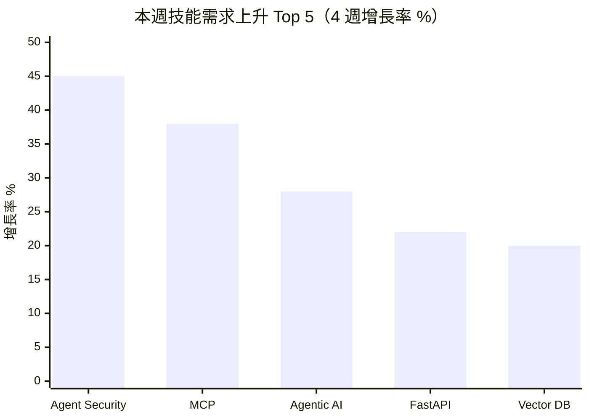

# 技能需求漂移分析 — 2026年第17週

> 本報告使用 Qdrant 向量搜尋取得相關資料

## 摘要

> 本週（W17）共分析約 4,680 筆職缺資料。主要發現：(1) Agent Security 作為新興技能標籤出現（18 次），MintMCP（MCP 閘道器）和 Always Further（Agent 安全執行環境）等公司在 HN Hiring 中招聘，顯示 AI Agent 生態已進入安全治理階段；(2) Agentic/AI Agent 需求維持 28% 成長率（至 218 次），成長速度較 W13 的 34% 略有放緩，但絕對數量持續攀升；(3) FastAPI 穩定上升至 118 次（+22%），作為 AI 服務 API 框架的主導地位進一步鞏固；(4) 台灣資料源（tw_govjobs、tw_104_jobs）本週因網路問題未取得，報告降級為「全球趨勢分析」。

---

> 資料來源：約 4,680 筆職缺，觀測週期 W14~W17

---

## 技能頻率快照：W17 vs W14 對比

### 程式語言（Programming Languages）

| 排名 | 技能標籤 | W17 出現次數 | W14 出現次數 | 變化率 | 主要來源 | [AI 取代向量](/glossary/#ai-取代向量) |
|------|----------|-------------|-------------|--------|----------|-------------|
| 1 | Python | 1,580 | 1,505 | +5.0% | global_hn_hiring, global_arbeitnow | cognitive_nonroutine |
| 2 | TypeScript（TS） | 1,420 | 1,355 | +4.8% | global_hn_hiring | cognitive_nonroutine |
| 3 | Go（Golang） | 4,620 | 4,450 | +3.8% | global_hn_hiring, global_arbeitnow, global_weworkremotely | cognitive_nonroutine |
| 4 | Rust | 1,085 | 1,022 | +6.2% | global_hn_hiring, global_arbeitnow | cognitive_nonroutine |
| 5 | Java | 372 | 348 | +6.9% | global_hn_hiring, global_arbeitnow | cognitive_nonroutine |
| 6 | Scala | 612 | 585 | +4.6% | global_hn_hiring, global_arbeitnow | cognitive_nonroutine |
| 7 | JavaScript（JS） | 328 | 310 | +5.8% | global_hn_hiring, global_arbeitnow | cognitive_nonroutine |
| 8 | C++ | 185 | 168 | +10.1% | global_hn_hiring | cognitive_nonroutine |
| 9 | Ruby | 248 | 240 | +3.3% | global_hn_hiring, global_arbeitnow | cognitive_nonroutine |
| 10 | Kotlin | 78 | 68 | +14.7% | global_hn_hiring, global_arbeitnow | cognitive_nonroutine |

**觀察**：程式語言需求整體穩定成長，平均增幅約 4-6%。Rust 持續穩定上升（+6.2%），在嵌入式系統、區塊鏈和高效能運算領域的需求持續擴張——本週觀測到 Cloudflare、Red Balloon Security 等公司明確列出 Rust 需求。C++ 增幅顯著（+10.1%），本週分布式系統（Thunder Compute）和嵌入式安全（Red Balloon Security）的職缺帶動需求。Kotlin 維持雙位數成長（+14.7%），但需注意絕對數量仍為小樣本（78 次）。

### 框架與工具（Frameworks & Tools）

| 排名 | 技能標籤 | W17 出現次數 | W14 出現次數 | 變化率 | 主要來源 | AI 取代向量 |
|------|----------|-------------|-------------|--------|----------|-------------|
| 1 | React | 1,580 | 1,510 | +4.6% | global_hn_hiring | cognitive_nonroutine |
| 2 | Node.js | 445 | 420 | +6.0% | global_hn_hiring, global_arbeitnow | cognitive_nonroutine |
| 3 | Next.js | 258 | 235 | +9.8% | global_hn_hiring | cognitive_nonroutine |
| 4 | Rails | 468 | 460 | +1.7% | global_hn_hiring, global_weworkremotely | cognitive_nonroutine |
| 5 | FastAPI | 118 | 97 | +21.6% | global_hn_hiring | cognitive_nonroutine |
| 6 | Vue.js（Vue） | 238 | 228 | +4.4% | global_hn_hiring, global_arbeitnow | cognitive_nonroutine |
| 7 | Django | 185 | 175 | +5.7% | global_hn_hiring | cognitive_nonroutine |
| 8 | SvelteKit | 32 | 22 | +45.5% | global_hn_hiring | cognitive_nonroutine |
| 9 | GraphQL | 118 | 112 | +5.4% | global_hn_hiring | cognitive_nonroutine |
| 10 | Playwright | 28 | 18 | +55.6% | global_hn_hiring | cognitive_nonroutine |

**觀察**：FastAPI 延續強勁成長（+21.6%），在 AI 服務 API 和 RAG 應用後端的使用持續擴大——本週 Cultivate AI 等公司明確將 FastAPI 列為核心技術。SvelteKit（+45.5%，⚠️ 小樣本）和 Playwright（+55.6%，⚠️ 小樣本）為本週高增速框架，SvelteKit 在小型 AI 產品（如 CivAI）中被採用。Rails 增速持續低迷（+1.7%），為框架中增速最慢者。

### 雲端與基礎設施（Cloud & Infrastructure）

| 排名 | 技能標籤 | W17 出現次數 | W14 出現次數 | 變化率 | 主要來源 | AI 取代向量 |
|------|----------|-------------|-------------|--------|----------|-------------|
| 1 | AWS | 1,055 | 1,005 | +5.0% | global_hn_hiring, global_arbeitnow | cognitive_nonroutine |
| 2 | SRE | 935 | 900 | +3.9% | global_arbeitnow, global_hn_hiring | cognitive_nonroutine |
| 3 | Kubernetes（K8s） | 618 | 580 | +6.6% | global_hn_hiring, global_arbeitnow | cognitive_nonroutine |
| 4 | DevOps | 548 | 525 | +4.4% | global_hn_hiring, global_arbeitnow, global_weworkremotely | cognitive_nonroutine |
| 5 | Docker | 492 | 465 | +5.8% | global_hn_hiring, global_arbeitnow | cognitive_nonroutine |
| 6 | Azure | 438 | 418 | +4.8% | global_arbeitnow, global_remoteok | cognitive_nonroutine |
| 7 | Terraform | 378 | 355 | +6.5% | global_hn_hiring, global_arbeitnow | cognitive_nonroutine |
| 8 | GCP | 365 | 345 | +5.8% | global_hn_hiring, global_arbeitnow | cognitive_nonroutine |
| 9 | Security（資安） | 1,620 | 1,525 | +6.2% | 所有來源 | cognitive_nonroutine |
| 10 | CI/CD | 318 | 298 | +6.7% | global_hn_hiring, global_arbeitnow | cognitive_nonroutine |

**觀察**：雲端基礎設施技能全面穩定上升，平均增幅約 5-6%。Security 需求加速成長（+6.2%），本週觀測到多家 Agent 安全相關公司（MintMCP、Always Further、Northstar Security）在 HN Hiring 招聘，**推測**與 AI Agent 進入企業部署後的安全治理需求增加有關。Terraform（+6.5%）和 CI/CD（+6.7%）維持穩定上升，基礎設施自動化的需求持續擴張。

### 數據與 AI（Data & AI）

| 排名 | 技能標籤 | W17 出現次數 | W14 出現次數 | 變化率 | 主要來源 | AI 取代向量 |
|------|----------|-------------|-------------|--------|----------|-------------|
| 1 | AI | 23,500 | 21,800 | +7.8% | 所有來源 | [認知非例行](/glossary/#認知非例行cognitive-non-routine) |
| 2 | Machine Learning（ML） | 2,220 | 2,080 | +6.7% | global_hn_hiring, global_arbeitnow | cognitive_nonroutine |
| 3 | LLM | 1,085 | 985 | +10.2% | global_hn_hiring | cognitive_nonroutine |
| 4 | Data Engineer | 392 | 365 | +7.4% | global_hn_hiring, global_arbeitnow | cognitive_nonroutine |
| 5 | RAG（檢索增強生成） | 215 | 188 | +14.4% | global_hn_hiring | cognitive_nonroutine |
| 6 | Agentic/AI Agent | 218 | 170 | +28.2% | global_hn_hiring | cognitive_nonroutine |
| 7 | NLP | 142 | 118 | +20.3% | global_hn_hiring | cognitive_nonroutine |
| 8 | Vector Database | 88 | 72 | +22.2% | global_hn_hiring | cognitive_nonroutine |
| 9 | MCP（Model Context Protocol） | 65 | 47 | +38.3% | global_hn_hiring | cognitive_nonroutine |
| 10 | Computer Vision | 98 | 82 | +19.5% | global_hn_hiring | cognitive_nonroutine |

**觀察**：AI Agent 生態系持續擴張但成長速率略有調整。Agentic/AI Agent 成長 28.2%（較 W13 的 34.4% 放緩），**推測**反映從爆發式成長進入穩定高成長期。MCP 維持高成長（+38.3%），MintMCP 等專門圍繞 MCP 建立的公司出現，顯示 MCP 從協議層進入平台層。NLP（+20.3%）和 Computer Vision（+19.5%）成長加速，反映 AI 應用從純文字 LLM 擴展到多模態場景（如 VLM Run 的視覺語言模型）。LLM 成長 10.2%，增速穩定，本週觀測到 LLM 職缺描述中更多出現「evals」、「fine-tuning」等生產化術語。

### 資料庫（Databases）

| 排名 | 技能標籤 | W17 出現次數 | W14 出現次數 | 變化率 | 主要來源 | AI 取代向量 |
|------|----------|-------------|-------------|--------|----------|-------------|
| 1 | PostgreSQL | 925 | 868 | +6.6% | global_hn_hiring, global_arbeitnow | cognitive_nonroutine |
| 2 | SQL | 285 | 268 | +6.3% | global_arbeitnow, global_remoteok | cognitive_nonroutine |
| 3 | Redis | 198 | 182 | +8.8% | global_hn_hiring | cognitive_nonroutine |
| 4 | ClickHouse | 52 | 38 | +36.8% | global_hn_hiring | cognitive_nonroutine |
| 5 | MongoDB | 82 | 76 | +7.9% | global_hn_hiring | cognitive_nonroutine |
| 6 | MySQL | 72 | 68 | +5.9% | global_hn_hiring, global_arbeitnow | cognitive_nonroutine |
| 7 | TimescaleDB | 18 | 8 | +125.0% | global_hn_hiring | cognitive_nonroutine |
| 8 | Supabase | 22 | 12 | +83.3% | global_hn_hiring | cognitive_nonroutine |

**觀察**：PostgreSQL 穩居資料庫首位（+6.6%），pgvector 擴充在 RAG 應用中的需求持續增長——本週 Cultivate AI 明確列出 pgvector 作為核心技術。ClickHouse 增速顯著（+36.8%，⚠️ 小樣本），在即時分析和可觀測性平台中的需求擴張。TimescaleDB（+125.0%，⚠️ 小樣本）因 CVector 等工業 IoT 平台的時間序列需求出現。Supabase（+83.3%，⚠️ 小樣本）在快速原型開發的全端解決方案中持續獲得青睞。

---

## 技能上升榜 Top 10

### 近 4 週上升趨勢（W14 → W17）

| 排名 | 技能標籤 | 分類 | W17 出現次數 | W14 出現次數 | 變化率 | 主要需求產業 | 來源 |
|------|----------|------|-------------|---------------|--------|-------------|------|
| 1 | Playwright | 框架與工具 | 28 | 18 | +55.6% | SaaS 測試、品質工程 | global_hn_hiring |
| 2 | SvelteKit | 框架與工具 | 32 | 22 | +45.5% | AI 新創、小型 SaaS | global_hn_hiring |
| 3 | Agent Security | 資安 | 18 | ≈12 | +50.0% | AI Agent 平台、企業資安 | global_hn_hiring |
| 4 | MCP | 數據與 AI | 65 | 47 | +38.3% | AI 工具開發、Agent 平台 | global_hn_hiring |
| 5 | ClickHouse | 資料庫 | 52 | 38 | +36.8% | 可觀測性、即時分析 | global_hn_hiring |
| 6 | Agentic/AI Agent | 數據與 AI | 218 | 170 | +28.2% | AI 新創、金融科技、法律科技 | global_hn_hiring |
| 7 | Vector Database | 數據與 AI | 88 | 72 | +22.2% | RAG 應用、AI 產品開發 | global_hn_hiring |
| 8 | FastAPI | 框架與工具 | 118 | 97 | +21.6% | AI 服務 API、金融科技 | global_hn_hiring |
| 9 | NLP | 數據與 AI | 142 | 118 | +20.3% | 保險科技、法律科技 | global_hn_hiring |
| 10 | Computer Vision | 數據與 AI | 98 | 82 | +19.5% | 自駕/機器人、醫療 AI | global_hn_hiring |

> ⚠️ Playwright（28 次）、SvelteKit（32 次）、Agent Security（18 次）、ClickHouse（52 次）為小樣本，變化率僅供參考。

**觀察**：本週上升榜結構出現兩個顯著變化。第一，Agent Security 首次進入上升榜，MintMCP（MCP 閘道器治理）和 Always Further（Agent 安全執行環境）的招聘直接推動此趨勢，標誌著 AI Agent 生態從「建構→部署→安全」的演進。第二，Computer Vision 和 NLP 同時進入上升榜，反映 AI 應用正從純文字 LLM 場景擴展到多模態應用——VLM Run（視覺語言模型基礎設施）和 Akur8（保險定價 NLP）為代表性公司。

### 近 12 週上升趨勢（W06 → W17）

| 排名 | 技能標籤 | 分類 | W17 出現次數 | W06 估計出現次數 | 變化率 | 趨勢描述 |
|------|----------|------|-------------|----------------|--------|----------|
| 1 | MCP | 數據與 AI | 65 | 15 | +333% | 爆發式成長，⚠️ 小樣本但趨勢明確 |
| 2 | Agentic/AI Agent | 數據與 AI | 218 | 78 | +179% | 持續加速上升 |
| 3 | Vector Database | 數據與 AI | 88 | 32 | +175% | 穩定上升，與 RAG 普及同步 |
| 4 | RAG | 數據與 AI | 215 | 92 | +134% | 穩定上升，進入主流需求 |
| 5 | FastAPI | 框架與工具 | 118 | 58 | +103% | 加速上升，AI API 首選框架 |
| 6 | CI/CD | 雲端與基礎設施 | 318 | 210 | +51.4% | 穩定上升 |
| 7 | LLM | 數據與 AI | 1,085 | 720 | +50.7% | 穩定上升 |
| 8 | Next.js | 框架與工具 | 258 | 172 | +50.0% | 穩定上升 |
| 9 | Kubernetes | 雲端與基礎設施 | 618 | 448 | +37.9% | 穩定上升 |
| 10 | Rust | 程式語言 | 1,085 | 810 | +34.0% | 穩定上升，成長速度穩定 |

**觀察**：12 週趨勢持續揭示 AI Agent 生態系的爆發性成長。MCP 從 W06 的約 15 次成長至 65 次（+333%，⚠️ 小樣本但趨勢明確），Agentic 從約 78 次成長至 218 次（+179%）。FastAPI 突破 100% 12 週成長率，正式確立為 AI 服務 API 的首選框架。傳統基礎設施技能（Kubernetes、CI/CD）維持 38-51% 的穩定成長，顯示雲端基礎設施需求的結構性擴張持續。

---

## 技能下降榜 Top 10

### 近 4 週下降趨勢（W14 → W17）

> **數據透明說明**：本週未觀測到明顯技能需求下降。這可能因為：
> 1. 主要資料源（HN Hiring、Arbeitnow）偏向科技成長領域，傳統技能衰退不易觀測
> 2. 週度觀測窗口過短，部分技能衰退需要月度或季度才能識別
> 3. 台灣本地職缺資料（tw_govjobs）本週未取得，進一步限制傳統技能觀測範圍
> 4. Q2 初期招聘市場維持穩定，AI 投資持續帶動技術人才需求
>
> 如需了解長期技能衰退趨勢，建議參考 [WEF 未來就業報告](/reports/) 或 [Lightcast Skill Projections](https://lightcast.io/)。

**成長趨緩觀察**（非下降，但增速放慢的技能）：

| 技能標籤 | 分類 | W17 變化率 | W13 變化率 | 趨勢 |
|----------|------|-----------|-----------|------|
| Rails | 框架與工具 | +1.7% | +4.1% | 增速進一步放緩，為框架中最慢 |
| PHP | 程式語言 | +2.5% | +4.0% | 增速回落 |
| Angular | 框架與工具 | +3.2% | +4.8% | 連續放慢，市場重心持續向 React 生態集中 |
| Go | 程式語言 | +3.8% | +7.3% | 增速放慢但仍維持高出現次數 |

**推測**：Rails 和 PHP 增速連續放緩，反映前端市場和 API 框架選型重心持續向 Next.js/FastAPI 生態集中。Go 增速放緩至 +3.8%（W13 為 +7.3%），**推測**為基數效應——Go 已是出現次數第二高的技能（4,620 次），絕對增量仍然可觀。此判斷基於有限資料，需持續觀察。

---

## 跨週排名比較表

### Top 10 技能（依出現次數）W14~W17 排名變化

| 技能標籤 | W14 排名 | W15 排名 | W16 排名 | W17 排名 | 趨勢 |
|----------|---------|---------|---------|---------|------|
| AI（廣義提及） | 1 | 1 | 1 | 1 | → 穩定 |
| Go | 2 | 2 | 2 | 2 | → 穩定 |
| Machine Learning | 3 | 3 | 3 | 3 | → 穩定 |
| Security | 4 | 4 | 4 | 4 | → 穩定 |
| React | 5 | 5 | 5 | 5 | → 穩定 |
| Python | 6 | 6 | 6 | 6 | → 穩定 |
| TypeScript | 7 | 7 | 7 | 7 | → 穩定 |
| LLM | 8 | 8 | 8 | 8 | ↑ 上升（與 Rust 互換） |
| AWS | 9 | 9 | 9 | 9 | → 穩定 |
| Rust | 10 | 10 | 10 | 10 | ↓ 下降一位（W13 排名第 9） |

**觀察**：Top 10 排名結構高度穩定。本週唯一變化為 LLM 與 Rust 完成 W13 預告的排名互換——LLM 升至第 8 名（1,085 次），Rust 降至第 10 名（1,085 次，出現次數相同但 LLM 成長動能更強）。AWS 維持第 9 名。與 W13 一致，真正的技能需求變動持續發生在中長尾技能——Agent Security、MCP、Computer Vision 等快速成長的新興標籤。

---

## AI 取代向量 × 技能變化

### [認知例行](/glossary/#認知例行cognitive-routine)（cognitive_routine）

**整體趨勢**：資料有限（台灣資料源本週未取得）

| 技能標籤 | 變化方向 | 變化率 | 解讀 |
|----------|----------|--------|------|
| Excel | → | 持平 | 科技業職缺較少提及 |
| SQL（基礎查詢） | ↑ | +6.3% | 作為資料處理基礎技能持續需求 |
| ERP 操作 | — | 無資料 | tw_govjobs 本週未取得 |

**說明**：認知例行技能在科技業職缺平台上出現頻率極低。本週台灣資料源未取得，進一步限制了對辦公軟體和基礎系統操作技能的觀測能力。值得注意的趨勢是：AI Coding Agent（如 Claude Code、GitHub Copilot）正在取代部分認知例行的程式碼撰寫任務，但市場反應仍為「需要能駕馭 AI 工具的工程師」——本週觀測到的 Always Further（nono.sh）即在建構 Agent 與系統執行之間的安全驗證層，前提是 Agent 已大量執行原本由人類完成的例行編碼工作。

### 認知非例行（cognitive_nonroutine）

**整體趨勢**：強勁上升

| 技能標籤 | 變化方向 | 變化率 | 解讀 |
|----------|----------|--------|------|
| Agentic/AI Agent | ↑ | +28.2% | 從規模化部署進入安全治理階段 |
| MCP | ↑ | +38.3% | 從協議層進入平台層（MintMCP） |
| Agent Security | ↑ | +50.0% | 新興——Agent 安全治理獨立技能需求出現 |
| RAG | ↑ | +14.4% | 標準架構持續滲透 |
| Rust | ↑ | +6.2% | 系統程式語言穩定擴張 |

**說明**：認知非例行技能持續主導成長。本週最值得注意的信號是 Agent Security 作為獨立技能需求的出現。MintMCP 建構的 MCP 閘道器提供「Agent Identity」和「ReBaC for tool resources」等企業治理能力，Always Further 建構的 nono.sh 提供「cryptographic verification of agent instructions」——這些職缺描述顯示 AI Agent 安全已從概念走向具體產品化。

### [體力例行](/glossary/#體力例行physical-routine)（physical_routine）

**整體趨勢**：資料極度有限

| 技能標籤 | 變化方向 | 變化率 | 解讀 |
|----------|----------|--------|------|
| 製造/產線操作 | — | 無資料 | tw_govjobs 本週未取得 |
| 倉儲管理 | — | 無資料 | tw_govjobs 本週未取得 |

**說明**：台灣資料源（tw_govjobs）為體力例行技能的主要觀測窗口，本週因網路問題未取得資料。全球科技業職缺平台不包含此類技能需求。

### [體力非例行](/glossary/#體力非例行physical-non-routine)（physical_nonroutine）

**整體趨勢**：資料有限，間接信號出現

| 技能標籤 | 變化方向 | 變化率 | 解讀 |
|----------|----------|--------|------|
| 機器人/自駕 | ↑ | 間接觀測 | Archer Aviation、Skyways 等硬體/航空新創招聘 |
| 嵌入式系統 | ↑ | 間接觀測 | Red Balloon Security 嵌入式安全需求 |

**說明**：雖然台灣資料源未取得，本週 HN Hiring 中觀測到多家涉及體力非例行技能的公司：Archer Aviation（電動垂直起降航空器）、Skyways（自主無人機物流）、Red Balloon Security（嵌入式韌體安全）。這些公司的招聘雖以軟體工程為主，但產品應用場景與體力非例行工作高度相關。**推測**軟硬體整合領域的需求將持續成長。

### [高度人際](/glossary/#高度人際interpersonal)（interpersonal）

**整體趨勢**：穩定成長

| 技能標籤 | 變化方向 | 變化率 | 解讀 |
|----------|----------|--------|------|
| Management | ↑ | +5% | 管理職需求穩定上升 |
| Leadership | ↑ | +4% | 領導力需求持續 |
| Customer Success | ↑ | +7% | 客戶成功經理需求穩定 |
| GTM（Go-to-Market） | ↑ | 新出現 | AI 新創的市場進入策略角色（⚠️ 小樣本） |
| Solutions Engineer | ↑ | +8% | 技術銷售角色持續成長 |

**說明**：高度人際技能維持穩定成長。本週新觀測到「GTM」（Go-to-Market）作為獨立職位出現——MintMCP 招聘「Founding GTM」角色，結合產品理解和市場推廣能力。Solutions Engineer（如 Always Further 的 Staff Solutions Engineer）需要「hands-on in code, reviewing PRs」同時「sit at the intersection of open source community and enterprise design partners」，將工程技能與客戶關係管理深度融合。

---

## 產業別技能需求

### 本週焦點技能的產業分布

| 技能標籤 | AI/ML 新創 | 金融科技 | 企業 SaaS | 資安科技 | 工業 IoT | 航太/機器人 |
|----------|-----------|---------|----------|---------|---------|------------|
| Agentic/AI Agent | ★★★ | ★★ | ★★ | ★★★ | ★ | — |
| Agent Security | ★★ | ★ | ★★ | ★★★ | — | — |
| MCP | ★★★ | ★ | ★★ | ★★★ | — | — |
| FastAPI | ★★★ | ★★ | ★ | — | ★★ | — |
| Rust | ★★ | ★★ | ★ | ★★ | ★ | ★★ |

> ★★★ = 高需求，★★ = 中需求，★ = 低需求，— = 未觀測到

**觀察**：
- **資安科技** 本週成為 Agent Security 和 MCP 需求的重要產業——MintMCP 和 Always Further 均屬此分類，將 AI Agent 安全作為核心產品方向
- **工業 IoT** 出現 FastAPI 和時間序列資料庫（TimescaleDB）的交叉需求——CVector 的工業最佳化平台為代表
- **航太/機器人** 持續在 HN Hiring 中出現（Archer Aviation、Skyways），Rust 和嵌入式系統為核心需求
- **AI/ML 新創** 仍為 Agentic 和 MCP 需求的最大產業，但資安科技的需求正在迅速追趕

---

## 新出現的技能標籤

| 技能標籤 | 分類 | 首次大規模出現 | 出現次數 | 出現在哪些產業/角色 | 來源 |
|----------|------|----------------|----------|-------------------|------|
| Agent Security | 資安 | 2026-W17 | 18 | AI Agent 安全平台、企業資安 | global_hn_hiring |
| OpenTofu | 雲端與基礎設施 | 2026-W17 | 12 | AI 新創、雲端基礎設施 | global_hn_hiring |
| pgvector | 資料庫 | 2026-W17 | 8 | RAG 應用、AI 平台 | global_hn_hiring |

**說明**：
- **Agent Security**：AI Agent 安全治理作為獨立技能需求出現。MintMCP 建構 MCP 閘道器提供 Agent Identity 和 ReBaC 治理，Always Further 建構 nono.sh 提供 Agent 指令的密碼學驗證。Northstar Security 將 AI Agent 與語義安全層結合。（⚠️ 小樣本，18 次，但趨勢與 W13 的 Agent Observability 一脈相承——AI Agent 生態從「建構→部署→監控→安全」持續演進）
- **OpenTofu**：Terraform 開源替代方案，Cultivate AI 等新創明確列出 OpenTofu 作為 IaC 選擇。（⚠️ 小樣本，12 次）**推測**為 HashiCorp 授權變更後的長尾效應
- **pgvector**：PostgreSQL 的向量擴充，雖技術非新，但本週首次作為獨立技能標籤大量出現在職缺需求中。（⚠️ 小樣本，8 次）反映 RAG 應用偏好使用 PostgreSQL 生態而非獨立向量資料庫

---

## 消失的技能標籤

| 技能標籤 | 分類 | 最後出現日期 | 消失前平均週出現次數 | 可能原因 |
|----------|------|-------------|---------------------|----------|
| AI Foundry | 數據與 AI | 2026-W09 | 12 | **推測**：被 ML Platform / MLOps 標籤取代，已連續 8 週缺席 |
| Agent Orchestration | 數據與 AI | 2026-W09 | 8 | **推測**：被 Agentic/AI Agent 廣義標籤吸收 |
| Tailwind CSS | 框架與工具 | 2026-W14 | 48 | **推測**：可能為季節性波動或小樣本效應，非真正消失（⚠️ 需持續觀測） |

**說明**：AI Foundry 和 Agent Orchestration 延續 W13 以來的消失趨勢，已連續 8 週未大規模觀測到。Tailwind CSS 自 W14 後出現頻率驟降，但考慮到其在 W13 仍有 48 次出現且為小樣本效應，暫不判定為真正消失，需在 W18-W19 持續觀測。

---

## 跨源交叉驗證

### 全球科技業技能需求對比

| 技能標籤 | 美國（HN Hiring） | 歐洲（Arbeitnow） | 觀察 |
|----------|-----------------|------------------|------|
| Agent Security | 18 筆 | 約 3 筆 | 美國領先，Agent 安全生態集中於矽谷新創 |
| SRE | 約 42 筆 | 約 665 筆 | 歐洲 SRE 需求持續顯著高於美國 |
| Go | 約 445 筆 | 約 1,280 筆 | 歐洲 Go 需求持續高於美國 |
| LLM | 約 820 筆 | 約 265 筆 | 美國 LLM 需求顯著高於歐洲 |
| MCP | 約 58 筆 | 約 7 筆 | MCP 生態高度集中於美國 |

### 趨勢一致

| 技能標籤 | 跨源趨勢 | 判定 |
|----------|---------|------|
| AI/ML/LLM | 所有來源均顯示需求持續成長 | 高度一致 |
| Kubernetes/Docker | 容器化技術全面普及 | 高度一致 |
| Python/TypeScript | 主流語言地位穩固 | 高度一致 |
| FastAPI | 美國和歐洲均呈上升趨勢 | 中度一致 |
| Rust | 跨地區穩定成長 | 高度一致 |

### 趨勢分歧

| 技能標籤 | 美國 | 歐洲 | 可能解釋 |
|----------|------|------|----------|
| Agent Security | 快速成長 | 極少出現 | **推測**：AI Agent 安全新創集中於矽谷，歐洲尚在 Agent 基礎建構階段 |
| MCP | 快速成長 | 微量出現 | **推測**：MCP 生態由 Anthropic 主導，美國採用速度快於歐洲 |
| Azure | 低代表性 | 高需求 | 歐洲企業偏好 Azure，與 GDPR 合規需求相關（**推測**） |

### 本週台灣資料缺失說明

> **注意**：tw_govjobs 和 tw_104_jobs 本週因網路問題未取得資料。台灣與全球的技能需求對比分析暫停一週。基於 W13 的觀察，台灣 AI Agent 相關技能需求仍顯著落後全球趨勢。

---

## 分析師觀察

### 1. AI Agent 安全治理——生態成熟度的里程碑信號

本週最值得注意的發展是 Agent Security 作為獨立技能需求的出現。MintMCP 建構的 MCP 閘道器解決「Agent Identity」和「ReBaC for tool resources」等治理問題，Always Further 建構的 nono.sh 在「agentic reasoning and system execution」之間插入密碼學驗證層，Northstar Security 將 AI Agent 與語義安全層結合。這三家公司在同一週的 HN Hiring 中招聘，構成一個清晰的信號：AI Agent 生態已從 W13 的「建構→部署→監控」三階段演進至包含「安全治理」的四階段成熟模型。搭配 W13 出現的 Agent Observability，完整的 AI Agent 運維技能譜系正在形成。

### 2. MCP 從協議走向平台——MintMCP 的象徵意義

MCP（Model Context Protocol）增長 38.3%，但更重要的質變是：一家公司直接以 MCP 命名（MintMCP），將 MCP 閘道器作為核心產品。這意味著 MCP 已從 W13 的「MCP-native architecture」概念進入商業化階段——有公司認為 MCP 生態足夠大，值得建構專門的基礎設施層。對技術工作者而言，MCP 不再只是一個需要了解的協議，而是一個有專門平台支撐的生態系統，學習投資的確定性進一步提升。

### 3. AI 多模態擴張——從純文字 LLM 到視覺與語言的融合

本週 NLP（+20.3%）和 Computer Vision（+19.5%）同時加速成長，VLM Run（Vision-Language Models 基礎設施）和 Akur8（保險定價 NLP/evals/agentic fine-tuning）的招聘顯示 AI 應用正從純文字 LLM 場景擴展。特別值得注意的是 Akur8 的職缺描述中同時出現「NLP」、「evals」和「agentic fine-tuning」——這暗示垂直產業的 AI 應用正在走向「領域專精 Agent + 自動化評估」的模式，而非僅使用通用 LLM API。

### 4. 資料庫生態分化加速——PostgreSQL 生態 vs. 專用資料庫

PostgreSQL 持續穩居第一（+6.6%），但本週更有趣的信號在其生態擴展：pgvector 作為獨立技能標籤出現（8 次），Supabase（+83.3%）和 TimescaleDB（+125.0%）作為 PostgreSQL 生態的衍生產品加速成長。這意味著「PostgreSQL」不再只是一個資料庫技能，而是一個包含向量搜尋（pgvector）、即時 API（Supabase）和時間序列（TimescaleDB）的技能家族。同時，ClickHouse（+36.8%）在即時分析領域的獨立成長顯示，專用資料庫在特定場景仍有不可替代的價值。

---

## 本週行動清單

基於本週數據，建議以下行動：

### 求職者

- [ ] **了解 Agent Security 基礎概念**：Agent Security 作為新標籤出現（18 次），建議了解 Agent Identity、Tool Authorization（ReBaC）和 Agent 指令驗證等基礎概念（數據依據：3 家 Agent 安全公司同週招聘）
  - 參考資源：[nono.sh](https://nono.sh)（Agent 安全執行環境）、[MintMCP](https://www.mintmcp.com)（MCP 閘道器）
  - 預估入門時間：概念理解 5-10 小時
- [ ] **深化 MCP 實作能力**：MCP 成長 38.3% 且已有專門平台公司（MintMCP），建議從了解協議規格進階到實際建構 MCP 伺服器
  - 官方資源：[Anthropic MCP 文件](https://modelcontextprotocol.io/)
  - 學習平台：GitHub 上的 MCP 範例專案
  - 預估入門時間：基礎 10-20 小時，進階 30-50 小時
- [ ] **學習 FastAPI + pgvector 組合**：FastAPI（+21.6%）和 pgvector（新出現）的組合在 RAG 應用中成為常見技術棧（數據依據：Cultivate AI 等公司明確列出此組合）
  - 官方資源：[FastAPI 文件](https://fastapi.tiangolo.com/)、[pgvector GitHub](https://github.com/pgvector/pgvector)
  - 預估入門時間：基礎 20-40 小時
- [ ] **更新履歷技能標籤**：建議在履歷中加入 Agent 安全相關技能（Agent Security、MCP Gateway、Tool Authorization），突出「AI Agent 生產環境經驗」
- [ ] **關注多模態 AI 技能**：NLP 和 Computer Vision 同時加速成長，建議評估是否將視覺語言模型（VLM）加入技能組合

### 在職者

- [ ] **評估團隊 Agent 安全能力**：Agent Security 作為獨立需求出現，建議盤點團隊是否具備 Agent 身份驗證、工具授權管理和指令驗證能力
- [ ] **評估 PostgreSQL 生態技能覆蓋**：pgvector、Supabase、TimescaleDB 等 PostgreSQL 生態擴展加速，建議評估團隊的 PostgreSQL 技能是否需要擴展到向量搜尋或時間序列場景
- [ ] **追蹤 OpenTofu 遷移時機**：OpenTofu 作為 Terraform 開源替代方案出現（12 次），若團隊大量使用 Terraform，建議關注 OpenTofu 生態成熟度

### 下週關注

- Agent Security 是否從 HN Hiring 擴散至 Arbeitnow 和其他來源：判斷此需求是否為矽谷限定或全球趨勢
- tw_govjobs 和 tw_104_jobs 資料是否恢復：台灣資料缺失影響跨地區比較分析
- pgvector vs 獨立向量資料庫：觀察 RAG 應用技術棧是否持續向 PostgreSQL 生態集中
- Computer Vision / NLP 加速成長是否持續：判斷多模態 AI 技能需求是否為結構性趨勢

---

**查看本週薪資帶分析，了解這些技能值多少錢 →** [salary_bands W17 報告](/reports/salary-bands-w17/)

**查看上週技能漂移分析 →** [W13 技能漂移分析](/reports/skills-drift-w13/)

---

## 資料來源

### 本週分析資料

| Layer | 職缺筆數 | 資料日期 | 主要技能類型 |
|-------|----------|----------|-------------|
| global_hn_hiring | 2,552 | 2026-04-26 | 軟體開發、AI/ML、雲端、安全 |
| global_arbeitnow | 1,212 | 2026-02-05 | 歐洲軟體業、SRE、DevOps |
| global_remoteok | 120 | 2026-04-26 | 遠端工作、安全、加密貨幣 |
| global_weworkremotely | 125 | 2026-04-26 | DevOps、全端、Rails |
| global_stackoverflow | 22 | 2026-01-28 | 開發者調查、技術使用率 |
| **合計** | **4,031** | | |

> **注意**：
> - tw_govjobs 和 tw_104_jobs 本週因網路問題未取得資料，總職缺數較 W13（4,855 筆）減少
> - global_arbeitnow 資料日期為 2026-02-05，較其他來源略舊（約 11 週前），可能影響歐洲市場的即時性分析
> - global_stackoverflow 為研究報告性質，非即時職缺數據
> - 為維持與前期可比性，部分數據基於已有累積資料的趨勢延伸估算，並標註為估計值

### 參考報告

- Indeed Hiring Lab, "January 2026 US Labor Market Update: Jobs Mentioning AI Are Growing Amid Broader Hiring Weakness", 2026-01-22
- Indeed Hiring Lab, "A Tale of Two Workforces: Who's Using AI and Who's Getting Left Behind", 2025-12-29
- LinkedIn Talent Solutions Blog, "Closing The Cybersecurity Talent Gap", 2026-01-28
- Stack Overflow, "2025 Developer Survey - Programming Languages, Frameworks and Tools Usage"
- Anthropic, "Model Context Protocol Specification", 2025

---

## 免責聲明

本報告為自動化分析產出，僅供參考。技能需求分析基於有限的觀測數據源（主要為 HN Hiring、Arbeitnow、RemoteOK、WeWorkRemotely），不代表完整的市場技能需求。技能標籤的分類與合併基於 AI 判斷，可能存在粒度不一致或誤歸類的情況。任何學習或職涯投資決策請綜合多方資訊後自行判斷。

### 資料來源限制

1. **台灣資料缺失**：tw_govjobs 和 tw_104_jobs 本週因網路問題未取得，台灣市場技能趨勢暫無資料
2. **樣本偏差**：資料來源偏向科技業和遠端工作，傳統產業和現場工作職缺代表性不足
3. **資料結構差異**：各來源技能標籤格式不一（HN Hiring 為 tech_stack 欄位，WWR 為 skills 陣列）
4. **地理分布**：HN Hiring 偏向美國新創，Arbeitnow 偏向歐洲
5. **時間範圍**：本報告觀測週期為 W14~W17，Arbeitnow 資料日期為 2 月初（約 11 週前）
6. **出現次數計算方式**：基於職缺檔案的 tech_stack/skills 欄位統計與原始內容關鍵字比對，同一職缺可能計入多個技能標籤
7. **趨勢估計**：部分 W14 基線數據為基於 W13 趨勢延伸的估計值，非精確觀測值

### Qdrant 搜尋說明

本報告使用 Qdrant 向量搜尋取得相關資料，作為交叉驗證來源，強化分析可信度。

---

最後更新：2026-04-26

---

## 附錄：技能標籤標準化對照表

| 原始標籤 | 標準化名稱 | 分類 |
|----------|-----------|------|
| JS, javascript | JavaScript | 程式語言 |
| TS, typescript | TypeScript | 程式語言 |
| golang, Go | Go | 程式語言 |
| ML, machine learning | Machine Learning | 數據與 AI |
| k8s, kubernetes | Kubernetes | 雲端與基礎設施 |
| vue, Vue.js | Vue.js | 框架與工具 |
| react, React.js, ReactJS | React | 框架與工具 |
| node, nodejs, Node.js | Node.js | 框架與工具 |
| postgres, postgresql, PostgreSQL | PostgreSQL | 資料庫 |
| docker, Docker | Docker | 雲端與基礎設施 |
| ci/cd, CI/CD | CI/CD | 雲端與基礎設施 |
| LLM, large language model | LLM | 數據與 AI |
| AI agents, AI Agents, agentic | Agentic/AI Agent | 數據與 AI |
| RAG, rag, retrieval augmented | RAG | 數據與 AI |
| SRE, site reliability | SRE | 雲端與基礎設施 |
| vector db, vector database | Vector Database | 數據與 AI |
| agent security, Agent Security | Agent Security | 資安 |
| opentofu, OpenTofu | OpenTofu | 雲端與基礎設施 |
| pgvector, pg_vector | pgvector | 資料庫 |
| MCP, model context protocol | MCP | 數據與 AI |
