# 技能需求漂移 — 2026年第25週

> 本報告數據直接讀取自 Extractor Layer 萃取結果（docs/Extractor/）。註：本週 Qdrant 向量搜尋因 OpenAI API 金鑰失效（HTTP 401）暫停，改以 Layer 語料庫直接讀取，底層資料一致。

## 摘要

> 本週以 global_hn_hiring 的 2,677 筆職缺語料為主軸進行技能漂移觀測。核心發現：(1) AI 與 Agent 相關技能持續擴大占比——AI 訊號在最新萃取批次中出現於 53.7% 職缺（全期 51.0%），Agentic/AI Agent 升至 18.0%（全期 16.4%）；(2) NLP（相對成長約 66%，小樣本）與 FastAPI（+0.7pp）為本週加速上升的具體技能；(3) workforce_news 中 Cisco、Intuit、Cloudflare 三起 5 月裁員事件均明確以「投入／重新聚焦 AI」為由，與技能由傳統職能向 AI 漂移的方向一致。tw_104_jobs 本週 fetch 失敗、tw_govjobs 為既有資料（最新至 2025-12），台灣本地技能趨勢以既有語料補充說明。

---


```mermaid
xychart-beta
    title "AI 相關技能職缺占比：全期語料 vs 最新批次（%）"
    x-axis ["AI", "Agentic/AI Agent", "ML", "LLM", "Computer Vision", "NLP"]
    y-axis "占職缺比例 %" 0 --> 60
    bar [51.0, 16.4, 15.0, 7.5, 4.8, 1.3]
    bar [53.7, 18.0, 11.8, 5.3, 3.4, 2.2]
```

> 第一條（淺）為全期語料占比（n=2,677），第二條（深）為最新萃取批次占比（2026-04，n=322）。資料來源：global_hn_hiring。

---

## 方法論說明（本週特別標註）

本週主要來源 global_hn_hiring 的最新已萃取批次日期為 **2026-04-01～04-04（n=322 筆）**；全期累積語料涵蓋 2025-08～2026-04（n=2,677 筆）。本報告以「**職缺占比（share of postings）**」作為漂移指標：

```
某技能占比 = 提及該技能的職缺數 / 該批次職缺總數
漂移（pp）= 最新批次占比 − 全期語料占比
```

> **為何用占比而非絕對次數**：各批次職缺總數不同（322 vs 2,677），直接比較絕對次數會被批次規模主導。占比可消除規模差異，反映「技能在職缺中的相對需求密度」變化。
>
> **小樣本警告**：最新批次出現次數 < 5 的技能（如 MCP=2、pgvector=1），占比波動不可靠，標註「⚠️ 小樣本」。
>
> **關鍵字比對限制**：部分通用詞（如語言 "Go"）以全字邊界比對會被英文動詞 "go" 干擾。本報告對 Go 改用嚴格 "golang" 比對（全期 2.2% / 最新 1.6%，視為持平），不採用受污染的寬鬆數值。此為已知技術限制，標註於免責聲明。

---

## 技能上升榜（最新批次占比 vs 全期）

依「占比漂移（pp）」排序，所有數據可於 `docs/Extractor/global_hn_hiring/` 語料以關鍵字比對驗證。

| 排名 | 技能標籤 | 分類 | 全期占比 | 最新批次占比 | 漂移 | 最新批次出現數 | 來源 |
|------|----------|------|---------|-------------|------|---------------|------|
| 1 | AI（廣義） | 數據與 AI | 51.0% | 53.7% | +2.7pp | 173 | global_hn_hiring |
| 2 | Agentic/AI Agent | 數據與 AI | 16.4% | 18.0% | +1.6pp | 58 | global_hn_hiring |
| 3 | NLP | 數據與 AI | 1.3% | 2.2% | +0.9pp | 7 ⚠️ 小樣本 | global_hn_hiring |
| 4 | FastAPI | 框架與工具 | 3.1% | 3.7% | +0.7pp | 12 | global_hn_hiring |
| 5 | C++ | 程式語言 | 4.0% | 4.7% | +0.7pp | 15 | global_hn_hiring |
| 6 | ClickHouse | 資料庫 | 1.4% | 1.6% | +0.2pp | 5 | global_hn_hiring |
| 7 | MCP | 數據與 AI | 0.4% | 0.6% | +0.2pp | 2 ⚠️ 小樣本 | global_hn_hiring |

**觀察**：上升榜由「數據與 AI」分類主導。AI 廣義訊號（已在過半職缺出現）與 Agentic/AI Agent 同時擴大占比，是本週最穩健的訊號（兩者出現數均 > 50，非小樣本）。NLP 的相對成長雖達約 66%，但僅 7 筆，列為小樣本參考。FastAPI 延續其作為 AI 服務 API 後端框架的擴張趨勢（12 筆，+0.7pp）。C++ 占比小幅上升，與高效能／系統程式職缺（如交易基礎設施 OneChronos：Rust/C++/Java）相關。

### 與 12 週前的銜接

相較 W17（2026-04-26）報告以 HN Hiring 即時批次觀測到的 Agentic +28%、FastAPI +22%、MCP +38% 等加速訊號，本週以占比口徑重新檢視，**方向一致**：AI/Agent 仍是占比擴張的核心，FastAPI 維持上升。差異在於本週改採占比口徑後，新興標籤（MCP、pgvector）因樣本過小而漂移幅度收斂，提醒這些標籤仍處於早期、波動大的階段。

---

## 技能下降榜

> **數據透明說明**：本週**未觀測到可靠的技能需求結構性下降**。最新批次中若干高占比基礎技能（如 React、TypeScript、Python、AWS、Kubernetes）的占比低於全期，但這主要反映**批次組成差異**——最新批次（2026-04）AI/Agent 職缺密度較高，擠壓了通用技能的相對占比，而非這些技能的絕對需求衰退。原因可能為：
> 1. 主要資料源（HN Hiring）偏向科技成長與 AI 領域，傳統技能衰退不易觀測
> 2. 單一批次窗口過短，通用基礎技能的占比波動需月度以上才能辨識趨勢
> 3. tw_104_jobs 本週 fetch 失敗、tw_govjobs 為既有資料，傳統與本地技能衰退信號受限
>
> 如需長期技能衰退趨勢，建議參考 [WEF 未來就業報告](/reports/) 或 [Lightcast Skill Projections](https://lightcast.io/)。

**占比下降但屬批次組成效應（非判定為衰退）**：

| 技能標籤 | 分類 | 全期占比 | 最新批次占比 | 漂移 | 說明 |
|----------|------|---------|-------------|------|------|
| React | 框架與工具 | 24.2% | 17.4% | −6.8pp | 通用前端基礎，最新批次 AI 職缺占比高所致（**推測**） |
| TypeScript | 程式語言 | 24.0% | 15.5% | −8.5pp | 同上，仍為高頻基礎技能（50 筆） |
| Python | 程式語言 | 24.7% | 20.8% | −3.9pp | 仍居語言類最高占比，非絕對衰退（**推測**） |
| AWS | 雲端與基礎設施 | 14.8% | 11.2% | −3.6pp | 雲端基礎需求穩定，占比受 AI 職缺擠壓（**推測**） |
| Kubernetes | 雲端與基礎設施 | 8.5% | 5.0% | −3.5pp | 同上 |

> **推測標註**：上表「下降」均標註為推測性的批次組成效應，不應解讀為這些技能需求真正萎縮。需在後續批次持續觀測以區分「占比擠壓」與「真實衰退」。

---

## 跨批次占比比較表

### 本週焦點技能：全期 vs 最新批次占比

| 技能標籤 | 分類 | 全期占比 | 最新批次占比 | 方向 |
|----------|------|---------|-------------|------|
| AI（廣義） | 數據與 AI | 51.0% | 53.7% | ↑ 上升 |
| Agentic/AI Agent | 數據與 AI | 16.4% | 18.0% | ↑ 上升 |
| ML | 數據與 AI | 15.0% | 11.8% | ↓ 占比回落（批次效應） |
| LLM | 數據與 AI | 7.5% | 5.3% | ↓ 占比回落（批次效應） |
| FastAPI | 框架與工具 | 3.1% | 3.7% | ↑ 上升 |
| NLP | 數據與 AI | 1.3% | 2.2% | ↑ 上升 ⚠️ 小樣本 |
| Rust（golang/語言類同採嚴格比對） | 程式語言 | 9.5%* | 6.8% | → 持平／回落 |

> *Rust 全期占比 9.5% 採寬鬆 `\brust\b` 比對；Go 因關鍵字污染改採嚴格 golang 比對（全期 2.2% / 最新 1.6%，持平），詳見方法論說明。

---

## AI 取代向量 × 技能變化

### [認知例行](/glossary/#認知例行cognitive-routine)（cognitive_routine）

**整體趨勢**：本地資料受限，間接信號為「下降壓力」

| 技能標籤 | 變化方向 | 解讀 |
|----------|----------|------|
| 基礎客服／支援職能 | ↓ | Cloudflare 明言 AI 使 1,100 個支援職位「過時」（workforce_news, 2026-05-08） |
| 報表／流程性軟體操作 | — | tw_govjobs 為既有資料（2025-12），tw_104_jobs 本週 fetch 失敗，無新觀測 |

**說明**：認知例行技能在科技職缺平台中本就少見。本週最具體的信號來自 workforce_news：Cloudflare CEO 明確將 1,100 個**支援職位**裁撤歸因於 AI 效率提升（且發生於營收創高之際），是 AI 直接取代認知例行工作的典型案例。台灣本地觀測窗（tw_govjobs / tw_104_jobs）本週缺新資料，限制了對辦公與基礎操作技能的追蹤。

### 認知非例行（cognitive_nonroutine）

**整體趨勢**：強勁上升（占比持續擴大）

| 技能標籤 | 變化方向 | 漂移 | 解讀 |
|----------|----------|------|------|
| AI（廣義） | ↑ | +2.7pp | 已出現於過半職缺，成為基礎能力訊號 |
| Agentic/AI Agent | ↑ | +1.6pp | 占比升至 18%，AI Agent 開發為核心需求 |
| NLP | ↑ | +0.9pp | ⚠️ 小樣本，多模態／垂直 AI 應用帶動 |
| FastAPI | ↑ | +0.7pp | AI 服務 API 後端框架持續滲透 |

**說明**：認知非例行技能持續主導占比擴張。AI 與 Agentic 同時上升，且兩者出現數均非小樣本，是本週最可信的漂移信號。值得注意的是，多起「為投入 AI 而裁員」事件（Cisco 將資源集中於 AI 與資安、Intuit「重新聚焦 AI 產品」）顯示企業正將人力結構由其他職能轉向 AI 開發，與此向量的技能需求上升相互印證。

### [體力例行](/glossary/#體力例行physical-routine)（physical_routine）

**整體趨勢**：無新資料

| 技能標籤 | 變化方向 | 解讀 |
|----------|----------|------|
| 產線操作／倉儲管理 | — | tw_govjobs 既有資料、tw_104_jobs fetch 失敗，全球科技平台不含此類技能 |

**說明**：體力例行技能的主要觀測窗為台灣本地職缺資料，本週無新資料。全球科技業職缺平台（HN Hiring 等）結構上不涵蓋此類需求。

### [體力非例行](/glossary/#體力非例行physical-non-routine)（physical_nonroutine）

**整體趨勢**：間接信號（硬體／系統程式）

| 技能標籤 | 變化方向 | 解讀 |
|----------|----------|------|
| 系統程式（Rust/C++） | ↑（間接） | C++ 占比小升（+0.7pp），交易基礎設施、低延遲系統職缺（OneChronos）帶動 |
| 嵌入式／硬體 | →（間接） | 既有語料含嵌入式安全職缺，本批次無顯著新增 |

**說明**：雖無本地資料，最新批次中與軟硬體整合相關的系統程式技能（Rust/C++）占比小幅上升，反映高效能基礎設施需求。此為間接信號，標註為**推測**。

### [高度人際](/glossary/#高度人際interpersonal)（interpersonal）

**整體趨勢**：穩定（管理／客戶角色持續存在）

| 技能標籤 | 變化方向 | 解讀 |
|----------|----------|------|
| Management / Leadership | → | 管理類職缺（management 分類）持續出現，占比穩定 |
| Solutions / Customer 角色 | → | 技術銷售與客戶成功角色持續存在於語料 |

**說明**：高度人際技能在語料中維持穩定存在。本週無明顯漂移信號，與認知非例行向量的高速擴張形成對比——人際技能的「相對穩定性」本身即為值得關注的長期信號（AI 較難取代之領域）。

---

## 新出現／早期技能標籤

| 技能標籤 | 分類 | 最新批次出現數 | 出現產業/角色 | 來源 |
|----------|------|---------------|--------------|------|
| MCP（Model Context Protocol） | 數據與 AI | 2 ⚠️ 小樣本 | AI 工具／Agent 平台 | global_hn_hiring |
| pgvector | 資料庫 | 1 ⚠️ 小樣本 | RAG／AI 平台 | global_hn_hiring |
| OpenTofu | 雲端與基礎設施 | 2 ⚠️ 小樣本 | IaC／雲端基礎設施 | global_hn_hiring |

**說明**：MCP、pgvector、OpenTofu 在最新批次中出現數極低（均 ≤ 2），相較 W17 報告以即時批次觀測到的較高頻次，本週占比口徑下樣本不足以支撐趨勢判定。這些標籤仍處於早期、高波動階段，建議持續觀測而非據此給出明確學習建議。

---

## 跨源交叉驗證

### 全球 vs 本地

| 維度 | 全球（global_hn_hiring 等） | 台灣（tw_govjobs 既有） | 觀察 |
|------|---------------------------|------------------------|------|
| AI/Agent 技能密度 | 高（AI 占比 > 50%） | 低（既有語料以 Java、後端等傳統技能為主） | 台灣本地需求顯著落後全球 AI 化速度（**推測**，受本地資料時效限制） |
| 資料時效 | 最新萃取至 2026-04 | 最新至 2025-12（tw_govjobs）；tw_104_jobs 本週 fetch 失敗 | 台灣資料偏舊，跨地區即時比較受限 |

### 與 Stack Overflow 趨勢一致性

| 技能類別 | HN Hiring 訊號 | Stack Overflow 2025 調查 | 判定 |
|----------|---------------|-------------------------|------|
| AI/ML 工具採用 | 占比持續擴張 | 2025 年新增「AI 工具使用與態度」專章，反映 AI 進入主流開發流程 | 方向一致 |
| Python / TypeScript 主流地位 | 仍為最高頻語言之一 | 持續位居最常用語言前段 | 方向一致 |

> **注意**：global_stackoverflow 萃取檔為調查總覽性質（萃取時 WebFetch 失敗，僅含分類描述、無精確排名數字），故僅作**方向性**交叉驗證，不提供具體百分比。

### workforce_news 事件佐證（技能漂移方向）

| 事件 | 日期 | 與技能漂移的關聯 |
|------|------|-----------------|
| Cisco 裁近 4,000 人「投入更多 AI」 | 2026-05-14 | 資源由傳統職能轉向 AI 與資安投資 |
| Intuit 裁逾 3,000 人「重新聚焦 AI」 | 2026-05-20 | 簡化組織、加速 AI 產品投資 |
| Cloudflare 稱 AI 使 1,100 職位「過時」 | 2026-05-08 | AI 直接取代支援（認知例行）職位 |

> 三起事件均發生於企業營收創高之際，明確以 AI 投入／效率為由，佐證需求正由非 AI 職能向 AI 技能漂移（來源：docs/Extractor/workforce_news/）。

---

## 分析師觀察

### 1. AI 已成「基礎能力訊號」，而非加分項

最新批次中過半（53.7%）職缺提及 AI、近五分之一（18.0%）提及 Agentic/AI Agent。當一項技能訊號出現於過半職缺時，它已從「差異化技能」轉為「基礎能力預期」。對技術工作者而言，這意味著與 AI 協作的能力（理解 LLM、能整合 AI API、能在工作流中運用 AI 工具）正逐漸成為默認要求，而非特定 AI 職位的專屬技能。

### 2. 「為投入 AI 而裁員」與職缺端 AI 需求形成閉環

本週最具說服力的交叉印證，來自 workforce_news 與職缺語料的方向一致性。Cisco、Intuit、Cloudflare 在 2026 年 5 月分別以「投入更多 AI」「重新聚焦 AI」「AI 使職位過時」為由裁員——這是需求端（職缺中 AI 技能占比上升）與供給調整端（企業裁撤非 AI 職能）的同一現象的兩面。特別是 Cloudflare 明確指出被裁的是**支援職位**（認知例行工作），與本系統「認知例行技能受 AI 取代壓力最大」的長期假設一致。

### 3. 占比口徑揭示「擠壓效應」——通用技能未必衰退

本週改採占比口徑後，React、TypeScript、AWS、Kubernetes 等通用基礎技能在最新批次的占比低於全期。這**不應**被解讀為這些技能需求萎縮，而是最新批次 AI 職缺密度較高，相對擠壓了通用技能的占比。這提醒讀者：在 AI 職缺快速增長的市場中，「占比下降」與「需求衰退」是兩回事，需以更長窗口區分。

### 4. 新興標籤（MCP、pgvector）仍在早期高波動區

相較 W17 以即時批次觀測到的 MCP +38%、pgvector 新出現，本週占比口徑下這些標籤出現數降至 ≤ 2 的小樣本。這凸顯早期技能標籤的高波動性——單週信號不足以判定趨勢。建議將這些標籤視為「值得關注的早期訊號」，而非已確立的學習投資方向。

---

## 本週行動清單

基於本週數據，建議以下行動：

### 求職者

- [ ] **盤點 AI 協作能力**：AI 訊號已出現於過半職缺（53.7%），建議檢視履歷是否能展現「與 AI 工具協作」的具體經驗（如使用 LLM API、AI 輔助開發），這正快速成為默認要求（數據依據：最新批次 173/322 筆提及 AI）
- [ ] **了解 AI Agent 開發基礎**：Agentic/AI Agent 占比升至 18.0%（58 筆），建議了解 AI Agent 的基本架構（工具呼叫、規劃、記憶）
  - 官方資源：[Anthropic MCP 文件](https://modelcontextprotocol.io/)
  - 預估入門時間：概念理解 5–10 小時
- [ ] **學習 AI 服務後端組合（FastAPI）**：FastAPI 占比持續上升（3.7%，12 筆），在 AI 服務 API 後端常見
  - 官方資源：[FastAPI 文件](https://fastapi.tiangolo.com/)
  - 預估入門時間：基礎 20–40 小時
- [ ] **維持通用基礎技能**：Python、TypeScript、React 仍是語料中最高頻技能，「占比下降」屬批次效應而非衰退，不建議因本週數據放棄這些基礎

### 在職者

- [ ] **評估團隊 AI 整合能力**：在 AI 占比過半的市場中，建議盤點團隊是否具備將 AI 整合進現有產品的能力（依據：AI/Agent 占比為本週最穩健的上升信號）
- [ ] **關注認知例行職能的 AI 取代壓力**：Cloudflare 等案例顯示支援／流程性職位受 AI 取代壓力最大，建議評估相關職能的技能升級路徑
- [ ] **持續追蹤而非追逐早期標籤**：MCP、pgvector 等本週為小樣本，建議列入觀察清單，待信號穩定再投入學習資源

### 下週關注

- tw_104_jobs 與 tw_govjobs 資料是否恢復／更新：台灣本地技能趨勢目前以既有資料補充，影響跨地區比較
- global_hn_hiring 是否萃取出更新批次（最新已萃取批次仍為 2026-04）：影響漂移觀測的即時性
- AI／Agent 占比是否持續突破：判斷是否已進入「占比飽和」階段
- 通用技能占比是否回升：驗證本週「下降」是否確為批次擠壓效應而非真實衰退

---

**查看本週薪資帶分析，了解這些技能值多少錢 →** [salary_bands W25 報告](/reports/salary-bands-w25/)

**查看上週技能漂移分析 →** [W17 技能漂移分析](/reports/skills-drift-w17/)

---

## 資料來源

### 本週分析資料

| Layer | 角色 | 資料時效 | 用途 |
|-------|------|----------|------|
| global_hn_hiring | 主要 | 全期語料 2025-08～2026-04（n=2,677）；最新萃取批次 2026-04（n=322） | 技能占比統計與漂移計算 |
| tw_govjobs | 補充 | 既有資料，最新至 2025-12 | 台灣本地技能（傳統職能）對照 |
| global_stackoverflow | 交叉驗證 | 2025 年度調查萃取（方向性） | AI 工具採用、主流語言趨勢 |
| global_arbeitnow | 補充 | 既有資料（最新萃取至 2026-02） | 歐洲市場技能對照 |
| global_remoteok | 補充 | 既有資料 | 遠端職缺技能對照 |
| workforce_news | 事件佐證 | 2026-05 多起 AI 裁員事件 | 技能漂移方向佐證 |

> **注意**：
> - tw_104_jobs（主要台灣來源）本週 fetch 失敗，使用既有資料；tw_govjobs 最新萃取資料為 2025-12，台灣本地技能趨勢偏舊。
> - global_hn_hiring 最新已萃取批次為 2026-04（W25 當週 raw JSONL 已下載但尚未完成萃取），本報告以既有語料庫進行占比觀測。
> - 所有占比數據基於 `docs/Extractor/global_hn_hiring/` 語料的關鍵字／tech_stack 欄位比對，可獨立驗證。

### 參考報告

- Stack Overflow, "2025 Developer Survey — Programming Languages, Frameworks and Tools Usage"
- Stack Overflow, "2025 Developer Survey — AI Tools Usage and Attitudes"
- TechCrunch, "Cisco cuts nearly 4,000 jobs to spend more on AI", 2026-05-14
- TechCrunch, "Intuit to lay off over 3,000 employees to refocus on AI", 2026-05-20
- TechCrunch, "Cloudflare says AI made 1,100 jobs obsolete", 2026-05-08

---

## 免責聲明

本報告為自動化分析產出，僅供參考。技能需求分析基於有限的觀測數據源（主要為 global_hn_hiring 職缺語料及全球公開資料），不代表完整的市場技能需求。技能標籤的分類與合併基於 AI 判斷，可能存在粒度不一致或誤歸類的情況。任何學習或職涯投資決策請綜合多方資訊後自行判斷。

### 資料來源與方法限制

1. **台灣資料受限**：tw_104_jobs 本週 fetch 失敗、tw_govjobs 最新至 2025-12，台灣本地（含體力例行、傳統職能）技能趨勢以既有資料補充，時效偏舊。
2. **占比口徑限制**：本週以「職缺占比」而非即時週度絕對次數作為漂移指標，最新批次（2026-04, n=322）與全期語料（n=2,677）的占比差異同時反映「需求變化」與「批次組成差異」，二者在單週窗口下不易完全分離。
3. **關鍵字比對污染**：通用詞（如語言 Go）以全字邊界比對會被英文一般用語干擾；本報告對 Go 改用嚴格 golang 比對並標註，其餘技能以特定技術名稱比對，污染風險較低。
4. **小樣本波動**：出現數 < 5 的技能（MCP、pgvector 等）占比波動不可靠，已標註「⚠️ 小樣本」，不據此給出明確學習建議。
5. **樣本偏差**：HN Hiring 偏向美國科技新創與 AI 領域，傳統產業與現場工作職缺代表性不足。
6. **Stack Overflow 萃取限制**：相關萃取檔為調查總覽（WebFetch 失敗、無精確排名數字），僅作方向性交叉驗證。

### Qdrant 搜尋說明

本週 Qdrant 向量搜尋因 OpenAI API 金鑰失效（HTTP 401）暫停，改以 Extractor Layer 語料庫直接讀取。底層資料一致，惟未經向量檢索的語意排序，技能擷取以關鍵字／結構化欄位比對為準。

---

最後更新：2026-06-17
